# 2026 年 7 月 17 日(周五) · **主线研判**

> **数据源新鲜度**: partial
> **降级状态**: true(R1 T-1 fallback · 公众号池死 · factor 面板未落)
> **置信度**: 0.78

## 一句话结论

医药主线三源硬共振第 3 日延续 + AI 应用/人形机器人 R4 四源硬催化接力,双主线并行,存储链因霸榜出货 alert + 长鑫抽血硬排除。

## 详细分析

**主线一:创新药+CXO+实验猴(延续攻势)** — R3 三源硬共振 rank1(resonance=0.88),WeFlow 医药系词群 depth 累计~450,群 B 出现 5+ 条独立 KOL 长文(冲锋 V/理杏仁/Master/f),R1_20260716 医药系 up_nums≥7 板块占 6 个呈显性扩散。R4 事件面兑现:实验猴均价突破 20 万/只(涨 40%+),昭衍新药 H1 净利 +885%~1377% 硬 alpha,《国民健康十五五规划》全链条支持创新药,上半年对外授权 1100 亿美元创新高,GLP-1 订单外溢 CDMO,mRNA 5 年随访疗效兑现。资金端 R7 未直接排位 top10 但涨停家数占绝对优势,属"高位分歧但主线仍在"。early_or_late=middle,涨停家数或收敛,龙头延续概率高。

**主线二:AI 应用+端侧+人形机器人(新主线接力)** — R4 E005 四源硬共振:英伟达 Jetson Thor 机器人芯片 + 丰田扩大机器人合作 + 三菱重工加入 NVIDIA 电源与散热计划 + 金力永磁具身电机小批量交付 + 清华-美团具身智能中心揭牌,20260717 开盘催化最硬。R3 三源硬共振 rank2(resonance=0.85),WeFlow AI 榜首 depth=889 breadth=99,端侧 338 + 手机 257 + 豆包 132 + 机器人 176。R7 主力净流入 rank2=数字经济 +14.08 亿,rank9=抖音概念 +8.66 亿。WAIC 2026 大会临近 + 字节 27 年 Capex 1 万亿是事件驱动窗口。early_or_late=early。

**主线三(备选):液冷+光模块+CPO** — R3 rank3 resonance=0.75 + R4 中际旭创 70 亿 H 股接近获批 + 三菱重工液冷合作。但 KOL 颜晓滨明确判断光模块反弹空间有限,与产业催化分歧,位置偏高。评分 62,备选观察回踩。

**存储/半导体硬排除** — R3 layer4 distribution_alert hit=true(T-2/T-3 霸榜前 10 达 70% 席位 → 20260715 集体跌停 -9% ~ -15%),R4 双负面事件叠加(E001 长鑫 T+1 申购抽血/发行 PE 308.92 倍 + E002 美股存储二次跳水 SK 海力士-11/美光-7.8/闪迪-13)。板块级硬规避,佰维存储(688525)的业绩硬 alpha 单点由 R5 单独评估,不进 R2 主线。

## 关键证据

- 证据 1:R3 rank1 医药三源硬共振 resonance_score=0.88(WeFlow depth~450 + KOL 5+条 + hotlist 医药系 up_nums≥7 板块 6 个) · 来源 R3_sentiment
- 证据 2:R4 E005 机器人 4 源硬共振(英伟达 x3 + 金力永磁 + 清华美团具身智能中心) · 来源 R4_news
- 证据 3:R7 主力净流入 top2 = 数字经济 +14.08 亿 · 沿 5 日窗口方向正向持续 · 来源 R7_capital_flow
- 证据 4:昭衍新药 603127 H1 净利 +885%~1377% 硬 alpha + 实验猴均价 20 万+ · 来源 R4 E006 相邻事件簇 + R3 KOL 冲锋 V
- 证据 5:存储链 R3 layer4 distribution_alert hit=true(霸榜出货第 4 层) + R4 E001/E002 双负面 · 硬排除依据

```mermaid
flowchart TD
  A[2026-07-17 主线研判] --> B[主线一 医药延续]
  A --> C[主线二 AI应用/机器人接力]
  A --> D[备选 液冷+光模块]
  A --> E[排除 存储/半导体]

  B --> B1[R3 resonance=0.88]
  B --> B2[R4 昭衍H1+885%]
  B --> B3[龙一 603127 昭衍新药]
  B --> B4[龙二 002821 凯莱英]
  B --> B5[候补 603259 药明康德]

  C --> C1[R4 E005 英伟达4源]
  C --> C2[R3 AI depth=889 榜首]
  C --> C3[R7 数字经济 rank2]
  C --> C4[龙一 002050 三花智控]
  C --> C5[龙二 002558 巨人网络]
  C --> C6[龙三 002517 恺英网络]

  D --> D1[中际旭创70亿H股]
  D --> D2[KOL颜晓滨看空 反弹空间小]
  D --> D3[secondary_lines 观察]

  E --> E1[R3 layer4 alert=true]
  E --> E2[R4 长鑫抽血PE308]
  E --> E3[R4 美光-7.8 闪迪-13]
  E --> E4[佰维硬alpha 单点由R5评估]
```

## 主线打分明细

| 主线 | 热度 | 资金 | 涨停 | 叙事 | 共振 | 总分 |
|---|---|---|---|---|---|---|
| 医药(创新药+CXO+实验猴) | 18 | 15 | 19 | 17 | 16 | **85** |
| AI 应用+端侧+机器人 | 17 | 16 | 15 | 18 | 14 | **80** |
| 液冷+光模块+CPO(备选) | — | — | — | — | — | 62 |
| 券商+金融科技(备选) | — | — | — | — | — | 58 |
| 锂电+新能源材料(备选) | — | — | — | — | — | 55 |
| AI+网安(备选) | — | — | — | — | — | 48 |
| 存储/半导体(排除) | — | — | — | — | — | ❌ hard_reject |

## 龙头候选清单(execution 前缀过滤后)

| 主线 | 角色 | 代码 | 名称 | execution 可入? | 依据 |
|---|---|---|---|---|---|
| 医药 | 龙一 | 603127.SH | 昭衍新药 | ✅ | 实验猴龙头 H1 +885% · R3 hotlist_top1 |
| 医药 | 龙二 | 002821.SZ | 凯莱英 | ✅ | CDMO/GLP-1 龙头 · KOL 强推 |
| 医药 | 龙三 | 603259.SH | 药明康德 | ✅ | CXO 权重 · 低吸候选 |
| 医药 | 候补 | 688166.SH | 博瑞医药 | ❌(688 禁) | 20260716 +20% · watch |
| 医药 | 候补 | 301520.SZ | 万邦医药 | ❌(301 禁) | 20260716 +20% · watch |
| AI/机器人 | 龙一 | 002050.SZ | 三花智控 | ✅ | R4 E005 核心 · 特斯拉+机器人 |
| AI/机器人 | 龙二 | 002558.SZ | 巨人网络 | ✅ | AI 游戏 · 20260716 涨停 |
| AI/机器人 | 龙三 | 002517.SZ | 恺英网络 | ✅ | 游戏+AI · 20260716 涨停 |
| AI/机器人 | 候补 | 300418.SZ | 昆仑万维 | ❌(300 禁) | KOL 夏至/颜晓滨双推 · watch |
| AI/机器人 | 候补 | 300748.SZ | 金力永磁 | ❌(300 禁) | R4 具身电机硬产业验证 · watch |

## 每票思维链(首推票)

**603127.SH 昭衍新药(龙一 · 医药)**
- **大资金意图**:实验猴价格突破 20 万/只 + H1 净利 +885%~1377% → 主力借业绩硬 alpha 完成筹码交换,是"主线中最硬的确定性 alpha"。
- **为什么走强**:R3 hotlist_top1 · KOL 冲锋 V + f + Master 三方独立提示 · 板块 R3 三源硬共振第 3 日延续。
- **逻辑够不够硬**:硬 · 业绩+行业景气+情绪+主线共振四轴齐全。
- **买入理由**:主板可入 execution · 情绪主线核心持仓。
- **风险点**:近 2-3 日涨幅偏大,R6 可能标注消息面透支;若开盘>+7% 需警惕高开出货。
- **止损条件**:破 5 日均线止损;板块 R3 alert 若升级为 hard_reject 全线止盈。
- **可验证假设**:20260717 开盘后昭衍集合竞价强度 ≥ +5% 且午前不破 20260716 收盘价 → 主线成立;若竞价高开>+8% 后 30min 内破前日收盘 → 主线透支信号。

**002050.SZ 三花智控(龙一 · AI/机器人)**
- **大资金意图**:R4 E005 四源硬共振点,英伟达 Jetson Thor + 三菱重工加入 NVIDIA 散热计划直接指向公司特斯拉+机器人执行器业务。
- **为什么走强**:20260717 开盘催化最硬,产业逻辑+事件驱动双硬。
- **逻辑够不够硬**:硬 · 产业事件+叙事+主线共振三轴齐全,资金端 R7 数字经济 rank2 侧证。
- **买入理由**:主板可入 execution · 事件驱动窗口首推。
- **风险点**:R3 KOL 提示 AI 应用多主题炒作缺业绩,机器人历史反复;20260716 已上涨 5%,开盘可能透支。
- **止损条件**:破 10 日均线止损 · 板块内龙头轮动出现新龙头替代时降级。
- **可验证假设**:开盘 20 分钟内成交额突破 20260716 全天 60% + 集合竞价 >+3% → 主线共振;若开盘直接高开 8%+ 后立即回落到平盘 → 主线诱多。

## 不确定性 / 反证

- **医药涨停潮已 2-3 日**:R3 提示消息面透支风险,R6 可能对昭衍/凯莱英标注短期回调。若 R6 hard_reject 医药主线,则退回单主线(AI/机器人)。
- **AI 应用龙头切换未完成**:天娱数科/拓维信息 20260716 已滞涨,昆仑万维/巨人/恺英是否成新龙头需盘中资金二次验证。
- **R1_20260717 未落盘**:走 T-1 fallback,若今日 R1 实盘出与"主线扩散型"不同的判断(如"防御风格"),本 R2 主线数量应降级为 1。
- **factor_layer_degraded=true**:未做因子层量化排序,leaders 全靠 R3/R4 定性 + hotlist 涨停梯队排序,存在选票误差。
- **存储链反转风险**:若长鑫二级挂牌"见光死"→"见光跌"反成利空出尽,存储链可能超跌反弹;R2 不追反弹,反弹信号由 R6/R7 盘中增量捕捉。

## 与其他 R/D/E 的关系

- **依赖**:
  - `data/research/20260716/R1_style.json`(T-1 fallback)
  - `data/research/20260717/R3_sentiment.json`(rank1/rank2 三源硬共振主源)
  - `data/research/20260717/R4_news.json`(E005 机器人四源共振 + E001/E002 存储双负面)
  - `data/research/20260717/R7_capital_flow.json`(main_force top_inflow_sectors + sector_5d_tracking)
- **被消费**:
  - `filter_leader_v1`(下一步同文件原地做龙头硬过滤 · 需求补 5 日主力资金累计流入 rank + 龙虎榜 30 日席位)
  - R5(individual profile · 昭衍/凯莱英/三花智控/巨人网络/佰维存储单票深挖)
  - R6(反证 · 医药消息面透支 + AI 应用龙头切换是否兑现 + 长鑫抽血是否消化)
  - D1(execution_pool 组池,注意 300/301/688/920 前缀过滤,主板龙头优先)

## Sub-Agent 元数据

- skill: analyze_main_sectors_v1
- artifact: data/research/20260717/R2_main_sectors.json
- 生成耗时: ~50 秒
- model: ark-code-latest
