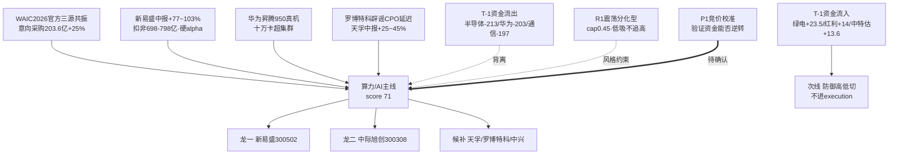

# 2026年7月21日 · **主线研判**

> **数据源新鲜度**: partial（R3缺失 + R7为T-1读数）
> **降级状态**: true
> **置信度**: 0.62

## 一句话结论

叙事最强的算力/光模块（WAIC三源共振+新易盛硬业绩）勉强清70门槛成唯一主线，但T-1资金仍在防御高低切、高位科技大幅流出，追高须待竞价确认。

## 详细分析

今日盘面呈现罕见的 **叙事与资金背离**。R4 消息面给出全场最强锚：WAIC2026 官方三源共振（新华社/人民日报/新闻联播），意向采购 203.6 亿同比 +25%；叠加新易盛中报预增 77~103%、扣非净利 698-798 亿的硬 alpha，以及华为昇腾950超节点真机首次公开。算力/AI（4事件 high）、光模块/CPO（2事件 high）、国产算力（high）多子板块同向催化，叙事维拿到 19/20 的全场最高分。

但 R7 资金面基于 **20260720（T-1）收盘**，而 WAIC 重磅催化发生在 07-20 晚间——资金尚未来得及反映。T-1 的真实资金流向反而是：主力大幅流出半导体（-213.66亿）、华为概念（-203.16亿）、通信技术（-197.63亿），钱在往绿色电力（+23.5亿 rank3）、红利股（+14亿）、中特估（+13.6亿）等防御高股息里躲。07-20 涨停梯队也全是电力/化工（桂冠电力/浙江新能/华银电力）。

R1 风格判定为 **震荡分化型·情绪45·仓位上限0.45**，明确提示 07-17 崩盘后为脆弱技术反抽、高位成长去杠杆未走完、"只做低吸不追高"。这与算力主线的右侧追高属性存在错配。

因此本轮唯一主线（算力/光模块，score 71）是 **靠叙事强度+多源催化共振勉强清 70 硬门槛**，资金维仅给到 12/20（pre-catalyst 读数）。防御高低切（绿电/红利/中特估）虽是 T-1 真实资金入口，但无新增催化、且属崩盘后避险，加之用户明确"防御高股息非进攻主线"，仅列次线作资金锚参考，不进 execution。

R3 情绪源 DOWN，共振维用 R4 多子板块催化同向 + R1 热榜（CPO/存储/算力租赁在榜）交叉替代，情绪浓度缺硬确认。

## 主线逻辑图谱

## 推理深度三问 · 算力/光模块主线

**大资金意图**：T-1（催化前）大资金明确在**撤出**高位科技、龟缩防御红利，没有为算力主线站台。险资逆势加仓科技、券商回购、瑞银喊"动量股抛售近尾声"属于**预期性托底信号**而非已兑现的资金流入。真金白银的方向要等 07-21 竞价与盘中 moneyflow 才能确认。

**为什么走强**（若走强）：驱动力是**基本面+叙事双击**——新易盛扣非+77~103% 是可验证的硬业绩，WAIC 官方三源+昇腾950真机是产业信念锚，而非纯情绪炒作。这类驱动比连板情绪更耐扰动。

**逻辑够不够硬**：叙事逻辑硬（官方三源+硬业绩），但**资金逻辑尚未成立**。71 分是"叙事扛着资金过线"的结果，一旦竞价高开后高位套牢盘涌出、防御接力，主线可证伪。属于"高信念、待验证"而非"高确定"。

## 每票思维链

### 新易盛 300502.SZ（龙一 · 光模块）

**买入理由**：R4 全场 weighted_score 最高（0.775）的硬 alpha——中报预增 77.46~102.88%、扣非净利 698-798 亿、Q3/Q4 订单能见度清晰、1.6T/NPO 推进。财联社电话会+eastmoney中报+投资者关系三源确认，非单源传言。

**风险点**：① 创业板 300 标的，execution 自动买入禁用，只能 watch/手动；② T-1 光模块所属高位科技整体资金流出，高开后有获利盘兑现压力；③ 中报预增或已部分price-in，需看竞价溢价是否透支。

**止损条件**：跌破前低或竞价大幅高开后 30 分钟不能站稳分时均价；R1 框架下浮亏 >5% 换仓。

**可验证假设**：07-21 竞价若光模块/CPO 板块整体溢价、新易盛主力资金转为净流入 top，则叙事→资金传导成立，主线成立；反之若高开低走、资金继续流出，则证伪，降级为次线。

### 中际旭创 300308.SZ（龙二 · 光模块）

**买入理由**：光模块绝对龙头，1.6T/CPO 核心标的，与新易盛构成光模块双龙，享受同一 WAIC+算力叙事。

**风险点**：创业板 300 禁自动买入；本轮无 07-21 实时资金/连板排名核验，龙二资格待 filter_leader_v1 裁定；高位股回调风险同龙一。

**止损条件**：破位或分时走弱；参照 R1 低吸不追高原则，不追高开。

**可验证假设**：若与新易盛资金同向流入、板块共振，则龙一龙二成立；若分化则保留强者。

## 关键证据

- 证据1：WAIC2026 意向采购 203.6亿同比+25%·官方三源共振 · 来源 R4/E20260721_001（新华社/人民日报/新闻联播）
- 证据2：新易盛中报预增 77.46~102.88%·扣非净利 698-798亿 · 来源 R4/E20260721_003（财联社电话会+eastmoney）
- 证据3：华为昇腾950超节点真机+十万卡超集群 · 来源 R4/E20260721_002
- 证据4：T-1 主力流出 半导体-213.66亿/华为-203.16亿/通信-197.63亿 · 来源 R7 main_force.top_outflow_sectors（20260720）
- 证据5：T-1 主力流入 绿色电力+23.5亿/红利+14亿/中特估+13.6亿 · 来源 R7 main_force.top_inflow_sectors（20260720）
- 证据6：瑞银称动量股抛售近尾声·险资加仓科技·券商回购 · 来源 R4/E20260721_006

## 数据源审计

| 源 | 状态 | 抓取时间 | 记录数 | 备注 |
|---|---|---|---|---|
| R4_news | 🟢 ok | 2026-07-21 | 8 事件 | 三大官方新闻源齐全·质量高 |
| R7_capital_flow | 🟡 stale | 2026-07-21 | 6 维 | 基准日 T-1(20260720)·WAIC催化未反映·**degraded 主因** |
| R1_style | 🟢 ok | 2026-07-21 | — | 震荡分化型·cap0.45·量化基座完整 |
| R3_sentiment | 🔴 error | — | 0 | 未落盘·共振维降级·情绪浓度缺硬确认 |

（degraded=true：主源 R3 缺失 + R7 为 T-1 读数。）

## 不确定性 / 反证

最大反证在于 **资金尚未确认叙事**：本主线 71 分几乎全靠叙事（19）扛过门槛，而 T-1 真实资金正在反方向流出高位科技、涌入防御红利。若把 R7 资金维当作已发生事实，本主线资金维应更低、可能跌破 70。乐观情形依赖"WAIC 催化 07-21 逆转资金"这一**尚未验证的假设**。R1 亦明确当前为崩盘后脆弱反抽、只做低吸不追高——若竞价高开冲高回落，算力主线随时可证伪，防御高低切（绿电/红利）反而是 T-1 资金实证的方向。因此本研判须由 P1 竞价校准强验证，D1 消费时不应把算力主线当作已确认的进攻主线满仓追高。

## 与其他 R/D/E 的关系

- 依赖：R1_style（风格/仓位上限）、R4_news（叙事/催化·主锚）、R7_capital_flow（资金·T-1）；R3_sentiment 缺失降级
- 被消费：filter_leader_v1（龙头硬过滤·本轮未执行）、R6 反证、D1 主决策、E1 复盘

## Sub-Agent 元数据

- skill: analyze_main_sectors_v1
- artifact: data/research/20260721/R2_main_sectors.json
- 生成耗时: ~120 秒
- model: ark-code-latest
