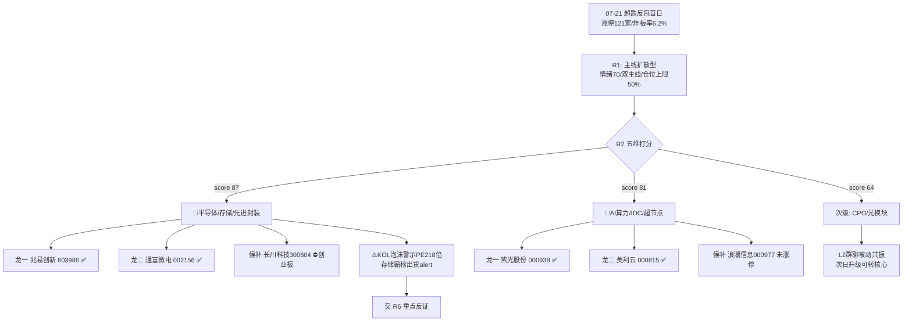

# 2026年7月22日 · **主线研判**

> **数据源新鲜度**: partial（公众号全灭，R1 上游降级；量化主源全新鲜）
> **降级状态**: 是（global_severity=3 传导）
> **置信度**: 0.72

## 一句话结论

超跌反包首日双主线：🥇半导体/存储链（涨停最猛）+ 🥈AI算力（共振最硬），CPO光模块列次级候补。⚠️半导体含泡沫警示待 R6 反证。

## 详细分析

昨日（07-21）市场暴力超跌反包，上证 +1.79%、创业板指 +7.05%，涨停 121 家、炸板率仅 6.2%（封板质量强）。R1 定性为「主线扩散型 + 情绪浓度 70 + 双主线」，仓位上限 50%。R2 在此约束下从全市场锁定 **2 条核心主线**，并把光模块归入次级。

**第一主线：半导体/存储/先进封装（score 87）** —— 这是今日涨停面与资金面双维最强的方向。芯片概念 up_nums=65 高居涨停板块第 1，存储芯片 30 家（+8.98%）、先进封装 29 家（+8.44%）、半导体及元件 28 家（+9.83%）多分支同步扩散。资金面 R7 显示国产芯片主力净流入 +212.55 亿（概念簇首）、高带宽内存 +24.5 亿（涨幅 +11.82%），叠加北向 5 日连续走强至 43.94 亿。叙事面 R4 存储业绩预增硬 alpha（江波龙预增 743 倍、佰维扭亏 3421%）三源共振，美光重返万亿市值为外部锚。**唯一扣分项在共振维**：核心 KOL 颜晓滨明确警示 A 股半导体 PE 约 218 倍泡沫、判定反弹是「跑路时机」，是全场最强反向声音。

**第二主线：AI算力/算力租赁/IDC/超节点（score 81）** —— 这是三源共振最硬、情绪最正向的方向。R3 rank1 三层全命中（L1 浪潮/紫光/美利云在榜且动量向上，L2 群聊字节算力/机构算租路演，L3 WeFlow 算力 732.6/AI 786.5/IDC 238.4 高共振），且 21 日热榜第一由前一日德明利跌停出货切换为紫光股份涨停修复，属正向共振而非霸榜出货。叙事面 R4 算力超节点带火液冷（中金预测 2026 液冷放量元年、市场 1147 亿 +273%）+ 国产大模型 Kimi K3/智谱 ARR 10 亿。

**次级：CPO/光模块（score 64）** —— L1 热榜拥挤（CPO 22 家涨停 +7.66%、联特科技 20cm 涨停）+ L3 高共振，且 R4 光模块缺口 70%+铟价暴涨 76%+源杰预增 1304% 硬催化，但 L2 群聊缺乏独立主动观点（随算力被动提及），属「交易热度 > 语义热度」，暂列 secondary，次日若群聊主动共振升级可提为核心。

**主动剔除**：液冷（板块连续 3-4 日跌停过热，回摆风险）、新能源车/储能/光伏（超跌普涨补涨、无三源共振）、国产替代（与半导体+算力高度重叠，并入处理）。

## 关键证据

- 证据 1: 芯片概念涨停 65 家板块第 1、存储芯片/先进封装/半导体元件 28-30 家扩散 · 来源 tushare.limit_cpt_list(20260721)
- 证据 2: 国产芯片主力 +212.55 亿、数据中心 +46.98 亿、高带宽内存 +24.5亿(+11.82%)、北向 5 日 36.15→43.94 亿递增 · 来源 R7_capital_flow.json
- 证据 3: AI算力三源硬共振(算力 732.6/AI 786.5/IDC 238.4)+21日紫光股份涨停登顶热榜修复 · 来源 R3_sentiment.json
- 证据 4: 存储业绩预增(江波龙743倍)+光模块缺口铟价暴涨(源杰预增1304%) 硬 alpha · 来源 R4_news.json
- 证据 5: 颜晓滨警示半导体 PE 218 倍泡沫、反弹是跑路时机（最强反向声音）· 来源 R3_sentiment.json layer2_kol

## 主线龙头（filter_leader_v1 硬过滤后）

### 🥇 半导体/存储链

```
龙一 兆易创新(603986.SH) execution_eligible ✅
龙二 通富微电(002156.SZ) execution_eligible ✅
候补 长电科技(600584) / 北方华创(002371) filtered_out
候补 长川科技(300604) execution_blocked(创业板) ⛔自动买入
```

**大资金意图**: 主力单日净流入国产芯片 +212.55 亿居概念簇首，兆易创新成交 33.1 亿、封单 10.5 亿板块最强，资金在存储主线做核心卡位。
**为什么走强**: 存储涨价 + AI 算力需求 + 中报业绩预增硬 alpha（江波龙 743 倍）三重驱动，美光重返万亿提供外部映射锚。
**逻辑够不够硬**: 涨停+资金+叙事三维极硬，但共振维有顶级 KOL 泡沫警示的硬伤，逻辑「硬中带裂」，必须 R6 反证。

- **兆易创新（龙一）买入理由**: 存储主板龙头，成交额/封单板块双第 1，中报预增线加持，主力资金 top1。
  **风险点**: 半导体 PE 218 倍泡沫警示 + 20 日存储霸榜出货 alert，高位追封有诱多风险。
  **止损条件**: 交 D1 制定（R2 不出买卖点）。
  **可验证假设**: 次日存储链能否维持涨停梯队、主力是否连续净流入 → R6/R7 增量验证。

### 🥈 AI算力/IDC

```
龙一 紫光股份(000938.SZ) execution_eligible ✅
龙二 美利云(000815.SZ)   execution_eligible ✅
候补 星网锐捷(002396) / 利通电子(603629) / 浪潮信息(000977) filtered_out
```

**大资金意图**: 紫光股份单日成交 193 亿、换手 17.58%，涨停登顶热榜第 1，资金抢算力/服务器国产化总龙头。
**为什么走强**: 算力超节点+液冷放量元年（中金 +273%）+国产大模型 ARR 兑现，算力是本轮最正向的产业叙事。
**逻辑够不够硬**: 三源共振最硬、情绪最正向（非出货型霸榜），逻辑硬；唯拥挤度高，需防科技整体调整。

- **紫光股份（龙一）买入理由**: 算力服务器主板龙头，成交/热度/主力板块三重第 1，新华三国产化叙事。
  **风险点**: 热榜 top50 约 75% 集中科技一条线，拥挤度极高，科技若调整无避风。
  **止损条件**: 交 D1 制定。
  **可验证假设**: 算力链能否走出独立于半导体的自主行情 → R6 反证 + 次日盘中验证。

## 主线结构图



## 数据源审计

| 源 | 状态 | 抓取日期 | 记录数 | 备注 |
|---|---|---|---|---|
| tushare.limit_cpt_list | 🟢 ok | 2026-07-22 | 20 | 涨停最强板块，芯片概念第1 |
| tushare.limit_list_d(U) | 🟢 ok | 2026-07-22 | 121 | 涨停个股全量，龙头定位 |
| R7_capital_flow.json | 🟢 ok | 2026-07-22 | - | 资金维主源 |
| R3_sentiment.json | 🟢 ok | 2026-07-22 | - | 共振/热度维 |
| R4_news.json | 🟢 ok | 2026-07-22 | 6 | 叙事/催化维 |
| R1_style.json | 🟡 stale | 2026-07-22 | - | 上游 degraded(0.55) |
| wechat_official_20 | 🔴 error | - | 0 | 23/23 invalid session 全灭 |

## 不确定性 / 反证

- **半导体主线含最大分歧**：涨停/资金/叙事三维极强，但顶级 KOL 颜晓滨明确判定为「跑路时机」+ PE 218 倍泡沫，20 日德明利跌停霸榜为出货信号，本主线的顶部诱多风险须由 R6 重点证伪。
- **叙事维依赖降级源**：公众号 23/23 全灭、weflow stock 维度禁用，叙事/共振仅靠 5 群 + tushare 热榜双源交叉，个股情绪靠文本推断。
- **持续性未验证**：超跌反包首日普涨，次日易分歧，若半导体走弱则扩散断裂、算力亦难独善。
- **因子层缺失**：top_ir_factors.json 未接入，龙头裁决基于涨停家数+主力资金+连板+成交额定性打分，未做量化因子横切验证。

## 与其他 R/D/E 的关系

- 依赖: R1_style.json（主线数量/仓位约束）、R3_sentiment.json（共振/热度）、R4_news.json（叙事催化）、R7_capital_flow.json（资金）
- 被消费: R5（对龙一/龙二画像）、R6（对 execution_eligible 龙头反证/hard_reject，重点验证半导体泡沫）、D1（从 leader_rank 1/2 且 execution_eligible=true 进 execution_pool 候选）

## Sub-Agent 元数据

- skill: analyze_main_sectors_v1 + filter_leader_v1
- artifact: data/research/20260722/R2_main_sectors.json
- 生成耗时: 约 90 秒
- model: ark-code-latest
