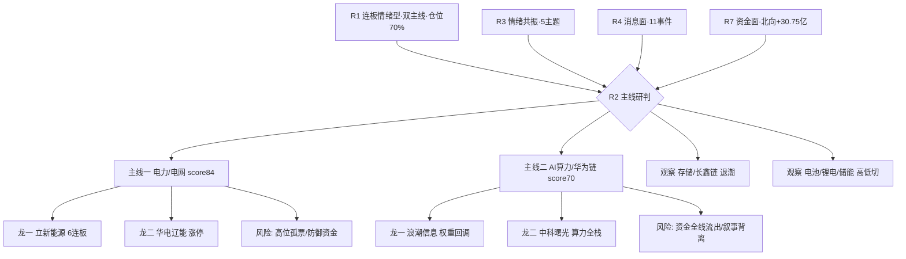

# 2026年7月24日 · **主线研判**

> **数据源新鲜度**: partial
> **降级状态**: false（因子层降级但不影响主线定性）
> **置信度**: 0.74

## 一句话结论

今日双主线：**电力/电网(特高压)** 全维共振为最硬主线，**AI算力/华为链** 叙事最强但资金流出待龙头企稳。

## 详细分析

今日 R1 判定为 **连板情绪型**（情绪浓度 72、双主线、仓位上限 70%）。在此背景下，R2 从全市场挑出两条主线，一强一分歧，与 R1 的双主线数量判定一致。

**主线一 · 电力/电网(特高压)（score 84）** 是今日证据链最完整的主线，五维几乎全高。R4 的头号事件即"特高压第三批招标超 2025 全年 + 三伏用电负荷创新高，电网设备全线爆发"（strength=high, 0.85）；R7 资金面上电网概念、智能电网、特高压三个概念同时进净流入前八且价涨约 4.5%，是罕见的"催化 + 资金 + 涨停 + 情绪梯队"四位一体。情绪端立新能源以 **6 连板** 高居全市场天梯之巅，量化基金与量化打板资金同步承接。连板情绪型市场里电力还承接了高低切防御资金，持续性优于纯题材。

**主线二 · AI算力/华为链（score 70）** 是全场最强叙事却与资金背离的分歧型侧线。R3 将其列为 rank1（L1+L2+L3 三源共振），梁文锋"英伟达护城河瓦解、华为超节点可平替"为最强催化，R4 亦有华为超节点、服务器 600 亿新订单等多条 high 事件。但 R7 资金面给出反向信号：算力概念 -120.57 亿、华为概念 -113.75 亿、半导体 -200.73 亿、科技风格 -313 亿全线净流出，权重股今日普跌。因此该线资金维被压到 9 分，靠叙事和催化撑在核心主线阈值边缘（70），盘中若龙头不企稳应立即降级。

**降为观察的两条**：存储/长鑫链（R4 催化硬但 R3 明确高位退潮，德明利/紫光霸榜却领跌）、电池/锂电/储能/固态（R7 资金绝对值最大但情绪共振弱，属权重高低切承接而非连板情绪主线）。

## 关键证据

- 证据 1：特高压第三批招标 63 亿中标超 2025 全年 + 电网设备全线爆发（strength=high 0.85）· 来源 R4_news E20260724_001
- 证据 2：电网概念 +47.33 亿 / 智能电网 +43.39 亿 / 特高压 +40.15 亿，净流入前八且均涨约 4.46% · 来源 R7_capital_flow top_inflow_sectors
- 证据 3：立新能源 6 连板为全市场情绪梯队最高标，量化基金/量化打板承接 · 来源 R7 hot_money + R1 天梯
- 证据 4：AI算力 R3 rank1 三源共振，但算力/华为/半导体概念资金全线净流出（-120/-113/-200 亿）· 来源 R3 + R7 top_outflow_sectors
- 证据 5：存储链热度霸榜（德明利#1/紫光#2）但同步领跌，退潮不作正向加分 · 来源 R3 divergence_note

## 数据源审计

| 源 | 状态 | 抓取时间 | 记录数 | 备注 |
|---|---|---|---|---|
| R1_style | 🟢 ok | 2026-07-24 | 1 | 连板情绪型/双主线基准 |
| R3_sentiment | 🟢 ok | 2026-07-24 | 5 | 5 主题共振，存储退潮告警 |
| R4_news | 🟢 ok | 2026-07-24 | 11 | 电网/存储/华为多条 high |
| R7_capital_flow | 🟢 ok | 2026-07-24 | 1 | 北向 +30.75 亿，板块资金全景 |
| tushare 限板/热榜 | 🟢 ok | 2026-07-24 | — | 涨停 116/连板天梯 |
| factor_snapshot | 🟡 stale | — | — | 目录缺失，量化因子层降级 |

## 不确定性 / 反证

AI算力线的定性最脆弱：最强叙事撞上最强资金流出，若视为"分歧后主升"则低吸机会，若视为"叙事退潮"则是诱多陷阱——两种解读并存，须由 R6 反证与盘中资金回流裁决。立新能源 6 连板为高位孤票，R1 已警示顶端天梯偏薄（6 板断层至 4 板），情绪型持续性弱于家数所示。存储链霸榜领跌可能拖累整个半导体情绪。因子层降级意味着龙头排序缺乏量化交叉验证，纯定性。

## 与其他 R/D/E 的关系

- 依赖: R1_style / R3_sentiment / R4_news / R7_capital_flow
- 被消费: R5（对龙一龙二 + 候补做画像）、R6（对 execution_eligible 龙头反证）、D1（仅从 leader_rank 1/2 且 execution_eligible=true 进 execution_pool 候选）

## 个股思维链（首推主线龙头）

### 立新能源 001258.SZ（电力线 龙一）

- **大资金意图**：量化基金与量化打板双席位承接 6 连板，游资在连板情绪型市场追逐最高标，意在做多情绪梯队制高点。
- **为什么走强**：特高压招标超全年 + 三伏用电负荷创新高，绿电/电力运营政策与旺季双催化，情绪龙头效应放大。
- **逻辑够不够硬**：题材硬（政策 + 旺季基本面），但 6 连板高位、天梯断层，估值/情绪已透支，硬度靠情绪而非价值。
- **买入理由**：全市场连板高度第一，主线内涨停 + 资金 + 情绪三重居首，符合"只做龙一"。
- **风险点**：高位孤票，R1 警示天梯偏薄，分歧回落风险大。
- **止损条件**：盘中若不能封板或炸板放量，情绪型退档即离场（D1 定量）。
- **可验证假设**：开盘竞价能否维持强势封板、板块跟风家数是否扩散。

### 浪潮信息 000977.SZ（AI算力线 龙一）

- **大资金意图**：主力 5 日累计仍居算力权重前列，但今日概念整体净流出，资金处于观望/调仓而非加仓。
- **为什么走强（叙事）**：服务器全球第三 + OpenAI 算力开支上调 7500 亿 + 华为超节点叙事，产业信念锚强。
- **逻辑够不够硬**：叙事极硬但资金背离（算力 -120 亿），逻辑与量能矛盾，需龙头企稳确认。
- **买入理由**：算力主线权重龙头，若资金回流为最佳载体。
- **风险点**：今日 -2.77 回调，概念资金全线流出，Alphabet FCF 转负拖累算力资本开支预期。
- **止损条件**：龙头不企稳/资金持续流出则不追高，破位离场。
- **可验证假设**：盘中北向及主力是否回流算力、CPO/光模块能否止跌。
