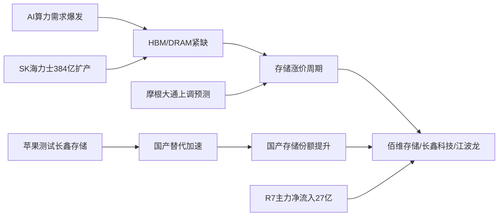

# 2026年8月11日 · 主线研判

> **数据源新鲜度**: partial
> **降级状态**: degraded（MCP全断，纯artifact推理）
> **置信度**: 0.72

## 一句话结论

存储芯片/HBM三源全中为今日核心主线，半导体设备资金最强但共振不足，兵装重组新题材待资金确认。

## 五维打分总览

| 排名 | 主线 | 热度 | 资金 | 涨停 | 叙事 | 共振 | 总分 | 交叉验证 |
|---|---|---|---|---|---|---|---|---|
| 🥇 | 存储芯片/HBM | 18 | 19 | 16 | 19 | 17 | **89** | 1.00 (3/3) |
| 🥈 | 半导体设备/先进制程 | 15 | 20 | 14 | 16 | 12 | **77** | 0.67 (2/3) |
| 🥉 | 兵装重组/军工 | 17 | 10 | 13 | 17 | 18 | **75** | 0.67 (2/3) |

### 落选主线（候选池）

| 主线 | 总分 | 落选原因 |
|---|---|---|
| 创新药/CXO/ADC | 67 | 霸榜出货警报（R3 distribution_alert），late阶段，资金未确认 |
| CPO/光模块 | 65 | R7净流出超200亿，龙头大跌分歧加大 |
| PCB/CCL/AI服务器 | 63 | R3共振强但R4/R7未直接对应，降为候选 |

## 详细分析

### 🥇 存储芯片/HBM（89分 · 三源全中）

**大资金意图**：机构大单(buy_lg)18.75亿主导买入高带宽内存板块，叠加北向连续流入，是机构确定性加仓方向。SK海力士384亿美元扩产+HBM紧缺逻辑持续验证，苹果测试国产DRAM进一步强化国产替代预期。

**为什么走强**：三重催化共振——①摩根大通上调存储市场预测至2028年 ②苹果测试长鑫存储（国产DRAM供应链突破）③HBM涨价+AI算力需求驱动。R3热榜江波龙(+23位)、长鑫科技(+13位)动量最强，R4在手订单验证业绩确定性。

**逻辑够不够硬**：硬。产业趋势（AI存储需求）+国产替代（苹果供应链）+业绩兑现（中报扭亏）三重逻辑叠加，非纯题材炒作。风险在于半导体板块整体资金流出（国产芯片-180亿），存储是否能独立行情需观察。

**龙头排序思维链**：

**佰维存储（龙一）**
- **买入理由**：AI存储模组+消费级双轮驱动，HBM封测布局，中报扭亏2776%~3422%，R4首推标的
- **风险点**：科创板标的（执行池禁用），估值偏高，半导体板块整体资金流出
- **止损条件**：跌破5日均线（约53.1元）确认趋势走弱
- **可验证假设**：存储涨价能否持续传导至Q3业绩，HBM需求是否超预期

**长鑫科技（龙二）**
- **买入理由**：国产DRAM龙头，苹果供应链潜在新进入者，营收+612%~+677%，热榜动量+13位
- **风险点**：科创板+次新股，波动大，苹果供应链正式落地时间不确定
- **止损条件**：跌破5日均线确认
- **可验证假设**：苹果是否正式导入长鑫DRAM，后续业绩增速能否维持

### 🥈 半导体设备/先进制程（77分 · 资金最强）

**大资金意图**：半导体设备净流入36.88亿全市场第一，净流入率6.31%，机构大单主导。中芯概念同样净流入15.75亿，buy_lg 20.18亿vs buy_elg -4.44亿，机构vs散户明显分化。

**为什么走强**：存储主线向上游设备传导+马斯克FEL光刻技术催化+国产替代长期逻辑。R7资金是最强支撑，但R3未进top5共振主题，说明市场认知度尚未完全扩散。

**逻辑够不够硬**：中等偏硬。资金是真金白银，但FEL技术偏远期概念，短期更多是情绪催化+存储主线溢出效应。需关注能否获得R3共振确认。

**龙头排序思维链**：

**中芯国际（龙一）**
- **买入理由**：国内晶圆制造龙头，先进制程突破核心标的，半导体设备国产替代主线
- **风险点**：科创板，市值大弹性有限，FEL技术偏远期
- **止损条件**：跌破5日均线（约62.8元）
- **可验证假设**：先进制程进展，国产设备导入率

### 🥉 兵装重组/军工（75分 · 新题材黑马）

**大资金意图**：R7未确认资金流入，当前是纯题材驱动。兵装重组概念新进热榜第2，是最大黑马，说明游资/散户关注度快速上升。

**为什么走强**：双催化——①霍尔木兹海峡地缘风险推升油气/军工/黄金 ②兵装重组+民爆十五五规划+西藏地矿国企改革。early阶段新题材，空间大但持续性待验证。

**逻辑够不够硬**：偏弱。地缘事件驱动持续性存疑（特朗普声明可能反复），兵装重组实质进展不明。early阶段胜率低，需资金确认后再加仓。

**龙头排序思维链**：

**长城军工（龙一）**
- **买入理由**：兵装重组概念龙头，热榜rank25→13(+12)，R3首推标的
- **风险点**：纯题材驱动无业绩支撑，兵装重组实质进展不确定，地缘事件可能反复
- **止损条件**：跌破5日均线确认趋势走弱
- **可验证假设**：兵装重组是否有实质公告，军工板块资金是否跟进

## 共识主题（4源交集）

| 主题 | 共识源数 | 源列表 | 综合分 |
|---|---|---|---|
| 存储芯片/HBM | 4 | R2/R3/R4/R7 | 0.92 |
| 半导体设备 | 3 | R2/R4/R7 | 0.75 |
| 兵装重组/军工 | 3 | R2/R3/R4 | 0.72 |

## 关键证据

- 证据1: R7高带宽内存净流入27.22亿#3，半导体设备净流入36.88亿#1 · 来源 R7_capital_flow
- 证据2: R3江波龙rank29→6(+23)、长鑫科技rank21→8(+13)动量最强 · 来源 R3_sentiment
- 证据3: R4 E002三重催化（摩根大通+苹果+HBM短缺）strength=high · 来源 R4_news
- 证据4: 兵装重组概念新进热榜第2 · 来源 R3_sentiment hotlist
- 证据5: CPO概念净流出238亿、光通信模块-221亿 · 来源 R7_capital_flow

## 数据源审计

| 源 | 状态 | 抓取时间 | 记录数 | 备注 |
|---|---|---|---|---|
| R1_style | 🟢 ok | 2026-08-11 07:18 | - | 主线扩散型+情绪74+3主线 |
| R3_sentiment | 🟡 partial | 2026-08-11 07:09 | 5主题 | WeFlow L3层缺失，L1+L2降级 |
| R4_news | 🟢 ok | 2026-08-11 07:13 | 8事件 | 公众号/群聊未fetch，财联社+东财为主 |
| R7_capital_flow | 🟢 ok | 2026-08-11 07:45 | - | premarket_full批次 |
| MCP实时板块 | 🔴 error | - | 0 | 全断 severity=3，无法实时验证 |
| 公众号21池 | 🔴 error | - | 0 | invalid session |
| 群聊5群 | 🔴 error | - | 0 | timeout/找不到对象 |

## 不确定性 / 反证

1. **MCP全断风险**：所有板块数据基于昨日+上游artifact推理，今日真实市场结构可能已变化，需开盘验证
2. **半导体整体资金流出**：国产芯片板块净流出180亿，存储/设备是结构性亮点还是最后的避风港？若大盘调整，高弹性板块可能补跌
3. **CPO资金出逃是否传导**：光模块-238亿大幅流出，若AI算力链整体退潮，存储/设备能否独立行情存疑
4. **军工持续性存疑**：地缘事件驱动往往脉冲式，兵装重组缺乏实质公告，early新题材胜率低
5. **创新药霸榜出货**：连续2日热榜第一，警惕高位出货拖累整体市场情绪
6. **全球流动性边际收紧**：日央行加息+美联储降息延后，利空高估值成长股

## 与其他 R/D/E 的关系

- 依赖: R1_style.json（风格/主线条数约束）、R3_sentiment.json（共振/热度）、R4_news.json（叙事/催化）、R7_capital_flow.json（资金）
- 被消费: filter_leader_v1（龙头硬过滤）、R6_devil_advocate（反证）、D1_main_decision（主决策）

## Sub-Agent 元数据

- skill: analyze_main_sectors_v1@1.2
- artifact: data/research/20260811/R2_main_sectors.json
- 生成耗时: ~3分钟（纯artifact推理，无MCP调用）
- model: doubao-seed-2-0-code-preview-260215
