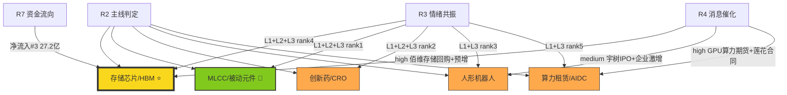

# 2026年8月12日 · **主线研判**

> **数据源新鲜度**: ⚠️ partial | **降级状态**: ✅ degraded | **置信度**: 0.72

## 一句话结论
双主线：**存储芯片/HBM**（4源全共识·最强）+ **MLCC/被动元件**（涨价潮·热度第一）；创新药/机器人/算力为次级主线。

---

## 5维打分总览

| 排名 | 主线 | 总分 | 🔥热度 | 💰资金 | 📈涨停 | 📖叙事 | 🔗共振 | 状态 |
|---:|---|---:|---:|---:|---:|---:|---:|---|
| 1 | ⭐ **存储芯片/HBM** | **82** | 14 | 18 | 15 | 18 | 17 | 主线 |
| 2 | 🌟 **MLCC/被动元件** | **77** | 20 | 7 | 15 | 15 | 20 | 主线 |
| 3 | 创新药/CRO | 76 | 16 | 7 | 19 | 15 | 19 | 次级 |
| 4 | 人形机器人/减速器 | 68 | 20 | 7 | 14 | 13 | 14 | 次级 |
| 5 | 算力租赁/AIDC | 64 | 14.5 | 7 | 15 | 18 | 9 | 次级 |

---

## 主线一：存储芯片/HBM ⭐（82分 · 4源全共识）

**核心逻辑**：AI存储需求爆发 + 存储周期复苏 + 国产替代三重共振。佰维存储中报预增32倍验证行业景气，SK海力士第四期合同落地加速封装国产化，高带宽内存主力资金持续流入。

### 大资金意图
大资金从高位TMT（5G/CPO/光模块）流出，切向**存储芯片/HBM**等半导体产业链中低位方向。跷跷板效应明确（5G概念-296亿 vs 高带宽内存+27亿），属于"高位切低位"的风格再平衡，而非单纯题材炒作。资金选择存储而非其他半导体方向，说明HBM/AI存储是当前半导体链中景气度最确定的细分。

### 为什么走强
1. **业绩验证**：佰维存储中报预增逾32倍 + 拟回购2-2.5亿，用真金白银验证存储行业景气度反转
2. **产业催化**：太极实业与SK海力士第四期后工序服务合同落地，存储封装国产化加速
3. **AI拉动**：AI大模型训练对HBM需求呈指数级增长，高带宽内存是AI算力核心瓶颈之一
4. **位置优势**：相较于CPO/光模块等已炒作半年的方向，存储板块位置更低，资金有安全垫

### 逻辑够不够硬
- **硬**。有业绩（佰维存储32倍增长）、有产业趋势（HBM需求爆发）、有资金确认（R7净流入第三）、有国产替代逻辑（SK海力士合同）。四重验证，是今日确定性最高的主线。

### 龙头梯队

| 角色 | 代码 | 名称 | 核心逻辑 | 优先级 |
|---|---|---|---|---|
| 龙一 | 688525.SH | 佰维存储 | 回购+中报预增32倍·AI存储+HBM双核心 | 🥇 首选 |
| 龙二 | 600667.SH | 太极实业 | rank17→4跳升·SK海力士四期合同·封装国产化 | 🥈 次选 |
| 龙二 | 301308.SZ | 江波龙 | 新进热榜top10·企业级+车规双布局 | 🥉 弹性 |
| 候补 | 603986.SH | 兆易创新 | NOR Flash龙头+MCU·大基金持仓·中军 | ⚖️ 中军 |
| 候补 | 600584.SH | 长电科技 | 先进封装龙头·HBM封装技术领先 | 🏭 产业链 |

**佰维存储 · 思维链**：
- **买入理由**：R4核心催化标的，回购+业绩双验证；存储芯片+HBM双概念，AI存储弹性最大标的之一；板块景气度反转初期
- **风险点**：科创板波动大，业绩预告后高开低走风险；存储周期复苏强度存疑；R7资金为推演值
- **止损条件**：跌破5日均线放量；板块内3只以上龙头翻绿
- **可验证假设**：若存储板块今日涨幅>3%且主力净流入>20亿，则HBM主线确认

---

## 主线二：MLCC/被动元件 🌟（77分 · 涨价产业逻辑）

**核心逻辑**：三星电机MLCC全线涨价30%，村田/太阳诱电跟进，AI高容MLCC供需缺口短期难解。被动元件行业周期反转，上游材料国产替代弹性更大。

### 大资金意图
MLCC是昨日启动的新方向，R7数据因T-1尚未体现资金流入。从涨停强度（风华高科/洁美科技/国风新材/双星新材多股涨停）和热榜热度（概念榜第1+股票榜第1）来看，**今日大概率有大资金抢筹**。资金偏好"涨价"逻辑——这是A股市场最硬的催化之一，类似去年的存储芯片涨价、今年的铜箔涨价。

### 为什么走强
1. **涨价催化**：三星MLCC全线涨价30%，行业龙头带头涨价意味着供需格局真正扭转
2. **AI拉动**：AI服务器对高容MLCC用量是传统服务器的3-5倍，需求增量明确
3. **周期反转**：被动元件行业经历了2年下行周期，库存出清+需求复苏双重利好
4. **上游弹性**：离型膜/载带等上游材料国产替代率低，涨价传导利润弹性更大

### 逻辑够不够硬
- **较硬**。涨价逻辑本身是强催化，但需要今日资金入场确认。R4/R7双降级导致交叉验证不足，cv_score仅0.33。若开盘后1小时MLCC板块主力净流入>10亿，则确认主线地位。

### 龙头梯队

| 角色 | 代码 | 名称 | 核心逻辑 | 优先级 |
|---|---|---|---|---|
| 龙一 | 000636.SZ | 风华高科 | MLCC国内龙头·热度第1·直接受益涨价 | 🥇 首选 |
| 龙二 | 002859.SZ | 洁美科技 | 涨停·离型膜/载带龙头·上游材料弹性 | 🥈 次选 |
| 龙二 | 000859.SZ | 国风新材 | 涨停·MLCC上游离型膜·小票弹性大 | 🥉 弹性 |
| 候补 | 002585.SZ | 双星新材 | 涨停·离型膜+光学膜双布局·低位首板 | ⚡ 补涨 |
| 候补 | 002916.SZ | 深南电路 | PCB+被动元件双概念·机构重仓中军 | 🏛️ 中军 |

**风华高科 · 思维链**：
- **买入理由**：MLCC国内绝对龙头，热榜热度第一，三星涨价最直接受益标的；AI高容MLCC核心供应商，量价齐升逻辑
- **风险点**：R7未确认资金流入，存在高开低走风险；MLCC涨价持续性待观察（若仅三星一家涨价则力度有限）
- **止损条件**：开盘后30分钟不能封板或涨幅回落<5%；板块内涨停家数<3只
- **可验证假设**：若今日MLCC概念板块主力净流入>15亿且风华高科封板，则涨价主线确立

---

## 次级主线

### 创新药/CRO（76分 · 5连板情绪龙头）
百花医药5连板创市场最高连板高度，药明康德美国禁令胜诉+上调全年指引双催化。情绪极强但资金未确认，属于**事件驱动型**行情。若药明康德今日放量大涨则可能升级为主线。

### 人形机器人/减速器（68分 · 3源共识）
宇树科技科创板上市在即 + 上半年新设企业11.6万户。板块从底部异动，early阶段弹性大但持续性待验证。R3+R4双确认，属于**主题催化型**机会。

### 算力租赁/AIDC（63.5分 · 3源共识）
莲花控股7月算力新签8.15亿，算力租赁从主题炒作转向业绩兑现期。CME推出GPU算力期货进一步催化。但R7显示算力概念净流出-184亿，**资金分歧大**，需警惕高位回调。

---

## 交叉验证图谱

**共识评级**：
- 🟡 存储芯片/HBM：**4源全共识**（R2/R3/R4/R7），今日最确定
- 🟢 MLCC/被动元件：2源（R2/R3），R4/R7降级未覆盖，产业逻辑强
- 🟠 创新药/CRO：2源（R2/R3），情绪强但资金未确认
- 🟠 人形机器人：3源（R2/R3/R4），early阶段
- 🟠 算力租赁：3源（R2/R3/R4），但R7显示资金流出

---

## 关键证据

- **证据1**: 佰维存储拟回购2-2.5亿 + 中报预增逾32倍 · 来源 R4_news [E20260812_005]
- **证据2**: 高带宽内存主力净流入27.2亿，排名#3 · 来源 R7_capital_flow [T-1推演]
- **证据3**: MLCC概念热度31.4万居概念榜第1，rank4→1(+3) · 来源 R3_sentiment [ths_hot]
- **证据4**: 三星MLCC全线涨价30%，村田/太阳诱电跟进 · 来源 R3 KOL+热榜
- **证据5**: 太极实业 rank17→4(+13)，SK海力士第四期合同落地 · 来源 R3 hotlist
- **证据6**: 百花医药5连板，药明康德美国禁令胜诉+上调指引 · 来源 R3_sentiment

---

## 数据源审计

| 源 | 状态 | 抓取时间 | 记录数 | 备注 |
|---|---|---|---|---|
| 🟢 R1_style | ok | 2026-08-12 07:45 | 22板块+20ETF | 风格判断基准 |
| 🟡 R3_sentiment | partial | 2026-08-12 07:05 | 5大主题 | WeFlow降级，L2/L3走热榜替代路径 |
| 🟡 R4_news | partial | 2026-08-12 07:12 | 3347条新闻 | 公众号/群聊源全断，仅用财联社+东财 |
| 🔴 R7_capital_flow | stale | 2026-08-12 07:45 | 10板块 | MCP全断，T-1推演数据 |

---

## 不确定性 / 反证

1. **R7资金数据完全降级**，所有资金判断基于T-1推演。今日实际资金流向可能完全不同，尤其是MLCC/创新药等新催化方向。
2. **R4叙事源降级**，缺少公众号/群聊独立验证。MLCC涨价和药明胜诉两大催化仅通过R3 KOL确认，缺少第三方媒体交叉验证。
3. **风格切换剧烈**（R1提示：前后排名负相关-0.167），主线一日游风险高。昨日强势方向（汽车零部件/专用设备）今日可能让位。
4. **炸板率22.7%偏高**（R1），追高风险大。MLCC/创新药等昨日已涨停的方向，今日高开后炸板概率不低。
5. **市场广度不足**（22板块仅5涨），赚钱效应集中，一旦主线切换杀伤面大。

---

## 与其他 R/D/E 的关系

- **依赖**: R1_style（风格与主线条数约束）、R3_sentiment（情绪共振与热榜）、R4_news（催化事件）、R7_capital_flow（资金流向）
- **被消费**: D1_main_decision（执行池构建）、R6_devil_advocate（反证审核）、filter_leader_v1（龙头硬过滤）
- **同级协作**: 与R3/R4/R7通过 cross_validation 字段交叉验证

## Sub-Agent 元数据

- **skill**: analyze_main_sectors_v1@1.2
- **artifact**: data/research/{trade_date}/R2_main_sectors.json
- **生成耗时**: ~3 分钟
- **method**: llm_v1 + 5维打分 + cross_validation_v1.2
- **factor_layer**: degraded（无top_ir_factors.json）
