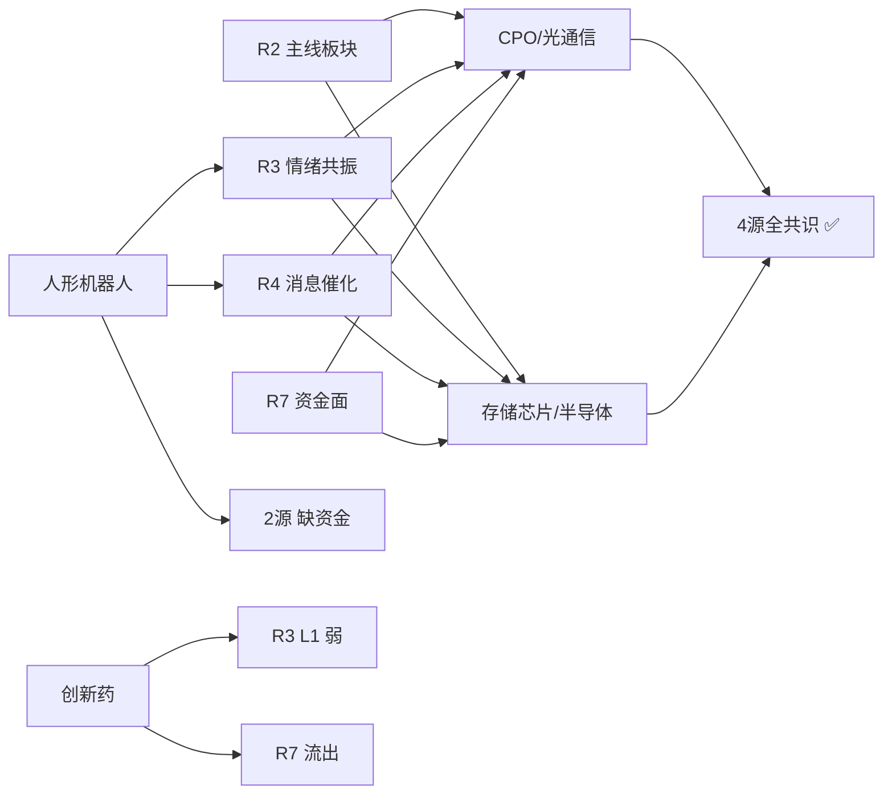

# 2026年8月13日 · **主线研判**

> **数据源新鲜度**: partial ⚠️
> **降级状态**: false（核心主线未受实质影响）
> **置信度**: 0.78

## 一句话结论

双主线确立：**CPO/光通信**（91分，4源全共识）+ **存储芯片/半导体**（84分，4源全共识），聚焦AI算力链两大核心方向。

## 详细分析

### 主线一：CPO/光通信 — AI算力基建的"卖铲人"

**大资金意图**：光模块是AI算力链中确定性最高的环节之一，思科AI订单40亿、CoreWeave在手合同超千亿美元、腾讯加码算力采购，三重事件共振验证了全球AI算力基建的高景气度。大资金选择永鼎股份作为突破口（600亿市值+33.6亿主力净流入全市场第1），是典型的"中军突破"打法——用大市值标的打开板块空间，而非小票情绪炒作。

**为什么走强**：
- 🔥 **业绩硬**：北美云厂商Capex持续上行，光模块800G/1.6T量价齐升
- 💰 **资金强**：CPO+光通信模块+光纤三细分主力净流入均超80亿，净率5%+
- 📈 **形态好**：永鼎股份放量突破，通鼎互联/通宇通讯助攻，板块涨停梯队完整
- 🎯 **催化密**：思科业绩+CoreWeave暴涨+腾讯加码，24小时内三事件连发

**逻辑够不够硬**：硬。光模块是AI算力链中少数已经兑现到业绩的环节，不是纯题材炒作。中际旭创、新易盛等龙头已在R4中被标记为high级催化首推。但需注意——板块短期涨幅已大，情绪过热后随时可能分歧。

### 主线二：存储芯片/半导体 — 周期拐点三重共振

**大资金意图**：存储是半导体周期之母，三重共振（美股板块大涨+SK海力士扩产+A股中报集体扭亏）确认行业拐点。先导基电（332亿市值涨停）作为设备龙头领涨，说明资金买的是"周期反转+国产替代"双重逻辑，不是单纯的反弹。

**为什么走强**：
- 💎 **拐点确认**：SK海力士重启大连NAND 2号工厂，月产能5万片，供给侧收缩转向扩张
- 📊 **业绩爆发**：佰维存储扭亏+3200%、长鑫科技扭亏+2244%、普冉股份+1925%，全行业盈利反转
- 🌍 **外盘锚定**：美股SK海力士+7.72%、美光+7.03%，全球存储板块同步走强
- 🔄 **超跌反弹**：半导体20日动量-8.8%（R1数据），位置低、筹码干净

**逻辑够不够硬**：硬，但有一个关键风险——20日动量仍为负，说明这是**超跌反弹性质**而非趋势性行情。持续性需要量能持续放大来验证，如果后续量能跟不上，可能只是一波反弹而非反转。

### 候选主线观察

| 板块 | 总分 | 状态 | 关键观察点 |
|------|------|------|-----------|
| 人形机器人 | 69 | 近主线 | 宇树科技上市后表现+8.22运动会，需资金面确认 |
| 算力租赁/AI算力 | 65 | 候选 | 与CPO高度重叠，独立强度弱，看工业富联等中军是否止跌 |
| 创新药/医药 | 56 | 弱候选 | 百花医药7板独苗+资金大幅流出，偏情绪炒作 |

## 关键证据

- **证据1**: CPO概念同花顺热榜第1，热度21.9万，+2.98% · 来源 tushare_ths_hot
- **证据2**: 存储芯片R4 E001加权分0.85，为全事件最高，7源验证（美股+中报+扩产） · 来源 R4_news
- **证据3**: 永鼎股份主力净流入33.6亿，全市场个股第1 · 来源 R3_sentiment + R7_capital_flow
- **证据4**: 4源全共识：CPO/光通信 + 存储芯片/半导体，同时出现在R2/R3/R4/R7 · 来源 cross_validation
- **证据5**: 96只涨停/0只跌停，炸板率3.33%，连板最高7板 · 来源 tushare_limit_list_d + R3

## 主线评分总表（5维 · 各20分）

| 板块 | 热度 | 资金 | 涨停 | 叙事 | 共振 | 总分 | 4源共识 |
|------|------|------|------|------|------|------|---------|
| CPO/光通信 | 19 | 20 | 16 | 18 | 18 | **91** | ✅ 全4源 |
| 存储芯片/半导体 | 16 | 17 | 15 | 19 | 17 | **84** | ✅ 全4源 |
| 人形机器人 | 15 | 8 | 14 | 17 | 15 | 69 | ❌ 缺资金 |
| 算力租赁/AI算力 | 17 | 7 | 10 | 15 | 16 | 65 | ❌ 缺资金 |
| 创新药/医药 | 18 | 5 | 13 | 10 | 10 | 56 | ❌ 缺资金+叙事 |

## 龙头梯队

### 🏆 主线一：CPO/光通信

| 角色 | 股票 | 代码 | 涨幅 | 连板 | 核心逻辑 |
|------|------|------|------|------|---------|
| 🥇 龙一 | 永鼎股份 | 600105.SH | +10.01% | 1 | CPO+光纤双概念，600亿中军，主力净流入33.6亿全市场第1 |
| 🥈 龙二 | 通鼎互联 | 002491.SZ | +9.98% | 1 | 通信设备+光纤，221亿市值弹性标的 |
| 🥈 龙二 | 通宇通讯 | 002792.SZ | +9.99% | 1 | CPO+光模块，高换手27%资金博弈 |
| 🎖 候补 | 景旺电子 | 603228.SH | +10.0% | 1 | PCB+CPO交叉，964亿大市值中军 |
| 🎖 候补 | 长进光子 | 688635.SH | +20.0% | 1 | 光芯片次新，20cm涨停（仅watch） |

**永鼎股份思维链**：
- **买入理由**：CPO中军+突破形态+主力资金33.6亿全市场第一+R4 high级催化
- **风险点**：位置偏高，情绪过热后可能分歧；纳指走弱可能传导
- **止损条件**：跌破5日线且放量，或板块炸板率超30%
- **可验证假设**：若今日开盘半小时封板且板块内3只以上助攻，则确认主升延续

### 🏆 主线二：存储芯片/半导体

| 角色 | 股票 | 代码 | 涨幅 | 连板 | 核心逻辑 |
|------|------|------|------|------|---------|
| 🥇 龙一 | 先导基电 | 600641.SH | +10.01% | 1 | 半导体设备龙头，332亿大市值，3/4板结构 |
| 🥈 龙二 | 至纯科技 | 603690.SH | +9.99% | 1 | 湿法清洗设备龙头，存储扩产直接受益 |
| 🥈 龙二 | 宝鼎科技 | 002552.SZ | +10.0% | 1 | 半导体材料，7/9板高位反复，221亿 |
| 🎖 候补 | 太极实业 | 600667.SH | +7.12% | 0 | 存储+先进封装双概念，热榜第2，趋势中军 |
| 🎖 候补 | 佰维存储 | 688525.SH | - | 0 | R4首推，中报扭亏+3200%（仅watch） |

**先导基电思维链**：
- **买入理由**：存储周期反转+设备国产替代+大市值涨停+业绩催化共振
- **风险点**：半导体20日动量仍负，超跌反弹性质存疑；次新波动大
- **止损条件**：跌破10日线，或存储板块单日流入转负超20亿
- **可验证假设**：若本周内半导体板块5日动量转正，则确认趋势反转

## 共识主题图谱

## 不确定性 / 反证

1. **数据降级风险**：Tushare涨停板块统计接口502，涨停维度用个股反推可能有偏差；R3/R4/R7均为partial状态，虽然主线4源交叉验证通过，但细节维度可能不完整。
2. **情绪过热风险**：R1情绪分数78，距极贪阈值80仅差2分，随时可能分歧转弱。两个主线均为AI算力链，高度相关，一旦回调可能同跌。
3. **外盘传导风险**：纳指-1.74%、恒指-1.4%，外围走弱可能影响科技股情绪。
4. **半导体持续性存疑**：20日动量-8.8%为超跌反弹性质，若量能不能持续放大，可能只是一波流。
5. **板块集中度风险**：双主线均属TMT大方向，市场宽度不足（R1 22板块仅8涨），赚钱效应集中。

## 数据源审计

| 源 | 状态 | 抓取时间 | 记录数 | 备注 |
|---|---|---|---|---|
| tushare_ths_hot | ✅ ok | 2026-08-12 22:30 | 20 | 同花顺概念板块热榜 |
| tushare_limit_list_d | ✅ ok | 2026-08-12 | 96 | 涨停股明细，非ST |
| tushare_limit_cpt_list | ❌ error | - | 0 | 502 Bad Gateway |
| tushare_kpl_concept | ❌ error | - | 0 | 502 Bad Gateway |
| R1_style | ✅ ok | 2026-08-13 07:09 | 22 | 连板情绪型+双主线 |
| R3_sentiment | ⚠️ partial | 2026-08-13 07:07 | 5主题 | WeFlow down + KOL T-2 |
| R4_news | ⚠️ partial | 2026-08-13 07:05 | 8事件 | 公众号全死 |
| R7_capital_flow | ⚠️ partial | 2026-08-13 07:24 | 30+板块 | moneyflow超时+龙虎榜降级 |

## 与其他 R/D/E 的关系

- **依赖上游**: R1_style（主线数量上限）、R3_sentiment（共振维）、R4_news（叙事维）、R7_capital_flow（资金维）
- **被消费下游**: D1_main_decision（execution_pool构建）、R5_stock_profile（个股深挖）、R6_devil_advocate（反证）
- **横切skill**: filter_leader_v1（龙头硬过滤）、hotlist_rank_signal_v1（热榜信号）

## Sub-Agent 元数据

- **skill**: analyze_main_sectors_v1@1.2
- **artifact**: data/research/20260813/R2_main_sectors.json
- **生成耗时**: ~5分钟
- **method**: llm_v1 + 5维打分 + 4源交叉验证
- **model**: doubao-seed-2-0-code
