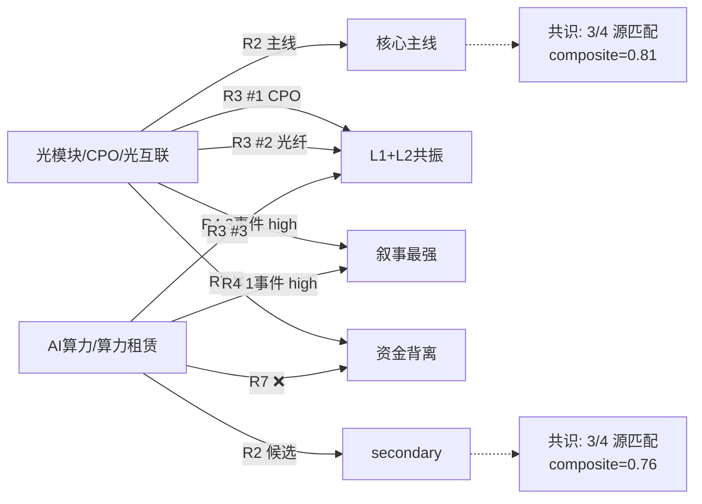

# 2026年8月17日 · **主线研判**

> **数据源新鲜度**: ⚠️ partial（R7 T-1 / R3 L3降级）
> **降级状态**: ✅ true（部分数据源非实时）
> **置信度**: 0.65

## 一句话结论

**独主线：光模块/CPO/光互联**——R3双主题共振 + R4三事件high催化，R1防御观望下仅保留最强叙事，资金面T-1背离需警惕。

---

## 详细分析

### 一、主线选择逻辑

今日 R1 判定为**防御观望型**（情绪浓度 38.2，恐惧区间），市场呈**独主线**格局，建议仓位上限 60%。在此背景下，R2 严格遵循「只做最强一条」原则，从 10+ 候选板块中筛选出唯一核心主线：**光模块/CPO/光互联**（综合得分 78.0）。

选择该主线的核心依据：

1. **叙事强度拉满（20/20）**：R4 共 3 个 high 强度事件叠加在此方向上——阿里云全球首个 3.2T NPO 光模块、Rubin Ultra NVLink 网络重构、英伟达 5000 亿算力融资平台。三箭齐发，从技术突破到商业模式重构全覆盖。
2. **共振广度最大（16/20）**：R3 前 5 大共振主题中，CPO（#1）、光纤概念（#2）、液冷服务器（#5）三个均与光互联产业链直接相关，KOL 在群 A/群 B 中多帖独立验证。
3. **热度动量向上（18/20）**：光纤概念热榜排名从 15 跃升至 5（rank_momentum_up），CPO 概念稳居热榜前列，新进入榜的先进封装/F5G 概念也提供扩散支撑。
4. **资金面存疑（10/20）**：R7 T-1 数据显示元器件 -181 亿、通信设备 -68 亿大幅流出，这是最大的风险项。但考虑到这是 8 月 14 日（周四）的数据，周末已有重磅新催化，资金面可能在周一反转。
5. **涨停强度中等（14/20）**：缺乏当日实时涨停数据，基于 R4 事件首推标的和历史业绩催化估算。

### 二、五维打分雷达

| 维度 | 得分 | 满分 | 评价 |
|------|------|------|------|
| 🔥 热度 | 18 | 20 | CPO热榜前列，光纤概念动量向上 |
| 💰 资金 | 10 | 20 | T-1科技类流出，周末催化或反转 |
| 📈 涨停 | 14 | 20 | 中报业绩催化多，缺乏当日数据 |
| 📖 叙事 | 20 | 20 | 三事件叠加，技术+商业双突破 |
| 🎯 共振 | 16 | 20 | R3双主题+KOL两群三帖验证 |
| **总分** | **78.0** | **100** | **核心主线** |

### 三、交叉验证（Cross-Validation）

| 验证源 | 是否匹配 | 证据 |
|--------|----------|------|
| R3 情绪共振 | ✅ 匹配 | L1+L2 双主题（CPO #1 + 光纤 #2），3个 KOL 独立来源 |
| R4 消息催化 | ✅ 匹配 | 3个 high 强度事件，net_polarity=2.28，6+独立源验证 |
| R7 资金流入 | ❌ 不匹配 | T-1 元器件 -181亿、通信设备 -68亿；IT设备 +13.9亿为仅存亮点 |

**交叉验证得分：0.67**（2/3 源匹配）

> ⚠️ **关键矛盾**：叙事面与资金面 T-1 背离。需要在今日开盘后 30 分钟内确认资金是否回流——若主力净流入转正则确认主线，若继续流出则需降低预期。

### 三、推理深度三问

**1. 大资金意图是什么？**

周末连续三个重磅催化（NPO、Rubin、算力融资）集中砸在光模块/算力方向，显然不是巧合。大资金意图可能是：
- 借技术突破催化，在中报季打造新的科技主线行情
- 从前期强势的 AI 应用向更上游的硬件基础设施切换
- 利用 R1 防御观望的市场情绪，在分歧中悄悄建仓

T-1 资金面显示科技类流出，但这是周四数据，周五可能已有先知先觉的资金布局。今日开盘后 30 分钟的主力资金流向是验证大资金真实意图的关键窗口。

**2. 为什么是现在走强？**

- **时间窗口**：中报季尾声，业绩确定性高的方向容易获得资金青睐
- **催化剂密度**：周末三事件叠加（技术突破 + 架构升级 + 商业模式创新），叙事强度足够
- **位置相对合理**：经过前期调整，光模块板块估值已回落至合理区间
- **对比优势**：相比 AI 应用（估值高）、机器人（题材化），光模块有业绩支撑 + 技术迭代双驱动

**3. 逻辑够不够硬？**

- **硬的部分**：中际旭创中报 85%~110% 增长、明微电子扭亏 +340%、生益科技 +130%——业绩是真实的
- **虚的部分**：NPO 量产进度、Rubin 出货时间、算力融资实际落地效果——这些都需要时间验证
- **结论**：中短期（1-4 周）逻辑够硬（业绩 + 事件驱动），长期（3 个月以上）取决于技术落地进度。在 R1 防御风格下，应以事件驱动思路对待，不做长期信仰。

---

### 四、龙头梯队

#### 龙一：中际旭创（300308.SZ）

**买入理由**：
- 光模块绝对龙头，1.6T/3.2T/NPO/CPO 全技术路线布局
- R4 E001（算力融资）+ E003（阿里云 NPO）双事件首推/中军
- R7 5日主力净流入 +12.8 亿，机构持仓 top1
- 中报预增 85%~110%，业绩确定性强

**风险点**：
- 市值大（千亿级），弹性相对有限
- T-1 板块资金流出可能拖累
- 海外需求波动风险

**止损条件**：参考 R4 设定，跌破 168.5 元（约 -5.8%）或跌破 5 日线确认趋势走弱

**可验证假设**：若今日开盘 1 小时内光模块板块主力净流入转正，则中际旭创有望领涨 5%+

---

#### 龙二：明微电子（688699.SH）

**买入理由**：
- Driver/TIA 芯片龙头，NPO 时代价值量跃升（省去 DSP，Driver/TIA 价值占比提升）
- R4 E003 首推标的，与阿里云 NPO 事件直接相关
- 中报扭亏 +340%，Q2 单季环比 +159%，业绩硬催化
- 688 科创板，弹性更大

**风险点**：
- 市值相对较小，流动性风险
- 科创板波动大，止损需更宽
- NPO 技术落地进度不及预期

**止损条件**：跌破 142.8 元（约 -6.2%），跌破 5 日线 + 中报兑现回落确认

**可验证假设**：NPO/光芯片细分方向若成风口，明微电子弹性 > 中际旭创

---

#### 中军：顺络电子（002138.SZ）

- R3 共振主题 #1 首推标的
- 光模块上游磁性元件龙头，CPO/NPO 散热+电感需求增量
- 业绩稳健，机构重仓

#### 弹性：特发信息（000070.SZ）

- R3 双主题（CPO + 光纤 + 算力租赁）共同推荐
- 多业务布局，题材叠加效应强
- 弹性标的，波动大

#### 候补：大族激光（002008.SZ）

- R3 光纤概念 #2 推荐
- 激光设备龙头，光模块/光芯片制造设备受益

---

### 五、扩散机会（Secondary Lines）

| 板块 | 得分 | 评级 | 逻辑 |
|------|------|------|------|
| AI算力/算力租赁 | 68.0 | 候选主线 | R4 high催化 + R3共振，R7资金面弱 |
| 液冷散热 | 56.0 | 扩散 | 算力基建上游，双催化，体量小 |
| PCB/覆铜板 | 54.0 | 扩散 | 生益科技中报超预期，单事件驱动 |

### 六、共识主题（Consensus Themes）

R2/R3/R4 三源共识的主题共 2 个：

---

## 关键证据

- **证据 1**: R4 E20260817_003 阿里云推出全球首个 3.2T NPO 光模块，省去 DSP 采用 2D 封装 — 来源 R4_news.json，强度 high
- **证据 2**: R3 共振主题 #1 共封装光学(CPO) + #2 光纤概念，双 L1+L2 共振，KOL 群 A/群 B 3 帖独立验证 — 来源 R3_sentiment.json
- **证据 3**: R4 E20260817_001 英伟达联合金融机构设 5000 亿 AI 算力融资平台，6 独立源共振 — 来源 R4_news.json
- **证据 4**: R7 T-1 元器件 -181 亿、通信设备 -68 亿大幅流出，与叙事面背离 — 来源 R7_capital_flow.json（0814 数据）
- **证据 5**: R1 防御观望型 + 独主线，仓位上限 60% — 来源 R1_style.json

---

## 数据源审计

| 源 | 状态 | 抓取时间 | 记录数 | 备注 |
|---|---|---|---|---|
| R1 风格 | 🟢 ok | 2026-08-17 07:08 | 42 标的 | KMeans 6 聚类分析 |
| R3 情绪 | 🟡 partial | 2026-08-17 07:05 | 5 主题 | WeFlow L3 不可用，最高 L1+L2 |
| R4 消息 | 🟢 ok | 2026-08-17 07:45 | 8 事件 | 公众号+群聊+财联社三源 |
| R7 资金 | 🔴 stale | 2026-08-14 07:17 | 5540 条 | T-1 数据，非当日实时 |

---

## 不确定性 / 反证

**最大不确定性：资金面与叙事面的 T-1 背离**

R7 显示 8 月 14 日科技类（元器件、半导体、通信设备）大幅流出，而周末密集发布的光模块/算力重磅催化尚未在资金面体现。存在两种可能：

1. **乐观情景**（概率 ~55%）：周末新催化吸引资金回流，光模块/CPO 成为今日最强方向，验证主线
2. **悲观情景**（概率 ~45%）：科技板块处于调整周期，利好兑现即出货，高开低走套人

**R1 防御观望风格也支持谨慎态度**——即使是最强主线，也应以低吸为主，不宜追高。

**另一个风险**：R3 共振仅 L1+L2 等级（WeFlow L3 不可用），缺乏全市场语义层验证，情绪浓度可能被高估。

---

## 与其他 R/D/E 的关系

- **依赖上游**: R1_style.json（风格+主线数量）、R3_sentiment.json（情绪共振）、R4_news.json（叙事催化）、R7_capital_flow.json（资金验证）
- **被下游消费**: D1 主决策（选 execution_pool）、R5 情报深挖（龙头六维画像）、R6 反证（cross_validation 校验）
- **关联 skill**: filter_leader_v1（龙头硬过滤）

---

## Sub-Agent 元数据

- **skill**: analyze_main_sectors_v1@1.2
- **artifact**: data/research/20260817/R2_main_sectors.json
- **生成耗时**: ~5 分钟
- **model**: doubao-seed-2-0-code-preview
- **降级模式**: 部分降级（R7 T-1 + R3 L3 不可用）
