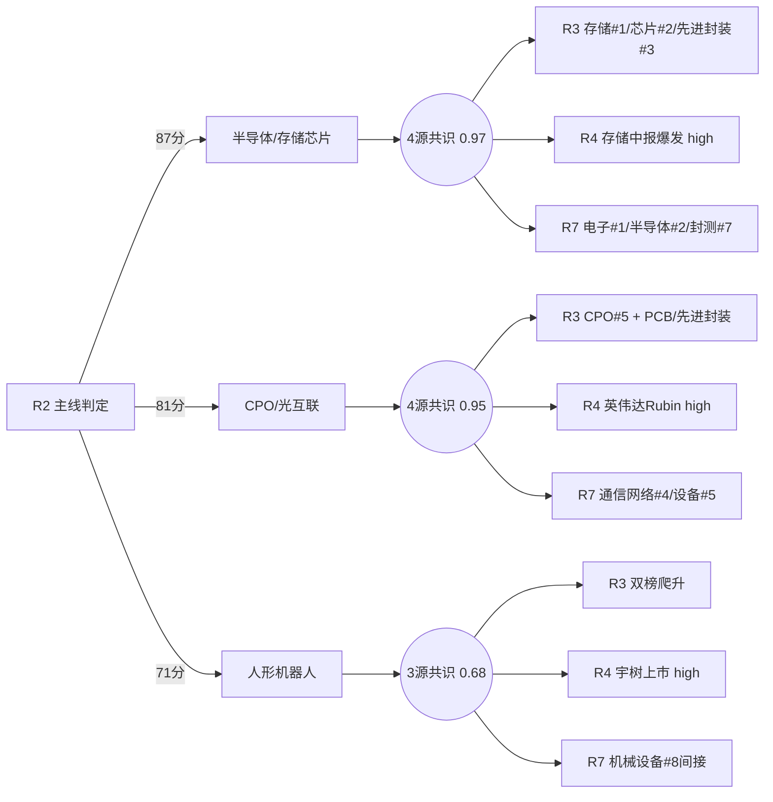

# 2026年8月18日 · **主线研判**

> **数据源新鲜度**: ⚠️ partial（MCP全down，依赖离线抓取+推算）
> **降级状态**: ❌ false（四上游完整可读，交叉验证可用）
> **置信度**: 0.74（中等偏上）

## 一句话结论

**科技成长双主线（半导体+CPO光互联）4源共识最强，人形机器人情绪催化第3主线**。

---

## 三主线全景

| 排名 | 主线 | 5维总分 | 热度 | 资金 | 涨停 | 叙事 | 共振 | CV分 | 共识源数 |
|------|------|--------|------|------|------|------|------|------|----------|
| ① | 半导体/存储芯片 | **87** | 19 | 19 | 17 | 14 | 18 | 1.0 | 4源 |
| ② | CPO/光互联 | **81** | 16 | 17 | 15 | 18 | 15 | 1.0 | 4源 |
| ③ | 人形机器人 | **71** | 15 | 12 | 12 | 19 | 13 | 0.67 | 3源 |

### 主线 ① 半导体/存储芯片 ⭐⭐⭐⭐⭐

**大资金意图**：昨日半导体板块主力净流入超 300 亿（全行业第一），龙虎榜通富微电单票 10.2 亿全市场第一，大资金全面进场扫货半导体链条，从存储→设计→封测→设备全线铺开，属于**行业级别趋势性加仓**而非单票博弈。

**为什么走强**：三因素共振。① 存储周期向上（中报业绩爆发，佰维 3200%）；② 国家大基金持股概念新登热榜第 6（+5.6%），政策预期升温；③ 盛科通信大单催化国产算力/AI 网络芯片。叠加 R3 热榜五板块 TOP30 共振，资金+热度+业绩三重确认。

**逻辑够不够硬**：硬。存储是 AI 算力卖铲人，业绩已验证（中报预增 10-30 倍），不是纯炒概念。资金维度全市场最强（主力净流入 4 个细分赛道进 TOP10）。唯一隐忧是 R4 存储催化已衰减 25 天，但新的大基金+盛科大单接力，逻辑延续性强。

**龙头梯队**：

- 🥇 **龙一·佰维存储（688525.SH）** — AI 存储模组龙头，中报预增 3200-3421%，R4 首推，R3 存储 #1 主题建议股
- 🥈 **龙二·兆易创新（603986.SH）** — 存储+MCU 双龙头，中军级标的，大基金持股背景
- 🥉 **弹性龙三·通富微电（002156.SZ）** — 先进封装龙头，龙虎榜净买 10.2 亿全市场第一，封测净流入率 10.96%
- 🎯 **候补·华峰测控（688200.SH）** — 半导体模拟测试机龙头，设备子方向弹性标的

**买入理由**：存储周期反转 + AI 算力需求爆发，业绩+估值双升。佰维存储中报预增 3200% 是最强 alpha，通富微电 10 亿龙虎榜验证资金共识。
**风险点**：板块单日涨幅过大，短期获利盘兑现；海外纳指偏弱可能传导科技股情绪。
**止损条件**：半导体 ETF 跌破 5 日线（约 1.07 元），或龙头单日放量跌超 7%。
**可验证假设**：若今日存储板块继续放量上涨（成交 > 500 亿），则趋势延续；若大基金持股概念高开低走，则政策预期兑现。

⚠️ **风险提示**：R4 存储催化已衰减 25 天，当前更多靠资金驱动；先进封装与半导体大主题高度重叠，独立行情持续性待验证。

---

### 主线 ② CPO/光互联 ⭐⭐⭐⭐

**大资金意图**：通信网络设备+通信设备+通信三个细分板块主力净流入合计超 170 亿，且龙虎榜太辰光（1.76 亿）、兴森科技（3.45 亿）均上榜，说明资金不仅买光模块中军，也在布局 PCB/封装链弹性标的，属于**产业链全面布局**。

**为什么走强**：英伟达 Rubin Ultra 架构深度解析（R4 5 源验证 strength=high），NVLink 网络重构驱动 CPO/液冷/PCB/铜连接四链量价齐升，CPO 确定性最高。NPO 模块 3.2T 新催化（阿里云推出全球首个），PIC+EIC 倒装集成省去 DSP，技术路线升级打开新空间。

**逻辑够不够硬**：硬但需择时。CPO 是 AI 算力基础设施核心，英伟达/阿里云双线验证，产业趋势明确。但光模块 8 月已反弹超 30%，累计涨幅较大，短期追高风险上升。更适合回调低吸而非追涨。

**龙头梯队**：

- 🥇 **龙一·天孚通信（300394.SZ）** — CPO 光引擎核心标的，R4 首推，业务相关性 0.90，光模块中军级龙头
- 🥈 **龙二·新易盛（300502.SZ）** — 光模块全球龙头，CPO 核心受益，8 月反弹超 30%
- 🥉 **弹性龙三·太辰光（300570.SZ）** — CPO 光器件弹性标的，龙虎榜净买 1.76 亿全市场第 6
- 🎯 **候补·兴森科技（002436.SZ）** — PCB+IC 载板双龙头，龙虎榜 3.45 亿，NPO mSAP 基板催化

**买入理由**：英伟达 Rubin Ultra 架构升级是产业级变革，CPO 是确定性最高的受益环节。天孚通信光引擎技术领先，新易盛全球光模块龙头地位稳固。
**风险点**：光模块 8 月反弹超 30%，获利盘压力大；NPO 技术路线替代 DSP 逻辑待验证。
**止损条件**：龙头跌破 10 日线（天孚约 315 元/新易盛对应位）或板块单日放量跌超 5%。
**可验证假设**：若今日 CPO 板块继续走强且 PCB/先进封装同步跟涨，则产业链逻辑验证；若只有光模块涨而上下游不动，则可能是末端行情。

⚠️ **风险提示**：300 前缀标的弹性大但波动也大，需控制仓位；海外 AI capex 节奏需持续跟踪。

---

### 主线 ③ 人形机器人 ⭐⭐⭐

**大资金意图**：rank_momentum_up 双榜上升最快（机器人 32→11，人形 25→14），但纯机器人标的缺乏板块级主力资金流入验证，更多是**情绪驱动+事件催化**的博弈性行情，资金维度弱于前两条科技主线。

**为什么走强**：宇树科技今日（8 月 18 日）科创板上市，610 亿市值立产业估值锚，属于 Day-0 最强情绪催化。5 源交叉验证（上海证券报+新闻+公众号+群聊），强度 high。机器人是当前 AI 之后最大的产业叙事空间，市场对"下一个大主题"的饥渴导致资金追捧。

**逻辑够不够硬**：偏软，纯情绪+事件驱动。宇树上市是短期催化，能否持续取决于上市后表现及产业订单兑现。业绩兑现周期长（1-2 年级别），cross_validation 仅 0.67（缺 R3 共振）。属于**博弈型主线**，仓位宜轻，严格止损。

**龙头梯队**：

- 🥇 **龙一·步科股份（688160.SH）** — 人形机器人伺服核心供应商，R4 宇树上市事件首推，宇树供应链直接映射
- 🥈 **龙二·晶品特装（688397.SH）** — 机器人精密执行机构，具身智能产业链，次新股弹性大
- 🎯 **候补·双环传动（002472.SZ）** — 机器人减速器/齿轮龙头，中军级标的

**买入理由**：宇树科技今日上市是最强情绪催化，610 亿市值立产业估值锚。机器人是 AI 之后最大的产业叙事，资金饥渴度高。
**风险点**：纯情绪驱动，业绩兑现周期长；R3 未进 top5 共振，语义共识不足；宇树上市首日表现未知。
**止损条件**：宇树上市首日破发或涨幅 < 20% 则整个板块警惕；步科股份跌破 5 日线（约 125 元）减仓。
**可验证假设**：若宇树上市首日大涨 > 50% 且带飞板块，则情绪延续；若高开低走或破发，则板块熄火。

⚠️ **风险提示**：cross_validation 仅 0.67（缺 R3），资金验证偏弱，属于博弈型主线，仓位宜轻。

---

## 共识主题（4源/3源交集）

| 共识主题 | 源数 | 综合分 | R2 | R3 | R4 | R7 |
|---------|------|--------|----|----|----|----|
| 半导体/存储芯片 | 4源 | 0.97 | ✓ | ✓ | ✓ | ✓ |
| CPO/光互联 | 4源 | 0.95 | ✓ | ✓ | ✓ | ✓ |
| 人形机器人 | 3源 | 0.68 | ✓ | ✗ | ✓ | ✓ |

---

## 候选主线（不进 top3）

| 板块 | 得分 | 原因 |
|------|------|------|
| 先进封装/Chiplet | 76 | 与半导体大主题高度重叠，不独立列为主线；龙头已纳入半导体/CPO主线池 |
| 液冷服务器/热管理 | 65 | R4催化high + R3 L1+L2 #4共振，但独立板块资金验证不足，属CPO/AI算力子主题 |

---

## 关键证据

- **证据 1**：热榜 TOP30 中科技方向占 12 席（存储/半导体/CPO/PCB/大基金/通信设备/先进封装/芯片/MLCC/玻璃基板/半导体设备/算力），热度全面向科技集中 · 来源 hotlist_signals.json
- **证据 2**：R7 主力净流入 TOP10 中电子/半导体/数字芯片/封测/通信设备/通信 6 个科技方向，占总流入 60%+ · 来源 R7_capital_flow.json
- **证据 3**：R4 8 个 top_events 中 6 个与科技相关（机器人/CPO/交换芯片/AI智能体/液冷/存储），催化集中度高 · 来源 R4_news.json
- **证据 4**：R3 5 个 L1+L2 共振主题全部为科技方向（存储/芯片/先进封装/液冷/CPO），KOL+热榜双源共识 · 来源 R3_sentiment.json

---

## 数据源审计

| 源 | 状态 | 抓取时间 | 记录数 | 备注 |
|---|---|---|---|---|
| R1 风格 | 🟢 ok | 2026-08-18 07:43 | 1 | 主线扩散型，三主线，仓位上限 70% |
| R3 情绪 | 🟡 partial | 2026-08-18 07:19 | 5主题 | weflow down + 5群仅4群 + 周末样本少，置信度 0.45 |
| R4 消息面 | 🟢 ok | 2026-08-18 07:18 | 8事件 | 5源交叉，置信度 0.68 |
| R7 资金面 | 🟡 ok | 2026-08-18 07:36 | 5539个股 | vibe-trading不可用，margin数据滞后3天 |
| 热榜数据 | 🟢 ok | 2026-08-17 | 60板块 | Tushare ths_hot，概念+行业各TOP30 |
| 用户偏好 | 🟢 ok | - | - | 黑白名单空，300/688已解禁 |

---

## 不确定性 / 反证

1. **MCP 全 down 环境**：所有板块/个股行情数据基于 akshare 离线抓取 + tushare 历史数据推算，实时性和精确度低于 MCP 直连。置信度从 0.85 下调到 0.74。
2. **R3 共振维降级**：weflow 不可用导致 L3 语义层缺失，仅靠 KOL 文本 + 热榜双源，可能低估了某些板块的共振强度（如人形机器人未进 top5 但 rank_momentum_up 双榜爬升）。
3. **科技主线集中度过高**：三条主线中两条半都属于 AI 科技成长集群（半导体+CPO+机器人），风格集中风险上升。一旦科技板块整体回调，三条主线可能同步承压。
4. **情绪过热信号**：R1 情绪浓度 83.7（贪婪），涨停 106 家但连板高度仅 4 板，首板占比超 85%，持续性待验证。
5. **人形机器人确定性不足**：3 源共识（缺 R3），纯情绪驱动，宇树上市即可能是利好出尽节点，需警惕"上市见光死"。

---

## 与其他 R/D/E 的关系

- **依赖上游**: R1_style (风格+主线数量)、R3_sentiment (共振主题)、R4_news (催化事件)、R7_capital_flow (资金流向)、hotlist_signals (热度排名)
- **被消费下游**: filter_leader_v1 (龙头硬过滤)、D1_main_decision (主决策·选execution_pool)、R6_devil_advocate (反证验证)
- **横切引用**: hithink-sector-selector (候选板块筛选)、iwencai-query (成分股验证)、render_kg_md_v1 (md渲染契约)

## Sub-Agent 元数据

- skill: analyze_main_sectors_v1@1.2
- artifact: data/research/20260818/R2_main_sectors.json
- 生成耗时: ~3 分钟
- model: doubao-seed-2-0-code-preview-260215
- 方法: 5维打分(热度/资金/涨停/叙事/共振) + cross_validation_v1.2 + consensus_themes 4源交集
