# 2026年8月19日 · **主线研判**

> **数据源新鲜度**: 🟡 partial
> **降级状态**: ⚠️ true（MCP全down + R3/R7/R1均降级）
> **置信度**: 0.72

## 一句话结论

三主线并行：**半导体/存储芯片**（82分，资金最强4源共识）+ **农业/转基因**（74分，盘面最强但资金弱）+ **人形机器人**（71分，催化最强但事件兑现日）。

---

## 五维打分总览

| 排名 | 主线 | 热度 | 资金 | 涨停 | 叙事 | 共振 | 总分 | CV分 | 共识源 |
|:---:|:---|:---:|:---:|:---:|:---:|:---:|:---:|:---:|:---:|
| ① | 半导体/存储芯片 | 18 | 20 | 13 | 16 | 15 | **82** | 1.00 | 4源 |
| ② | 农业/转基因 | 20 | 8 | 19 | 10 | 17 | **74** | 0.33 | 2源 |
| ③ | 人形机器人 | 14 | 10 | 12 | 18 | 17 | **71** | 1.00 | 4源 |

> **CV分** = R3共振+R4催化+R7资金 三源匹配率；**共识源** = 匹配源数+R2本身

---

## 主线结构全景图

```mermaid
graph TD
    R2[R2 主线研判 20260819] --> ML1[主线① 半导体/存储芯片 82分]
    R2 --> ML2[主线② 农业/转基因 74分]
    R2 --> ML3[主线③ 人形机器人 71分]
    
    ML1 --> DIM11[热度 18/20 ■■■■■■■■■□]
    ML1 --> DIM12[资金 20/20 ■■■■■■■■■■]
    ML1 --> DIM13[涨停 13/20 ■■■■■■□□□□]
    ML1 --> DIM14[叙事 16/20 ■■■■■■■■□□]
    ML1 --> DIM15[共振 15/20 ■■■■■■■□□□]
    ML1 --> LDR11[龙一 佰维存储 688525]
    ML1 --> LDR12[龙二 普冉股份 688766]
    ML1 --> LDR13[中军 兆易创新 603986]
    ML1 --> LDR14[弹性 通富微电 002156]
    
    ML2 --> DIM21[热度 20/20 ■■■■■■■■■■]
    ML2 --> DIM22[资金 8/20 ■■■■□□□□□□]
    ML2 --> DIM23[涨停 19/20 ■■■■■■■■■□]
    ML2 --> DIM24[叙事 10/20 ■■■■■□□□□□]
    ML2 --> DIM25[共振 17/20 ■■■■■■■■□□]
    ML2 --> LDR21[龙一 大北农 002385]
    ML2 --> LDR22[龙二 隆平高科 000998]
    ML2 --> LDR23[龙三 登海种业 002041]
    ML2 --> LDR24[弹性 丰乐种业 000713]
    
    ML3 --> DIM31[热度 14/20 ■■■■■■■□□□]
    ML3 --> DIM32[资金 10/20 ■■■■■□□□□□]
    ML3 --> DIM33[涨停 12/20 ■■■■■■□□□□]
    ML3 --> DIM34[叙事 18/20 ■■■■■■■■□□]
    ML3 --> DIM35[共振 17/20 ■■■■■■■■□□]
    ML3 --> LDR31[龙一 步科股份 688160]
    ML3 --> LDR32[龙二 三花智控 002050]
    ML3 --> LDR33[弹性 晶品特装 688397]
    ML3 --> LDR34[中军 拓普集团 601689]
    
    STYLE[R1: 主线扩散型 情绪68 仓位上限65%] -.-> R2
    R3F[R3: 5大共振主题 情绪分58] -.-> R2
    R4F[R4: 8大催化事件 5源交叉] -.-> R2
    R7F[R7: 主力净流入top10 电子345亿居首] -.-> R2

```

---

## 主线① · 半导体/存储芯片 🏆

**总分 82 / 100 · CV 1.00 · 4源共识**

### 五维明细
| 维度 | 得分 | 评分依据 |
|:---|:---:|:---|
| 🔥 热度 | 18/20 | 半导体行业热榜#2(20.9万)，存储芯片概念#4(10.9万)，top30占9席 |
| 💰 资金 | 20/20 | 半导体188亿+数字芯片99亿+封测47亿+材料30亿 = **364亿全链流入** |
| 📈 涨停 | 13/20 | 佰维/普冉中报预增10-30倍，封测净率11.12%，但整体涨幅有限 |
| 📝 叙事 | 16/20 | 长鑫科技市值破4万亿(E20260819_003 high)，存储=AI算力核心资产 |
| 🎯 共振 | 15/20 | R3 L1_moderate+L2_news_moderate，芯片概念排名上升 |

### 核心逻辑
- R7资金最强方向，全产业链累计净流入364亿，居各板块之首
- 长鑫科技4万亿市值里程碑，重新定义A股科技股估值锚
- 业绩验证：佰维存储预增3200%+、普冉股份预增2977%，行业高景气确认
- 半导体链在热榜top30占9席，仍是市场最大集群

### 三大灵魂拷问

**❓ 大资金意图**
大资金意图：北向连续20日净流入593亿，半导体链单日364亿主力净流入，显示机构级资金坚定布局AI算力硬件底层。长鑫科技超4万亿市值是标志性事件，重新定义A股科技股估值锚。但北向同时净卖出长鑫9.8亿和兆易6.2亿，说明大资金内部有分歧，抱团方向从大市值龙头向二线弹性标的扩散。

**❓ 为什么走强**
为什么走强：1) 产业趋势——AI算力需求爆发驱动存储量价齐升，长鑫/佰维/普冉业绩暴增验证；2) 估值重构——长鑫4万亿打开板块估值天花板；3) 政策催化——大基金三期持续投入；4) 资金共识——半导体链在热榜top30占9席，是市场最大集群。

**❓ 逻辑够不够硬**
逻辑够不够硬：够硬但位置高。产业趋势（AI存储需求）+业绩验证（10-30倍增长）+资金共识（364亿流入）三重支撑是硬核的。但风险在于：1) 美股科技股昨夜重挫外盘压力；2) 存储热度环比降10%显示分歧加大；3) 部分龙头（长鑫/兆易）北向净卖出。结论：主线地位稳固，但内部会分化，从普涨转向精选个股。

### 龙头候选（4只）

| 角色 | 代码 | 名称 | 核心逻辑 |
|:---|:---:|:---|:---|
| 🥇 龙一 | 688525.SH | 佰维存储 | 存储模组龙头，长鑫核心伙伴，预增3200%+，主力5日+5.6亿 |
| 🥈 龙二 | 688766.SH | 普冉股份 | NOR Flash龙头，AIoT+车载双轮，预增2977%，北向+2.9亿 |
| 🏛️ 中军 | 603986.SH | 兆易创新 | 存储+MCU双龙头，板块中军，注意北向净卖出6.2亿有分歧 |
| ⚡ 弹性 | 002156.SZ | 通富微电 | 先进封装龙头，封测净流入47亿(净率11%)，北向+6.8亿 |

### 首推票思维链 · 佰维存储

**💡 买入理由**
1) 存储模组龙头，长鑫产业链核心合作伙伴，AI服务器存储方案直接受益；2) 中报预增3200%~3422%，行业景气度最高验证；3) R7主力5日净流入+5.6亿，资金认可度高；4) 长鑫科技4万亿市值锚定，存储板块估值空间打开。

**⚠️ 风险点**
1) 美股科技股昨夜重挫，SK海力士/闪迪跌9%，外盘回调压力；2) 存储芯片热度环比降10%，高位板块有分歧；3) 科创板标的波动大；4) 长鑫科技北向净卖出9.8亿，龙头分化。

**🛑 止损条件**
参考价185元，止损位172元（跌幅约7%），跌破5日线175元确认破位

**🔬 可验证假设**
可验证假设：若0819存储板块资金继续流入>30亿且佰维存储站稳180元以上，则存储行情延续至下周；若板块资金净流出>20亿且跌破172元，则短期见顶。

### 风险提示
- 美股科技股昨夜重挫(SK海力士/闪迪跌9%)，存储外盘回调压力
- 存储芯片热度环比降10%，高位板块有分歧
- 长鑫科技北向净卖出9.8亿(R7估算)，龙头有获利了结迹象

---

## 主线② · 农业/转基因 🌾

**总分 74 / 100 · CV 0.33 · 2源共识（盘面驱动型）**

### 五维明细
| 维度 | 得分 | 评分依据 |
|:---|:---:|:---|
| 🔥 热度 | 20/20 | 种植业#1(22.4万)，转基因#1(19.5万)，粮食概念#3(14.4万) |
| 💰 资金 | 8/20 | 农林牧渔不在R7 top10，资金面弱，疑似游资主导 |
| 📈 涨停 | 19/20 | 转基因+9.3%/种植业+9.36%/粮食+6.52%/玉米+7.47%，全链涨停潮 |
| 📝 叙事 | 10/20 | 新闻仅15条排第8，学术大会+研报催化，级别不够高 |
| 🎯 共振 | 17/20 | R3 L1_strong+L2_news_low，盘面先动消息后知，动量最强 |

### 核心逻辑
- 盘面绝对强势，全农业链涨停潮，热榜直接登顶
- 位置低、筹码干净，科技分化后资金溢出方向
- 农产品价格指数上行+种业政策预期+学术大会三重催化
- 但R4叙事弱+R7资金弱，典型"盘面先动型"，持续性存疑

### 三大灵魂拷问

**❓ 大资金意图**
大资金意图：农业板块0818突然爆发，转基因/种植业涨停潮，热榜直接登顶。从资金角度看，这更像是游资主导的短期轮动行情——R7主力净流入top10中无农林牧渔，说明机构资金并未大规模进场。可能的逻辑是：科技股高位分化后，游资寻找低位新题材，农业板块位置低+政策预期+暑期催化（学术大会），成为资金短期避风港。

**❓ 为什么走强**
为什么走强：1) 位置低——农业板块长期滞涨，筹码干净；2) 事件催化——第三届全国作物杂种优势学术大会开幕+华尔街两份研报；3) 农产品价格上行——农产品批发价格200指数连续上升；4) 科技分化资金溢出——半导体高位震荡，资金寻找新方向。

**❓ 逻辑够不够硬**
逻辑够不够硬：不够硬，偏情绪博弈。虽然盘面强度很高（涨停潮+热榜登顶），但核心问题是：1) 叙事维弱——新闻仅15条排第8，无重磅政策或产业级催化；2) 资金维弱——主力净流入不在top10；3) 持续性存疑——农业板块历史上多为1-3日短线行情。结论：可以参与但需谨慎，严格止损，若后续有政策级催化（如转基因商业化政策落地）则升级为主线，否则按轮动处理。

### 龙头候选（4只）

| 角色 | 代码 | 名称 | 核心逻辑 |
|:---|:---:|:---|:---|
| 🥇 龙一 | 002385.SZ | 大北农 | 转基因种业龙头，种业+生猪双主业，0818涨停 |
| 🥈 龙二 | 000998.SZ | 隆平高科 | 国内种业龙头，转基因技术领先，中信背景 |
| 🥉 龙三 | 002041.SZ | 登海种业 | 玉米种业龙头，转基因玉米商业化核心受益 |
| ⚡ 弹性 | 000713.SZ | 丰乐种业 | 种业+农化双主业，小盘弹性品种 |

### 首推票思维链 · 大北农

**💡 买入理由**
1) 转基因种业龙头，种业+生猪双主业弹性大；2) 0818已涨停，热榜登顶，板块全链爆发；3) R3首推标的，资金已大举介入；4) 种业政策催化预期+农产品价格上行双重逻辑。

**⚠️ 风险点**
1) R4叙事维弱，无high级催化事件，盘面先动消息滞后；2) R7农林牧渔不在资金top10，资金持续性存疑；3) 警惕一日游行情，若无政策催化跟涨则难持续；4) 历史上农业板块持续性通常较短。

**🛑 止损条件**
昨日涨停价参考，跌破5日线即减仓，若回踩涨停板底部不破则持有

**🔬 可验证假设**
可验证假设：若0819转基因板块继续有5只以上涨停且大北农连板，则农业主线成立可持续1-2周；若涨停家数骤减至2只以下，则为一日游。

### 风险提示
- R4叙事维弱: 新闻仅15条排第8，无R4 high级催化事件支撑，典型'盘面先动型'
- R7资金面缺失: 农林牧渔不在主力净流入top10，资金持续性存疑
- 警惕一日游: 若无后续政策催化/新闻跟涨确认，可能是短期轮动行情

---

## 主线③ · 人形机器人 🤖

**总分 71 / 100 · CV 1.00 · 4源共识（事件驱动型）**

### 五维明细
| 维度 | 得分 | 评分依据 |
|:---|:---:|:---|
| 🔥 热度 | 14/20 | 人形机器人热榜#6，机器人概念#11，两日累计+21位上升中 |
| 💰 资金 | 10/20 | 机械设备净流入50.9亿(rank7)，机器人链有增量但非最强 |
| 📈 涨停 | 12/20 | 板块涨幅0.49%有限，情绪尚未扩散，步科等弹性票活跃 |
| 📝 叙事 | 18/20 | 宇树上市(E001 high)+机器人大会今日开幕+超人发布超预期 |
| 🎯 共振 | 17/20 | R3 L1_moderate+L2_news_moderate，新闻40条#3，双源匹配 |

### 核心逻辑
- R4最强催化：宇树科技今日科创板上市，610亿市值估值锚
- 事件双叠加：宇树上市Day-0 + 世界机器人大会8.19开幕
- 热榜动量向上：人形机器人9→6，机器人概念32→11
- 产业趋势：人形机器人从概念走向量产，多路线并行

### 三大灵魂拷问

**❓ 大资金意图**
大资金意图：机器人板块是典型的'事件驱动+预期博弈'。R7机械设备净流入50.9亿排第7，说明有增量资金，但并非最强方向。宇树科技上市是关键事件——610亿发行市值将为人形机器人板块建立估值参照系。大资金可能的策略是：提前布局供应链标的（步科/三花/绿的谐波），等宇树上市情绪高点兑现收益。注意'买预期卖事实'风险。

**❓ 为什么走强**
为什么走强：1) 事件密集——宇树上市(今日)+世界机器人大会(今日)+超人产品发布(超预期)；2) 产业趋势——人形机器人从概念走向量产，特斯拉Optimus/宇树/小米多路线并行；3) 估值锚定——宇树610亿市值重新定义板块估值；4) 热榜上升——人形机器人排名从第9升至第6，动量向上。

**❓ 逻辑够不够硬**
逻辑够不够硬：中等偏硬，但今日是关键考验日。产业趋势（人形机器人量产）是确定的长期逻辑，宇树上市是里程碑事件。但短期风险在于：1) 事件兑现——两个重磅催化都在今日，'买预期卖事实'概率高；2) 板块涨幅有限（0.49%），情绪尚未充分扩散；3) R7资金虽然流入但并非最强方向。结论：作为第三主线可以配置，但仓位宜轻，观察今日宇树上市表现后再决定加减仓。

### 龙头候选（4只）

| 角色 | 代码 | 名称 | 核心逻辑 |
|:---|:---:|:---|:---|
| 🥇 龙一 | 688160.SH | 步科股份 | 人形机器人伺服核心供应商，宇树供应链映射，预增85%~120% |
| 🥈 龙二 | 002050.SZ | 三花智控 | 执行器龙头，特斯拉+宇树双供应链，板块中军 |
| ⚡ 弹性 | 688397.SH | 晶品特装 | 机器人执行端精密零部件，人形关节组件，科创板弹性 |
| 🏛️ 中军 | 601689.SH | 拓普集团 | 汽零+机器人双轮，特斯拉链核心，大盘中军机构重仓 |

### 首推票思维链 · 步科股份

**💡 买入理由**
1) 人形机器人伺服系统核心供应商，与宇树科技供应链映射；2) 宇树今日科创板上市，610亿市值为人形机器人板块估值锚；3) 中报预增85%~120%，基本面有支撑；4) R7主力5日净流入+3.2亿，资金提前布局。

**⚠️ 风险点**
1) 事件兑现日=出货日风险，宇树上市+机器人大会开幕均为今日；2) 科创板标的流动性风险；3) 板块整体涨幅仅0.49%，情绪尚未扩散；4) 机器人概念前期已有较大涨幅，位置偏高。

**🛑 止损条件**
参考价138元，止损位128.5元（跌幅约6.9%），跌破5日线130元确认破位

**🔬 可验证假设**
可验证假设：若宇树科技上市首日涨幅>50%且步科股份同步上涨>8%，则机器人情绪扩散可持续；若宇树破发或步科冲高回落>5%，则事件兑现出货。

### 风险提示
- 事件兑现日=出货日风险: 宇树上市+机器人大会开幕均为今日，'买预期卖事实'
- 科创板标的(步科/晶品/宇树)注意流动性风险和首日波动
- 板块整体涨幅有限(0.49%)，情绪尚未扩散到全链

---

## 候选主线（secondary）

| 主线 | 得分 | 说明 |
|:---|:---:|:---|
| PCB/先进封装 | 66 | R4+R7双强但热度低，并入半导体大主线细分 |
| CPO/光互联 | 64 | R7通信链200亿流入+热榜第5，但R4无直接催化 |
| 创新药/医药 | 58 | 热度第2但热价背离(-1.07%)，资金弱，避风港属性 |

---

## 4源共识主题

| 主题 | 共识源数 | 来源 | 综合分 |
|:---|:---:|:---|:---:|
| 半导体/存储芯片 | 4 | R2_main_lines, R3_resonance_top_themes, R4_sectors_catalyzed, R7_top_inflow_sectors | 0.8 |
| 人形机器人 | 4 | R2_main_lines, R3_resonance_top_themes, R4_sectors_catalyzed, R7_top_inflow_sectors | 0.78 |

---

## 关键证据

1. **半导体/存储芯片资金最强**：R7主力净流入半导体188亿+数字芯片99亿+封测47亿+材料30亿=364亿，全产业链流入居首 · 来源 R7_capital_flow
2. **农业板块盘面爆发**：转基因+9.3%/种植业+9.36%/粮食+6.52%，热榜直接登顶，动量最强 · 来源 R3_sentiment + hotlist_signals
3. **人形机器人催化最密**：宇树科技今日上市(610亿)+世界机器人大会今日开幕+超人发布超预期，三事件叠加 · 来源 R4_news E001 + R3_sentiment
4. **半导体4源共识最高**：R2得分82 + R3共振 + R4催化 + R7资金 = 4源全中，composite_score 0.80 · 来源 cross_validation
5. **R1风格定位主线扩散**：情绪68分，双主线，仓位上限65%，科技硬件+周期资源两大方向 · 来源 R1_style

---

## 数据源审计

| 源 | 状态 | 抓取时间 | 记录数 | 备注 |
|---|---|---|---|---|
| R1_style (风格) | 🟡 stale | 2026-08-19T07:18:18+08:00 | 1 | degraded, 6项数据缺失 |
| R3_sentiment (情绪) | 🔴 error | 2026-08-19T07:40:00+08:00 | 5 | weflow+群聊全down, partial |
| R4_news (消息面) | 🟢 ok | 2026-08-19T07:13:01+08:00 | 8 | - |
| R7_capital_flow (资金) | 🟡 stale | 2026-08-19T07:30:00+08:00 | 15 | MCP全down, 推演值, partial |
| Tushare ths_hot (热榜) | 🟢 ok | 2026-08-18收盘 | 40 | T-1 baseline |
| Tushare major_news (新闻) | 🟢 ok | 2026-08-19 04:36 | 800 | - |

---

## 不确定性 / 反证

1. **数据质量风险**：MCP全down环境（severity=2），涨停/连板/龙虎榜均为推算值，实际盘面数据可能与推算有偏差。R2整体降级为partial，置信度0.72。
2. **农业主线可持续性存疑**：虽然盘面强度极高，但R4叙事弱+R7资金弱，缺乏机构资金和重磅催化支撑，可能是游资主导的一日游行情。需观察今日是否有政策级催化确认。
3. **人形机器人事件兑现风险**：两大催化（宇树上市+机器人大会）都在今日，"买预期卖事实"概率高。若宇树上市表现不及预期或冲高回落，可能带动板块回调。
4. **半导体高位分化风险**：虽然主线地位稳固，但存储热度环比降10%+美股科技股重挫+部分龙头北向净卖出，显示内部分歧加大。今日可能从普涨转向分化。
5. **R3共振维低估可能**：weflow+群聊全down，仅靠Tushare热榜+重大新闻，部分主题（如智能驾驶、AI应用）的真实共振度可能被低估。

---

## 与其他 R/D/E 的关系

- **上游依赖**: R1_style.json（风格/仓位上限）、R3_sentiment.json（共振/热榜）、R4_news.json（催化/个股）、R7_capital_flow.json（资金/龙虎榜）
- **下游消费**: 
  - `filter_leader_v1`（本文件龙头硬过滤，原地更新）
  - D1 主决策（选 execution_pool / 仓位分配）
  - R5 情报深挖（个股画像）
  - R6 反证（hard_reject 裁决）
  - E1 每日复盘（验证/评分）

---

## Sub-Agent 元数据

- **skill**: analyze_main_sectors_v1@1.2
- **artifact**: `data/research/20260819/R2_main_sectors.json`
- **生成耗时**: ~3分钟（LLM推理 + 数据合成）
- **model**: doubao-seed-2-0-code
- **降级状态**: partial（MCP全down，3/4上游降级）
- **factor_layer**: degraded（top_ir_factors.json 缺失）
