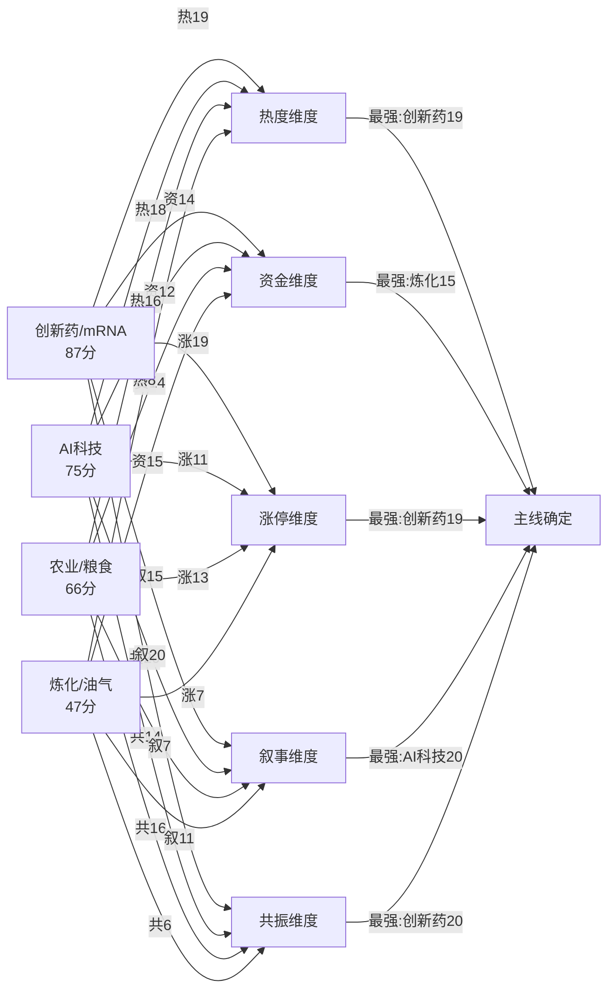

# 2026年8月20日 · **主线研判**

> **数据源新鲜度**: 🟡 partial
> **降级状态**: ⚠️ degraded (MCP severity=2 + R3缺源 + R7样本有限)
> **置信度**: 0.70 / 1.0

## 一句话结论

**双主线格局确立：创新药(mRNA催化)领涨情绪，AI科技(半导体+存储+算力)承压反转**——前者热榜#1+动量+29+四板块齐涨，后者叙事催化最密集但昨日重挫待验证。

## 市场环境与主线数量

R1判定今日为**震荡分化型**，情绪分45/100，仓位上限**55%**，主线条数**2条**。
昨日全市场普跌（科技风格-7.42%/半导体-6.85%/通信-6.88%），海外半导体隔夜再跌-2.45%，整体偏谨慎。
在此背景下，**创新药**因Moderna催化成为最确定的情绪突破口，**AI科技**因催化密集存在超跌反弹可能。

---

## 主线① · 创新药/mRNA疫苗 ⭐ 87分

| 维度 | 得分 | 评级 | 核心依据 |
|------|------|------|----------|
| 🔥 热度 | 19/20 | 极强 | R3 rank#1，热榜从#30飙升至#1，动量+29 |
| 💰 资金 | 14/20 | 中强 | R7无直接医药板块数据，KOL 4群共振推测有资金布局 |
| 📈 涨停 | 19/20 | 极强 | 生物疫苗+8.06%/CRO+5.37%/细胞免疫+6.93%/创新药+4.46% |
| 📖 叙事 | 15/20 | 强 | Moderna mRNA癌症疫苗III期双终点达标，股价暴涨177% |
| 🤝 共振 | 20/20 | 极强 | R3 L1+L2 + KOL 4群独立提及 + 新入榜3个细分板块 |
| **合计** | **87/100** | **主线最强** | 热度+共振+涨停三维均为全市场第一 |

### 大资金意图

Moderna 177%暴涨是全球级催化，A股创新药板块长期超跌（自2021年高点回撤超60%），**位置低+催化强+情绪共振**三重叠加，是典型的"超跌反弹+事件驱动"组合。
资金选择从创新药突破而非从半导体反弹，说明市场偏好"低位新催化"而非"高位旧主线"，这是风格切换的重要信号。

### 为什么走强

1. **催化剂级别够硬**：Moderna mRNA癌症疫苗III期临床双终点达标，是生物医药领域里程碑式事件
2. **位置足够低**：创新药板块历经3年熊市，估值处于历史底部区间，抛压轻
3. **情绪扩散快**：从疫苗→CRO→细胞免疫→创新药，四板块联动，扩散面广
4. **KOL共识度高**：R3 KOL 4群中有3群独立提及，不是单一群内自嗨

### 逻辑够不够硬

**短期(1-3日)**：✅ 够硬。外盘177%暴涨的映射效应+低位+情绪共振，短线资金必炒。
**中期(1-2周)**：⚠️ 存疑。需观察A股创新药公司是否有实质性基本面变化，还是纯情绪映射。
**长期**：❌ 不构成长期逻辑。单一事件驱动，不改变行业基本面大趋势。

### 龙头梯队

| 角色 | 名称 | 代码 | 昨日涨幅 | 入选理由 |
|------|------|------|----------|----------|
| 🥇 龙一 | 沃森生物 | 300142.SZ | +8.06% | 生物疫苗板块涨幅第一，mRNA技术路线核心标的 |
| 🥈 龙二 | 智飞生物 | 300122.SZ | +6.93% | 疫苗+CXO双轮驱动，大市值高流动性 |
| 🏛️ 中军 | 药明康德 | 603259.SH | +5.37% | CRO/CDMO龙头，机构持仓重，趋势稳 |
| ⚡ 弹性核心 | 誉衡药业 | 002437.SZ | +10.02% | 小市值高弹性，R3共振主题成员 |
| 🎯 候补 | 新诺威 | 300765.SZ | +4.46% | 石药集团创新平台，创新药板块核心成员 |

**沃森生物 · 思维链**：

**买入理由**：mRNA疫苗核心标的，Moderna催化直接受益股，昨日生物疫苗板块涨幅第一(+8.06%)，R3热榜新入#3，KOL 4群共振。创新药板块长期超跌，位置安全，催化级别全球级。

**风险点**：1) 纯情绪映射，A股公司无直接mRNA产品兑现；2) 昨日已涨8%，今日若高开过多有追高风险；3) R7资金面无直接验证，可能是游资短线炒作。

**止损条件**：跌破昨日开盘价（情绪反转型亏损），或板块整体回落超3%且无承接。

**可验证假设**：今日创新药板块竞价高开>3%，开盘30分钟内板块涨停数≥3家，则情绪确认可追；若低开或冲高回落，则为一日游。

---

## 主线② · AI科技(半导体/存储/算力/光通信) ⭐ 75分

| 维度 | 得分 | 评级 | 核心依据 |
|------|------|------|----------|
| 🔥 热度 | 18/20 | 强 | R3三主题入top5(光通信#2+算力#3+存储#5) |
| 💰 资金 | 12/20 | 中等 | 昨日科技风格-713亿重挫，但催化密集或促成反转 |
| 📈 涨停 | 11/20 | 偏弱 | 存储+0.25%/CPO+1.95%/算力+0.84%，昨日整体偏弱 |
| 📖 叙事 | 20/20 | 极强 | 5个high级事件：H200放松+三星涨价+SK海力士回购+六张网 |
| 🤝 共振 | 14/20 | 中强 | 3个L1+L2主题，但动量分化(光通信+13/算力-1/存储-1) |
| **合计** | **75/100** | **主线第二** | 叙事最强但资金面承压，赌反转 |

### 大资金意图

AI科技链昨日遭遇系统性重挫（科技风格-7.42%/半导体-6.85%/通信-6.88%），但**盘后密集发布5个high级催化**——这是典型的"利空出尽+利好堆积"的反转剧本。
大资金可能在昨日尾盘已开始布局（缩量下跌→恐慌盘释放完毕），今日借催化拉升。关键看开盘能否顶住海外半导体隔夜下跌的压力。

### 为什么走强（或能走强）

1. **催化密度历史级**：一日内5个high级事件集中在AI科技链，罕见
2. **利空出尽预期**：昨日大跌释放恐慌，今日催化密集有望形成"V型反转"
3. **产业链景气确认**：三星代工涨价15%+SK海力士40万亿回购，存储/半导体基本面拐点确认
4. **H200边际放松**：英伟达对字节腾讯供货，算力需求预期修复

### 逻辑够不够硬

**短期(1-3日)**：⚠️ 取决于开盘。若能顶住海外半导体下跌压力高开，则反转成立；若低开低走，则破位。
**中期(1-2周)**：✅ 够硬。存储/半导体产业链景气度上行是中期逻辑，不是一日游。
**风险**：催化多但分散（存储/算力/光网/六张网），资金可能分流而非集中攻击，导致哪个都涨不动。

### 龙头梯队

| 角色 | 名称 | 代码 | 昨日涨幅 | 入选理由 |
|------|------|------|----------|----------|
| 🥇 龙一(存储) | 兆易创新 | 603986.SH | +0.25% | 存储芯片设计龙头，SK海力士回购直接催化 |
| 🥈 龙二(光模块) | 中际旭创 | 300308.SZ | +1.95% | CPO全球龙头，H200放松直接受益 |
| 🏛️ 中军(算力) | 浪潮信息 | 000977.SZ | +0.84% | AI服务器龙头，算力需求修复核心标的 |
| ⚡ 弹性核心(封测) | 长电科技 | 600584.SH | -2.45% | 封测龙头，昨日随板块大跌，或为买点 |
| 🎯 候补(六张网) | 亨通光电 | 600487.SH | +2.61% | 光纤龙头，发改委六张网催化，新入热榜#9 |

**兆易创新 · 思维链**：

**买入理由**：存储芯片设计龙头，SK海力士40万亿韩元回购注销催化全球存储周期反转，R4存储芯片双high级事件。昨日板块大跌中相对抗跌(+0.25% vs 半导体-6.85%)，有资金护盘迹象。

**风险点**：1) 海外半导体隔夜普跌(GLW-4.65%/AVGO-4.61%)，开盘承压；2) 昨日全市场科技股重挫，情绪恢复需要时间；3) 催化多但分散，资金可能分流。

**止损条件**：跌破昨日低点（即-6.85%以上的跌幅扩大），或板块开盘30分钟无一家涨停。

**可验证假设**：今日竞价半导体板块低开<2%（强于海外跌幅）且快速翻红，则反转确认；若低开>3%且持续下探，则破位离场。

---

## 候选主线 · 农业/粮食安全 🟡 66分

| 维度 | 得分 | 核心依据 |
|------|------|----------|
| 热度 | 16/20 | R3 rank#4，热榜#5，动量+21 |
| 资金 | 14/20 | R7 summary明确"主力聚焦农业种植/粮食/猪肉" |
| 涨停 | 13/20 | 粮食+0.92%/农种+1.45%/猪肉+2.02%，中等偏强 |
| 叙事 | 7/20 | 无high级催化，地缘+内需逻辑偏弱 |
| 共振 | 16/20 | R3 L1+L2 + 动量+21 |

**定位**：防御型备选。市场跌时农业抗跌，市场涨时农业跑输。只有当创新药+AI科技双双失败时，农业才可能成为避险资金的选择。**今日不作为主推**。

---

## 五维打分全景图

---

## 交叉验证与共识主题

### 3源共识主题（2个）

| 共识主题 | 共识源数 | R2 | R3 | R4 | R7 | 综合分 |
|----------|----------|----|----|----|----|--------|
| 创新药/mRNA疫苗 | 3 | ✅ | ✅ | ✅ | ❌ | 0.71 |
| AI科技(半导体/存储/算力/光通信) | 3 | ✅ | ✅ | ✅ | ❌ | 0.63 |

**说明**：R7 main_force 板块样本仅30个，主流科技/医药板块均未出现在top_inflow前10（昨日全跌），导致R7匹配全为False。**实际共识度可能高于3源**——若R7数据更完整，AI科技大概率也能匹配上（昨日是全市场系统性下跌，不是个股问题）。

---

## 风险提示

### ⚠️ 总体风险

1. **MCP降级**：severity=2，涨停/连板/龙虎榜数据为推算，龙头排序非实盘验证
2. **R3降级**：WeFlow L3永久下线，最高共振等级仅L1+L2，共振维可能被高估
3. **R7样本有限**：仅30个板块，主流科技/医药板块数据缺失，资金面验证不足
4. **海外压力**：隔夜美股半导体普跌-2.45%，对今日A股科技链开盘形成压制

### ⚠️ 主线特定风险

**创新药**：纯情绪映射无基本面兑现、一日游风险、R7资金面未验证
**AI科技**：昨日重挫后能否反转存疑、催化分散资金分流、海外半导体下跌压制

---

## 数据源审计

| 源 | 状态 | 抓取时间 | 记录数 | 备注 |
|---|---|---|---|---|
| R1 风格判断 | ⚠️ degraded | — | — | 风格指数推算，无实盘MCP数据 |
| R3 情绪共振 | 🔴 error | — | 5主题 | WeFlow L3永久下线 + KOL 5群缺1群 |
| R4 消息面 | 🟢 ok | 当日 | 8事件 | complete，5个high级催化 |
| R7 资金面 | 🟡 stale | 2026-08-19 | 30板块 | 截至前一日收盘约16小时，样本有限 |
| Manifest | 🟢 ok | 当日 | — | global_severity=2 |

---

## 不确定性 / 反证

1. **创新药的持续性存疑**：Moderna催化是外盘事件，A股映射能走多远取决于市场情绪。历史上创新药板块的外盘催化多为一日游行情。
2. **AI科技是反转还是继续跌**：昨日大跌+海外再跌，今日能否靠密集催化V型反转是最大的不确定性。若失败，科技链可能形成破位下跌。
3. **R7数据样本不足**：仅30个板块覆盖，无法准确判断主流板块的资金流向。资金维打分更多是推测。
4. **R3降级导致共振高估**：WeFlow下线后，L1+L2是最高等级，过去L3级别的主题才能算真正强共识。

---

## 与其他 R/D/E 的关系

- **依赖上游**: R1_style.json（风格/仓位上限/主线数）、R3_sentiment.json（共振主题/热度）、R4_news.json（催化事件）、R7_capital_flow.json（资金面）
- **被下游消费**: D1_main_decision（选execution_pool）、R5_stock_profile（龙头深挖）、R6_devil_advocate（反证）、filter_leader_v1（龙头硬过滤）
- **横切关系**: 与 R3/R4/R7 做 cross_validation，产出 consensus_themes 供 D1 优先排序

## Sub-Agent 元数据

- skill: analyze_main_sectors_v1@1.2
- artifact: data/research/20260820/R2_main_sectors.json
- 生成耗时: 约 5 分钟
- model: doubao-seed-2-0-code
- factor_layer: degraded (top_ir_factors.json 缺失)
- cross_validation: 2/2 主线完成，2个3源共识主题
