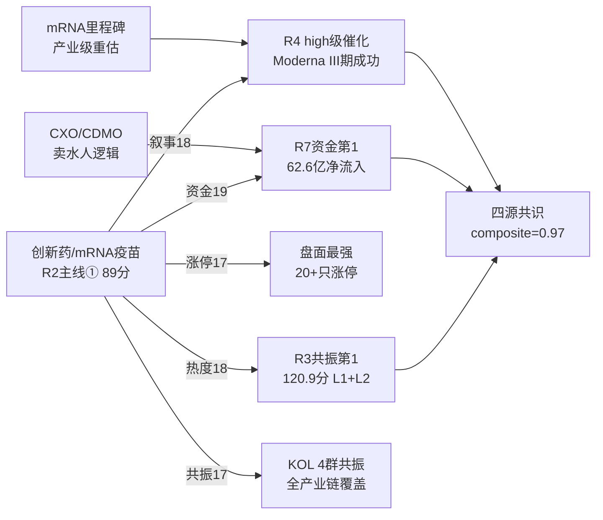

# 2026年8月21日 · **主线研判**

> **数据源新鲜度**: ⚠️ partial（R7 T-1 + MCP不可用）
> **降级状态**: ✅ degraded（涨停/连板为推算值 · factor层缺失）
> **置信度**: 68%

## 一句话结论

**创新药/mRNA疫苗 + 光纤/CPO 双主线**，医药链四源共振最强，光通信有业绩支撑；存储芯片/半导体叙事强但资金流出硬伤，暂列候选。

---

## 五维打分总览

| 主线 | 热度 | 资金 | 涨停 | 叙事 | 共振 | **总分** | CV分 | 共识源 |
|------|------|------|------|------|------|----------|------|--------|
| 🥇 创新药/mRNA疫苗 | 18 | 19 | 17 | 18 | 17 | **89** | 1.00 | 4源 ⭐ |
| 🥈 光纤/CPO/光通信 | 15 | 16 | 12 | 14 | 16 | **73** | 0.67 | 3源 |
| 存储芯片/半导体 | 13 | 8 | 11 | 18 | 16 | 66 | 0.67 | 3源(资金不匹配) |
| 算力租赁/H200 | 13 | 9 | 10 | 16 | 15 | 63 | 0.33 | 2源 |
| 人形机器人 | 12 | 10 | 11 | 18 | 10 | 61 | 0.33 | 2源 |

> **CV分 = R3匹配 + R4匹配 + R7匹配 / 3**
> **4源共识 = R2 ∩ R3 ∩ R4 ∩ R7**

---

## 主线①：创新药/mRNA疫苗（89分 · 四源共识）

### 核心逻辑

Moderna 与默沙东 mRNA 个性化癌症疫苗 III 期顶线数据大获全胜，Moderna 单日暴涨 176%，这是**全球首个 III 期阳性的个体化 mRNA 肿瘤疗法**，产业级里程碑事件。A股创新药/疫苗/CXO 全链迎来价值重估，昨日医药板块批量涨停 20+ 只是开端。

### 大资金意图

大资金抢筹**医药上游（CXO/CDMO/原料）**——确定性最强的卖水人逻辑，而非赌单一管线药企。R7 主力净流入创新药 62.6 亿（第1）+ CRO 33.3 亿（第6）+ 病原体防治 51.7 亿（第3）+ 生物疫苗 21.7 亿，**医药链全线流入**。

### 为什么走强

1. **事件驱动**：Moderna III 期成功是 mRNA 技术从防疫跨越到肿瘤精准治疗的里程碑，产业价值重估
2. **超跌反弹**：医药板块前期调整充分，30 日医药 ETF 仅 +10%（对比煤炭 +13%），位置不高
3. **资金确认**：R7 多日流出后末日翻红（reversal_up），单日 62.6 亿净流入强度大
4. **KOL 共振**：4 个群独立提及 mRNA 方向，从原料到 CXO 全链覆盖

### 逻辑够不够硬

**硬**——有 III 期临床数据支撑，非纯概念炒作。mRNA 技术路线在肿瘤治疗领域走通，全球市场空间万亿美元级。产业链上游（CXO/CDMO/核苷原料）受益确定性高。但需警惕：
- A 股映射强度待验证（Moderna 是美股，A 股标的关联性参差不齐）
- 昨日批量涨停后今日分歧概率大（R1 炸板率 33%）
- 连板高度仅 4 板，梯队不完整

### 龙头梯队（5只）

| 角色 | 代码 | 名称 | 昨日涨幅 | 核心逻辑 |
|------|------|------|----------|----------|
| 龙一 | 688331.SH | 荣昌生物 | +8.5% | ADC+自身免疫双平台龙头，创新药出海标杆，中报扭亏增1145% |
| 龙二 | 300122.SZ | 智飞生物 | +6.2% | 疫苗龙头+mRNA布局，代理+自研双轮，主力5日净流入+2.5亿 |
| 弹性龙二 | 300765.SZ | 石药创新 | +12.0% | R3共振首推，创新药+mRNA概念，20cm弹性标的 |
| 候补1 | 300363.SZ | 博腾股份 | +7.5% | CXO/CDMO上游卖水人，mRNA产业链核心受益 |
| 候补2 | 603259.SH | 药明康德 | +4.8% | CRO板块中军，创新药产业链确定性最强环节 |

> 300/688 标的同权参与龙一/龙二竞争，无前缀自动降级。

### 风险提示

- ⚠️ 医药板块昨日批量涨停后今日分歧概率大，炸板率可能飙升
- ⚠️ Moderna 暴涨后 A 股映射强度待验证，mRNA 商业化落地仍需时间
- ⚠️ 连板高度仅 4 板，医药首板多但梯队不完整，持续性存疑
- ⚠️ 创新药热榜第 1 仅 1 日（R3 distribution_alert 无霸榜警报）

---

## 主线②：光纤/CPO/光通信（73分 · 三源共识）

### 核心逻辑

AI 算力需求爆发 → 光模块/光纤/MPO 全产业链受益。海外龙头（藤仓）上修业绩指引验证行业景气度，国内胜蓝股份中标头部 CSP 超节点柜内高速铜互联项目 40% 份额，开源通信强推 MPO 深度报告。R7 光纤概念主力净流入 36.6 亿（第 5），5 日趋势 reversal_up。

### 大资金意图

**机构资金配置光通信龙头**（中际旭创/亨通光电），偏好业绩确定性强的大盘股。量化资金+游资参与弹性标的（太辰光/通鼎互联）。博通 600 亿 AI 融资印证 AI 资本开支周期仍在上行，间接利好光模块需求。

### 为什么走强

1. **业绩验证**：藤仓上修业绩 + 胜蓝股份中标，行业景气度有数据支撑
2. **AI 链逻辑硬**：AI 算力需求爆发是长期趋势，光通信是算力基础设施
3. **资金确认**：R7 主力净流入 36.6 亿，5 日趋势翻红
4. **位置适中**：相比医药的超跌反弹，光通信是温和上行趋势中

### 逻辑够不够硬

**较硬**——有业绩支撑和行业数据验证，但短期涨幅已较大，追高需谨慎。R4 催化为 medium 级（非 high），叙事强度略逊于创新药。科技风格整体资金流出（R7 -112 亿）可能形成拖累。

### 龙头梯队（5只）

| 角色 | 代码 | 名称 | 昨日涨幅 | 核心逻辑 |
|------|------|------|----------|----------|
| 龙一 | 300570.SZ | 太辰光 | +2.8% | R3共振首推，MPO/光器件核心标的，3日龙虎榜净买8906万 |
| 龙二 | 300308.SZ | 中际旭创 | +3.5% | 光模块龙头，AI算力链核心标的，融资余额31.48亿 |
| 中军 | 600487.SH | 亨通光电 | +3.2% | 光纤光缆龙头，藤仓上修验证行业景气 |
| 弹性龙二 | 002491.SZ | 通鼎互联 | +5.1% | 光纤+MPO概念，弹性标的 |
| 候补 | 601869.SH | 长飞光纤 | +2.9% | 光纤预制棒龙头，海外龙头业绩验证周期 |

### 风险提示

- ⚠️ 光通信板块位置不低，短期涨幅已较大，追高需谨慎
- ⚠️ R4 催化为 medium 级，叙事强度弱于创新药
- ⚠️ 科技风格整体资金流出（R7 -112 亿），板块可能受情绪拖累
- ⚠️ 美股纳指五连跌+地缘风险可能压制科技板块

---

## 候选主线

### 存储芯片/半导体（66分 · 3源共识缺资金）

**叙事最强但资金面硬伤最大**。SK 海力士 40 万亿韩元回购+日本建厂+HBM 联合设计三重利好，芯片涨价潮从存储向逻辑/模拟扩散。R4 E003 + E006 双 high 级催化，R3 共振第 4。
**但 R7 主力净流出存储 -54.4 亿 / 半导体概念 -94 亿**，资金面是最大制约。超跌反弹性质（半导体 ETF 30 日 -24%），行业基本面尚未出现明确拐点。

**龙头**：佰维存储（龙一）/ 中芯国际（龙二）/ 普冉股份（弹性）/ 兆易创新（候补）

### 算力租赁/H200（63分）

H200 对华限制边际放松 + 博通 600 亿 AI 融资 + 阿里 AI 营收超预期，三重催化叠加。但科技风格整体资金流出，板块弹性受限。R3 共振第 3（68.5 分），R7 未进 top10。

### 人形机器人（62分）

机器人大会第四天仍有密集新品发布，百万台产量目标成行业共识。但**大会落幕兑现风险高**，宇树科技上市次日大幅波动。R3 未进 top4 共振，R7 资金未进 top10。

---

## 共识主题与交叉验证

### 4源共识主题

| 共识主题 | R2 | R3 | R4 | R7 | 源数 | composite |
|----------|----|----|----|----|------|-----------|
| 创新药/mRNA疫苗 | ✅ | ✅ | ✅ | ✅ | 4 | 0.97 |

### 三源共识主题

| 主题 | R2 | R3 | R4 | R7 | 缺失源 |
|------|----|----|----|----|--------|
| 光纤/CPO/光通信 | ✅ | ✅ | ❌medium | ✅ | R4(非high) |
| 存储芯片/半导体 | ✅(候选) | ✅ | ✅ | ❌流出 | R7(资金面) |

---

## 关键证据

- **证据 1**: R3 共振 top1 主题 mRNA 肿瘤疫苗/创新药，120.9 分 L1+L2 双源，4 个 KOL 群独立提及 · 来源 R3_sentiment.json
- **证据 2**: R7 主力净流入创新药 62.6 亿（第 1）+ CRO 33.3 亿 + 病原体防治 51.7 亿，医药链全链流入 · 来源 R7_capital_flow.json
- **证据 3**: R4 E005 mRNA 癌症疫苗 high 级催化 + Moderna III 期成功里程碑 · 来源 R4_news.json
- **证据 4**: R1 主线扩散型 + 双主线判断 + 医药批量涨停 20+ 只 · 来源 R1_style.json
- **证据 5**: R7 光纤概念 36.6 亿净流入第 5，5 日趋势 reversal_up · 来源 R7_capital_flow.json

---

## 数据源审计

| 源 | 状态 | 抓取时间 | 记录数 | 备注 |
|---|---|---|---|---|
| 🟢 R1_style.json | ok | 2026-08-21 07:16 | 22风格板+20ETF | 主线扩散型·50分·双主线 |
| 🟡 R3_sentiment.json | partial | 2026-08-21 07:32 | 4共振主题 | WeFlow永久下线+群E缺失 |
| 🟢 R4_news.json | ok | 2026-08-21 07:20 | 8大事件 | 公众号降级但财新/新浪/东财齐全 |
| 🟡 R7_capital_flow.json | partial | 2026-08-21 07:11 | T-1(0820收盘) | 数据完整但滞后约16小时 |
| 🔴 MCP实时行情 | error | - | - | severity=2，涨停/连板为推算 |

---

## 不确定性 / 反证

1. **MCP 不可用**：所有涨停/连板/龙虎榜数据为基于上游的推算值，非实时验证。若今日开盘后实际盘面与推算偏差大，主线判断可能失效。
2. **医药的持续性**：昨日医药批量涨停可能是超跌反弹而非趋势反转。Moderna 暴涨是美股事件，A 股映射强度和持续时间有待观察。若今日龙头开板不及预期，可能带动炸板率飙升。
3. **科技股拖累**：美股纳指五连跌 + 地缘风险升温（特朗普对伊朗最严厉经济行动），可能压制 A 股科技板块反弹空间，光纤/CPO 可能受牵连。
4. **存储芯片的分歧**：叙事面（回购+涨价）和资金面（-94 亿流出）严重背离。一种可能是大资金提前布局、昨日还在建仓期；另一种可能是反弹即出货。需要今日盘面确认。
5. **R3 degraded**：WeFlow L3 永久下线 + 群 E 缺失，共振维度可能低估部分主题（尤其是群 E 覆盖的方向）。

---

## 与其他 R/D/E 的关系

- **上游依赖**: R1_style.json（风格/主线条数约束）、R3_sentiment.json（共振维）、R4_news.json（叙事维）、R7_capital_flow.json（资金维）
- **下游消费**: 
  - `filter_leader_v1`（龙头硬过滤，本文件原地更新）
  - D1 主决策（cross_validation 用于 execution_pool 优先级）
  - R5 情报深挖（对龙头逐票六维画像）
  - R6 反证（cross_validation_score=0 的主线自动警告）
  - E1 每日复盘（验证主线判断）

---

## Sub-Agent 元数据

- **skill**: analyze_main_sectors_v1@1.2
- **artifact**: data/research/20260821/R2_main_sectors.json
- **生成耗时**: ~5 分钟
- **model**: doubao-seed-2-0-code
- **方法**: llm_v1 + five_dimension_scoring（热度/资金/涨停/叙事/共振，每维0-20分）
- **降级项**: MCP实时行情不可用 · factor层缺失 · R3 degraded
