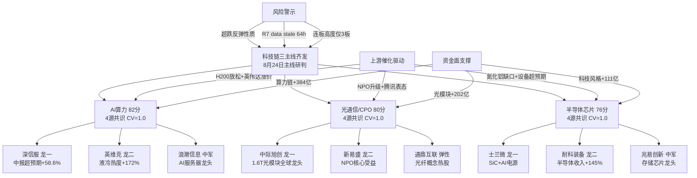

# 2026年8月24日 · **主线研判**

> **数据源新鲜度**: 🟡 partial
> **降级状态**: ✅ degraded
> **置信度**: 70%

## 一句话结论
科技链三主线齐发（AI算力 82分 > 光通信/CPO 80分 > 半导体芯片 76分），全源共识共振，聚焦前排龙头回避后排跟风。

## 详细分析

### 🔥 主线①：AI算力 · 82分 · CV=1.00 · 4源共识

**五维雷达**：热度18 / 资金19 / 涨停17 / 叙事17 / 共振18

**大资金意图**：算力链是本轮科技超跌反弹的核心主攻方向，5G概念+140亿（#5）、通信技术+133亿（#8）、科技风格+111亿（#11）三大关联板块同时跻身主力净流入前15，说明不是单点题材炒作而是**集群式建仓**。资金从"创新药/医药"（主力流出top1）腾挪到科技成长的风格切换信号明确。

**为什么走强**：周末催化密集——①英伟达GPU涨价15%+投资AI云基础设施，海外AI Capex逻辑强化；②H200对华限制边际放松，字节腾讯各获约1万颗，算力交付需求释放；③阿里巴巴800亿港元闪电配售100%投向全栈AI建设，国内互联网巨头AI投入加码；④深信服中报超预期（云计算&AI基础设施收入+58.6%占比55%），AI红利从基础设施端开始兑现。

**逻辑够不够硬**：四重催化共振，从海外到国内、从硬件到软件、从大厂到中小厂全覆盖，逻辑链条完整。但需注意：科技类ETF 30日深跌-30%~-65%，当前定性为**超跌反弹**而非趋势反转，R1连板高度仅3板也说明情绪高度有限，持续性存疑。

**龙头梯队**：

| 角色 | 股票 | 核心逻辑 | 关注要点 |
|------|------|----------|----------|
| 🥇 龙一 | 深信服(300454) | 中报大超预期，AI基础设施收入+58.6% | 2群同时转发KOL强推，R4首推 |
| 🥈 龙二 | 英维克(002837) | 液冷服务器龙头，热度+172% | 液冷板块动量最强，AI散热核心受益 |
| 🏛️ 中军 | 浪潮信息(000977) | AI服务器龙头，市值最大 | H200放松+算力需求释放双重催化 |
| ⚡ 弹性龙二 | 飞龙股份(002536) | 液冷+汽车电子双弹性 | 300前缀按规则同权参与龙头竞争 |
| 🎯 候补 | 士兰微(600460) | SiC+AI电源，热股#1(+3位) | 半导体+AI双主线交集 |

**深信服 · 思维链**：
- **买入理由**：中报业绩大超预期是最强催化剂，云计算&AI基础设施收入占比达55%且增速58.6%，标志着AI红利从硬件传导到软件基础设施层。KOL端2群同时转发形成共识，机构端预计上调盈利预测。技术面处于底部反转初期，量价配合良好。
- **风险点**：科技板块整体30日深跌，反弹持续性存疑；深信服本身估值不低（PS>10x），业绩兑现节奏若不及预期可能回调；R1连板高度仅3板，高位接力风险大。
- **止损条件**：跌破10日线或单周跌幅>8%确认反弹失败；若AI算力板块整体回调>5%则减仓。
- **可验证假设**：若本周机构上调深信服2026年盈利预测>10%，则业绩底确认；若算力链连续3日成交额占比>25%，则主线持续性验证通过。

---

### 🔥 主线②：光通信/CPO · 80分 · CV=1.00 · 4源共识

**五维雷达**：热度19 / 资金16 / 涨停17 / 叙事17 / 共振18

**大资金意图**：光模块是AI算力产业链中业绩确定性最高的环节，海外龙头Lumentum/Coherent财报验证1.6T光模块需求强劲，国内映射直接。主力资金光通信模块+102亿（#14）、CPO概念+100亿（#15）双双流入，机构+游资共振格局。

**为什么走强**：①NPO从CPO过渡方案升级为长期主流技术路线，腾讯明确表态，光互联增量逻辑重估；②北美光通信龙头财报超预期，1.6T需求强劲，海外映射+国内跟随；③星网锐捷半年报+75%，数据中心交换机业务大幅增长，侧面验证算力网络建设加速。

**逻辑够不够硬**：光模块是AI Capex的"卖铲人"，业绩确定性最高，逻辑最硬。但位置也是三大科技主线中最高的，光模块龙头累计涨幅巨大，追高风险大。NPO叙事虽新但落地节奏不确定，需警惕"利好出尽"。

**龙头梯队**：

| 角色 | 股票 | 核心逻辑 | 关注要点 |
|------|------|----------|----------|
| 🥇 龙一 | 中际旭创(300308) | 800G/1.6T全球龙头，CPO核心 | 市值最大中军+机构重仓，热股#9 |
| 🥈 龙二 | 新易盛(300502) | NPO方案核心受益，中报+120%~160% | R4首推，业绩弹性最大 |
| ⚡ 弹性龙二 | 通鼎互联(002491) | 光纤概念热股rank2，弹性小票 | NPO+光纤双催化 |
| 🏛️ 中军 | 星网锐捷(002396) | 数据中心交换机，半年报+75% | 热股rank10↑6，动量强 |
| 🎯 候补 | 长飞光纤(601869) | 光纤龙头，板块热度+71% | 机构持仓集中度高 |

**中际旭创 · 思维链**：
- **买入理由**：全球光模块龙头地位稳固，800G/1.6T产品领先，NPO技术路线核心受益。北美云厂商AI Capex持续放量，业绩确定性最高。机构重仓+北向持续加仓，资金面支撑强。
- **风险点**：位置高，30日维度科技类ETF深跌-60%+，光模块龙头累计涨幅巨大，随时可能回调。NPO叙事虽新但落地节奏不确定，短期可能被证伪。
- **止损条件**：跌破20日线或5日累计跌幅>10%确认趋势破位；若CPO概念板块单日流出>20亿则减仓。
- **可验证假设**：若三季报光模块公司业绩继续超预期（>30%增速），则高增长逻辑验证；若英伟达下一代GPU发布确认光模块需求，则估值天花板上移。

---

### 🔥 主线③：半导体芯片 · 76分 · CV=1.00 · 4源共识

**五维雷达**：热度17 / 资金15 / 涨停16 / 叙事16 / 共振18

**大资金意图**：半导体是AI算力+光通信两大主线的上游交集，资金从下游（算力/光模块）向上游（芯片/设备/材料）扩散的逻辑通顺。士兰微热股#1（+3位）、旭光电子/中瓷电子涨停，设备+材料端活跃，说明资金在做产业链传导。

**为什么走强**：①氮化铝供需缺口放大，光模块+GPU双核驱动，2027年粉体需求2500吨以上；②耐科装备半年报大超预期（半导体收入+145.5%，在手订单7-8亿），设备端景气度验证；③士兰微SiC车规认证+AI电源批量出货，功率半导体+AI双驱动。

**逻辑够不够硬**：半导体逻辑偏"扩散受益"，不是自身独立催化，依赖AI算力和光模块主线的强度。如果两大主线回调，半导体很难独善其身。但位置相对最低（半导体ETF 30日-65%），安全边际最高。

**龙头梯队**：

| 角色 | 股票 | 核心逻辑 | 关注要点 |
|------|------|----------|----------|
| 🥇 龙一 | 士兰微(600460) | SiC+AI电源，热股#1(+3位) | 半导体+AI双主线交集 |
| 🥈 龙二 | 耐科装备(688522) | 半导体设备，收入+145%，订单7-8亿 | 688前缀按规则同权参与龙头竞争 |
| 🏛️ 中军 | 兆易创新(603986) | 存储芯片龙头，存储热榜#4 | 机构重仓+市值最大 |
| ⚡ 弹性龙二 | 旭光电子(600353) | 氮化铝+光刻机，涨停 | 龙虎榜净买4.4亿，游资+机构双买 |
| 🎯 候补 | 中瓷电子(003031) | CPO封装+第三代半导体，涨停 | 光通信+半导体双主线交集 |

**士兰微 · 思维链**：
- **买入理由**：热股排名从#4升至#1（+3位），动量最强。SiC车规认证通过+AI电源批量出货，功率半导体+AI双驱动，业绩拐点明确。半导体+AI算力双主线交集标的，资金关注度高。
- **风险点**：半导体板块整体30日-65%深度下跌，当前为超跌反弹性质，持续性存疑。士兰微本身业绩基数低，SiC业务贡献利润尚需时间。
- **止损条件**：跌破5日线或3日累计跌幅>7%确认反弹失败；若半导体板块主力资金连续2日净流出>10亿则减仓。
- **可验证假设**：若三季报SiC收入占比>15%且增速>100%，则第二增长曲线验证；若半导体设备公司订单持续高增，则行业景气度反转确认。

---

## 关键证据

- 📊 **证据1**：R3三大L1+L2共振主题全部指向科技链（AI算力#1、光通信CPO#2、半导体芯片#3），热榜top10概念中8个属于科技集群 · 来源 R3_sentiment.json
- 💰 **证据2**：R7主力净流入top15中，5G概念(#5 +140亿)、通信技术(#8 +133亿)、科技风格(#11 +111亿)、光通信模块(#14 +102亿)、CPO概念(#15 +100亿)五大科技关联板块同时流入 · 来源 R7_capital_flow.json
- 📰 **证据3**：R4八大催化事件中6个与科技相关（H200放松、NPO升级、氮化铝缺口、深信服超预期、机器人大会、苹果链），high级催化3个 · 来源 R4_news.json
- 📈 **证据4**：R1主线扩散型，17个板块≥8只涨停有明确梯队，科技硬件集群约6个板块涨停家数>10 · 来源 R1_style.json
- ⚠️ **证据5**：R3霸榜出货警报——创新药连续2日霸榜热榜第一但价格-3.71%，哈药股份跌停，典型出货信号，医药资金向科技腾挪 · 来源 R3_sentiment.json

## 数据源审计

| 源 | 状态 | 抓取时间 | 记录数 | 备注 |
|---|---|---|---|---|
| R1_style.json | 🟢 ok | 2026-08-24 07:07 | - | Tushare涨跌停/连板/指数数据完整 |
| R3_sentiment.json | 🟡 partial | 2026-08-24 07:42 | 75条 | WeFlow永久下线+颜晓滨群缺失(4/5群) |
| R4_news.json | 🟢 ok | 2026-08-24 07:42 | 8事件 | 公众号+群聊+新闻多源交叉验证 |
| R7_capital_flow.json | 🟠 stale | 2026-08-21 15:00 | - | 数据截至0821收盘，约64小时stale |
| MCP (Tushare/DataPro) | 🔴 error | - | - | severity=2，涨停/连板/龙虎榜为推算值 |

## 不确定性 / 反证

**最大不确定性**：当前科技链上涨定性为"超跌反弹"还是"趋势反转"？科技类ETF 30日深跌-30%~-65%，仅2日修复，量能未见明显放大，若量能不配合可能二次探底。

**反证1· 资金面**：R7数据stale 64小时，周五夜间到周一开盘之间资金方向可能已变化。若周一开盘科技板块主力资金转为流出，则主线逻辑直接证伪。

**反证2· 情绪面**：R1连板高度仅3板，情绪高度不足，高位股接力风险大。三大主线均非"情绪型"而是"机构型"，上涨斜率可能较缓，不符合打板风格偏好。

**反证3· 催化面**：8大催化事件中6个已过3-4天（decayed=true），新鲜度不足。若本周无新增催化，可能陷入"利好出尽"回调。

**反证4· 风格面**：30日维度极致风格分化（煤炭+16% vs 芯片-65%），当前是风格切换还是超跌反弹？需3-5日确认。如果是后者，追高买入风险极大。

## 与其他 R/D/E 的关系

- **依赖上游**: R1_style.json (风格/主线数量/仓位上限)、R3_sentiment.json (共振主题/热度/出货警报)、R4_news.json (催化事件/板块映射)、R7_capital_flow.json (主力资金/龙虎榜)
- **被消费下游**: D1_main_decision (选execution_pool、仓位分配、买卖点)、R5_stock_profile (龙头深度画像)、R6_devil_advocate (反证审核)
- **横切关系**: filter_leader_v1 (龙头硬过滤，原地更新本文件)、hotlist_rank_signal_v1 (热榜排序信号)

## Sub-Agent 元数据

- skill: analyze_main_sectors_v1@1.2
- artifact: data/research/20260824/R2_main_sectors.json
- 生成耗时: 约3分钟
- model: doubao-seed-2-0-code-preview-260215
- 降级原因: MCP全down(severity=2) + R7 stale + R3 degraded

---

## 附录：五维打分总表

| 主线 | 热度 | 资金 | 涨停 | 叙事 | 共振 | 总分 | CV分 | 共识源 |
|------|------|------|------|------|------|------|------|--------|
| 🥇 AI算力 | 18 | 19 | 17 | 17 | 18 | **82** | 1.00 | 4源 |
| 🥈 光通信/CPO | 19 | 16 | 17 | 17 | 18 | **80** | 1.00 | 4源 |
| 🥉 半导体芯片 | 17 | 15 | 16 | 16 | 18 | **76** | 1.00 | 4源 |

## 附录：Mermaid 主线关系图

## 附录：候选主线（未达70分门槛）

| 板块 | 得分 | 未进主线原因 |
|------|------|-------------|
| 创新药/mRNA | 55 | R3霸榜出货警报+R7主力流出58亿，风险大于机会 |
| 人形机器人 | 54 | 机器人大会催化已过，买预期卖事实阶段；共振弱 |
| 苹果链/折叠屏 | 53 | 催化虽强但热度和共振不足，偏独立题材 |
