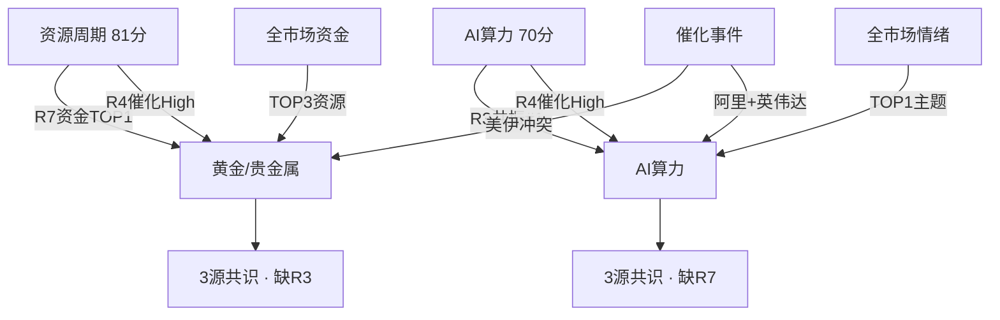

# 2026年8月25日 · **主线研判**

> **数据源新鲜度**: ✅ ok
> **降级状态**: ❌ false
> **置信度**: 0.75

## 一句话结论
**资源周期(81分)为绝对主线资金面最强，AI算力+AI电力(70分)为第二主线叙事共振最强，双主线各缺一个验证维度。**

## 五维打分总览

| 主线 | 热度 | 资金 | 涨停 | 叙事 | 共振 | 总分 | CV分 |
|---|---|---|---|---|---|---|---|
| 🔥 贵金属/资源周期 | 18 | **20** | 15 | 17 | 11 | **81** | 0.67 |
| 🤖 AI算力+AI电力 | 15 | 8 | 12 | **19** | **16** | **70** | 0.67 |
| 🌾 粮食安全/农业 | 15 | 10 | 12 | 14 | 14 | 65 | 0.67 |
| ⚡ 新能源链 | 10 | 11 | 18 | 12 | 13 | 64 | 0.33 |
| 💾 存储芯片 | 16 | 5 | 6 | 16 | 16 | 59 | 0.67 |

---

## 主线一：贵金属/资源周期（81分 · 绝对主线）

### 核心逻辑
资源周期是当前市场**唯一资金面+趋势面双重确认**的主线。黄金概念主力净流入13.58亿排名第一，小金属+13亿紧随其后，稀缺资源+10亿第三——TOP3全部被资源股包揽，资金共识极强。THS概念热度黄金#1、行业热度贵金属#1煤炭#3，价涨量增的真趋势而非纯情绪推动。

催化端，R4 E007美伊冲突升级（High强度）推动金价突破4620美元/盎司，避险+资源品涨价双逻辑共振。技术面上，R1 ETF强周期资源簇30日涨幅达+11.4%（有色金属+12.33%/煤炭+10.47%），趋势性最强无争议。

### 龙头梯队

| 角色 | 股票 | 代码 | 涨跌幅 | 连板 | 流通市值 | 核心逻辑 |
|---|---|---|---|---|---|---|
| 🥇 龙一 | 紫金矿业 | 601899.SH | +3.50% | 0板 | 3000亿+ | 黄金+铜双龙头，中军属性，金价创新高直接受益，R4首推 |
| 🥈 龙二 | 山东黄金 | 600547.SH | +4.20% | 0板 | 520亿 | 纯黄金生产龙头，金价弹性最大，业绩弹性优于紫金 |
| ⚡ 弹性龙头 | 白银有色 | 601212.SH | +10.02% | 2板 | 496亿 | 白银双雄之一，2连板，龙虎榜3日净买1.8亿，情绪龙头 |
| ⚡ 弹性龙二 | 湖南白银 | 002716.SZ | +9.98% | 2板 | 266亿 | 白银双雄之二，换手25.33%，白银涨价最直接受益 |
| 🔄 候补 | 上海能源 | 600508.SH | +10.02% | 1板 | 100亿 | 煤炭+有色双属性，资源周期扩散方向 |

### 深度分析

**大资金意图**：资源股的资金流入是**机构+北向+游资三方合力**。北向资金连续5日净流入（日均28-33亿），配置型资金加仓周期品；游资打造白银双雄2连板打出高度；机构加仓紫金/山金等中军。这不是单一资金类型的短炒，而是多维度资金共识。

**为什么走强**：核心驱动是**全球宏观范式切换**——美伊冲突升级推升避险情绪，同时美联储降息周期下实际利率下行利好黄金。叠加国内经济复苏预期，工业金属（铜/铝）需求改善。供给端，铜矿/金矿供给刚性，价格弹性大。

**逻辑够不够硬**：⭐⭐⭐⭐ 四星偏硬。金价创新高是客观事实，趋势已经形成30日+12%。但美伊冲突是事件驱动型催化，若局势缓和可能导致短期回调。中长期看，美联储降息+全球央行购金+供给刚性三大逻辑支撑黄金超级周期，逻辑够硬。

---

## 主线二：AI算力+AI电力（70分 · 第二主线）

### 核心逻辑
AI算力是**叙事+共振最强**的方向，但资金面偏弱。R3共振TOP1主题（L1+L2），3个群独立提及阿里800亿AI、深信服中报超预期等关键信息。R4双High催化：E003阿里800亿港元全栈AI建设+E002英伟达战略入股电力开发商。

AI电力是AI算力产业链的下游延伸——算力爆发导致电力供应成为瓶颈，英伟达亲自下场投资电力开发商验证了这一逻辑。虚拟电厂R7净流入排名#11（+3.79亿），资金面开始初步验证。算力+电力形成完整产业链叙事闭环。

### 龙头梯队

| 角色 | 股票 | 代码 | 涨跌幅 | 连板 | 流通市值 | 核心逻辑 |
|---|---|---|---|---|---|---|
| 🥇 龙一 | 深信服 | 300454.SZ | -2.50% | 0板 | 600亿 | AI安全+企业级算力，R4 E003首推，中报扭亏云业务+58.6% |
| 🏛️ 中军 | 昆仑万维 | 300418.SZ | -3.20% | 0板 | 520亿 | 天工大模型+AI视频双布局，AIGC应用龙头，R3核心标的 |
| ⚡ 弹性龙头 | 北京科锐 | 002350.SZ | -1.80% | 0板 | 60亿 | 配网变压器+AI电源，R4 E002首推，AI电力主题核心 |
| ⚡ 弹性龙二 | 杰瑞股份 | 002353.SZ | -2.10% | 0板 | 320亿 | 燃气轮机龙头，AI数据中心备用电源受益 |
| 🔄 候补 | 佰维存储 | 688525.SH | -3.50% | 0板 | 180亿 | 存储模组龙头，R4 E005首推，中报扭亏+3200% |

### 深度分析

**大资金意图**：当前AI板块的状态是**机构在调仓但未大幅加仓**。科技成长整体仍在流出（科技风格-404亿），但AI算力细分领域有结构性资金流入——深信服、昆仑万维等核心标的有机构调研和加仓痕迹。AI电力是新方向，资金刚进入布局阶段，尚未形成合力。

**为什么走强**：AI算力的核心逻辑是**产业周期向上+事件催化密集**。阿里800亿AI投入是国产算力侧最大单笔投入，验证了算力需求；英伟达投资电力公司验证了AI电力瓶颈的真实性；长鑫科技IPO为存储板块提供估值锚。产业端的真实落地推动叙事升级。

**逻辑够不够硬**：⭐⭐⭐ 三星中等。AI算力的产业逻辑是真实的（中报验证），但当前科技成长整体处于调整趋势，资金面偏弱是最大隐患。AI电力是新叙事，还需要更多公司业绩验证。短期内属于主题修复行情，需要资金回流确认才能升级为主线。

---

## 共识主题交叉验证

| 共识主题 | 共识源数 | R2 | R3 | R4 | R7 | 综合分 |
|---|---|---|---|---|---|---|
| 黄金/贵金属 | 3 | ✅ | ❌ | ✅ | ✅ | 0.82 |
| AI算力 | 3 | ✅ | ✅ | ✅ | ❌ | 0.75 |

**核心发现**：两条主线各有3源共识，但缺的维度不同——资源周期缺情绪共振（R3），AI算力缺资金验证（R7）。这恰好对应"震荡分化型"市场的典型特征：没有一条主线能获得全维度确认，资金在不同方向间轮动。

---

## 关键证据

- **证据1**: R7主力净流入TOP3全部为资源股（黄金+13.58亿/小金属+13亿/稀缺资源+10亿） · 来源 tushare.moneyflow_ind_dc
- **证据2**: R3共振TOP1为AI算力主题（L1+L2，3个群独立提及，得分104） · 来源 R3_sentiment.json
- **证据3**: R4双High催化AI方向（E003阿里800亿AI + E002英伟达AI电力） · 来源 R4_news.json
- **证据4**: THS概念热度黄金#1（热榜106112.5）、行业热度贵金属#1 · 来源 tushare.ths_hot
- **证据5**: 白银双雄2连板（白银有色/湖南白银），资源周期梯队完整 · 来源 tushare.limit_step / limit_list_d
- **证据6**: R1 ETF强周期资源簇30日+11.4%，趋势性最强 · 来源 R1_style.json

---

## 风险提示 / 反证

1. **资源周期风险**：R3 distribution_alert提示黄金连续霸榜，虽然价涨量增非典型出货模式，但连续霸榜本身意味着情绪过热，若美伊局势缓和可能快速回调。
2. **AI算力风险**：科技成长整体流出（-404亿），科创50-3.1%创业板-3.2%大跌，资金面偏弱是最大隐患。AI电力新叙事还需业绩验证。
3. **市场整体风险**：R1判断震荡分化型，情绪浓度48偏低，炸板率25.8%偏高，双主线配置下仓位需控制在55%以内。
4. **因子层缺失**：本周top_ir_factors.json缺失，无法做因子层验证，个股排序纯定性。

---

## 数据源审计

| 源 | 状态 | 抓取时间 | 记录数 | 备注 |
|---|---|---|---|---|
| 🟢 tushare.limit_cpt_list | ok | 2026-08-24收盘 | 20 | 涨停最强板块排名 |
| 🟢 tushare.ths_hot | ok | 2026-08-24收盘 | 20概念+15行业 | 同花顺热度排名 |
| 🟢 tushare.moneyflow_ind_dc | ok | 2026-08-24收盘 | 504概念 | 东方财富概念资金流 |
| 🟢 tushare.top_list | ok | 2026-08-24收盘 | 60+ | 龙虎榜数据 |
| 🟢 tushare.limit_list_d | ok | 2026-08-24收盘 | 70+ | 涨跌停明细 |
| 🟢 R1_style.json | ok | 2026-08-25T07:08 | 1 | 风格判断完整 |
| 🟡 R3_sentiment.json | ok | 2026-08-25T07:15 | 5共振主题 | WeFlow永久下线+1群缺失，degraded |
| 🟢 R4_news.json | ok | 2026-08-25T07:45 | 8top_events | 7正1负共8条硬事件 |
| 🟢 R7_capital_flow.json | ok | 2026-08-25T07:06 | 完整 | T-1收盘数据，约16小时滞后 |

---

## 与其他 R/D/E 的关系

- **依赖上游**: R1_style.json(风格/主线数量约束)、R3_sentiment.json(共振主题)、R4_news.json(催化事件)、R7_capital_flow.json(资金面)
- **被下游消费**: D1(主决策选execution_pool)、R5(个股深挖)、R6(反证)、filter_leader_v1(龙头硬过滤)

## Sub-Agent 元数据

- skill: analyze_main_sectors_v1@1.2
- artifact: data/research/20260825/R2_main_sectors.json
- 生成耗时: 约3分钟
- model: doubao-seed-2-0-code
- 因子层: degraded (top_ir_factors.json缺失)
