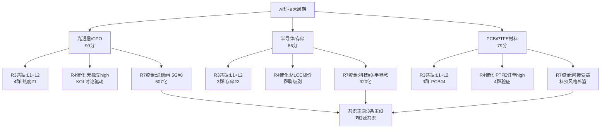

# 2026年8月28日 · **主线研判**

> **数据源新鲜度**: ⚠️ partial（R4仅群聊源 / factor层缺失）
> **降级状态**: ✅ true（因子层降级 + R4单源）
> **置信度**: 0.65

## 一句话结论

AI科技大周期三条子主线共振：光通信/CPO（情绪最热）+半导体/存储（资金最强）+PCB/PTFE（催化最硬），全仓聚焦科技但需警惕同链集中度风险。

---

## 五维打分总览

| 排名 | 主线 | 热度 | 资金 | 涨停 | 叙事 | 共振 | 总分 | CV分 | 共识源 |
|:---:|:---|:---:|:---:|:---:|:---:|:---:|:---:|:---:|:---:|
| ① | **光通信/CPO** | 20 | 17 | 18 | 17 | 18 | **90** | 0.67 | 3源 |
| ② | **半导体/存储芯片** | 17 | 19 | 19 | 15 | 16 | **86** | 0.67 | 3源 |
| ③ | **PCB/PTFE/电子材料** | 16 | 13 | 16 | 19 | 15 | **79** | 0.67 | 3源 |
| ④ | AI算力/液冷 | 14 | 11 | 12 | 12 | 13 | 62 | — | 2源 |
| ⑤ | 量子科技 | 6 | 4 | 6 | 14 | 5 | 35 | — | 1源 |

**核心判断**：三条主线全部 ≥70 分硬门槛，但同属 AI 科技大周期（英伟达产业链的三个细分环节），本质是"一条大主线 + 三个分支"。R1 建议双主线，但五维打分三条均过线，保留供 D1 裁决。

---

## 主线① · 光通信/CPO（90分 · 热度王者）

### 大资金意图

北向资金连续5日净流入25-29亿，通信技术板块主力净流入319.95亿（排名#4），5G概念287.73亿（#8）。大资金正在从"AI算力"向"AI网络/光互联"外溢——英伟达业绩超预期后，市场开始重新定价光模块/光通信的景气度。**本质是AI算力基建的"补短板"行情**，算力炒完炒网络。

### 为什么走强

1. **英伟达业绩验证需求**：Q2数据中心业务超预期，1.6T光模块量产节奏确认
2. **NPO/MPO技术升级**：从可插拔→NPO→CPO演进，Socket环节百亿级纯增量
3. **开源通信强Call全产业链**：机构风向标群定性"光互联全产业链机会"
4. **薄膜铌酸锂新催化**：高速光通信核心材料，FCC制裁风险低，天通股份国内核心供应商
5. **热榜第一**：CPO概念从#3→#1（热度+243%），亨通光电热股#1涨停

### 逻辑够不够硬

**硬**。英伟达业绩是产业级验证（不是预期），光模块/光通信是AI算力的"血管"，需求确定性高。但需注意：光模块板块过去两年跌幅巨大，本次是反弹还是反转需要持续验证。NPO/CPO技术路线演进是长期逻辑（1-2年），短期情绪驱动成分大。

### 龙头思维链

**龙一 · 亨通光电（600487.SH）**

- **买入理由**：热股榜#1涨停，海缆+光通信双主业双轮驱动，CPO板块人气核心。流通市值大（500亿+），机构持仓重，承接力强。光通信业务受益于1.6T光模块升级和海外需求，海缆业务受益于海风装机加速。
- **风险点**：涨幅已大（CPO+4.47%），短期获利盘多。海缆业务受海风装机节奏影响大。北向资金若转向可能率先砸大市值票。
- **止损条件**：跌破5日均线且放量，或CPO板块单日跌幅超3%。
- **可验证假设**：今日CPO板块能否继续领涨、亨通光电能否连板（验证龙头带动性）。

**龙二 · 长飞光纤（601869.SH）**

- **买入理由**：热股榜#7涨停，光纤光缆绝对龙头，NPO/MPO升级直接受益。热榜新入top10，关注度快速提升。光纤量价齐升逻辑（运营商集采+AI算力需求双重驱动）。
- **风险点**：传统光纤业务占比高，估值弹性不如纯CPO标的。NPO/MPO对光纤的价值量提升幅度有争议。
- **止损条件**：跌破5日线且换手率超15%。
- **可验证假设**：光纤概念板块热度能否持续，长飞能否接力亨通成为光纤分支龙一。

**中军 · 中天科技（600522.SH）**

- **买入理由**：光通信+海缆双龙头，机构重仓中军。流通市值大，适合大资金进出。光通信业务布局完整（光纤+光模块+海缆）。
- **风险点**：中军弹性通常小于小票，行情初期可能跑输龙头。海缆业务占比高受海风政策影响。
- **止损条件**：跌破20日均线确认趋势破坏。
- **可验证假设**：光通信行情若持续1周以上，中军是否补涨。

---

## 主线② · 半导体/存储芯片（86分 · 资金最强）

### 大资金意图

科技风格主力净流入346.9亿（#3）、半导体概念309.84亿（#5）、国产芯片263.22亿（#10），**三个板块同时进top10，合计超900亿**——这是今天资金最集中的方向。半导体ETF单日+4.42%、芯片ETF+4.07%、科创50ETF+3.89%，大资金在买"科技风格"而不是单票。**意图：布局半导体周期反转+AI算力驱动的双逻辑**。

### 为什么走强

1. **MLCC涨价确认周期反转**：三星电机Q4涨价25-30%，AI Server高端涨10-20%，产业进入上升周期
2. **8寸成熟制程产能紧张**：AI算力虹吸BCD工艺，富满微/明微电子从涨价演绎为缺货
3. **存储芯片板块涨幅+4.55%**：R3统计涨幅最高的板块
4. **HDD磁电存储技术变革**：斯迪克磁电存储核心部件独家供应，一半价格翻倍容量
5. **热榜上升快**：存储芯片#8→#3（+5），MLCC#19→#10（+9），国家大基金持股新进top15

### 逻辑够不够硬

**比较硬**。MLCC涨价是产业级信号（三星这种龙头涨价通常是行业拐点），8寸成熟制程紧缺是AI算力需求的真实映射。但需要注意：半导体ETF 30日收益-1.34%（R1科技反弹簇），这次是底部反弹还是趋势反转还需观察。存储周期反转的市场共识尚未完全形成。

### 龙头思维链

**龙一 · 德明利（001309.SZ）**

- **买入理由**：存储芯片热股榜涨停，连板高度领先（2连板）。存储主控芯片+模组，小盘高弹性。存储周期反转初期最容易出妖股的细分。
- **风险点**：流通市值小，波动性大。2连板后追高风险高，需警惕炸板。具体业务弹性需验证。
- **止损条件**：涨停板炸板且回落超5%，或跌破5日线。
- **可验证假设**：能否3连板确立龙头地位，带动存储板块整体上行。

**龙二 · 富满微（300671.SZ）**

- **买入理由**：8寸成熟制程涨价核心标的，BCD工艺产能紧张直接受益。KOL 3群讨论，关注度高。创业板标的弹性大。
- **风险点**：前期涨幅可能已部分反映涨价预期。300标的20cm涨跌幅，波动大。
- **止损条件**：跌破5日线且放量。
- **可验证假设**：成熟制程涨价是否向更多品种蔓延，富满微是否成为板块核心标的。

**弹性 · 明微电子（688699.SH）**

- **买入理由**：科创板弹性，LED驱动+功率器件双业务，8寸成熟制程涨价受益。688同权竞争，科创板整体强势（科创50+3.77%）。
- **风险点**：科创板流动性不如主板，行情退潮时跌得也快。LED驱动周期性强。
- **止损条件**：跌破10日线确认短期趋势破坏。
- **可验证假设**：科创板半导体弹性是否优于主板。

---

## 主线③ · PCB/PTFE/电子材料（79分 · 催化最硬）

### 大资金意图

PTFE材料获英伟达十几亿订单——这是**产业级+客户级的双重验证**。大资金可能已经在布局英伟达产业链的"最上游"——从光模块到PCB到材料，越上游价值量越容易被低估，一旦确认订单就是戴维斯双击。PCB概念热度+364%（R3统计最大涨幅），说明资金关注度提升极快。

### 为什么走强

1. **PTFE英伟达十几亿订单**：E20260828_001 high级催化，4群交叉验证，台股PTFE/CCL集体涨停新高
2. **ABF产能极度缺货**：二线供应商靠竞价拍卖产能，供需关系极度紧张
3. **NV Rubin PTFE新路线**：除高阶HDI外switch/midplane/LPU板均有望替换PTFE
4. **高频CCL国产替代**：华正新材送测英伟达，昇腾950一供
5. **PCB概念热度+364%**：R3统计热度增速最快的板块

### 逻辑够不够硬

**催化硬但验证弱**。如果英伟达PTFE订单为真，这是非常硬的产业逻辑（类比当年沪电股份之于5G）。但目前只有群聊信息，缺乏官方公告或产业链调研验证（R4 degraded）。PTFE是个小赛道，市场容量有限，能容纳的资金量不如光通信/半导体。

### 龙头思维链

**龙一 · 沃特股份（002886.SZ）**

- **买入理由**：R4首推PTFE树脂龙头，国内PTFE树脂龙头，特种高分子材料全产业链布局。英伟达PTFE订单直接受益，弹性最大。
- **风险点**：订单真实性存疑（仅群聊信息，无官方验证）。PTFE业务占比需确认。流通市值中等，流动性可能不足。
- **止损条件**：跌破5日线且放量，或订单证伪。
- **可验证假设**：今日是否有机构调研或公告验证PTFE订单，股价能否继续走强。

**龙二 · 协和电子（003025.SZ）**

- **买入理由**：R3推荐PTFE板加工know-how稀缺，有望进入Rubin Ultra Kyber正交背板。小盘次新股，弹性大。PCB+PTFE双概念。
- **风险点**：流通市值小（可能<20亿需警惕庄股），业务真实性和客户验证不足。次新股波动大。
- **止损条件**：跌破5日线且换手率超20%。
- **可验证假设**：能否获得英伟达供应链认证（短期难验证，但股价可提前反应）。

**中军 · 华正新材（603186.SH）**

- **买入理由**：高频CCL送测英伟达，昇腾950一供，CBF载板膜国产替代。主板标的，机构认可度高，中军角色。
- **风险点**：CCL业务传统部分占比高，PTFE/高频CCL贡献尚小。送测不等于量产，时间周期可能较长。
- **止损条件**：跌破20日均线确认趋势破坏。
- **可验证假设**：英伟达送测是否有实质进展，CCL板块是否联动上涨。

---

## 交叉验证与共识主题

| 共识主题 | 共识源数 | 来源 | 综合分 |
|:---|:---:|:---|:---:|
| 光通信/CPO | 3源 | R2 + R3 + R7 | 0.80 |
| 半导体/存储 | 3源 | R2 + R3 + R7 | 0.72 |
| PCB/PTFE材料 | 3源 | R2 + R3 + R4 | 0.76 |

**关键发现**：
- 三条主线全部3源共识（R2定性 + R3共振 + R4或R7），没有单源孤证的主线
- 光通信/CPO综合分最高（0.80），PCB/PTFE次之（0.76），半导体第三（0.72）
- 资金维度半导体最强（920亿三板块），情绪维度光通信最强（热榜#1），催化维度PCB最强（R4 high级）
- **风险**：三条主线同属AI科技链，若科技风格回调将全军覆没，集中度风险高

---

## 风险提示

1. **集中度风险**：三条主线同属AI科技大周期，没有防御性主线对冲。若科技风格回调，组合将面临系统性风险。
2. **R4催化验证弱**：PTFE英伟达订单等核心催化仅来自群聊，缺乏官方公告验证。若证伪，PCB/PTFE主线可能快速退潮。
3. **港股大跌信号**：恒指-2.04%显示外资对中资股态度谨慎，北向资金若转向可能率先砸科技大票。
4. **炸板率警戒**：炸板率18.1%接近20%警戒线，若盘中分歧加剧可能快速退潮（R1风险）。
5. **连板高度单薄**：6板/5板/4板各1只，龙头断板风险大，情绪退潮时首当其冲。
6. **微利股极端收益**：微利股30日+111%暗示炒作成分重，监管风险升温（R1风险）。

---

## 数据源审计

| 源 | 状态 | 抓取时间 | 记录数 | 备注 |
|---|:---:|:---:|:---:|---|
| R1_style.json | 🟢 ok | 2026-08-28 07:45 | — | 主线扩散型·情绪78.6·双主线建议 |
| R3_sentiment.json | 🟢 ok | 2026-08-28 07:28 | 4主题 | 4个L1+L2共振主题，WeFlow已下线 |
| R4_news.json | 🟡 partial | 2026-08-28 07:05 | 8事件 | degraded：仅群聊4群，无官方源验证 |
| R7_capital_flow.json | 🟢 ok | 2026-08-28 07:05 | 50板块 | Tushare moneyflow_ind_dc 完整 |
| Tushare热榜 | 🟢 ok | 20260827 | 20概念+100热股 | THS两日数据完整 |
| Factor层 | 🔴 error | — | — | top_ir_factors.json 缺失 |

---

## 不确定性 / 反证

**自我批判**：
1. 三条主线本质上都是"英伟达产业链"的不同环节，五维打分可能存在重复计算——热度、资金、涨停都是科技风格的整体强势，而非三个独立主线。D1应考虑是否按"一条大主线+三个分支"处理，降低仓位集中度。
2. R4催化全部来自群聊，没有官方公告或权威媒体验证。PTFE英伟达订单若为假，第三条主线直接崩塌。
3. factor_layer缺失，个股排序基于定性判断，可能存在偏差。德明利作为存储龙一的依据不足（仅热榜+连板）。
4. 港股大跌2%是重要负面信号——外资是科技股的重要边际定价者，若北向资金转向，三条主线都将承压。
5. 创新药热榜#2但KOL 0群讨论（R3 late warning），说明市场风格可能在科技和医药之间摇摆，若科技退潮医药可能接棒。

---

## 与其他 R/D/E 的关系

- **依赖上游**: R1_style.json（风格/主线数量）、R3_sentiment.json（共振主题/热度）、R4_news.json（催化事件）、R7_capital_flow.json（资金流）
- **被消费下游**: filter_leader_v1（龙头硬过滤）、D1_main_decision_v1（主决策）、R6_analyze_devil_advocate_v1（反证）、R5_analyze_stock_profile_v1（个股深挖）

## Sub-Agent 元数据

- skill: analyze_main_sectors_v1@1.2
- artifact: data/research/20260828/R2_main_sectors.json
- 生成耗时: 约3分钟
- model: doubao-seed-2-0-code-preview-260215
- factor_layer: degraded（top_ir_factors.json 缺失）
