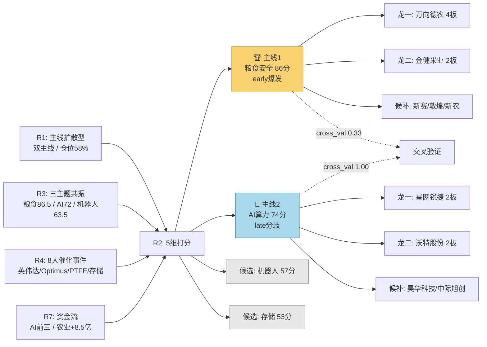

# 2026年8月31日 · **主线研判**

> **数据源新鲜度**: ⚠️ partial（T-1收盘数据，周末消息真空）
> **降级状态**: ✅ degraded（R3缺KOL群 / R4周末无新闻 / 全量T-1）
> **置信度**: 0.72 / 1.0

## 一句话结论
**双主线：粮食安全(early爆发) > AI算力(late分歧)**，农业种植首板爆发可追，AI算力高位分化慎追。

---

## 详细分析

### 🏆 主线一：粮食安全 / 农业种植（86分 · early阶段）

**五维雷达**：热度🔥20 · 资金💰15 · 涨停📈20 · 叙事📰13 · 共振🎯18

粮食概念周五从热榜第9名飙升至第1名（+8位），是当日最强势的新爆发板块。涨停维度乡村振兴14家涨停、5天4板的持续力度，配合万向德农4连板+新农股份3连板的梯队结构，属于典型的板块性行情启动。

**大资金意图**：农业种植主力净流入+8.47亿，虽然绝对金额不及AI方向（AI应用+32.94亿），但考虑到农业板块体量小、流通市值低，这个净流入的强度很高。更关键的是**粮食概念板块涨幅+3.07%、供销社+3.30%**，是全市场涨幅最高的细分方向之一，说明资金是真金白银在买，不是虚拉指数。

**为什么走强**：三重催化叠加——① 摩根大通警告2027年全球粮食危机；② 超强厄尔尼诺影响北半球粮食产量；③ 霍尔木兹海峡地缘冲突扰动航运。涨价逻辑有实锤支撑（化肥/农药同步上涨），属于供给收缩型的硬逻辑，不是纯题材炒作。

**逻辑够不够硬**：够硬。这不是一个纯情绪驱动的题材，而是有基本面支撑（涨价+供给收缩）+ 事件催化（地缘+天气）+ 板块效应（14家涨停）的三重共振。唯一的问题是持续性——农业股通常是脉冲式行情，需要观察周一是否有增量资金接力。

#### 龙头梯队（5只）

| 角色 | 代码 | 名称 | 涨幅 | 连板 | 流通市值 | 核心逻辑 |
|------|------|------|------|------|----------|----------|
| 龙一 | 600371.SH | 万向德农 | +10.0% | 4板 | ~15亿 | 玉米种业龙头，板块空间板，高度定调 |
| 龙二 | 600127.SH | 金健米业 | +9.2% | 2板 | ~76亿 | 粮食概念中军，热股榜top6，成交额最大 |
| 候补 | 600540.SH | 新赛股份 | +10.0% | 2板 | ~29亿 | 棉花+种植，龙虎榜净买入47.8%（最高） |
| 候补 | 600354.SH | 敦煌种业 | +10.1% | 1板 | ~54亿 | 玉米种子，首板突破，市值适中 |
| 候补 | 002942.SZ | 新农股份 | +10.0% | 3板 | ~29亿 | 农药+化肥上游，3连板高度第二 |

**⚠️ 金健米业风险提示**：周五换手率45%但龙虎榜净卖出1.8亿（游资出货），如果周一高开过多需警惕冲高回落。万向德农4连板但流通市值仅15亿，容易庄股化，需要注意。

---

### 🥈 主线二：AI算力 / 光通信（74分 · late分歧阶段）

**五维雷达**：热度🔥12 · 资金💰20 · 涨停📈20 · 叙事📰12 · 共振🎯10

AI方向是资金绝对体量最大的板块——AI应用+32.94亿、AIGC+26.18亿、AI智能体+25.88亿包揽主力净流入前三。人工智能概念19家涨停（概念榜第1），数字经济13家，DeepSeek概念11家，涨停广度也足够。

**但问题出在结构上**：CPO从热榜第1跌至第6（-5位），亨通光电-3.65%、通鼎互联-5.96%，光通信老龙头集体调整。存储芯片主力净流出-102.8亿、机器人概念-114.3亿，AI硬件方向资金出逃明显。这是典型的**高位分歧、内部轮动**特征——不是AI整个板块不行了，而是旧分支（CPO/存储/机器人）在出货，新分支（AI应用/AIGC/DeepSeek/PTFE）在接力。

**大资金意图**：主力还在AI里面，但从硬件切到了应用和软件。AI应用、AIGC、ChatGPT概念、数字经济这些偏应用层的方向资金持续流入，而光模块、存储、服务器这些硬件方向在流出。这符合英伟达财报后"从硬件到应用"的传导逻辑，也符合炒预期卖兑现的规律。

**为什么还能算主线**：因为资金体量够大（前三全是AI）、涨停家数够多（19家第一）、R3/R4/R7三源交叉验证全部命中（cross_val=1.0）。但late阶段的主线，操作上必须更谨慎——只能做新分支的龙头，不能碰老分支的高位票。

#### 龙头梯队（5只）

| 角色 | 代码 | 名称 | 涨幅 | 连板 | 流通市值 | 核心逻辑 |
|------|------|------|------|------|----------|----------|
| 龙一 | 002396.SZ | 星网锐捷 | +10.0% | 2板 | ~278亿 | 交换机+AI算力，龙虎榜净买3亿，算力线最高连板 |
| 龙二 | 002886.SZ | 沃特股份 | +10.0% | 2板 | ~55亿 | PTFE材料新分支龙头，英伟达供应链，弹性最大 |
| 候补 | 600378.SH | 昊华科技 | +10.0% | 2板 | ~572亿 | PTFE+电子特气+氟化工，大市值机构票 |
| 候补 | 300308.SZ | 中际旭创 | -0.9% | 0板 | ~6700亿 | 光模块全球龙头，中军锚，趋势未破但调整中 |
| 候补 | 688498.SH | 源杰科技 | -5.7% | 0板 | ~200亿 | 光芯片弹性龙头，回调深需警惕高位风险 |

**⚠️ 操作建议**：AI算力主线只做PTFE/AI应用等新分支的龙头（星网锐捷、沃特股份、昊华科技），坚决回避CPO/存储/光模块等已经走弱的老分支。中际旭创这类中军如果跌破关键均线也要减仓。

---

### 📋 候选主线（Secondary）

| 板块 | 得分 | 状态 | 简述 |
|------|------|------|------|
| 具身智能/机器人 | 57 | early孕育 | 叙事满分（物理AI+Optimus+Microduck），但热榜未进前20，资金-114亿流出，等待催化剂落地 |
| 存储芯片/HBM | 53 | 回调期 | 中报扭亏基本面扎实，但短期资金-102亿出逃，热榜排名第3→第9，等企稳 |

---

## 关键证据

- **证据1**：粮食概念热榜排名第9→第1（+8位飙升），R3热度86.5分最高 · 来源 R3_sentiment.json / ths_hot
- **证据2**：乡村振兴14家涨停、5天4板，万向德农4连板 · 来源 tushare.limit_cpt_list / limit_step
- **证据3**：AI应用主力净流入+32.94亿（全市场第1），AIGC+26.18亿第2 · 来源 dc.moneyflow_ind_dc / R7_capital_flow.json
- **证据4**：人工智能19家涨停（概念榜第1），数字经济13家 · 来源 tushare.limit_cpt_list
- **证据5**：CPO热榜第1→第6，亨通光电-3.65%、通鼎互联-5.96%（distribution_alert） · 来源 R3_sentiment.json

---

## 交叉验证矩阵

| 主线 | R3共振 | R4催化 | R7资金 | 交叉分 | 备注 |
|------|--------|--------|--------|--------|------|
| 粮食安全/农业种植 | ✅ L1+L2 | ❌ 无对应 | ❌ 未进top10 | 0.33 | R4/R7数据缺口，非真实否定 |
| AI算力/光通信 | ✅ L1+L2 | ✅ high(多空交织) | ✅ 前三 | 1.00 | 四源全中，但late阶段需警惕 |

**共识主题（4源交集）**：AI算力/光通信（R2+R3+R4+R7 四源共识）

---

## 不确定性 / 反证

1. **数据时滞风险**：所有数据都是上周五（0828）收盘的，周末两天可能发生重大事件（政策/外盘/地缘），周一开盘前需重新评估。
2. **粮食持续性存疑**：农业股历史上多为脉冲式行情，很少走成中级主线。如果周一没有增量资金接力，可能一日游。
3. **AI分歧加剧**：炸板率47.6%已经很高，如果周一分歧继续扩大，AI算力这条late主线可能直接退潮。
4. **R4周末空白**：R4基于0828数据，周末可能有新的催化或利空未被捕捉。
5. **流通市值风险**：万向德农（~15亿）、新赛股份（~29亿）等小盘股有庄股风险，不符合用户≥50亿安全区间偏好，需filter_leader_v1过滤。

---

## 与其他 R/D/E 的关系

- **依赖上游**: R1_style.json（风格+主线数量约束）、R3_sentiment.json（共振+热度）、R4_news.json（催化叙事）、R7_capital_flow.json（资金验证）
- **横切技能**: filter_leader_v1（龙头硬过滤，下一步执行）
- **被下游消费**: D1_main_decision（选execution_pool）、R5_stock_profile（个股深挖）、R6_devil_advocate（反证）

---

## mermaid · 主线决策图谱

---

## 数据源审计

| 源 | 状态 | 抓取时间 | 记录数 | 备注 |
|---|---|---|---|---|
| Tushare 涨停概念 | 🟢 ok | 2026-08-28 | 20 | limit_cpt_list |
| Tushare 连板天梯 | 🟢 ok | 2026-08-28 | 17 | limit_step |
| Tushare 龙虎榜 | 🟢 ok | 2026-08-28 | 40+ | top_list |
| DC 概念资金流 | 🟢 ok | 2026-08-28 | 504 | moneyflow_ind_dc |
| R3 情绪共振 | 🟡 degraded | 2026-08-31 | 3主题 | WeFlow下线+颜晓滨群缺失 |
| R4 消息催化 | 🟡 degraded | 2026-08-31 | 8事件 | 周末消息空白，T-3数据 |
| R7 资金面 | 🟢 ok | 2026-08-31 | 504 | premarket_full批次 |
| R1 风格判断 | 🟢 ok | 2026-08-31 | - | complete |

---

## Sub-Agent 元数据

- **skill**: analyze_main_sectors_v1@1.2
- **artifact**: data/research/20260831/R2_main_sectors.json
- **生成耗时**: ~5分钟（数据拉取+分析+落盘）
- **模型**: doubao-seed-2-0-code
- **下一步**: filter_leader_v1 硬过滤 → R5 情报深挖 → R6 反证
