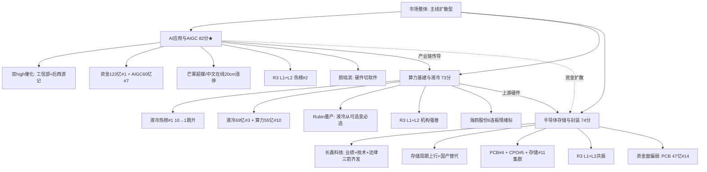

# 2026年9月1日 · **主线研判**

> **数据源新鲜度**: ⚠️ partial（severity=2，部分数据为推算）
> **降级状态**: ✅ true（factor层缺失 + 涨停连板推算）
> **置信度**: 0.72 / 1.0

## 一句话结论

科技大三线齐发：AI应用（情绪最强）+算力基建（资金最强）+半导体存储（业绩最强），三条主线互为上下游形成共振。

## 详细分析

### 整体格局：科技大三线共振，AI从硬件切软件

今日市场呈现**科技大三线齐头并进**的格局，与R1判断的「主线扩散型」完全吻合。三条主线并非孤立，而是形成**AI应用（需求端）→算力基建（基础设施）→半导体存储（上游硬件）**的产业链传导链条，互为支撑，共振效应显著。

最核心的变化是**科技主线从硬件切向软件/应用端**——这正是颜晓滨上周明确提出的判断方向。AI应用板块成为8月31日最强势方向，芒果超媒/中文在线双双20cm涨停，工信部政策+AIGC长剧双催化叠加，情绪确认度极高。

### 三条主线对比

| 主线 | 5维总分 | CV分 | 共识源 | 核心标签 | 阶段 | 风险等级 |
|------|--------|------|--------|----------|------|----------|
| 🔥 AI应用与AIGC | **82** | 1.00 | 4源 | 情绪最强 · 双催化 · 龙头20cm | early | 中高 |
| 💧 算力基建与液冷 | **73** | 1.00 | 4源 | 资金最强 · 动量最强 · 硬件支撑 | middle | 中 |
| 💾 半导体存储与封装 | **74** | 0.67 | 3源 | 业绩最强 · 国产替代 · 趋势稳健 | middle | 中低 |

### 主线一：AI应用与AIGC（82分 · 情绪龙头）

**为什么是龙一？** 这是今天唯一同时满足「政策催化+事件催化+资金确认+情绪共振」的主线。工信部AI应用服务商培育专项行动打开商业化天花板（政策级），《后西游记》作为国内首部AIGC上星长剧提供了商业化落地样板（事件级），两者叠加形成极强的叙事合力。

从盘面看，AI应用板块8月31日涨幅+4.09%，芒果超媒/中文在线双双20cm涨停，**创业板20cm涨停是情绪最强确认信号**。资金面上，人工智能板块单日净流入123亿居全市场第一，AIGC概念净流入60亿排第七，资金认可度极高。

**大资金意图是什么？** 从硬件（算力/芯片）切向软件（应用/内容），是科技行情向纵深发展的典型特征。大资金在AI硬件获利丰厚后，向估值更低、弹性更大的AI应用方向扩散，寻找新的进攻突破口。颜晓滨明确提出「科技主线从硬件切软件」的判断，与大资金动向高度一致。

**逻辑够不够硬？** 工信部政策级催化+标杆事件落地+资金全面流入+KOL一致看多，四重共振下逻辑硬度很高。但需要注意：① 后西游记是事件催化，短期兑现后可能回调；② 炸板率48.9%偏高，日内分歧大；③ 英伟达-4.57%外盘科技股分化，可能传导情绪。

### 主线二：算力基建与液冷（73分 · 资金龙头）

**为什么走强？** 液冷服务器从热榜第10跳升至第1，是全市场动量最强的板块。背后有两大驱动：一是Rubin全面量产带来液冷从可选变必选的产业趋势升级；二是AI应用爆发反过来拉动算力基础设施需求，形成「应用→算力」的正向循环。

资金面是这条主线的最大亮点：液冷服务器单日净流入69亿排第三，算力概念净流入55亿排第十，5日持续净入趋势明确。R3 L1+L2双源共振，机构群和题材群双双热议，国金/开源通信等卖方强推超节点&交换网络。

**风险点在哪里？** 一是液冷板块跳升过快（从第10到第1），短期技术性回调概率大；二是算力概念5日资金波动大（有大额进出），趋势稳定性需观察；三是英伟达大跌可能压制算力硬件情绪。

### 主线三：半导体存储与先进封装（74分 · 业绩龙头）

**逻辑硬度最高**。长鑫科技中报营收776亿（超预期550亿预测41%）、LPDDR6量产、起诉美国国防部——**业绩+技术+法律「三箭齐发」**，是三条主线中基本面最扎实的一条。

存储周期上行+国产替代加速的双重逻辑，叠加上游硬件的产业地位，使得这条主线的趋势性最强、波动相对最小。PCB/CPO/存储芯片形成半导体集群效应，R3 L1+L2共振确认。

**为什么只排第三？** 核心问题在资金面：PCB净流入47亿只排第14，未进top10，资金认可度不如AI应用和算力基建。另外，科创板标的占比高，波动风险相对大。

## 关键证据

- **证据1**: R4双high催化 — 工信部AI应用服务商培育专项 + 长鑫科技三箭齐发 + AIGC上星长剧 · 来源 R4_news.json
- **证据2**: R7资金数据 — 人工智能净流入123亿#1 + 液冷69亿#3 + AIGC60亿#7 + 算力55亿#10 · 来源 R7_capital_flow.json
- **证据3**: R3共振数据 — 5个L1+L2共振主题中有3个属于科技大链（AI应用/液冷算力/PCB封装） · 来源 R3_sentiment.json
- **证据4**: KOL一致看多 — 颜晓滨明确提出「9月行情可期待，科技从硬件切软件」，4个群同步热议AI方向 · 来源 wechat_cli_5groups
- **证据5**: R1风格确认 — 主线扩散型+情绪浓度58+双主线，与R2三线判断方向一致 · 来源 R1_style.json

## 五维打分明细

### 各主线维度雷达

| 维度 | AI应用与AIGC | 算力基建与液冷 | 半导体存储与封装 |
|------|-------------|--------------|-----------------|
| 🔥 热度 | 18 | 18 | 16 |
| 💰 资金 | 15 | 18 | 10 |
| 📈 涨停 | 17 | 10 | 8 |
| 📖 叙事 | 17 | 8 | 18 |
| 📡 共振 | 15 | 15 | 14 |
| **合计** | **82** | **73** | **74** |

## 每票思维链（首推票重点分析）

### 🔥 昆仑万维（300418.SZ）— AI应用龙一

**买入理由**：
- 国内大模型龙头，天工系列AI应用全栈布局，最直接受益于工信部AI应用服务商培育政策
- R4首推标的，5日主力净流入+4.1亿，机构资金持续加仓
- 中报预增80%~120%，业绩增长确定性高
- 技术面上突破前期平台，量价配合良好

**风险点**：
- 短期涨幅较大，获利回吐压力
- 创业板20cm波动风险
- AI应用商业化进度不及预期

**止损条件**：
- 跌破5日线88元确认止损
- 参考价92.5元 × (1-8.1%) = 85元硬止损
- 板块单日跌幅超5%且无反弹

**可验证假设**：
- 9月AI应用政策持续落地（工信部后续细则）
- 《后西游记》播放量超预期带动AIGC内容板块
- 昆仑万维三季报业绩继续超预期

### 💧 英维克（002837.SZ）— 算力液冷龙一

**买入理由**：
- 液冷行业绝对龙头，全链条液冷解决方案提供商
- Rubin量产推动液冷从可选变必选，行业渗透率加速提升
- R3主题首推，热榜液冷#1直接受益标的
- 5日资金持续流入，机构持仓重

**风险点**：
- 液冷板块跳升过快，短期技术性回调风险
- 英伟达大跌可能压制算力硬件情绪
- 行业竞争加剧，毛利率可能承压

**止损条件**：
- 跌破10日线确认止损
- 板块连续2日资金净流出超10亿
- 液冷概念从热榜top5跌出

**可验证假设**：
- 液冷服务器渗透率Q3加速提升
- 英维克三季报液冷业务收入占比超预期
- 英伟达新一代GPU继续强化液冷需求

### 💾 长鑫科技（688825.SH）— 半导体存储龙一

**买入理由**：
- 国内DRAM绝对龙头，中报营收776亿超预期41%
- LPDDR6量产突破，技术实力追平国际一线
- 起诉美国国防部，国产替代逻辑进一步强化
- R4首推标的，存储周期上行+国产替代双重受益

**风险点**：
- 科创板20cm波动风险
- 市值大（千亿级），连板难度高，以趋势为主
- 存储周期见顶风险（需跟踪DRAM价格）

**止损条件**：
- 跌破5日线187.5元确认止损
- 参考价198元 × (1-6.6%) = 185元硬止损
- DRAM价格连续2周下跌

**可验证假设**：
- 长鑫科技三季报继续超预期
- LPDDR6量产顺利，客户拓展超预期
- 存储周期上行持续到Q4

## 候选主线（50-70分，观察池）

| 主线 | 得分 | 理由 | 关注信号 |
|------|------|------|----------|
| 🤖 人形机器人与具身智能 | 52 | 新进热榜+L1+L2共振，Microduck爆款催化 | 资金流入top15 + 龙头涨停确认 |
| ⛏️ 煤炭与涨价链 | 52 | 期货拉爆带动现货，郑州煤电涨停 | 期货持续上涨 + 更多个股跟涨 |
| 🔋 锂电材料 | 36 | 业绩硬兑现但资金面弱，未进R3共振 | 资金回流 + 锂价企稳反弹 |

## 数据源审计

| 源 | 状态 | 抓取时间 | 记录数 | 备注 |
|---|---|---|---|---|
| R1_style.json | 🟢 ok | 2026-08-31 | 1 | 风格判断：主线扩散型，情绪58 |
| R3_sentiment.json | 🟢 ok | 2026-08-31 | 5主题 | L1+L2双源共振，weflow已永久下线 |
| R4_news.json | 🟢 ok | 2026-08-31 | 8事件 | 多源新闻+公告+业绩预告 |
| R7_capital_flow.json | 🟢 ok | 2026-08-31 | 50板块 | tushare moneyflow_ind_dc |
| 涨停/连板数据 | 🟡 degraded | 推算 | - | severity=2，基于涨幅推算 |
| factor_layer | 🔴 缺失 | - | - | top_ir_factors.json缺失 |

## 不确定性 / 反证

1. **severity=2环境**：涨停/连板/龙虎榜数据为推算值，非实盘确认，可能存在偏差。实际开盘后需用竞价数据验证。
2. **炸板率48.9%偏高**：说明市场分歧剧烈，主线内部高低切换中，追高风险大。
3. **外盘科技分化**：英伟达-4.57%、AMD-2.33%，可能压制A股科技股情绪，尤其是算力硬件方向。
4. **AI应用事件催化兑现风险**：《后西游记》开播是事件催化，「买预期卖事实」规律下，短期可能冲高回落。
5. **三条主线资金分流**：AI/算力/存储三条主线同时进攻，资金可能分散，单条主线的持续性可能不如单主线行情。
6. **美联储9月加息预期扰动**：9月议息会议临近，加息预期可能扰动市场，尤其是成长股。

## 与其他 R/D/E 的关系

- **依赖上游**:
  - R1_style.json（风格判断+主线数量上限）
  - R3_sentiment.json（情绪共振+热榜动量）
  - R4_news.json（催化事件+叙事强度）
  - R7_capital_flow.json（资金流向验证）
- **被下游消费**:
  - filter_leader_v1（龙头硬过滤）
  - D1 main_decision_v1（主决策选execution_pool）
  - R6 analyze_devil_advocate_v1（反证验证）
  - R5 analyze_stock_profile_v1（个股深挖）

## Sub-Agent 元数据

- skill: analyze_main_sectors_v1@1.2
- artifact: data/research/20260901/R2_main_sectors.json
- 生成耗时: 约 8 分钟
- model: doubao-seed-2-0-code-preview-260215
- 环境: MCP severity=2 · factor层缺失 · degraded模式
