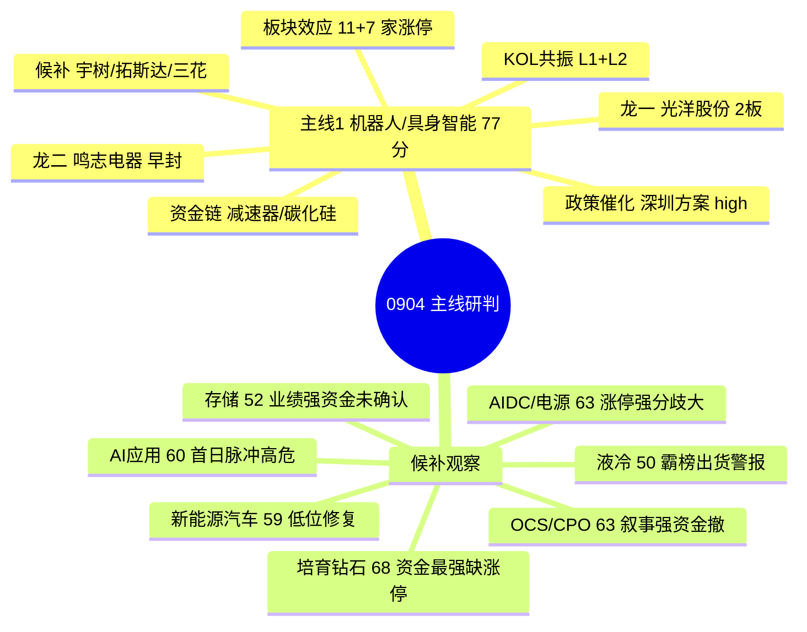

# 2026年9月4日 · **主线研判**

> **数据源新鲜度**: ✅ ok
> **降级状态**: 否（因子层缺失为可选增强，notes 已标注）
> **置信度**: 0.70 / 1.0

## 一句话结论

退潮加速期只保留一条主线：**机器人/具身智能**（板块效应 18 家涨停 + 深圳政策 high + L1+L2 共振三源支撑），龙头**光洋股份 2 连板 + 鸣志电器 早封**；培育钻石资金最强但缺涨停龙头，其余 AI 侧题材全部降为候补观察。

## 详细分析

### 整体格局：退潮加速期的"独苗"主线

今日 R1 判定为**震荡分化型（退潮加速期）**——涨停 44 家收缩、跌停 16 家翻倍、炸板率 42.9% 近崩溃阈值、连板天梯最高仅 5 板孤军且**无 3 板断层**，全市场 2/3 个股下跌。R3 情绪浓度 33，5 个 L1+L2 共振主题全是**边缘发酵**：无一强势放量主线。

R7 资金面给出最关键的背离信号：0903 主力净流入集中到 **券商/培育钻石/黄金/储能/锂电**，而 **算力 -48.88 亿 / 光纤 -41.89 亿 / 国产芯片 -62.8 亿 / 华为 -86.83 亿** 全线净流出——也就是说，R4 消息面最强的 AI 侧叙事（GPT-6/英伟达收购/算力 ETF），**恰恰是 0903 资金撤出的方向**。在这种"消息强、资金撤、情绪退"的组合下，R2 只保留一条真正有多源支撑的主线，其余全部降级。

### 主线一：机器人/具身智能（77 分 · 唯一主线）

**为什么是它？** 这是今日唯一同时满足「板块效应 + 政策催化 + 情绪共振 + 资金链间接确认」的方向：机器人概念 0903 **11 家涨停（全市场第 2）** + 人形机器人 7 家涨停，板块效应显著；R4 E005 深圳机器人产业方案（2026-2028）为**政策级 high 催化（5 源官方确认）**，宇树净利预增 905~1055% 提供硬 alpha；R3 人形机器人 **L1+L2 双源共振**（新进热榜 #9）。资金面虽是短板（主线板块未进净流入 top10），但**减速器 +9.37 亿 / 碳化硅 +8.52 亿 / 第三代半导体 +9.76 亿** 的零部件链流入，说明资金在向机器人硬科技方向试探。

- **大资金意图**: 在 AI 硬件高位退潮（算力/芯片/华为 全线净流出 50-87 亿）背景下，主力把进攻仓位切向**位置更低的机器人产业链**——减速器/碳化硅/第三代半导体的净流入正是为 Optimus 量产叙事提前铺仓位。对手盘是 0903 追 AI 消息面被套的浮筹，以及高位孤军（国芳/集泰）的获利盘。
- **为什么走强**: 位置（机器人板块 30 日未透支，人形机器人刚新进热榜 #9）+ 催化（深圳政策 high + 特斯拉 Optimus 碳纤维骨架减重 33% + 李飞飞 World Labs 世界模型打通具身智能路径）+ 筹码（光洋 2 板、鸣志 09:32 早封惜筹）三维同时转好。
- **逻辑够不够硬**: 硬证据有两条——深圳方案是政策级硬锚（5 源官方），宇树业绩是硬 alpha（预增 905~1055%）；但**证伪路径同样清晰**：E008 双环传动终止分拆环动科技已削弱关节标的资本运作预期，若今日高标补跌或炸板率升破 50%，板块效应将瞬间瓦解。

| 维度 | 得分 | 依据 |
|------|:--:|------|
| 🔥 热度 | 16 | 人形机器人热榜 #9（新进），机器人概念涨停板块 #2 |
| 💰 资金 | 12 | 减速器/碳化硅/第三代半导体链流入；主线板块未进 top10 |
| 📈 涨停 | 19 | 机器人概念 11 家 + 人形机器人 7 家涨停，板块效应全市场第 2 |
| 📖 叙事 | 15 | 深圳方案 high + 宇树业绩；扣 E008 双环终止分拆负面 |
| 📡 共振 | 15 | R3 L1+L2 双源共振 + AI 军工 KOL |
| **合计** | **77** | 唯一 ≥70 主线 |

### 龙头候选（5 只 · 待 filter_leader_v1 硬过滤）

| 角色 | 代码 | 名称 | 0903 涨幅 | 连板 | 逻辑 |
|------|------|------|:--:|:--:|------|
| 龙一 | 002708.SZ | 光洋股份 | +10.03% | 2板 | 板块最高连板 · 09:50 早封 · 机器人滚针/圆柱轴承正宗 · circ 79亿 |
| 龙二 | 603728.SH | 鸣志电器 | +10.00% | 1板 | 09:32 早封有带动性 · 空心杯电机全球核心 · 换手仅 2.1% 惜筹 · circ 223亿 |
| 候补 | 688836.SH | 宇树科技 | +0.81% | - | 产业锚 · 业绩 +905~1055% · 20cm 弹性 |
| 候补 | 300607.SZ | 拓斯达 | +2.91% | - | 深圳本体 · 政策直接受益 · R4 首推 |
| 候补 | 002050.SZ | 三花智控 | +1.91% | - | 机电执行器中军 · circ 1340亿 压舱石 · 回踩低吸候选 |

**光洋股份 · 思维链**
- **买入理由**: ① 板块内唯一 2 连板（4 天 3 板），连板高度断层环境下高度稀缺；② 滚针/圆柱轴承是减速器核心零部件，正宗受益 Optimus 量产 + 深圳方案；③ 09:50 早封+尾盘回封，游资接力特征明显。
- **风险点**: ① 换手 18.5% 偏高，尾盘开板过一次，分歧加大；② R1 退潮期严禁追高，若板块高标集体杀跌，2 板高度最先承压；③ E008 双环终止分拆拖累整个关节/减速器分支情绪。
- **止损条件**: 买入价 -6%（退潮期收紧），或跌破 0903 涨停价 15.58 元次日不收回即离场；盘中炸板不回封立即减半。
- **可验证假设**: 今日（0904）竞价高开 3% 内且机器人板块涨停家数不减（≥8 家）→ 板块效应延续；若竞价低开 3% 以下或板块炸板率上升 → 退潮传导，主线证伪。

**鸣志电器 · 思维链**
- **买入理由**: ① 空心杯电机是人形机器人手部执行器核心环节，全球市占率居前；② 09:32 早封、换手仅 2.1%，筹码惜售、上方无套牢盘；③ circ 223 亿大市值符合安全区间，机构可参与。
- **风险点**: ① 涨停首板次日溢价依赖板块合力，独苗难走远；② pe_ttm 313 倍估值极高，业绩不兑现则杀估值；③ 大市值票弹性弱于小市值，主升浪中涨幅受限。
- **止损条件**: 买入价 -7%，或跌破 0903 涨停价 53.35 元次日不收回；板块内若出现 3 家以上炸板即减仓。
- **可验证假设**: 24-72h 内机器人板块涨停家数维持 ≥8 家且光洋股份晋级 3 板 → 鸣志有接力补涨空间；反之若光洋断板、板块涨停家数 <5 家 → 主线退潮，鸣志仅反抽离场。

### 候选主线（观察池 · 50-70 分）

| 主题 | 分数 | 核心逻辑 | 主要矛盾 |
|------|:--:|------|------|
| 培育钻石/金刚石散热 | 68 | 资金最强（主力 +18.25 亿 top2 · 5 日净入 20 亿）+ 热度 #2 + L1+L2 共振 + DARPA 金刚石散热 0到1 | 无涨停龙头（黄河旋风/四方达未涨停，博云新材机构净卖 -2.23 亿）· R3 divergence 警报 |
| OCS 光交换/CPO | 63 | R4 E002/E003 high + R3 共振第 1（CPO 9→4）· 今日 8 只算力 ETF 发行 | R7 光纤 -41.89 亿 / 算力 -48.88 亿净流出 · 隔夜 GLW/AVGO 下跌 |
| AIDC/AI 电源 | 63 | R4 E003 算力 ETF high + AIDC 0903 涨停 8 家 + 充电桩/AIDC 新进热榜 | 资金分歧（储能流入 vs 算力流出）· 台达召回题材脉冲性质 |
| AI 应用/AI 编码 | 60 | R4 E001 GPT-6 Astra high（5 源）· 新炬/金现代涨停 | 人工智能 -59.7 亿净流出 · R1 警示退潮期首日脉冲最易次日炸板 |
| 新能源汽车/锂电 | 59 | 涨停家数全市场第 1（15 家）· 宁组合/麒麟电池/储能资金流入 · 动力电池大会 | 无 R3/R4 叙事共振 · 低位修复轮动非情绪主线 |
| 存储芯片 | 52 | R4 E004 三箭齐发 high（长江存储 IPO 问询 + 佰维 +3200%/长鑫 +2244%） | 国产芯片 -62.8 亿净流出 · 0903 无涨停 · 资金未确认 |
| 液冷服务器 | 50 | R4 E006 全链 high · 集泰 4 板 | 🔴 R3 L4 霸榜出货警报（连续 2 日热榜第 1）· 集泰/金帝澄清未销售/未量产 · 严禁追高 |

## 关键证据

- **证据 1**: 涨停板块统计（0903）—— 新能源汽车 15 家 #1 / 机器人概念 11 家 #2 / 液冷 10 家 #3 / AIDC 8 家 #6 · 来源 tushare.limit_cpt_list
- **证据 2**: 连板天梯（0903）—— 5 板国芳 / 4 板集泰、龙版 / **无 3 板** / 2 板 6 只（含光洋、金帝、太阳电缆）· 来源 tushare.limit_step
- **证据 3**: 主力净流入（0903）—— 券商 +18.75 亿 / 培育钻石 +18.25 亿 / 储能 +16.6 亿；净流出 算力 -48.88 亿 / 光纤 -41.89 亿 / 国产芯片 -62.8 亿 · 来源 R7_capital_flow.json
- **证据 4**: 共振主题（R3）—— 5 个 L1+L2：OCS/CPO（#4）、培育钻石（#2 急升 9 位 divergence）、人形机器人（#9 新进）、AI 应用（#5）、AIDC/充电桩（新进）· 来源 R3_sentiment.json
- **证据 5**: 消息催化（R4）—— E005 深圳机器人方案 high（5 源）/ E008 双环终止分拆 + 集泰金帝澄清（负面）/ E003 算力 ETF 今日发行 · 来源 R4_news.json
- **证据 6**: 市值安全线 —— 全部龙头候选 circ_mv ≥ 50 亿（光洋 79 亿 / 鸣志 223 亿 / 宇树 165 亿 / 拓斯达 123 亿 / 三花 1340 亿）· 来源 tushare.daily_basic

## 数据源审计

| 源 | 日期 | 状态 | 备注 |
|---|---|:--:|---|
| R1_style.json | 2026-09-04 | 🟢 | 1 条 · 震荡分化型（退潮加速）情绪 35 · 07:05 |
| R3_sentiment.json | 2026-09-04 | 🟢 | 5 条共振主题 · 07:25 |
| R4_news.json | 2026-09-04 | 🟢 | 8 条事件 + sectors_catalyzed · 07:11 |
| R7_capital_flow.json | 2026-09-04 | 🟢 | T-1（0903）premarket_full · 主力/北向/游资/龙虎榜诱多 · 07:14 |
| hotlist_signals.json | 2026-09-04 | 🟢 | 热榜 2 日 diff · L4 液冷出货警报 · 07:17 |
| tushare.ths_hot | 2026-09-03 | 🟢 | 概念热度 top20 |
| tushare.limit_cpt_list | 2026-09-03 | 🟢 | 涨停最强板块 top20 |
| tushare.limit_step | 2026-09-03 | 🟢 | 连板天梯 9 只 |
| tushare.limit_list_d | 2026-09-03 | 🟢 | 涨停明细 44 只（含首封时间/市值/换手） |
| tushare.ths_member | 2026-09-03 | 🟢 | 人形机器人 + 培育钻石成分 2 板 |
| tushare.daily_basic | 2026-09-03 | 🟢 | 龙头候选市值/换手 10 条 |
| tushare.daily | 2026-09-03 | 🟢 | 龙头涨幅确认 5 条 |
| factor_snapshot/top_ir_factors | 缺失 | 🔴 | factor_layer_degraded=true · 可选增强层，R2 跳因子层 |

## 不确定性 / 反证

- **退潮期主线天然脆弱**: 唯一主线机器人板块连板高度仅 2 板（全市场无 3 板），板块效应靠涨停家数而非高度支撑，若今日高标（国芳 5 板/集泰 4 板）集体杀跌，机器人 2 板梯队最易被恐慌传导。
- **资金确认不足**: R7 中机器人主线板块本身未进主力净流入 top10，仅零部件链（减速器/碳化硅）间接流入——这可能是资金试探而非主攻，需今日竞价/早盘主力流向二次确认。
- **培育钻石的降级是否过度保守**: 培育钻石资金/热度/共振三项全强（68 分），因缺涨停龙头 + R3 divergence 未升主线。若今日黄河旋风/四方达放量涨停，则该主题应即时升级——留给 D1/R6 复核。
- **消息面与资金面的背离**: R4 最强的 AI 侧叙事（GPT-6/算力 ETF/存储）全部遭遇 R7 资金净流出，今日算力 ETF 首日发行可能带来增量配置资金扭转局面，此场景下 OCS/CPO 与 AIDC 有修复空间。
- **R7 为 T-1 数据**: 07:30 全量批次尚未产出（当前 07:28），资金维度基于 0903 收盘；今日盘中资金流向变化无法预判。

## 与其他 R/D/E 的关系

- 依赖: R1_style.json（风格/情绪/主线约束）· R3_sentiment.json（共振/出货警报）· R4_news.json（催化/负面）· R7_capital_flow.json（资金）
- 被消费: D1（main_decision_v1）据此选 execution_pool（cross_validation_score 0.67 ≥ 0.34 门槛，进优先档）· R6（反证，重点验证机器人双环终止分拆与培育钻石分歧）· filter_leader_v1（对 leaders[] 做龙头硬过滤）

## Sub-Agent 元数据

- skill: analyze_main_sectors_v1
- artifact: data/research/20260904/R2_main_sectors.json
- 生成耗时: 约 240 秒
- model: deepseek-v4-flash-260425
