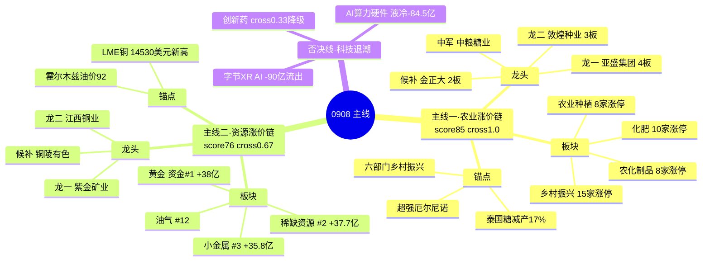

# 2026-09-08 · **主线研判**

> **数据源新鲜度**: partial
> **降级状态**: false
> **置信度**: 0.58

## 一句话结论

主线=**农业/粮食/涨价链**（持续性3日，扩散中后期）+**资源涨价链（黄金/铜/小金属）**（启动第1日）；科技链退潮资金大额流出，只观察不追。

## 详细分析

**市场定调（继承 R1）**：修复次日分歧。涨停73家/跌停0，但炸板率33.64%（较前日16.96%翻倍）、连板高度6→4降级、情绪周期=高位震荡、仓位上限55%。今日主线的正确姿势是**少而精**——只做三源（R3叙事×R4催化×R7资金）共振最强的主线，不贪扩散。

**主线一：农业/粮食/涨价链（score 85，三源全中 cross=1.0）**。这是今日唯一三源硬共振全绿的主线：R3 共振主题 rank1（L1+L2，7席霸榜：代糖/粮食/化肥/玉米/农业种植/草甘膦/猪肉）；R4 催化（超强厄尔尼诺→全球食品价格2022年以来最高、泰国糖减产17%、六部门乡村振兴政策锚）；R7 资金（化肥链上游磷化工#5 +31.9亿/化工原料#4 +33亿/煤化工#8 +26.5亿）。涨停实况：乡村振兴15家（#2）、化肥10家（#6）、农化制品8家（#13）、农业种植8家（#14）。生命周期=主升中期（3日/龙头4板/资金今日转正），注意炸板率控仓。龙一亚盛集团一字4板（华泰总部3日3次上榜），龙二敦煌种业换手3板（高盛/中信多席位）。

**主线二：资源涨价链（score 76，cross=0.67）**。纯资金驱动主线：黄金#1 +38亿、稀缺资源#2 +37.7亿、小金属#3 +35.8亿霸榜，催化剂=LME铜14530美元历史新高（E007）+霍尔木兹封锁油价92美元（E008）。但涨停维弱（铜/黄金个股无涨停潮）——资金与涨停脱节，属**趋势资金主线**而非涨停主线。生命周期=启动期（age1/height1），资金持续性未确认，禁重仓。龙一紫金矿业（铜金全球龙头·容量核心），龙二江西铜业。

**被否决的三条**：①字节世界模型/XR/AI应用（R3 rank3+R4 high 但 R7 人工智能-90亿大额流出 → capital veto）；②AI算力硬件链（R3 rank4 退潮分歧 + distribution_alert + 液冷-84.5亿/数据中心-70亿/华为-110.8亿 → 只观察，移交R6反证）；③创新药/AI制药（R3 rank2 但 R4 无催化 + cross=0.33<0.34 → 按 D1 规则降级 watch_pool）。西部大开发/一带一路涨停维强（#1 17家/#5 11家）但无 R3/R7 共振，且成分与农业线重叠。

## 关键证据

- 证据 1: 乡村振兴15家涨停#2/化肥10家#6/农化8家#13/农业种植8家#14 · 来源 limit_cpt_list 0908
- 证据 2: 磷化工#5 +31.87亿/化工原料#4 +33.03亿/煤化工#8 +26.48亿 · 来源 R7 moneyflow_ind_dc
- 证据 3: 黄金#1 +38.03亿/稀缺资源#2 +37.68亿/小金属#3 +35.77亿 · 来源 R7 top_inflow
- 证据 4: 人工智能-89.97亿/液冷-84.54亿/华为-110.75亿净流出 · 来源 R7 top_outflow（科技否决依据）
- 证据 5: 亚盛集团4板一字(华泰总部3日3次上榜)·敦煌种业3板(高盛/中信) · 来源 limit_step + R7 hot_money
- 证据 6: 创新药热榜7→2 up5(CRO新进) 但涨停仅澳洋健康2板/奥浦迈20cm · 来源 R3 hotlist + limit_list_d

## 数据源审计

| 源 | 状态 | 抓取时间 | 记录数 | 备注 |
|---|---|---|---|---|
| limit_cpt_list | ok | 23:30 | 20 | 当日涨停最强板块top20 |
| limit_list_d | ok | 23:31 | 66 | 当日涨停个股全量 |
| limit_step | ok | 23:31 | 18 | 连板天梯4-3-2 |
| R1_style | ok | 22:17 | - | 高位震荡·仓位55% |
| R3_sentiment | ok | 22:38 | 5主题 | 农业rank1 L1+L2 |
| R4_news | ok | 22:01 | 8事件 | E006农业/E007铜/E008宏观 |
| R7_capital | ok | 22:03 | - | 资源霸榜·科技流出 |
| factor_snapshot | error | - | 0 | top_ir_factors缺失·因子层降级 |

## 不确定性 / 反证

1. **同源偏差**：R2 与 R7 都基于 tushare moneyflow_ind_dc，资金维"独立验证"实际不独立——若明日板块资金回撤，本判据可靠性下降。
2. **农业线扩散中后期**：3日发酵（0904猪肉→0907粮食→0908七席），代糖#1为新晋 watch，若明日霸榜需警惕单日登顶兑现；亚盛集团4板一字后高位分歧风险。
3. **资源线涨停与资金脱节**：黄金资金第一但A股黄金股无涨停——若明日黄金股不启动，主线成立性存疑。特朗普关税扩精铜是预期炒作，政策反复风险。
4. **R4 无 iwencai/hithink 验证**（llm_pure_no_verification，个股置信顶格0.5），龙头股逻辑依赖群聊/公告而非独立数据源。
5. **R6 尚未跑**：亚盛集团一字4板、紫金/江铜趋势高位，均需反证是否诱多/出货。

## 与其他 R 的关系

- 依赖: R1_style(风格/情绪/仓位) · R3_sentiment(共振主题) · R4_news(催化) · R7_capital_flow(资金)
- 输出被下游使用: R5(对龙一/龙二做画像) · R6(对 execution_eligible 龙头反证) · D1(从 leader_rank 1/2 且 execution_eligible 进 execution_pool)

## Sub-Agent 元数据

- skill: analyze_main_sectors_v1
- artifact: data/research/20260908/R2_main_sectors.json
- 生成耗时: ~12 min
- model: deepseek-v4-flash-260425
