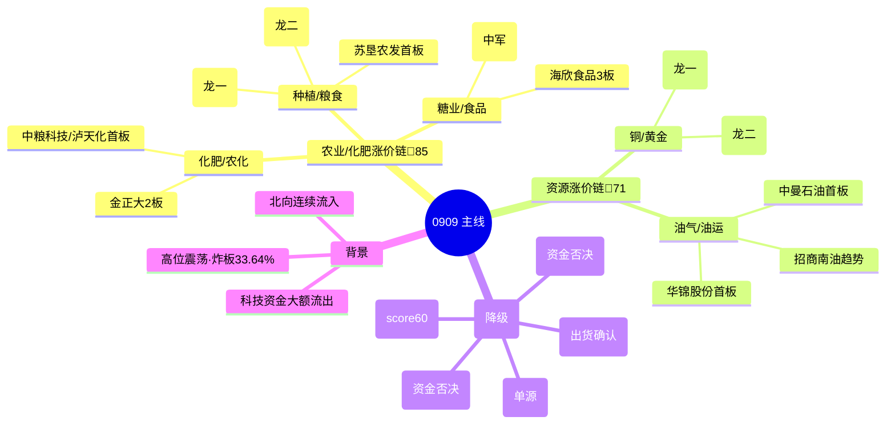

# 2026-09-09 · **主线研判**

> **数据源新鲜度**: partial
> **降级状态**: 否
> **置信度**: 0.51

## 一句话结论

高位震荡(炸板率33.64%)下只做两条三源硬共振主线：**农业/化肥涨价链**(85分·主升中期) + **资源涨价链**(71分·启动期)，科技线全降次级。

## 详细分析

### 环境定位 · 修复次日分歧，高位震荡少而精

R1 把 0909 定性为**主线扩散型偏震荡**，情绪周期重算为**高位震荡**(conf 0.75)：涨停73家/跌停0家，但炸板率 33.64% 较前日 16.96% 翻倍、连板高度 6→4 降级、科技权重回调、溢价 +2.89% 仍在赚。这个环境下**追高性价比下降**——R2 落 2 条主线（而非 R1 建议的 3 条），理由只有一个：少而精，只做资金+涨停+叙事**三源同向**的线。盘中若炸板率破 35%，候选数砍半、仓位上限再降（R1 警示）。

### 主线一 · 农业/粮食/化肥涨价链（score 85 · 🥇 今日第一主线）

R3 共振 rank1(L1+L2 · 热榜6席霸榜)、R4 E006 high(超强厄尔尼诺 + 十五五规划 + 六部门乡村振兴)、R7 农化上游资金霸榜(磷化工#5/化工原料#4/煤化工#8)——**三源全中，cross_validation=1.0**。涨停维实证：乡村振兴15家(8天5板)、化肥10家(+4.26%)、农化制品8家(+4.71%)、农业种植8家(+3.12%)，龙头梯队 4-3-2 完整。生命周期 **mid_up 主升中期**(age3/height4/money1)——但已发酵3日(0904猪肉→0907粮食→0908七席)，**扩散中后期，只做龙一/龙二，追高慎之**。

- **大资金意图**: 机构与游资为何在此位置押注农业？——供给端"超强厄尔尼诺(WFP确认)"+需求端"粮食安全/涉农政策(六部门乡村振兴+十五五规划)"构成**气候+政策双硬锚**；化肥/磷化工是本轮农业行情的**上游卡位**，农化五只涨停(金正大/新安/和邦/赤天化/川发龙蟒)说明资金在打"卖水人"逻辑而非追终端种子。对手盘=追高情绪盘，承接靠政策与涨价预期的持续注入。
- **为什么走强**: 位置=扩散中后期(中高位)、催化=硬政策(涉农上市)+硬天气(厄尔尼诺·WFP)、筹码=亚盛4板一字缩量(换手0.87%惜售)+敦煌3板换手充分。三维共振，赚钱效应从科技切向农业的资金正在集聚。
- **逻辑够不够硬**: 够硬但已兑现3日。独立源=R3(多群独立提及)+R4(央视/财联社/人民财讯)+R7(资金霸榜)三源；硬政策(乡村振兴+十五五)+硬事件(超强厄尔尼诺)双锚；**证伪路径=磷化工/化工原料5日累计仍净流出(cum -4.02/-3.04亿)，若明日资金转出即证伪**；亚盛4板一字若断板，高标情绪二次受挫。

**候选龙头**(filter_leader_v1 已过滤，仅龙一/龙二 execution_eligible)：

| 角色 | 代码 | 名称 | 板型 | 连板 | 流通(亿) | 标签 |
|---|---|---|---|---|---|---|
| 🐉 龙一 | 600108.SH | 亚盛集团 | 一字4板(缩量) | 4 | 102.8 | 卡位·总龙 |
| 🐉 龙二 | 600354.SH | 敦煌种业 | 换手3板 | 3 | 55.3 | 补涨·卡位备选 |
| 候补 | 002470.SZ | 金正大 | 换手2板(化肥) | 2 | 83.1 | 助攻 |
| 候补 | 600737.SH | 中粮糖业 | 首板(容量中军) | 1 | 388.4 | 中军 |
| 候补 | 601952.SH | 苏垦农发 | 首板(尾盘回封弱) | 1 | 145.9 | 补涨 |

> 📌 **首推票思维链 · 亚盛集团(600108)**
> - **买入理由**: ①连板高度市场并列第1(4板)+乡村振兴15家涨停板块第2的种植业总龙头，身份无需证明；②R7游资实证：国泰海通成都龙腾东路/中泰常州惠国路连续2日上榜同票，量能逻辑在场。
> - **风险点**: ①4板一字缩量(换手0.87%)，高位分歧一旦放量=兑现信号；②高位震荡环境炸板率33.64%，一字板若开板跳水承接不明。
> - **止损条件**: 买入价 -5% 硬止损(高位龙头不设 -10%，怕断板瀑布)；或次日竞价高开<3% 视为弱转弱，9:45 前不转强即走。
> - **可验证假设**: 24-72h 内观察——若磷化工/化工原料主力资金连续第2日净流出且亚盛开板换手>8%，则"扩散中后期"判定成立、持仓降级 watch；若资金持续为正且亚盛 5 板缩量加速，则主升延续、龙二卡位补涨成立。

### 主线二 · 资源涨价链(铜/黄金/小金属/油气)（score 71 · 🥈 资金第一主线）

R7 资金维**top3 霸榜**(黄金#1 +38.03亿/稀缺资源#2 +37.68亿/小金属#3 +35.77亿)+北向连续5日净流入；R4 E003 high(LME铜14617美元历史新高·关税15%抢铜潮)+E002 high(中东冲突油价99美元)。但**涨停维弱**(黄金股未涨停、仅4家首板)且**5日累计资金仍净流出**(黄金-29.7/稀缺-71.09/小金属-96.74亿)——这是典型的**资金暴动但持续性未确认**，lifecycle=**formation 启动期**，只做首板试探、**禁重仓**。

- **大资金意图**: 主力资金在"全球抢铜(关税预期+大摩下调增产)+中东地缘(油价99美元)"两个**宏观硬事件**上做趋势配置，而非涨停博弈；公募增配有金属(R4)是机构配置盘的信号。对手盘=短线获利盘与美联储加息预期下的估值压制。
- **为什么走强**: 位置=低位启动、催化=LME铜历史新高+油价99美元(硬事件)、筹码=黄金/铜资金从科技切出。资金与涨停脱节是**趋势资金主线**特征——赚的是商品价格的钱，不是情绪的钱。
- **逻辑够不够硬**: 硬事件够硬(铜价新高/油价新高/地缘未决)，但**持续性待验证**——5日累计仍净流出，0908 是单日脉冲还是趋势起点未定；证伪路径=明日黄金/铜个股若不启动且资金转出，主线存疑。叠加 E008 美联储加息(59.4%)压制资源股估值，逻辑有对冲项。

**候选龙头**(龙一/龙二为趋势票，非涨停实证)：

| 角色 | 代码 | 名称 | 板型 | 流通(亿) | 标签 |
|---|---|---|---|---|---|
| 🐉 龙一 | 601899.SH | 紫金矿业 | 趋势资金主线(未涨停) | ~7000 | 中军·容量核心 |
| 🐉 龙二 | 600362.SH | 江西铜业 | 趋势股(+5.45%) | ~900 | 联动 |
| 候补 | 603619.SH | 中曼石油 | 首板(油服·唯一涨停实证) | 115.1 | 事件联动 |
| 候补 | 000059.SZ | 华锦股份 | 首板(尾盘弱封) | 98.4 | 补涨 |
| 候补 | 601975.SH | 招商南油 | 趋势股(+4.72%·油运) | 466.0 | 对冲·联动 |

> 📌 **首推票思维链 · 紫金矿业(601899)**
> - **买入理由**: ①R4 E003 首推·全球铜金龙头，LME铜历史新高+关税预期双受益，黄金概念#1资金的主要载体；②R7 北向连续5日净流入+公募增配有金属，机构配置盘在场。
> - **风险点**: ①趋势票不在涨停榜，情绪周期高位震荡下弹性低于题材股；②美联储9月加息概率59.4%，若落地压制资源股估值。
> - **止损条件**: 买入价 -5% 硬止损(趋势票允许 -6%~-8% 区间，D1 以买入价为基准)；或铜价(COMEX/LME)收盘跌破 14000 美元/金价跌破前低时破位离场。
> - **可验证假设**: 24-72h 内——若明日黄金/铜个股出现涨停潮或紫金放量突破前高，则"资金→涨停"传导成立、主线升级；若板块资金第2日转出且黄金股继续不动，则单日脉冲判定成立、只保留观察。

### 次级线 · 科技全降，防"一日游"

| 次级线 | score | 裁决理由 |
|---|---|---|
| 字节世界模型/XR/AI应用 | 62 | R3 early+R4 E001 high，但 R7 人工智能-89.97亿 **资金否决** |
| 创新药/CRO | 60 | R3 rank4 共振+CRO#11资金正，但 R4 无 top event+涨停分散，score<70 |
| AI算力硬件链(光/液冷/存储/CPO) | 55 | R4 E001/E004 high 仍在，但 R3 **distribution_alert confirmed(CPO出货第2日)** + R7 大额流出 → 三源缺两源，**反证重点·只观察不追** |
| 6G/通信 | 50 | R4 E005 high(工信部6G)但 R7 华为-110.75亿 资金否决 |
| 房地产/物业 | 50 | 涨停维单源(物业管理15家/ETF+2.19%)，无共振无资金，一日游风险高 |

## 关键证据

- 证据 1: R3 农业 rank1 L1+L2 · 热榜6席霸榜(粮食#3/化肥#4/玉米#6/农业种植#9/草甘膦#14/猪肉#12)+代糖#1 · 来源 R3_sentiment.json
- 证据 2: R4 E006 high 超强厄尔尼诺(WFP)+十五五规划+六部门乡村振兴涉农上市 · 来源 R4_news.json
- 证据 3: R7 磷化工#5 +31.87亿/化工原料#4 +33.03亿/煤化工#8 +26.48亿(农化上游) + 黄金#1 +38.03亿/稀缺#2/小金属#3 霸榜 · 来源 R7_capital_flow
- 证据 4: limit_cpt 0908 乡村振兴15家(rank2)/化肥10家(rank6)/农化制品8家/农业种植8家 + 连板天梯 4板×3(亚盛/爱仕达/百大) · 来源 tushare.limit_cpt_list + limit_step
- 证据 5: 亚盛4板一字(换手0.87%)+敦煌3板换手+金正大2板；游资席位国泰海通成都龙腾东路/中泰常州惠国路连续2日上榜亚盛 · 来源 tushare.limit_list_d + R7.hot_money
- 证据 6: R3 distribution_alert confirmed(CPO霸榜出货第2日)+R7 华为-110.75亿/人工智能-89.97亿/液冷-84.54亿 → 科技线资金否决 · 来源 R3+R7

## 数据源审计

| 源 | 日期 | 状态 | 备注 |
|---|---|---|---|
| tushare/limit_cpt_list | 2026-09-08 | 🟢 | 20 板块 · 涨停最强统计 |
| tushare/limit_list_d | 2026-09-08 | 🟢 | 70 涨停个股(非ST) · 含封板时间/流通/换手 |
| tushare/limit_step | 2026-09-08 | 🟢 | 18 连板天梯 · 4板×3 |
| tushare/moneyflow_ind_dc | 2026-09-08 | 🟢 | R7 内联 · 概念资金 504 板块 |
| wechat_cli_5groups | 2026-09-08 | 🟢 | R3 内联 · 5 焦点群 370 条(匿名) |
| news_cls / news_major | 2026-09-08 | 🟢 | R4 内联 · 2421/800 条 |
| weflow_analytics | - | 🔴 | DOWN · R3 降级(L3 缺) |
| ths_hot 当日(0909) | - | 🟡 | 当日空 → T-1(0908) baseline |

## 不确定性 / 反证

- **R3 热榜为 T-1 baseline**(0909 当日未生成)，共振判定有 1 日滞后——若 0909 盘中热榜换血，农业霸榜位可能被顶替。
- 农业线"扩散中后期"是最大隐忧：已发酵3日，龙一亚盛 4 板一字，高位震荡环境下**一字板断板即情绪踩踏**；磷化工/化工原料 5 日累计仍净流出，资金持续性是真命题。
- 资源线"资金-涨停脱节"：黄金资金#1 但 A 股黄金股未涨停，若明日不启动则主线存疑；5 日累计净流出说明 0908 单日暴动可能是脉冲。
- 美联储 9 月加息概率 59.4% + 美债 4.474% 高位，对高位科技股与资源股估值双压制（R4 E008）。
- R6 尚未跑：亚盛一字 4 板、紫金/江铜高位趋势票均需反证"出货/诱多"。

## 与其他 R 的关系

- 依赖: R1_style.json(风格/情绪周期/仓位上限) · R3_sentiment.json(共振主题/热榜) · R4_news.json(催化事件/sectors_catalyzed) · R7_capital_flow(资金/游资/龙虎榜)
- 输出被消费: filter_leader_v1(已内联) · R5 个股画像(对 leaders 龙一/龙二深挖) · R6 反证(对 execution_eligible 龙头反证) · D1 主决策(execution_pool 候选)

## Sub-Agent 元数据

- skill: analyze_main_sectors_v1
- artifact: data/research/20260909/R2_main_sectors.json
- 生成耗时: ~15 分钟
- 用 model: deepseek-v4-flash-260425
