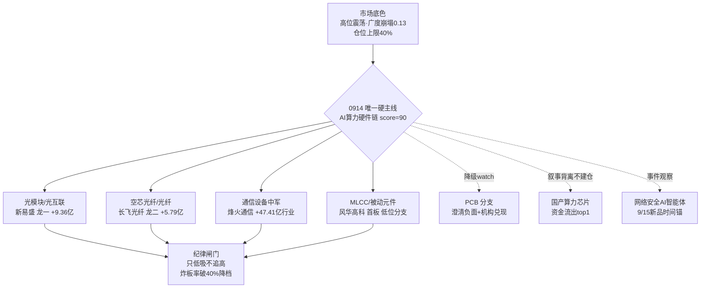

# 2026年9月14日 · **主线研判**

> **数据源新鲜度**: partial
> **降级状态**: true
> **置信度**: 0.62

## 一句话结论

0914 只认一条三源共振硬主线：AI算力硬件链（光互联/光模块/CPO/MLCC/PCB），高位震荡只做龙一龙二低吸与低位分支补涨，仓位上限40%。

## 详细分析

先说市场底色。R1 把 0911 定性为广度崩塌式退坡：涨停40家但跌停21家三倍放大、全市场涨跌比0.13、中位-2.21%、涨停溢价中位-1.90%继续转负、连板高度从5板回落到4板——有题材、无赚钱效应，是高位分歧期的典型结构。情绪周期重算为高位震荡（conf 0.75，方向偏主跌）。这个底色决定了 R2 的收敛：R1 名义给出"三主线以上"（强板块17个），但那些是概念重叠造成的计数虚高，按纪律"高位震荡压缩候选、无主线不开新仓"，今天只保留一条够格的硬主线，其余降为观察。

为什么 AI 算力硬件链是唯一够格的？因为它三源共振得分 90，是全场唯一 热度/资金/叙事/共振 四项都满分的板块：热榜上 MLCC 从19升到2（+17，最强动量）、光纤18→6、铜缆高速连接新进前5、6G新进前20；资金端 R7 概念净流入前十有七个属于这条链（5G 44.88亿第一、光通信43.37亿第二、被动元件33.69亿、MLCC 28.28亿），5日累计 5G 469亿、通信技术466亿、光通信339亿；叙事端 R4 的 E003 算力一张网（工信部+中行3000亿）、E004 光博会+1.6T订单排到明年+长飞空芯光纤破纪录、E005 Anthropic 盈利+英伟达百亿美元参投，三件 high 事件叠加六家券商独立共振。这不是一日游题材，是资金已经连续买了五天的趋势型主线。

但正因为位置高，纪律要卡死。生命周期脚本判定为"主升中期"（age 10天、资金持续4天），我却要在行动上按"高位分歧/兑现初期"校准：板块内最高连板只有2板（超声电子），说明这不是连板型主线而是趋势型主线，R7 的龙虎榜诱多命中率高达46%，PCB/通信涨停端机构在明着兑现（超声电子-2.04亿、逸豪新材-2.25亿）。所以 leaders 只给四只：新易盛（龙一，主力+9.36亿全场第一）、长飞光纤（龙二，+5.79亿）、烽火通信（中军，通信设备行业+47.41亿）、风华高科（候补，MLCC 分支龙一，元件板块0911涨幅全市场第一+3.11%）。PCB 分支（崇达/嘉立创/金安国纪/超声电子）虽然涨停+游资连续上榜，但被 R4 澄清负面（英伟达传闻不属实）和 R7 机构兑现双重压制，降级 watch。

两条次级都只观察不建仓：国产算力芯片/AI软件（56分）叙事极强——华创喊出"底部已至"、国联民生深度推昇腾/寒武纪——但资金是全场流出第一（国产芯片-124.47亿、存储-110.3亿、人工智能-98.36亿），加上沐曦解禁占流通盘75%的达摩克利斯之剑，这是"有叙事无资金"的标准背离，等寒武纪逆势放量再说；网络安全AI智能体（50分）是纯事件驱动，9/15 天融信新品发布是时间锚，但今天网安周才开幕、资金还没进场，生命周期刚走到"形成期"。

## 关键证据

- 证据1: R7 概念主力净流入前十中 7 席属本链（5G+44.88亿/光通信+43.37亿/被动元件+33.69亿/MLCC+28.28亿/F5G+24.00亿/算力+21.27亿/CPO+21.16亿）· 来源 R7_capital_flow
- 证据2: 热榜动量 MLCC 19→2(+17) 全场最强、光纤 18→6(+12)、铜缆新进#5、6G新进#19 · 来源 hotlist_signals(T-1 baseline)
- 证据3: 0911 limit_cpt_list 5G 10家/CPO 9家/元件 9家/PCB 8家；元件板块 +3.11% 全市场涨幅第一（风华高科/嘉立创/崇达/铜峰电子首板+超声电子2板）· 来源 tushare 直连
- 证据4: R4 E003/E004/E005 三事件 strength=high，六券商独立共振（开源/华西/太平洋/华创/国联民生/国金）· 来源 R4_news
- 证据5: 个股实测 0911 主力净额 新易盛+9.36亿/长飞+5.79亿/金安国纪+5.72亿/风华高科+2.11亿 · 来源 tushare.moneyflow
- 证据6: R7 龙虎榜诱多命中 29/63=46%，超声电子 2板但主力-2.72亿流出 · 来源 R7 lhb_bull_trap

## 数据源审计

| 源 | 状态 | 抓取时间 | 记录数 | 备注 |
|---|---|---|---|---|
| R1_style | 🟡 | 07:31 | - | 颜晓滨群error+公众号disabled，底层真实收盘 |
| R3_sentiment | 🟡 | 07:47 | 3主题 | WeFlow永久下线·L1当日空用T-1 baseline·2/5群 |
| R4_news | 🟢 | 07:24 | 8事件 | 三源+xtick交叉验证 |
| R7_capital_flow | 🟡 | 07:23 | 2520行 | vibe-trading down·两融0910 |
| tushare 直连(板块/个股) | 🟢 | 08:00 | 实测 | MCP网关down但SDK真实0911收盘 |
| hotlist_signals | 🟡 | 07:40 | 20 | 场景C·T-1 baseline |
| factor_snapshot | 🔴 | - | 0 | 目录缺失 factor_layer_degraded=true |

## 不确定性 / 反证

最大的自我批判是：这条链的位置太高，而今天的市场是高位震荡偏主跌。龙一龙二都是百元以上高位股（新易盛423、长飞474），30日涨幅巨大，一旦高标补跌（R1 新高崩塌簇 30日-10.73% 正在失效），龙一龙二低吸也可能接飞刀。R3 已经给出反向证据：光纤热榜升12位但主力净流出-17.2亿，热榜升位≠资金确认；PCB 机构在兑现；半导体下周解禁476.93亿可能外溢压制整个 AI 算力大叙事。此外 R4 E001 提示 9/17 美联储加息决议落地前，高位科技成长承压。若 0914 炸板率破40%或跌停继续放大，本研判整体降档，只剩最强龙一甚至空仓。国产算力芯片这条线尤其危险——叙事越强、资金背离越狠，越是"讲故事出货"的高发区，R6 反证必须重点盯这条。

## 与其他 R/D/E 的关系

- 依赖: R1_style(风格/仓位上限) · R3_sentiment(共振主题) · R4_news(催化事件) · R7_capital_flow(资金验证) · hotlist_signals(热榜动量) · mainline_lifecycle.py(生命周期脚本)
- 被消费: D1(canghai-plan execution_pool 选股, cross_validation_score=1.0 主线优先) · R6(devil_advocate 反证, 重点查国产算力芯片"叙事出货"与 PCB 机构兑现) · R5(stock_profile 逐票六维画像) · E1(复盘) · filter_leader_v1(龙头硬过滤)

## Sub-Agent 元数据

- skill: analyze_main_sectors_v1
- artifact: data/research/20260914/R2_main_sectors.json
- 生成耗时: ~25 秒
- model: deepseek-v4-flash-ga-260731
