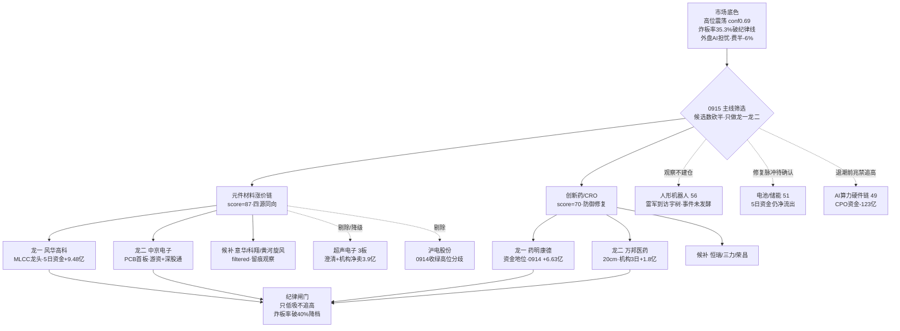

```yaml
date: 2026-09-15
agent: R2-main-sectors
skill_version: analyze_main_sectors_v1@1.0
generated_at: 2026-09-15T08:26:00+08:00
confidence: 0.50
degraded: true
data_sources:
  - name: R1_style
    path: data/research/20260915/R1_style.json
    status: ok
    captured_at: 2026-09-15T07:43:32+08:00
    record_count: 1
    error: degraded(KOL 5群全灭·公众号disabled·美股tushare延迟至0911·底层tushare SDK 真实收盘)
  - name: R3_sentiment
    path: data/research/20260915/R3_sentiment.json
    status: ok
    captured_at: 2026-09-15T08:10:00+08:00
    record_count: 5
    error: degraded(L1-Only: KOL 5群全灭 0条·WeFlow down·xtick MCP down)
  - name: R4_news
    path: data/research/20260915/R4_news.json
    status: ok
    captured_at: 2026-09-15T07:38:22+08:00
    record_count: 8
    error: null
  - name: R7_capital_flow
    path: data/research/20260915/R7_capital_flow_20260915.json
    status: ok
    captured_at: 2026-09-15T07:49:20+08:00
    record_count: 2703
    error: degraded(vibe-trading MCP down·两融0911·美股主体0911)
  - name: tushare_direct(limit_cpt_list/limit_list_d/limit_step/moneyflow/moneyflow_ind_dc/daily)
    path: MCP/tushare SDK 直连
    status: ok
    captured_at: 2026-09-15T08:23:00+08:00
    record_count: null
    error: MCP网关down(severity=3) 但SDK直连真实0914收盘
  - name: hotlist_signals
    path: data/research/20260915/hotlist_signals.json
    status: ok
    captured_at: 2026-09-15T08:04:21+08:00
    record_count: 20
    error: degraded(L1-only·diff baseline 0911)
  - name: factor_snapshot
    path: data/factor_snapshot/
    status: error
    captured_at: null
    record_count: 0
    error: 目录不存在 factor_layer_degraded=true
input_freshness: partial
input_freshness_note: 核心量化主源(tushare SDK 直连 0914 收盘 + R3 热榜 + R7 资金) fresh; KOL 5群全灭 + WeFlow 永久下线 + xtick MCP down + factor 因子层缺失 + MCP 网关 global_severity=3
```


# 2026年9月15日 · **主线研判**

> **数据源新鲜度**: partial
> **降级状态**: true
> **置信度**: 0.50

## 一句话结论

0915 只认两条跨源满分主线：元件材料涨价链（PCB/MLCC/培育钻石，87分）与创新药/CRO（70分，防御修复），高位震荡+炸板率破35%纪律线，候选数砍半，只做龙一龙二低吸与低位补涨，禁追 PCB 热榜第一。

## 详细分析

先说市场底色。R1 把 0914 定性为"广度大幅修复但结构分化"：涨停55家、跌停15家收敛、全市场涨跌比从 0.13 修复到 1.41、前日涨停溢价中位从 -1.90% 回正到 +3.12%，赚钱效应确认回来了；但高标崩塌（非ST三板以上当日 -9.99%）、权重弱（创业板 -1.10%）、炸板率 35.3% 破 35% 纪律警戒线。情绪周期重算=高位震荡（conf 0.69），叠加外盘重大利空——美股 0914 夜 AI 开发放缓担忧、费半 -6%、10年美债三年来首破 5%、纳指期货 -1.7%、韩股 -3.26%。结论很硬：**内部修复 vs 外部利空的对撞日，0915 只做最强主线的龙一龙二，科技成长链若高开低走即外盘映射杀。**

为什么元件材料涨价链是唯一 87 分硬主线？因为它拿到了 R3 热榜 + R7 资金 + R4 叙事 + 游资席位的四源同向：热榜 top3 全占（PCB#1、MLCC#2、培育钻石#3 排名 +11 最强动量），R7 概念净流入 PCB+43.85亿第一、新材料+43.55亿第二、MLCC+22.41亿第四、培育钻石+18.18亿第七，PCB 5日累计 +129.62亿是全场唯一持续净入主线；叙事端 R4 E008 电子布 G75 涨到 22800-24000 元/吨 + 村田 MLCC 扩产 20% + 大摩喊出玻纤布与铜箔材料超级周期。这不是一日游题材，是资金连续买了四天半的涨价链。但纪律必须卡死：PCB 新晋热榜#1 触发 R3 distribution_alert（霸榜第一永作反向），高位澄清票（超声电子 3板、金安国纪）被 R4 澄清+ R7 机构兑现双重压制——所以 leaders 只给资金持续型龙一（风华高科）和低位涨停龙二（中京电子），超声、金安、沪电全部剔除或降级。

创新药/CRO 是第二条 70 分主线，属性完全不同——**防御修复**。R7 行业端医药生物 +28.98亿全行业第一、创新药概念 +16.18亿进前十、医药ETF 0914 +1.92% 是 20 只 ETF 当日最强；R4 E007 出海交易额破 1200 亿美元（+36%）+ 恒瑞 SHR-2004 受理 + 荣昌/石药中报扭亏硬 alpha；热榜创新药#4、CRO#7 新进。它赢在"资金+叙事+热度"三源，弱在涨停维——医药链只有 5 家涨停、高度 2 板，是低位修复型而非连板型，所以生命周期人工校准为"形成期"，只做药明（资金地位龙一，0914 +6.63亿全链第一）低吸，不做接力。

三条被丢弃的线必须讲清楚。AI算力硬件链（数据中心/CPO/光模块/存储）涨停家数其实很高（数据中心#2 十二家涨停），但 R7 主力流出全场最狠（CPO -123.49亿、光通信 -98.95亿、数据中心 -72.51亿），R3 直接判定"人气未散、资金先撤=退潮前兆"，R4 E003 又要求回避光模块——**热榜在榜≠安全，资金流向才是**，0915 禁止追高。电池/储能/新能源车链资金单日回流（电池技术 +26.51亿）但 5日累计还是巨量净流出（-119亿），闽东电力 4 板是全市场最高板但当日主力 -4.19亿 背离，属修复脉冲不是趋势反转。油气/油运被 R4 E001 霍尔木兹封锁+油价破百 high 催化，但无涨停无资金无热榜，只能作事件观察。



## 推理深度三问

### 主线一 · 元件材料涨价链

- **大资金意图**: 主力在"涨价传导"上集中下注——电子布、覆铜板、MLCC、培育钻石是材料端涨价受益，不依赖英伟达订单叙事，天然规避外盘 AI 担忧的映射风险；紫阳东路等游资席位 +6.69亿扫 PCB 链五票（超声/中京/双星/科翔/黄河旋风）是题材资金的主攻方向，对手盘是高位 AI 硬件链的存量筹码（CPO -123亿 出逃正好是它的活水来源）。
- **为什么走强**: 位置——链内龙一风华 58.9 元相对超声 22.63 元 3 板不算极端，但 PCB 链整体已 6 天 4 板属中位偏高；催化——电子布涨价 + 村田扩产 + 大摩超级周期是硬事件，且是产业数据不是预期；筹码——风华 5日资金持续正流入、深股通 3日 +4.39亿，龙虎榜诱多命中率仍高（超声机构净卖 3.9亿）说明分歧在加剧，资金在向材料端和低位票迁移。
- **逻辑够不够硬**: 够硬——R3 热榜 + R7 资金 + R4 叙事 + 游资席位四个独立源同向，cross_validation_score=1.0，涨价有产业价格数据锚（电子布 22800-24000 元/吨）。证伪路径：①涨价是题材借口的假涨→电子布报价回落或滞涨；②高位澄清票（超声/金安）带崩板块情绪；③外盘 AI 担忧扩散成系统性风险偏好收缩。今日验证点：PCB 热榜#1 能否在出货 watch 下不炸板。

### 主线二 · 创新药/CRO

- **大资金意图**: 资金在"加息预期下的防御+低位修复"上下注——10Y 美债破 5% 压制高估值成长，医药生物 30日 ETF 仅 -0.56% 已在低位，行业端 +28.98亿 全行业第一说明机构在高低切；药明 0914 单日 +6.63亿是明确的机构回补信号，对手盘是过去一个月的套牢盘。
- **为什么走强**: 位置——药明 158.86、恒瑞 43.15 都在 30 日深调后的低位；催化——出海 1200 亿（+36%）+ 恒瑞 SHR-2004 受理 + 荣昌/石药中报扭亏硬 alpha，是业绩+事件双锚；筹码——创新药概念 5日累计 -61亿但 0914 单日 +16.18亿 转正，修复刚启动。
- **逻辑够不够硬**: 够硬但弹性存疑——出海数据是年度累计的存量利好，不是突发催化，R3 也只有 L1 单源（无 KOL）；涨停维弱（5家、高度2板）说明市场还没把它当进攻主线，只能定位为防御修复。证伪路径：①0915 创新药资金不再流入→单日脉冲结束；②外盘科技杀跌拖累全市场风险偏好，防御也被抽血。

## 首推票思维链

### 风华高科（000636 · 主线一龙一）

- **买入理由**: ①产业逻辑——MLCC 国产龙头，村田扩产 20% 验证 AI 服务器 MLCC 需求，涨价链最纯正标的，R4 E008 首推；②数据锚——0914 +5.2% 连续两日走强，5日主力 +9.48亿（超声剔除后板块第一）、深股通 3日 +4.39亿，热榜#2 + 双平台人气 #1/#5，float 642亿容量核心，高位震荡期有资金背书的趋势龙。
- **风险点**: ①短期——PCB 热榜#1 出货 watch，若 0915 高开抢跑则先手兑现；②中期反证——涨价周期若证伪（电子布报价回落）或外盘 AI 担忧扩散成系统性杀跌，材料链跟随回调。
- **止损条件**: 跌破 55.95（前高支撑，约 -5%）离场；若盘中板块炸板率破 40%，立即降档。
- **可验证假设**: 24-72h 内——0915 若能收于 60 上方且主力仍净流入 → 涨价链趋势延续；若高开冲高回落跌破 58.9（0914 收盘）→ 出货 watch 兑现，降级。

### 药明康德（603259 · 主线二龙一）

- **买入理由**: ①产业逻辑——CRO 全球龙头，创新药出海 1200 亿直接受益 BD 订单，R4 E007 板块级利好；②数据锚——0914 +5.04% 放量修复，主力 +6.63亿 全链第一（5日 +7.63亿），医药生物行业 +28.98亿 全行业第一，低位 158.86。
- **风险点**: ①短期——防御修复主线在科技反弹日弹性不足，若 0915 科技链企稳则资金分流；②中期反证——加息 92.4% 概率下高估值成长持续受压制，医药修复可能一日游（创新药概念 5日累计仍 -61亿）。
- **止损条件**: 跌破 150（约 -5.5%）离场；跌破 5 日线且缩量则减半。
- **可验证假设**: 24-72h 内——0915 若收于 163 上方且主力继续净流入 → 修复启动确认；若冲高回落跌破 158.86 → 单日脉冲结束，只保留观察。

## 关键证据

- 证据1: R7 概念净流入 PCB+43.85亿#1 / 新材料+43.55亿#2 / MLCC+22.41亿#4 / 培育钻石+18.18亿#7 / 被动元件+15.77亿#12；PCB 5日累计 +129.62亿 · 来源 R7_capital_flow
- 证据2: ths 热榜 top3 全占（PCB#1 / MLCC#2 / 培育钻石#3 排名 +11 最强动量）；风华 ths#1/dc#5、黄河旋风 dc#2/ths#5 surge+78 · 来源 hotlist_signals
- 证据3: 0914 limit_up PCB链 8家（超声3板/中京/科翔20cm/满坤20cm/双星2板/康达/意华/澳弘2板）+ 培育钻石 2家；闽东电力4板=全市场最高板 · 来源 tushare 直连 limit_list_d
- 证据4: R4 E008 电子布 G75 涨至 22800-24000 元/吨 + 村田 MLCC 扩产20% + 大摩材料超级周期 high；E007 创新药出海1200亿 +36% + 恒瑞 SHR-2004 受理 high · 来源 R4_news
- 证据5: 个股实测 0914 主力净额 药明+6.63亿 / 风华+2.79亿 / 科翔+2.21亿 / 恒瑞+1.39亿；超声 5日 -7.53亿、沪电 0914 -1.99% 高位分歧 · 来源 tushare.moneyflow
- 证据6: R7 游资席位 紫阳东路+6.69亿（超声/中京/双星/科翔/黄河旋风）+ 万邦医药机构专用3日+1.81亿 synergy high；CPO -123.49亿 流出#1 · 来源 R7 hot_money

## 数据源审计

| 源 | 状态 | 抓取时间 | 记录数 | 备注 |
|---|---|---|---|---|
| R1_style | 🟡 | 07:43 | 1 | KOL全灭·美股tushare延迟0911·底层SDK真实收盘 |
| R3_sentiment | 🟡 | 08:10 | 5主题 | L1-Only降级: KOL 5群全灭0条·WeFlow down·xtick down |
| R4_news | 🟢 | 07:38 | 8事件 | news_cls 2186条 + news_major 800条 + earnings_predict 500条 |
| R7_capital_flow | 🟡 | 07:49 | 2703行 | vibe-trading down·两融0911·美股主体0911 |
| tushare 直连(板块/个股) | 🟢 | 08:23 | 实测 | MCP网关down(severity=3)但SDK真实0914收盘 |
| hotlist_signals | 🟡 | 08:04 | 20 | L1-only·diff baseline 0911 |
| factor_snapshot | 🔴 | - | 0 | 目录缺失 factor_layer_degraded=true |

## 不确定性 / 反证

最大的自我批判：今天所有判断都建立在"外部利空 vs 内部修复"的对撞上，而我选择了相信内部修复（给了两条 70+ 主线）。如果 0915 科技成长链低开杀跌带崩全市场情绪，元件材料链作为科技大类会被无差别抽血，创新药防御属性也扛不住系统性抛压——R1 的风险提示是明确的（炸板率破40%立即降档至 0.25-0.30 仓）。第二个反向证据在 PCB 链内部：龙一候选沪电股份 0914 收绿、超声电子机构净卖 3.9亿，说明这条链的最高位票已经在兑现，我给的龙一风华高科是"资金持续型"而非"涨停型"，如果资金切换方向（从材料端切回算力链超跌反弹），主线一的核心逻辑会被抽走。第三个是 R3 的 L1-Only 硬伤：KOL 五群全灭，没有任何舆论交叉验证，我全部依赖量化源——quantitative agreement 不等于 sentiment confirmation。R6 反证请重点查：PCB 涨价是否为题材借口的假涨、创新药 +16.18亿 是否为脉冲式回补、万邦医药 21亿 小盘的庄股风险。

## 与其他 R/D/E 的关系

- 依赖: R1_style(风格/仓位上限) · R3_sentiment(L1 热榜共振/PCB distribution_alert) · R4_news(催化事件 E008/E007) · R7_capital_flow(资金验证/游资席位) · mainline_lifecycle.py(生命周期) · filter_leader_v1(龙头硬过滤·已归档本session内联执行)
- 被消费: D1(canghai-plan execution_pool 选股, 两条主线 cross_validation_score=1.0 优先; 只从 leader_rank 1/2 且 execution_eligible 取) · R6(devil_advocate 反证, 重点查 PCB 假涨/创新药脉冲/万邦小盘庄股) · R5(stock_profile 逐票六维画像) · E1(复盘) · P1(竞价校准)

## Sub-Agent 元数据

- skill: analyze_main_sectors_v1
- artifact: data/research/20260915/R2_main_sectors.json
- 生成耗时: 约 28 分钟（07:58 启动 · 08:26 落盘）
- model: deepseek-v4-flash-ga-260731
- factor_layer: degraded=true（data/factor_snapshot 缺失，跳过因子层，notes 已标注）
