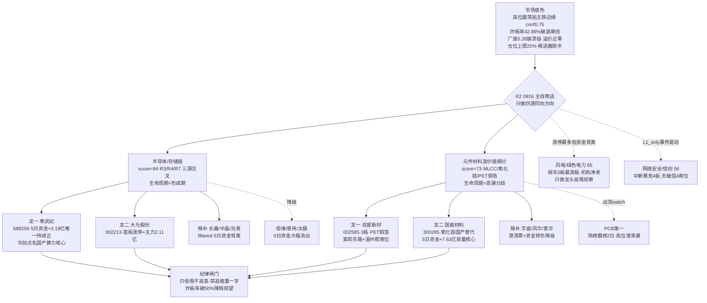

# 2026年9月16日 · **主线研判**

> **数据源新鲜度**: partial
> **降级状态**: true
> **置信度**: 0.50

## 一句话结论

0916 只认两条跨源满分主线：半导体/存储链（84分·四源同向但资金转正首日）与元件材料涨价链细分（73分·MLCC/氧化锆/PET铜箔，PCB霸榜出货禁追），高位震荡贴主跌边缘，候选数砍半，只做龙一龙二低吸，不碰中位杂毛。

## 详细分析

先说市场底色，今天的纪律比昨天更硬。R1 把 0915 定性为"退潮确认/主跌边缘"：涨停32家、跌停27家逼近涨停数、炸板率42.86%破40%退潮线（续破35%纪律线）、全市场涨跌比0.26崩溃级（较0914的1.41腰斩）、前日涨停溢价中位+0.11%近零、连板高度5板但梯队极薄、KOL 直言"投机冰点+情绪冰"、盘后"私募都在提高现金仓位"。情绪周期重算=高位震荡贴主跌边缘（conf 0.75），仓位上限25%。**这个背景下 R2 只做减法：不把 0915 涨停最多的板块当主线，只把资金、热榜、叙事、KOL 四源同向的方向当主线。**

为什么半导体/存储链是唯一84分硬主线？因为它拿到了 R3 #1 L1+L2 的四源同向：热榜六细分同向（存储芯片#4上升、光刻胶#6新进、国家大基金#14新进、先进封装#18、CPO#5、液冷#15），R7 六大细分同向净流入（半导体+40.75亿全场第一、存储芯片+28.81亿第三、中芯概念+22.76亿第四），R4 E004 苹果接受三星2027Q1存储报价+30-40%、高容量NOR再涨90-110%、长鑫/佰维/普冉中报扭亏硬alpha，KOL 机构群华创"Token至2030年12x年化底部已至"、国金"算力的强结构主线"、开源"光、超节点、液冷三重奏"集中推国产算力。但必须诚实：这条链 5日累计资金仍大幅净流出（半导体-273.95亿），0915 只是资金转正第一天，涨停高度只有1板（大为/中晶）——所以生命周期判"形成期"而非主升，龙一只给了资金5日全正的寒武纪，龙二给了首板+主力+2.11亿的大为股份，长鑫/兆易/佰维这些 R4 首推的存储龙头因5日资金大幅流出全部降级或只做候补。**这是"叙事最强、资金刚回头"的方向，0916 的核心验证点就是资金能否续流入。**

元件材料涨价链是第二条73分主线，但性质完全不同——**高潮分歧期的细分接力**。R7 PCB+39.18亿第二（5日累计+164.12亿，全场唯一持续主线）、MLCC 5日+53.94亿强净入；但 R3 明确 PCB 热榜#1霸榜2日=high出货警报（红线4霸榜第一永作反向），R4 E008 高位澄清潮集中爆发（崇达/超声/金安否认英伟达认证、澳弘3连板净利降17.89%、满坤86倍PE、华瓷澄清MLCC粉体小量验证未批量供货），加上 0914 龙一风华高科 0915 主力-3.79亿高位兑现——**这条链只做细分（MLCC/氧化锆/PET铜箔）龙一龙二低吸，PCB 本身是出货 watch**。细分内龙一给到3板的双星新材（PET铜箔，5日+9.66亿，紫阳东路+温州帮席位），龙二给到氧化锆国产替代的国瓷材料（5日+7.63亿，568亿容量核心），华瓷（澄清+41亿小盘）和风华（资金转负）全部降级。

两条被降级的线必须讲清楚。风电/绿色电力是 0915 涨停维全场最强（绿色电力9家+风电8家+风电设备4家，闽东电力5板=全市场最高板，大金/天顺/中闽/吉鑫/锡华/新中港涨停），个股资金也强（大金+6.21亿、中天+5.13亿），但 R7 新能源链整体大幅流出（储能-71.85亿、新能源车-67.4亿、锂矿-51.02亿、新能源-46.86亿），闽东5板换手29%主力-0.86亿背离，大金/天顺龙虎榜机构专用净卖——**涨停最多≠资金认可，这是"惯性涨停+机构兑现"的背离线，降级次线只做龙头低吸观察**。网络安全/信创有全市场次高板中新赛克4板和游资4席位买天融信（章盟主/T王/红岭路/作手新一），但 L1_only 无KOL无R4 high，事件驱动观察。商业航天（R4 E005 引力一号发射成功 high）和油气（E002 油价破105）无涨停无资金，全部移交事件观察。

## 推理深度三问

### 主线一 · 半导体/存储链

- **大资金意图**: 主力在"存储涨价周期+国产算力自主"上重新下注——苹果接受三星2027Q1报价+30-40%是需求端硬确认，NOR再涨90-110%给出弹性，中报扭亏（长鑫1714~2530%、佰维2776~3421%）给出业绩兑现；机构群华创/国金/开源集中推国产算力是配置逻辑（Token 12x年化→算力强结构主线），对手盘是过去一个月高位 AI 硬件链的存量筹码（CPO/光模块 0915 流出-77.92亿/-75.06亿 正好是活水来源）。
- **为什么走强**: 位置——半导体概念5日累计-273.95亿、个股龙头（兆易-39亿/长鑫-41亿）深调后，0915 单日资金转正+40.75亿为回补起点；催化——存储涨价（苹果+30-40%/NOR+90-110%）+ 华为3D数据中心/10万卡超节点是硬事件，且是产业价格数据不是预期；筹码——寒武纪5日全正+3.19亿是唯一机构持续承接的算力大票，芯片类ETF 0915 全场唯一红族。
- **逻辑够不够硬**: 硬但"资金持续性未验证"——R3热榜+R7资金+R4叙事+KOL四源同向（cross_validation=1.0），涨价有产业价格锚（苹果报价/NOR涨幅），中报扭亏有硬alpha。证伪路径：①0916 资金不再续流入→单日脉冲结束（半导体5日仍-274亿是最大软肋）；②外盘AI硬件链续跌（英伟达5日-8.42%/美光-9.11%）映射杀；③美联储今夜加息落地，科创50高估值受压制。今日验证点：半导体/存储概念主力是否连续第二日净流入+是否出2板。

### 主线二 · 元件材料涨价链

- **大资金意图**: 游资+主力在"涨价传导"上继续下注——电子布G75涨至22800-24000元/吨、村田10月"大概率"普调涨价、三环"确定"涨、东曹断供氧化锆→国产替代；紫阳东路（+3日2次扫双星/通鼎/崇达）+温州帮（双星+8387万）是题材资金主攻，对手盘是 PCB 高位澄清票（崇达/超声/金安/澳弘/满坤）的获利盘。
- **为什么走强**: 位置——MLCC/氧化锆/PET铜箔是 PCB 霸榜出货后资金的高低切承接细分，双星3板为细分最高板、国瓷5日+7.63亿是容量资金；催化——东曹断供+村田涨价是硬产业数据，氧化锆"对日替代"被 KOL 点名为核心方向；筹码——风华5日+21.12亿但0915单日-3.79亿，说明高位容量票在兑现，资金向低位的双星/国瓷迁移。
- **逻辑够不够硬**: 细分硬、PCB 软——MLCC/氧化锆涨价有产业锚（村田/三环/东曹断供），双星/国瓷有资金+席位背书；但 PCB 本身霸榜2日=high出货警报（红线4），R4 高位澄清潮说明主升段在退潮。证伪路径：①材料链资金 0916 续流出（风华-3.79亿若扩散到双星/国瓷）→ 高潮后直接退潮；②华瓷澄清（未批量供货）带崩氧化锆情绪票；③加息压制高估值（华正251元/满坤86倍PE）。今日验证点：双星3板能否红盘承接+国瓷资金是否续正。

## 首推票思维链

### 寒武纪（688256 · 主线一龙一）

- **买入理由**: ①产业逻辑——国产算力总龙头，华为10万卡超节点2027基础配置+3D数据中心直接受益，华创点名"核心资产国产芯片"，Token 12x年化产业周期未结束；②数据锚——5日主力+3.19亿且五日全正（算力大票唯一持续流入），0915 +3.44% 主力+1.02亿，R3 suggested_stocks 首位，circ 6765亿容量核心。
- **风险点**: ①短期——1075元高价大票，外盘英伟达5日-8.42%映射断裂，若 0916 高开冲高即先手兑现；②中期反证——美联储今夜加息92.4%概率，科创50高估值承压；半导体概念5日累计仍-273.95亿，若资金不再续流入则回补一日游。
- **止损条件**: 跌破1050（前低支撑，约-2.4%）减半，跌破1020（约-5%）离场；若板块炸板率破50%立即降档。
- **可验证假设**: 24-72h 内——0916 若能收于1090上方且主力续净流入 → 算力资金回流确认；若冲高回落跌破1075（0915收盘）→ 单日脉冲结束，降级 watch。

### 大为股份（002213 · 主线一龙二）

- **买入理由**: ①产业逻辑——半导体首板，存储涨价+半导体洁净室Fab扩产催化直接受益；②数据锚——0915 涨停+10.00% 主力+2.11亿（半导体涨停票资金第一），5日+1.56亿持续正，circ 61亿低位启动，是"首板试探"纪律内标准承接位。
- **风险点**: ①短期——炸板率42.86%高位震荡末期，首板隔日溢价不确定，若半导体链资金断档则闷杀；②中期反证——61亿小盘弹性大但非纯正存储龙头，若 0916 半导体大票吸血则小票被抽。
- **止损条件**: 跌破29.49（首板涨停价）离场（约-3%以内空间，破位即走）；若高开>3%不追。
- **可验证假设**: 24h 内——0916 若能弱转强（竞价低开→盘中转强）且封板 → 半导体链启动确认；若高开秒板缩量一字或炸板回落 → 不参与，等下一低位。

### 双星新材（002585 · 主线二龙一）

- **买入理由**: ①产业逻辑——PET铜箔/复合铜箔细分龙头，MLCC/氧化锆/PET铜箔是 PCB 霸榜出货后的高低切承接细分；②数据锚——0915 3板涨停（细分最高板），主力+2.86亿，5日+9.66亿，紫阳东路（3日2次）+温州帮（+8387万）席位背书，热榜 PET铜箔#3新进，R3 suggested 第二位。
- **风险点**: ①短期——3板+换手22.25%=高位分歧区，高位震荡末期3板票隔日溢价最不确定，竞价被顶一字=接盘；②中期反证——PCB 霸榜出货警报若带崩材料链情绪，最高板首当其冲；紫阳东路/温州帮是游资快进快出席位，撤单即杀。
- **止损条件**: 跌破11.00（3板前平台，约-8.8%超-5%硬区间→实际按D1买入价-5%~-10%重设）离场；高开>3%不追；若竞价缩量一字放弃。
- **可验证假设**: 24h 内——0916 若能红盘承接（不炸板不深跌）且材料链资金续正 → 细分接力确认；若炸板回落跌破12.06（0915收盘）→ 高潮结束，降级。

### 国瓷材料（300285 · 主线二龙二）

- **买入理由**: ①产业逻辑——氧化锆/MLCC粉体国产替代核心，东曹断供Apple Watch电子级氧化锆→国产替代，村田10月"大概率"普调涨价/三环"确定"涨，华创点名"对日替代很核心"；②数据锚——0915 +1.22% 主力+0.33亿，5日+7.63亿（0914 +7.57亿主升），circ 568亿容量核心，华瓷澄清后市场会转向真正有粉体产能的国瓷。
- **风险点**: ①短期——未涨停趋势票，若材料链情绪票（华瓷/双星）炸板则容量票跟跌；②中期反证——若东曹断供国产替代被证伪（验证体系未通过）或村田涨价落空，逻辑退坡；氧化锆是 KOL 单一叙事，无独立第二源。
- **止损条件**: 跌破63.0（约-5.4%基于66.6收盘）离场；跌破5日线且缩量则减半；高开>3%不追。
- **可验证假设**: 24-72h 内——0916 若主力续净流入且站稳66上方 → 氧化锆细分资金确认；若放量跌破64 → 容量票补跌，watch。

## 关键证据

- 证据1: R7 概念净流入 半导体+40.75亿#1 / PCB+39.18亿#2 / 存储芯片+28.81亿#3 / 中芯概念+22.76亿#4 / 新材料+17.8亿#5 / 网络安全+14.1亿#6; 流出 光通信模块-77.92亿 / CPO-75.06亿 / 华为概念-74.7亿 / 储能-71.85亿 / 新能源车-67.4亿 · 来源 R7_capital_flow
- 证据2: 0915 limit_cpt 涨停家数 锂电池10 / 华为10 / 绿色电力9 / 风电8 / 储能8 / 新能源车8 / 芯片概念7 / PCB6; limit_list_d 涨停32家 闽东电力5板=最高板 / 中新赛克4板 / 双星新材3板 / 澳弘电子3板 · 来源 tushare 直连
- 证据3: 个股主力实测(0915) 华正新材+7.36亿 / 大金重工+6.21亿 / 中天科技+5.13亿 / 双星新材+2.86亿 / 大为股份+2.11亿 / 中闽能源+2.00亿 / 新中港+1.97亿; 流出 风华高科-3.79亿 / 太极实业-1.55亿 / 佰维-1.08亿 / 闽东电力-0.86亿 · 来源 tushare.moneyflow
- 证据4: 5日主力累计 华正+25.68亿 / 风华+21.12亿 / 中天+14.39亿 / 大金+12.25亿 / 双星+9.66亿 / 国瓷+7.63亿; 流出 兆易-39.31亿 / 长鑫-40.81亿 / 寒武纪+3.19亿(唯一5日全正算力票) · 来源 tushare.moneyflow 5日
- 证据5: R3 resonance_top_themes 3条 L1+L2: ①半导体/存储链 ②PCB/MLCC/氧化锆 ③风电; distribution_alert PCB#1霸榜2日high; L1_only: 商业航天#13 / 网络安全#7 · 来源 R3_sentiment
- 证据6: R4 E004 苹果接受三星2027Q1报价+30-40% / NOR再涨90-110% / 长鑫扭亏1714~2530% high; E008 PCB高位澄清潮(崇达/超声/金安否认+澳弘净利降17.89%+满坤86倍PE+华瓷澄清) high; E005 引力一号遥三发射成功+千帆248颗 high · 来源 R4_news
- 证据7: R7 hot_money 游资席位 紫阳东路(双星/通鼎/崇达/中京) / 温州帮(双星+8387万) / 章盟主+T王+红岭路+作手新一(天融信) / 量化基金(意华+9629万); lhb 大金重工机构专用净卖-4491万 / 天顺风能-9221万 · 来源 R7 hot_money/lhb_bull_trap

## 数据源审计

| 源 | 状态 | 抓取时间 | 记录数 | 备注 |
|---|---|---|---|---|
| R1_style | 🟢 | 07:22 | 1 | 高位震荡贴主跌边缘 conf0.75 · 仓位上限25% · 炸板率42.86% |
| R3_sentiment | 🟡 | 08:04 | 3主题 | KOL 2/5群77条 · WeFlow down · xtick MCP down(HTTP直连ok) |
| R4_news | 🟢 | 07:24 | 8事件 | news_cls 2561条 + news_major 800条 + earnings_predict 500条 |
| R7_capital_flow | 🟡 | 07:40 | 全量 | vibe-trading down · 两融0914 · 美股主体0914美盘 |
| tushare SDK 直连(板块/个股) | 🟢 | 08:20 | 实测 | limit_cpt 20 / limit_list 32涨停 / moneyflow 5548 / daily_basic 5548 |
| hotlist_signals | 🟡 | 08:00 | 20 | 场景C · L1取0915收盘 · PCB#1霸榜high警报 |
| factor_snapshot | 🔴 | - | 0 | 目录缺失 factor_layer_degraded=true |

## 不确定性 / 反证

最大的自我批判：今天我把全部筹码押在"资金方向"而非"涨停方向"——0915 涨停最多的新能源链（绿色电力9+风电8）被我降级为次线，因为 R7 新能源链整体流出-200亿级；而资金流入的半导体/PCB 链涨停其实很少（芯片7家/PCB6家，高度仅1-3板）。如果 R7 的单日资金数据是"被动买入/尾盘回补"而非主动进攻，那么我的主线一（半导体）就是"用资金脉冲替代了涨停确认"，0916 若资金不再流入就会被打脸。第二个反向证据：半导体链 5日累计仍-274亿，我把"资金转正首日"判为形成期——但 R1 的广度0.26崩溃级和溢价近零说明市场没有增量资金，回流可能是存量博弈的短脉冲。第三个是主线二的硬伤：PCB 霸榜2日出货警报下，我给的双星新材是3板高位票、国瓷材料是未涨停趋势票，都不是标准的"低位启动"，高潮分歧期做它们全靠低吸纪律托底——R6 反证请重点查：半导体单日资金是否为脉冲、风电"涨停多资金撤"是否意味着最后一棒、双星3板在高位震荡末期是否该直接空仓规避。第四个是数据面：KOL 核心群缺失，WeFlow 永久下线，我全部依赖量化源+2群KOL，sentiment 维度是最薄弱的一环。

## 与其他 R/D/E 的关系

- 依赖: R1_style(风格/情绪周期/仓位上限25%) · R3_sentiment(L1+L2共振主题/PCB distribution_alert) · R4_news(E004存储涨价/E008 PCB澄清潮/E001华为超节点) · R7_capital_flow(资金验证/游资席位/5日资金) · mainline_lifecycle.py(生命周期) · filter_leader_v1(龙头硬过滤·已归档本session内联执行)
- 被消费: D1(canghai-plan execution_pool 选股, 两条主线 cross_validation_score=1.0 优先; 只从 leader_rank 1/2 且 execution_eligible 取: 寒武纪/大为股份/双星新材/国瓷材料) · R6(devil_advocate 反证, 重点查半导体单日资金脉冲/风电最后一棒/双星3板高位) · R5(stock_profile 逐票六维画像) · E1(复盘) · P1(竞价校准)

## Sub-Agent 元数据

- skill: analyze_main_sectors_v1
- artifact: data/research/20260916/R2_main_sectors.json
- 生成耗时: 约 25 分钟（08:00 启动 · 08:25 落盘）
- model: deepseek-v4-flash-ga-260731
- factor_layer: degraded=true（data/factor_snapshot 缺失，跳过因子层，notes 已标注）
