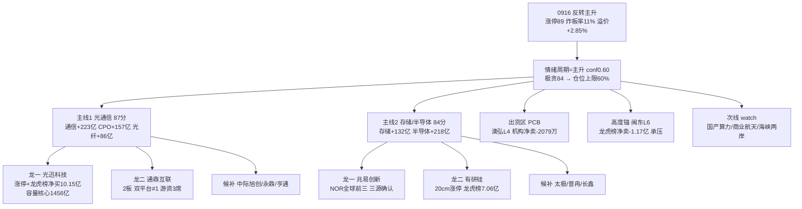

# 2026年9月17日 · **主线研判**

> **数据源新鲜度**: partial
> **降级状态**: true
> **置信度**: 0.55

## 一句话结论
科技硬件双核(光通信 87 + 存储/半导体 84)确认主升早期,只做龙一龙二;PCB 出货区、闽东 L6 高度锚承压,总仓≤60% 防反转回吐。

## 详细分析

**0916 是 V 型反转主升的确认日。** 涨停 89 家(较 0915 翻 2.8 倍)、炸板率 11%(较 42.86% 暴降)、昨日涨停溢价 +2.85%、全市场涨跌比 3.51、科创50 +4.14%,情绪周期=主升(conf0.60 贴确认线),但情绪浓度 84 已入极贪区,仓位上限 60%、不满仓。R2 在 R1 近似代理的 20 个强板块上做三源硬共振(≥2 源强正面 + R7 资金非大额流出),只有**科技硬件链双核**过 70 硬门槛——资金面 0916 全线净流入(通信技术 +223 亿、半导体 +218 亿、国产芯片 +195 亿、存储 +132 亿、CPO +157 亿、光纤 +86 亿),与 R4 三条 high 催化(E002 苹果 NVLink / E003 华为 Token / E005 存储供需)及 R3 热榜 top5 完全同向。**新能源链被 R7 资金否决**(固态电池 -31.5 亿、锂矿 -24.2 亿、锂电池 -17.8 亿全线流出),不进主线。

**主线一 · 光通信(光模块/CPO/光纤)87 分,生命周期=主升早期。** 通信设备 6 家涨停居行业第 1,龙一光迅科技(0916 涨停 + 龙虎榜净买 10.15 亿全市场第 1 + 流通市值 1456 亿容量核心),龙二通鼎互联(2 板高度 + 双平台人气第 1 + 章盟主/紫阳东路/T 王 3 席游资协同)。PCB(澳弘电子 L4)因 R3 霸榜二日出货警报 + 机构净卖 -2079 万划入出货区,**内部切光纤/存储/先进封装,不追 PCB 第一**。

**主线二 · 存储/半导体链 84 分,生命周期=主升早期。** 存储是科技链唯一 5 日资金持续净入(0910/0915/0916 三正日,0916 +132 亿),R4 E005 美光 512GB + 2028 前无新增供应 + 英飞凌 NOR 退出是全场最硬产业逻辑,业绩硬 alpha 密集(佰维 +3200%、长鑫 +2244%、普冉 +2976%)。龙一兆易创新(NOR 全球前三,三源确认),龙二有研硅(20cm 涨停 + 龙虎榜净买 7.06 亿 + 半导体材料资金行业 #6)。

**高度锚与风险源。** 闽东电力 L6 是全市场最高板(09:36 早封有带动性),但龙虎榜净卖 -1.17 亿 + 换手 21.76%,高位出货迹象,若 6 板断板情绪高度直接塌——只作情绪观察,不做主线。第三主线候选(国产算力/商业航天/海峡两岸/港口)均单源支撑,cross_validation_score≈0.33,按 D1 消费规则降 watch_pool。

### 推理深度三问

**主线一 · 光通信:大资金意图 / 为什么走强 / 逻辑够不够硬**
- **大资金意图**: 主力单日净流入 223 亿(通信技术)+ 157 亿(CPO),是全市场资金流向的最强单极;龙虎榜前二(光迅 10.15 亿、通鼎 9.14 亿)全被光通信包揽,游资(章盟主/紫阳东路/T 王)3 席连续 2 日锁票——资金不是试探,是建仓级。
- **为什么走强**: 苹果 NVLink + 自研 M8 服务器(美股 Lumentum +9.53% 实涨映射)+ 华为 Token 10 万倍 + 光纤热榜 rank 11→5 升位,消息、热榜、资金、人气四线同日共振,0915 崩盘后超跌反包。
- **逻辑够不够硬**: 产业逻辑够硬(光互连需求 + 供给紧张),但 0917 面临反转次日回吐考验,极贪 84 下高开兑现概率不小;且 R3 共振仅为 L1-only 量化同向,缺 KOL 文本确认——结论:硬,但要按"早盘确认溢价续强"执行,防高开低走。

**主线二 · 存储/半导体:大资金意图 / 为什么走强 / 逻辑够不够硬**
- **大资金意图**: 存储 5 日三正日(0910 +20 亿/0915 +29 亿/0916 +132 亿),是全市场唯一"脉冲后仍持续"的板块——资金在存储上是连续加仓不是一日游。
- **为什么走强**: 美光高管"2028 年前新增供应才爬坡" + 英飞凌 NOR 业务出售 = 供需缺口有明确时间锚;佰维/长鑫/普冉中报预增 +2000% 以上,业绩与叙事双确认。
- **逻辑够不够硬**: 产业逻辑最硬的一条,但**高位风险**最大——兆易 373 元、普冉 398 元、佰维 213 元,chart_vision 日线偏空,只能低吸不能追高;SK 海力士否认与英特尔洽谈已局部降温。结论:硬,但只做龙一低吸,不碰高位追高。

## 关键证据

- 证据 1: 通信设备 6 家涨停居行业第 1(光迅/通鼎/永鼎/星网/中瓷/华脉),半导体 5 家居第 2(中晶 L2/有研硅 20cm/有研新材/立昂微/晶升) · 来源 limit_up_0916
- 证据 2: 光迅科技 龙虎榜净买 10.15 亿全市场第 1,通鼎互联 9.14 亿第 2,有研硅 7.06 亿第 3 · 来源 R7 top_list
- 证据 3: R7 主力净流入前 30 全是科技硬件(通信+223/半导体+218/国产芯片+195/5G+194/CPO+157/光通信模块+142/存储+132/光纤+86) · 来源 R7 moneyflow_ind_dc
- 证据 4: R4 三条 high 催化(E002 苹果 NVLink / E003 华为 Token / E005 美光存储)精确命中双主线 · 来源 R4 top_events
- 证据 5: 存储 5 日资金三正日 = 全市场唯一持续净入链,先进封装/光刻机/第三代半导体新进热榜 · 来源 R7 sector_5d_tracking + R3 hotlist
- 证据 6: 闽东电力 L6(全市场最高板)龙虎榜净卖 -1.17 亿,澳弘电子 L4(PCB)机构净卖 -2079 万 = 高度锚与出货区双向预警 · 来源 R7 lhb_bull_trap
- 证据 7: R1 主升 conf0.60 贴确认线,情绪 84 极贪,仓位上限 60% · 来源 R1_style
- 证据 8: R4 价格锚过期预警——中际旭创参考价 125.5 与 0916 实际收盘 907.8 严重不符,需盘前核验 · 来源 R4 + daily_all_0916

## 数据源审计

| 源 | 状态 | 抓取时间 | 记录数 | 备注 |
|---|---|---|---|---|
| R1_style | 🟢 ok | 07:38:44 | 1 | 连板情绪型·情绪84·仓位上限60% |
| R3_sentiment | 🟡 degraded | 08:03:57 | 1 | 场景E L1-only·KOL 5/5群全灭·共振维降级 |
| R4_news | 🟢 ok | 07:36:51 | 8 | 8事件·hithink/iwencai MCP down |
| R7_capital_flow | 🟡 degraded | 07:46:30 | 1 | vibe down·两融0915·美股主体0915·conf 0.5 |
| limit_up_0916 | 🟢 ok | 06:52 | 89 | tushare口径·含float_mv/first_time/limit_times |
| limit_broken_0916 | 🟢 ok | 06:52 | 11 | 炸板率11% |
| daily_all_0916 | 🟢 ok | 06:52 | 5550 | 全市场收盘·个股pct/amount |
| factor_snapshot | 🔴 error | - | 0 | 因子层缺失 factor_layer_degraded=true |

## 不确定性 / 反证

1. **R3 共振是 L1-only**:KOL 5/5 群全灭 + WeFlow 永久下线,双主线"共振"实为热榜+人气+资金+消息四路量化同向,缺市场参与者文本层。若 0917 竞价科技硬件集体低开,说明量化同向是反转日惯性而非共识。
2. **反转次日回吐是最大反证**:0916 涨停 89 家含大量超跌反抽成分,0917 自然回落概率高;R1 明确"早盘确认(溢价续强+炸板率<20%)才上修至 70%,否则降档震荡、候选数砍半"。本文件所有"进"都基于主升延续假设,炸板率回升 >20% 即失效。
3. **R4 价格锚大面积过期**(中际旭创 125.5 vs 实际 907.8):D1/R5 必须盘前核验,本 R2 未用 R4 的目标价/止损价,仅取板块与催化方向。
4. **高度锚承压**:闽东电力 L6 龙虎榜净卖,若断板,主升高度直接降档;光通信/存储连板高度都只有 2 板,梯队仍薄(6 板孤军、3 板断层),情绪高度靠单票硬撑。
5. **国产算力/商业航天等次线 cv≈0.33 属单源驱动**:不因"名字好听"进 execution,留给 D1 按 cross_validation 规则处理。

## 与其他 R/D/E 的关系

- 依赖: R1(风格/情绪/仓位上限)、R3(L1-only 观测+热榜+出货警报)、R4(催化事件+板块映射)、R7(资金流+龙虎榜+游资)、emotion_cycle(主升 conf0.60)
- 被消费: D1(execution_pool 候选·取 leader_rank 1/2 + execution_eligible)、R5(龙一/龙二画像)、R6(对 execution_eligible 龙头反证)、E1(复盘对照)

## Sub-Agent 元数据

- skill: analyze_main_sectors_v1
- artifact: data/research/20260917/R2_main_sectors.json
- 生成耗时: ~40 秒
- model: deepseek-v4-flash-ga-260731
