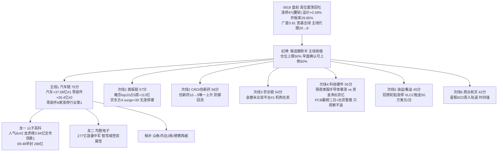

# 2026年9月18日 · **主线研判**

> **数据源新鲜度**: partial
> **降级状态**: true
> **置信度**: 0.48

## 一句话结论
回吐日主线收缩至 1 条:汽车链 75 分(涨停+资金双核)唯一过线,只做龙一山子高科/龙二均胜电子;面板/CRO/农业/科技硬件全降次线,存储半导体资金背离只观察不追。

## 详细分析

**0918 盘前是反转次日回吐确认日,主线宽度从 20 个强板块塌缩到 6 个。** 涨停 47 家(较 0916 的 89 腰斩)、昨日涨停溢价从 +2.85% 熄火至 +0.39%、全市场涨跌比 3.51 → 0.91 转负、8 大宽基全绿、炸板率 29.85% 破 25% 分歧线。情绪周期=高位震荡(conf0.75),R1 定仓上限 50%、早盘确认(溢价转正+炸板率<25%)才可上修 60%。这种环境下 R2 按纪律**候选数砍半、主线收缩**:在 R1 代理的 6 个强板块 + R3 五个观测主题 + R4 八条催化 + R7 资金榜上做三源硬共振,只有一条主线过 70 硬门槛。

**主线一 · 汽车链 75 分(汽车/汽车零部件/无人驾驶/Robotaxi),生命周期=主升中期(conf0.55)。** 这是 0917 全市场唯一「涨停+资金」双核共振的方向:涨停维——新能源汽车 13 家#1(8天5板)、汽车零部件 7 家#7、汽车电子 7 家#9、无人驾驶 6 家#12,零部件 8 家涨停居行业第 1;资金维——行业净入前三占 3 席(汽车 +37.08 亿#1 / 汽车零部件 +30.4 亿#2 / 底盘与发动机系统 +18.1 亿#5),山子高科龙虎榜净买 3.94 亿全市场第 1。催化是 R4 E007 特斯拉 Cybercab 中国巡展(medium),消息面弱于资金/涨停,但资金+人气双证成立(R3 观测 rank3)。龙一山子高科(人气 dc#2 + 龙虎榜全市场第 1 + 09:48 早封),龙二均胜电子(277 亿容量中军 + 智驾域控双属性)。高位震荡期按 lifecycle 提示「控仓做龙一龙二、注意炸板率」。

**次线:四条资金去向但都差一口气。** 面板显示链 57 分是 R7 概念净入 top10 占 5 席的最强承接方向(MiniLED/显示技术/MicroLED/OLED/电子纸合计 +113 亿,京东方A 人气 surge +30 位双平台#4),但无涨停潮(仅三峡新材玻璃基板 1 家)+ R4 无催化,承接初期不是主线——若 0918 面板涨停潮扩散可盘中升级。CRO/创新药 56 分是唯一 rank_momentum_up(创新药 10→5)+ 医药 ETF 0917 唯一收红,防御回流但无催化。农业链 54 分热榜三席新进+金健米业双平台#1,但 R3 明示「游资在买机构在卖(机构净卖 -2978 万),单源观察不追高」。科技硬件链 55 分最拧巴:隔夜美股半导体暴涨(费半 +2.9% 三连涨/英特尔 +7.67%/美光 +5.50%)+ 昇腾 960 催化,但 R7 存储 -103.65 亿/国产芯片 -81.91 亿/半导体概念 -73.65 亿全口径大额净出 + PCB 霸榜二日 high 出货警报——**资金背离=退潮前兆,隔夜高开在回吐日是最危险形态,只观察不追**。

### 推理深度三问

**主线一 · 汽车链:大资金意图 / 为什么走强 / 逻辑够不够硬**
- **大资金意图**: 0917 行业主力净入前三占 3 席(汽车/汽车零部件/底盘发动机),是全市场唯一行业级三连号;山子高科龙虎榜净买 3.94 亿全市场第 1 + 游资 3 席(紫阳东路/量化打板/T王)合力——资金在高低切后选择了汽车链作为承接方向,不是试探是进攻。
- **为什么走强**: 涨停家数全市场第一梯队(零部件 8 家)+ 行业资金三连号 + 人气 surge(山子高科 dc#2)三线同向;催化为 Robotaxi 商业化预期(Cybercab 中国巡展),属「资金先于消息」的承接形态,与 0917 热榜科技硬件退潮形成高低切对照。
- **逻辑够不够硬**: 资金/涨停/人气三源同向够硬,但**消息面仅 medium**(无 hard 事件锚)+ 资金持续性未验证(0917 单日 #1,persist=1)+ 高位震荡回吐日环境——结论:硬,但按「早盘竞价确认(板块溢价转正)+ 只做龙一龙二 + 控仓」执行,炸板率破 35% 即降档。

## 关键证据

- 证据 1: 汽车链涨停家数全市场第一梯队——新能源汽车 13 家#1(8天5板)/汽车零部件 7 家#7/汽车电子 7 家#9/无人驾驶 6 家#12 · 来源 limit_cpt_list_0917
- 证据 2: 汽车零部件 8 家涨停居行业第 1(众泰/山子/天海/金杯/均胜/北特/克来/冠盛) · 来源 limit_list_d_0917
- 证据 3: R7 行业主力净入前三占 3 席——汽车 +37.08 亿#1/汽车零部件 +30.4 亿#2/底盘与发动机系统 +18.1 亿#5 · 来源 R7 moneyflow_ind_dc
- 证据 4: 山子高科龙虎榜净买 3.94 亿全市场第 1 + 游资 3 席合力(紫阳东路+1.78 亿/量化打板/T王) · 来源 R7 lhb_top10_5d + hot_money
- 证据 5: 科技硬件链资金背离——存储 -103.65 亿/国产芯片 -81.91 亿/半导体概念 -73.65 亿/电子行业 -126.68 亿 vs 隔夜美股费半 +2.9% 三连涨 · 来源 R7 top_outflow + R4 E002
- 证据 6: PCB 概念连续两日热榜 #1 = high 出货警报(R3 红线:霸榜第一永远是反向) · 来源 R3 distribution_alert
- 证据 7: 面板显示链 R7 概念净入 top10 占 5 席(MiniLED#4/显示技术#6/MicroLED#7/OLED#8/电子纸#9) + 京东方A 人气 surge 34→4 双平台#4 · 来源 R7 sector_flows + R3 attention
- 证据 8: R1 高位震荡 conf0.75 + 仓位上限 50% + 炸板率 29.85% 破 25% 分歧线(未破 35% 纪律线) · 来源 R1_style

## 数据源审计

| 源 | 日期 | 状态 | 备注 |
|---|---|---|---|
| R1_style | 2026-09-18 | 🟢 | 主线扩散型偏震荡回吐·情绪60·仓位上限50% |
| R3_sentiment | 2026-09-18 | 🟡 | 场景E L1-only·KOL 5/5群全灭·共振维降级 |
| R4_news | 2026-09-18 | 🟢 | 8事件·E001昇腾/E002存储/E005商业航天/E007 Robotaxi |
| R7_capital_flow | 2026-09-18 | 🟡 | 0917收盘全量·vibe down·conf 0.5 |
| limit_cpt_list_0917 | 2026-09-17 | 🟢 | tushare 直连·20板块·涨停维锚点 |
| limit_list_d_0917 | 2026-09-17 | 🟢 | tushare 直连·49只涨停·含 float_mv/first_time/limit_times |
| limit_step_0917 | 2026-09-17 | 🟢 | 9只连板·5板1只/3板3只/2板5只 |
| factor_snapshot | - | 🔴 | 因子层缺失 factor_layer_degraded=true |
| 群聊(KOL) | - | 🔴 | 5/5 群全失败·0条(匿名) |

## 不确定性 / 反证

1. **R3 共振是 L1-only**:KOL 5/5 群全灭 + WeFlow 永久下线,汽车链「共振」实为资金+人气+涨停+消息四路量化同向,缺市场参与者文本层。若 0918 竞价汽车链集体低开,说明承接方向只是单日资金脉冲而非共识。
2. **回吐日二次探底是最大反证**:0917 涨停 47 腰斩+溢价熄火+广度转负,若 0918 高开后高开低走,回吐延续,主线代理可能从 6 个继续收缩——本文件所有「进」都基于回吐企稳假设,炸板率破 35% 或跌停放大即失效,降档防御 0.30-0.35。
3. **资金持续性未验证**:汽车行业 0917 单日 #1,但 5 日连续性未确认(生命周期 persist=1,mid_up conf0.55);若 0918 资金转出,接力熄火,汽车链可能是一日游。
4. **隔夜美股半导体暴涨是双刃剑**:纳指 +1.69%/费半 +2.9% 若带动 A股科技硬件高开,回吐日高开是最危险形态——高位科技(存储/光模块)资金已净出百亿,高开即兑现窗口,且可能虹吸汽车链竞价溢价。
5. **山子高科高位风险**:5 日 +14.32%/0916 单日 -9.27%,属游资人气票,隔日缩量承接不足易炸;R3 已提示 D1 严格过流动性/市值闸门(实际流通 286 亿已过,高位风险仍在)。

## 与其他 R/D/E 的关系

- 依赖: R1(风格/情绪/仓位上限/情绪周期)、R3(L1-only 观测+热榜+出货警报)、R4(催化事件+板块映射)、R7(资金流+龙虎榜+游资)、tushare MCP(limit_cpt_list/limit_list_d/limit_step 直连)、emotion_cycle(高位震荡 conf0.75)
- 被消费: D1(execution_pool 候选·取 leader_rank 1/2 + execution_eligible + cross_validation_score≥0.67 优先)、R5(龙一/龙二画像)、R6(对 execution_eligible 龙头反证·可 hard_reject)、E1(复盘对照)

## Sub-Agent 元数据

- skill: analyze_main_sectors_v1
- artifact: data/research/20260918/R2_main_sectors.json
- 生成耗时: ~50 秒
- model: deepseek-v4-flash-ga-260731
