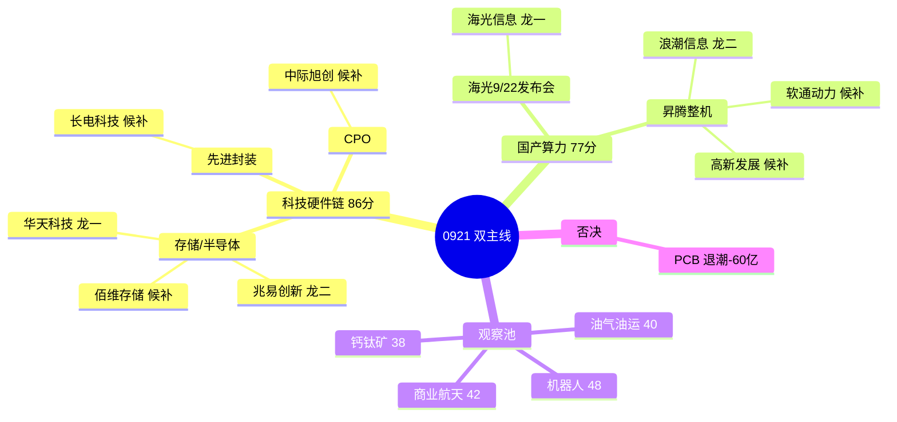

# 2026年9月21日 · **主线研判**

> **数据源新鲜度**: partial
> **降级状态**: true
> **置信度**: 0.48

## 一句话结论
修复反弹日双主线:科技硬件链 86 分(存储/先进封装/CPO,五源全同向,PCB 资金切细分)+ 国产算力 77 分(海光 9/22 发布会窗口);只做龙一/龙二,PCB 退潮不追,商业航天/机器人/油运全降观察。

## 详细分析

**0921 盘前是 0918 强修复普涨后的内部结构验证日。** 0918 收盘:涨停 78 家(较 0917 的 47 扩张 66%)、跌停 0、炸板率 24.27% 降至 25% 分歧线下方、昨日涨停溢价 +2.78% 逼近 +3% 强线、全市场涨跌比 3.68、8 大宽基全线大涨(科创 50 +2.89%)。情绪周期=高位震荡(conf0.49,与主升 0.48 临界并列),R1 定仓上限 60%,早盘确认(溢价 >+3% 且炸板率 <20%)才可上修 65-70%,炸板率破 25% 或高标补跌则降 40-50%。R1 的 main_lines_count=3 是**近似代理**(强板块 20 个),非 R2 真实判定;按高位震荡纪律「候选数砍半」,本 R2 只给 2 条过 70 硬门槛的主线。

**主线一 · 科技硬件链 86 分(存储/半导体/先进封装/CPO),生命周期=主升中期(conf0.55)。** 这是 R3 场景 E 五源全同向的最强量化共振:热榜(存储芯片 #2/CPO #3/先进封装 #10 新进/国家大基金 #11 新进)、人气(华天科技双榜 #2/长电 dc#4+ths#11/太极实业 surge 28→8)、资金(R7 国产芯片 +229.9 亿 #4/半导体概念 +207.3 亿 #6/电子行业 +198.5 亿 #1/先进封装 5 日 4 正加速流入)、事件(R4 E002 长鑫第五代工艺量产+LPDDR5X+NAND)、情绪(XTick 涨停 79/晋级率 1进2=20% 回升)。**关键内部切细分:PCB 热榜 #5 在榜但主力净出 -60.19 亿 = 退潮前兆(0915/0917 同构),资金正切先进封装/存储接棒,PCB 不推不追。** 龙一华天科技(封测核心,0918 涨停 10:02 早封封单 7.17 亿,龙虎榜多席合力),龙二兆易创新(存储 NOR 主板容量 2604 亿)。风险:板块内最高连板仅 2 板(科森),高度不足,靠广度不靠高度。

**主线二 · 国产算力/昇腾链 77 分,生命周期=主升中期(conf0.55),事件驱动型。** R4 E003 海光信息 9/22 深圳发布 1000 系列 CPU(低功耗/端侧/机器人芯片,high)+ E006 华为昇腾 960 提前 3 季度发布+灵衢昇腾 950 集群全球上线(high)构成明确时间锚;R7 数字芯片设计行业 +75.4 亿 #3/通信网络设备 +67.5 亿 #4 行业级资金正向;华为概念 16 家涨停 #2(4 天 4 板)。**注意 r7_capital_match=false:概念级资金未进 top10,属事件驱动非资金驱动** —— 发布超预期有加速空间,不及预期当日兑现,0921 是事件前最后窗口。龙一海光信息(CPU+DCU 龙头,中报预增 41.5~52.32%),龙二浪潮信息(昇腾整机商,主板容量 1054 亿)。

**次线四条全部观察不追。** 人形机器人/特斯拉链 48 分(R4 E008 特斯拉宁波审厂 Optimus+丰田 40 万台,medium,但热榜机器人概念掉出 top20,涨停 12 家 #5 有宽度无热度确认);商业航天 42 分(R4 E005 发射密集 high 连续性佳,但 R7 无资金确认,航空装备行业净出 -6.46 亿,R3 明确只作观察移交 R6);油气/油运 40 分(R4 E004 布油破 100 美元 high,但资金/热榜双无且油价 9/18 曾暴跌 9%,双刃);光伏/钙钛矿 38 分(E007 钙钛矿国标 medium,热榜掉出资金无确认)。

### 推理深度三问

**主线一 · 科技硬件链:大资金意图 / 为什么走强 / 逻辑够不够硬**

- **大资金意图**: 存储涨价周期(长鑫第五代量产+拟进军 NAND)+ 国产替代是国家级产业逻辑,主力在 PCB 退潮后把电子方向资金(单日 +198.5 亿行业第一)切向先进封装/存储/CPO 细分,接棒者就是华天/兆易/长电这类封测与存储容量票。对手盘是仍在 PCB 里恋战不肯走的存量资金。
- **为什么走强**: 位置=修复反弹首日后的接力位(芯片概念 6 天 3 板,资金 5 日 3 正);催化=硬事件(长鑫量产)+ 硬业绩(佰维/普冉/长鑫中报暴增 2000%+);筹码=华天 0918 涨停 10:02 早封、封单 7.17 亿、龙虎榜多席合力(游资+深股通+机构)——三维全正。
- **逻辑够不够硬**: 独立源 4 个同向(R3 热榜/人气、R7 资金、R4 事件、XTick 情绪),硬业绩+硬时间锚齐备。证伪路径:①0921 高标无承接、板块从普涨转分化;②PCB 资金继续大幅出逃拖累电子情绪;③E001 宏观负面(美债破 5%)压制高估值成长。**高度不足(板块内最高 2 板)是最大短板,靠广度不靠高度,若 0921 出现高度票则确认主升,否则只能做龙一龙二控仓。**

**主线二 · 国产算力/昇腾链:大资金意图 / 为什么走强 / 逻辑够不够硬**

- **大资金意图**: 昇腾 960 提前 3 季度发布=国产算力从数据中心向物理世界延伸的系统级竞争,海光 9/22 发布会是近期最明确的事件时间锚,资金在事件前埋伏(数字芯片设计 +75.4 亿),博弈发布超预期。
- **为什么走强**: 位置=事件发酵初期(华为概念 4 天 4 板);催化=双 high 事件(E003+E006)+ 热榜液冷服务器 #9 主力 +44.5 亿;筹码=海光 0918 +4.04% 未涨停,事件未落地前主力不急拉。
- **逻辑够不够硬**: 事件锚硬(9/22 发布日确定),但资金面弱于主线一(概念级未进 top10),属事件驱动非资金驱动。证伪路径:①发布不及预期 → 当日兑现;②E001 宏观负面把 AI 算力列入 bearish_scope;③0921 资金不跟随 → 高度受限。**事件双刃,只能低吸布局不能追高。**

### 每票思维链

**首推票 · 华天科技(002185.SZ·科技硬件链龙一)**

- **买入理由**: ① 产业逻辑:长鑫第五代工艺量产+存储国产化,先进封装是最直接受益环节,PCB 退潮资金明确切向封测(集成电路封测行业 +50.8 亿 #5);② 数据/事件锚:0918 涨停 10:02 早封、封单 7.17 亿、成交 63.9 亿,龙虎榜紫阳东路 +2.81 亿/湛江万豪世家 +1.79 亿/深股通/机构多席合力,人气双平台 #2。
- **风险点**: ① 短期:修复反弹日高度不足(板块内最高 2 板),若 0921 板块从普涨转分化,容量票最容易被先手资金兑现高开低走;② 中期反证:半导体 5 日资金波动大(0917 单日净出 -73.65 亿),高位反复并非单边加速,PCB 式退潮可能重演在封测上。
- **止损条件**: 以 0918 收盘 18.03 为锚,-7% 破位(16.77)离场;或板块涨停家数 0921 跌破 10 家/芯片概念掉出涨停榜前 5 → 逻辑弱化减仓。
- **可验证假设**: 0921 华天竞价溢价 >+3% 且 10:30 前不破均价线 → 卡位成立,先进封装接棒 PCB 确认;若竞价高开 >5% 后 30 分钟内翻绿 → 先手兑现,卡位失败,当日不参与。

**首推票 · 海光信息(688041.SH·国产算力链龙一)**

- **买入理由**: ① 产业逻辑:CPU+DCU 双龙头,9/22 发布 1000 系列 CPU(低功耗/端侧)+ 机器人芯片新品类,产品线从数据中心向物理世界扩张;② 数据/事件锚:中报预增 41.5~52.32%,R4 E003 首推,数字芯片设计行业资金 +75.4 亿 #3,688 解禁可参与。
- **风险点**: ① 短期:事件驱动双刃,发布不及预期当日兑现,0921 是事件前最后窗口,存在「买预期卖兑现」惯性;② 中期反证:E001 宏观负面(美债破 5%+全球紧缩)把 AI 算力/半导体列入 bearish_scope,海外利率上行压制成长估值。
- **止损条件**: 以 0918 收盘 241.38 为锚,-8% 破位(222.07)离场;或 0922 发布会若明确不及预期(无超预期参数/无订单落地) → 逻辑证伪当日出。
- **可验证假设**: 0921 海光缩量回踩不破 5 日线 → 事件前吸筹成立,0922 发布超预期可加速;若 0921 放量冲高回落(发布会前资金提前兑现) → 0922 大概率利好出尽,只观察不接。

## 关键证据
- 证据 1: 芯片概念 18 家涨停 #1(6 天 3 板)/华为概念 16 家 #2(4 天 4 板)/数据中心(AIDC)10 家 #6 · 来源 tushare limit_cpt_list 0918
- 证据 2: R7 国产芯片 +229.91 亿 #4/半导体概念 +207.28 亿 #6/电子行业 +198.54 亿 #1/先进封装 5 日 4 正加速流入(+168.89 亿) · 来源 R7_capital_flow.json
- 证据 3: PCB 主力净出 -60.19 亿/印制电路板行业 -41.17 亿 vs 热榜仍 #5 在榜 = 资金背离退潮前兆 · 来源 R7+R3
- 证据 4: R4 E002 长鑫科技第五代工艺量产(LPDDR5X+拟进军 NAND)+ E003 海光 9/22 发布 1000 系列 CPU + E006 昇腾 960 提前发布 · 来源 R4_news.json
- 证据 5: 华天科技 0918 涨停 +10.01%(10:02 早封/封单 7.17 亿/流通市值 600 亿/龙虎榜多席合力) · 来源 tushare limit_list_d+daily 0918
- 证据 6: 连板天梯最高仅 4 板(华瓷/锡华),科技硬件簇内最高 2 板(科森) — 高度不足靠广度 · 来源 tushare limit_step 0918

## 数据源审计
| 源 | 日期 | 状态 | 备注 |
|---|---|:--:|---|
| tushare limit_cpt_list | 2026-09-18 | 🟢 | 20 强板块 · 芯片 18 家 #1 |
| tushare limit_list_d | 2026-09-18 | 🟢 | 78 涨停 · 龙头封板数据落地 |
| tushare limit_step | 2026-09-18 | 🟢 | 9 只连板 · 最高 4 板 |
| tushare daily/daily_basic | 2026-09-18 | 🟢 | 13 龙头真实价格/流通市值 |
| R1_style | 2026-09-21 | 🟢 | complete · 情绪 70 · 仓位上限 60% |
| R3_sentiment | 2026-09-21 | 🟡 | 场景E L1-only · 共振主题空用 l1 obs 代偿 |
| R4_news | 2026-09-21 | 🟡 | 8 事件 · hithink down llm_pure |
| R7_capital_flow | 2026-09-18 | 🟢 | 北向/概念行业资金流 · tushare 直连 |
| hotlist_ths | 2026-09-18 | 🟡 | 场景C baseline T-1 vs T-2 diff |
| factor_snapshot | - | 🔴 | 目录缺失 factor_layer_degraded=true |
| wechat_cli_5groups | 2026-09-21 | 🔴 | 5/5 群 timeout · KOL 定性不可得 |
| MCP 网关 | 2026-09-21 | 🔴 | severity=3 · 底层 tushare 直连可用 |

## 不确定性 / 反证
- **共振维降级**: R3 场景 E(L2 群聊全灭+L3 WeFlow 下线)导致 resonance_top_themes 为空数组,cross_validation 的 r3 证据用 l1_only_top_observations 代偿;若严格按空数组计算,科技硬件链 cv=0.67、国产算力 cv=0 —— D1 须按本文件注释双读,不要把 0.92/0.64 的 consensus 当成舆论共振确认。
- **高度短板**: 科技硬件链板块内最高连板仅 2 板(科森),修复反弹日涨停 78 家是广度修复,不是高度主升;若 0921 无 3 板以上科技票出现,主线大概率走「龙一龙二趋势+后排分化」而非连板加速,追高胜率低。
- **资金反复风险**: 半导体概念 5 日资金 3 正 2 负(0917 单日 -73.65 亿),高位反复未达单边加速,PCB 退潮教训(热榜在榜 vs 资金出逃)可能在封测上重演,先进封装 4 日正流入是唯一加速证据,待 R6 反证验证。
- **宏观对冲**: E001 美联储 10 月加息概率 56.5%+美债破 5%+日央行 1.25% 将高估值成长/AI 算力/半导体列入 bearish_scope,事件落地前波动加大,仓位上限 60% 是硬约束。
- **R6 待验证项**: 两条主线的 cross_validation、leader 认定、次新簇霸榜第一(注册制次新 #1)情绪顶格是否引发回撤,全部移交 R6 反证(唯一 hard_reject 来源,主控不得干预)。

## 与其他 R/D/E 的关系
- 依赖: R1_style.json(风格/仓位上限/情绪周期) · R3_sentiment.json(共振/热榜信号) · R4_news.json(催化事件) · R7_capital_flow.json(资金流) · mainline_lifecycle_v1(生命周期算法) · tushare 直连(涨停/连板/龙头真实数据)
- 被消费: D1(canghai-plan 选 execution_pool,按 cross_validation_score ≥0.67 优先) · R5(个股六维画像,leader 候选池) · R6(反证,对本文件 leader/cv 做硬否决) · filter_leader_v1(龙头硬过滤已内联标注) · E1(复盘 T+N 回填)

## Sub-Agent 元数据
- skill: analyze_main_sectors_v1
- artifact: data/research/20260921/R2_main_sectors.json
- 生成耗时: ~45 秒(08:29 落盘)
- model: deepseek-v4-flash-ga-260731
