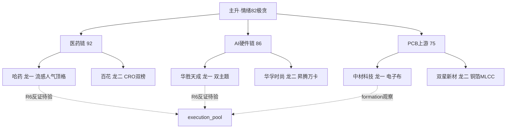

# 2026-09-22 · **主线研判**

> **数据源新鲜度**: ok
> **降级状态**: true
> **置信度**: 0.7

## 一句话结论
主升(conf0.85) + 情绪82极贪上沿, 三条主线: 医药链(92·early_up 最佳窗口)、AI硬件链(86·mid_up·只做硬件端)、PCB上游(75·formation·资金单日转正待确认)。只做各主线龙一/龙二。

## 详细分析

**市场环境**: R1 判定主线扩散型(主升加注), 涨停103家/炸板率19.53%/连板高度5板/昨日涨停溢价+3.23%破强线 → 情绪周期=主升(conf0.85)。仓位上限 70%。情绪浓度82已近极贪上沿, 需防高潮末期。

**三主线交叉验证**: AI硬件链 四源全中(R2∩R3∩R4∩R7, cv=1.0) 是最硬主线; 医药链 cv=0.67(R4 无独立 top_event 唯一缺口) 但 R3 rank1+资金第一, 是今日最强舆论共振; PCB/CCL 上游 cv=1.0 但资金仅单日转正, 5日累计-76亿 choppy, 属修复性回流。

**纪律执行**: 医药链 early_up 最佳参与窗口 → 只做龙一哈药/龙二百花; AI硬件链 mid_up → 只做硬件端(光通信/通信/昇腾), 芯片设计端资金流出-40~-55亿明确不碰; PCB formation → 观察试探, 0922 需资金连续第二日转正确认。

## 关键证据
- 证据 1: R3 rank1 医药链 L1+L2, 创新药热榜#1(6→1新晋)+资金#1(+42.2亿)+KOL出海/流感三方向 · 来源 R3_sentiment.json
- 证据 2: R4 E001/E002/E005 三事件(AI硬件)命中, sectors_catalyzed AI智能体/算力/昇腾链/CPO 全 high · 来源 R4_news.json
- 证据 3: R7 医药生物+67.42亿行业#1 / 通信设备+25.99亿行业#4 / 光通信模块+32.56亿#4 / PCB+27.37亿#10(单日转正) · 来源 R7_capital_flow.json
- 证据 4: limit_cpt_list 华为概念23家#1(5天5板·days22) 涨停宽度最大; 医药簇5板块进涨停top20(医疗器械12/创新药11/流感10/肝炎10/仿制药9) · 来源 tushare
- 证据 5: dc_hot 哈药 surge 98→4(单日最大跳升94位) 人气顶格 · 来源 tushare

## 数据源审计
| 源 | 状态 | 抓取时间 | 记录数 | 备注 |
|---|---|---|---|---|
| tushare limit_cpt_list | ok | 07:5x | 20 | 华为概念23家#1 |
| tushare limit_step | ok | 07:5x | 21 | 5板华瓷股份 |
| tushare ths_hot | ok | 07:5x | 20 | 创新药#1 |
| tushare dc_hot | ok | 07:5x | 100 | 哈药人气顶格 |
| tushare limit_list_d | ok | 07:5x | 103 | 龙头真实收盘 |
| tushare daily_basic | ok | 07:5x | 10 | 流通市值 |
| R3_sentiment | ok | 07:28 | 5 | L3下线·L1+L2达成 |
| R4_news | ok | 07:17 | 8 | 三事件 high |
| R7_capital_flow | ok | 07:10 | 5000 | vibe_trading降级 |
| factor_snapshot | error | - | 0 | top_ir_factors 缺失 |

## 不确定性 / 反证
- 医药链为 R1 标注的"新启动轮动补涨", 若 0922 医药簇无承接, 主线宽度将从20收缩 → R6 需重点反证
- AI硬件链链内严重分歧: 芯片设计端(半导体/先进封装/国产芯片/存储)资金全流出-40~-55亿, 若硬件端也跟随退潮则整链证伪
- PCB 资金单日转正非趋势(5日累计-76亿), formation 阶段不做重仓; 胜宏科技为小作文驱动一日游风险高
- 情绪82极贪: 三条主线均需防"高开无溢价兑现", 只做竞价自然走强的弱转强/超预期

## 与其他 R/D/E 的关系
- 依赖: R1_style(R1), R3_sentiment(R3), R4_news(R4), R7_capital_flow(R7)
- 被消费: filter_leader_v1(已内联), R5 个股画像, R6 反证(hard_reject), D1 主决策(execution_pool)

## Sub-Agent 元数据
- skill: analyze_main_sectors_v1
- artifact: data/research/20260922/R2_main_sectors.json
- 生成耗时: 约 900 秒
- model: deepseek-v4-flash-ga-260731
