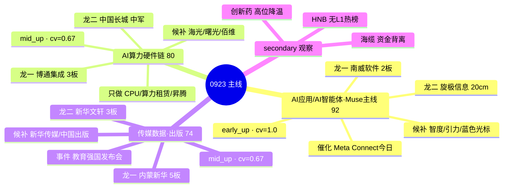

# 2026-09-23 · **主线研判**

> **数据源新鲜度**: ok
> **降级状态**: true
> **置信度**: 0.68

## 一句话结论
主升临界(conf0.53) + AI单极聚焦: 三条主线 — **AI应用/Muse(92·early_up 最佳窗口)**、**AI算力硬件链(80·mid_up·只做资金正向细分)**、**传媒数据/出版·教育强国(74·mid_up·事件驱动)**。只做各主线龙一/龙二, 总仓≤65%。

## 详细分析

**市场环境**: R1 判连板情绪型(临界)·主升临界(conf0.53·插值), 涨停63家/炸板率22.22%(临界带)/连板高度6板/溢价+2.60%破强线/广度0.78恶化 → 高度抬升+广度收缩的聚焦分化日。市场从多线普涨收敛为 **AI单极聚焦**: 强板块20个全在算力科技簇(人工智能20家3天3板/华为概念19家6天6板/DeepSeek16家/AI应用13家/AI智能体11家)。0923 只做各主线龙一/龙二, 总仓≤65%; 早盘溢价>+3%且炸板率<20%可上修70%; 炸板率破25%或6板高标断板降40-50%。

**核心结构**: 0922 是 AI 叙事内部资金再定价日 — 芯片/CPO/光纤/通信(热榜在榜但资金大幅流出: 半导体-74亿/CPO-74亿/光纤-68亿/通信-126亿) → **AI应用/传媒/算力租赁/智能体**(资金Top10全簇: 百度#1+34.55/互联网#2+33.32/ChatGPT#3/AI智能体#4/AI应用#7)。0923 主线 = AI应用接棒, 只做资金正向细分。Meta Muse 登顶 iOS + Meta Connect 9/23-24 今日连续催化 + 英特尔 CPU 涨价 + 云栖大会 + DeepSeek 昇腾 + 存储涨价四重共振 = 事件密度极高。

**三主线交叉验证**: AI应用 四源全中(cv=1.0·R2∩R3∩R4∩R7) 是最硬主线; 算力硬件链 cv=0.67(R7 资金未全正向·链内分化); 传媒数据/出版 cv=0.67(R4 无独立传媒 high 条目)。consensus_themes 3 个全过 3 源阈值。

**纪律执行**: AI应用 early_up 最佳窗口 → 猛干龙一南威/龙二旋极; 算力硬件 mid_up → 只做 CPU/算力租赁/昇腾/载板 资金正向细分, 芯片/CPO/光纤明确不碰; 传媒数据 mid_up → 内蒙新华5板高位只做分歧低吸, 教育强国发布会10时落地防见光死。海缆/创新药 资金背离已降级 secondary, HNB 无L1热榜仅观察。

**推理深度三问(今日首线 AI应用/Muse)**:
- **大资金意图**: 0922 资金从算力硬件(芯片/CPO/光纤/通信, 单日流出 74-126亿)切向 AI 应用/传媒/数字内容(资金 Top10 全簇, 北向 5 日连净入 29.11亿) — 这是 AI 叙事内部的结构性再定价, 不是普涨扩散。大资金在 Muse 上线 6 天 90 万下载 + 20 美元订阅 + Meta Connect 9/23-24 连续两日事件窗口里下注"AI 应用商业化兑现", 对手盘是 0921-0922 已获利的算力硬件端获利盘。
- **为什么走强**: 位置(热榜 AI应用 9→1 新晋榜首 + 南威 surge 76→16 单日最大跳升) + 催化(Muse 登顶 iOS 超越 ChatGPT + Intel CPU 涨价 + 云栖大会 + DeepSeek 昇腾 四事件同日) + 筹码(百度概念 5日4正日 +70.05亿, AI应用 5日4正日 +56.56亿, 沪股通专用席位净买 7.59亿含南威/内蒙新华) 三维共振。
- **逻辑够不够硬**: 五源全向最强(热榜 + 资金 + KOL 五群 + R4 今日事件 + attention 人气), 硬时间锚 = Meta Connect 9/23-24 两日 + 教育强国发布会 9/23 10时; 证伪路径 = 亚马逊封禁 Muse(20:50 已出)情绪回落 + 主升临界(炸板率 22.22% 临界带)若早盘破 25% 或 6 板高标断板则逻辑链断裂, 南威 2 板一字 fd 仅 9651 万封单薄开板即分歧。

## 关键证据
- 证据 1: R3 rank1 AI应用/AI智能体 L1+L2 五源全向最强(热榜#1新晋+资金Top7+KOL五群+R4 Meta Connect今日催化) · 来源 R3_sentiment.json
- 证据 2: R4 E001 Muse登顶+Meta Connect 9/23-24 + E002 Intel CPU涨价 + E003 云栖大会 + E005 昇腾 + E006 存储, 8 events 全 high 正面 · 来源 R4_news.json
- 证据 3: R7 资金Top10全为AI应用簇(百度#1/互联网#2/ChatGPT#3/AI智能体#4/AI应用#7)+北向5日连净入29.11亿; 半导体-74/CPO-74/光纤-68流出 · 来源 R7_capital_flow.json
- 证据 4: limit_cpt_list 0922 强板块20个 AI单极: 人工智能20家#1/华为19家#2/DeepSeek16家#3/AI应用13家#5/AI智能体11家#6 · 来源 tushare MCP
- 证据 5: limit_step 0922 连板天梯: 6板华瓷/5板内蒙新华/4板南华生物/3板博通集成·新华文轩/2板南威软件·新华传媒·华媒控股·哈药 · 来源 tushare MCP

## 数据源审计
| 源 | 状态 | 抓取时间 | 记录数 | 备注 |
|---|---|---|---|---|
| R1_style.json | 🟢 | 07-10 | 1 | 连板情绪型·主升临界0.53·仓位65% |
| R3_sentiment.json | 🟢 | 07-30 | 5 | L1+L2 5主题·情绪71 |
| R4_news.json | 🟢 | 07-10 | 8 | 8 events 全 high |
| R7_capital_flow.json | 🟢 | 07-13 | 5000 | 北向+29.11亿·资金Top10全AI应用簇 |
| tushare.limit_cpt_list | 🟢 | 07-47 | 20 | 0922 强板块20个 |
| tushare.limit_step | 🟢 | 07-47 | 24 | 0922 连板天梯 |
| tushare.ths_hot | 🟢 | 07-47 | 20 | 0922 热榜·AI应用#1 |
| tushare.limit_list_d | 🟢 | 07-47 | 63 | 0922 涨停63家 |
| tushare.daily_basic/daily | 🟢 | 07-48 | 17 | 候选票 float_mv/pct 校验 |
| tushare.moneyflow_ind_dc | 🟢 | 07-47 | 5000 | 0922 概念资金流 |
| factor_snapshot | 🔴 | - | 0 | top_ir_factors.json 缺失·因子层降级 |
| weflow | 🔴 | - | 0 | 永久下线(2026-08-19) |

## 不确定性 / 反证
1. **主升临界不是主升确认**: 情绪周期 conf0.53 是插值(炸板率22.22%临界带+溢价+2.60%破强线+广度0.78恶化), 若 0923 早盘炸板率破25%或6板高标(华瓷股份)断板, 三条主线全部降档, 候选砍半 — 本报告的候选池全部基于"主升延续"假设。
2. **链内分化风险**: 算力硬件链(80)里芯片/CPO/光纤/通信资金大幅流出, 只有 CPU/算力租赁/昇腾/载板 正向; 若资金继续从硬件端撤退, 龙一博通集成(3板·换手19.16%)高位分歧加剧。
3. **南威软件2板一字fd仅9651万**: 封单薄, 一字开板分歧风险大; 教育强国发布会10时落地后 AI+政务 分支防见光死。
4. **KOL偏热 vs 量化广度恶化背离**: 颜晓滨"满仓搞了"口径 vs 涨跌比0.78跌多涨少, 存在喊多的人自己也在观望的可能 — 所以仓位上限保守在65%而非连板情绪型上沿。
5. **美股夜盘未知**: tushare 美股最新仅到0921(美东周一), 0922美东周二夜盘方向是隔夜未知数。

## 与其他 R/D/E 的关系
- 依赖: R1(风格/仓位上限65%) · R3(共振主题5个) · R4(催化事件8个) · R7(资金流Top10)
- 被消费: D1(从 leader_rank 1/2 且 execution_eligible 进 execution_pool) · R5(对龙一/龙二逐票画像) · R6(对 execution_eligible 龙头反证) · E1(复盘 observation tracking)

## Sub-Agent 元数据
- skill: analyze_main_sectors_v1
- artifact: data/research/20260923/R2_main_sectors.json
- 生成耗时: ~10 分钟
- model: deepseek-v4-flash-ga-260731
