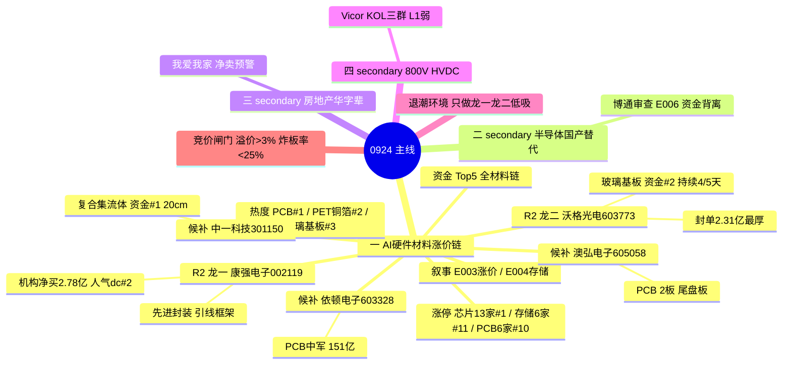

# 2026-09-24 · **主线研判**

> **数据源新鲜度**: ok
> **降级状态**: false
> **置信度**: 0.68

## 一句话结论

0923 退潮确认日,全市场唯一硬主线 = **AI硬件材料涨价链(PCB/铜箔/玻璃基板/先进封装/MLCC/存储)**,四源同向+资金 Top5 全材料链;只做龙一康强电子/龙二沃格光电低吸,其余主题全部资金背离→观察。

## 详细分析

**市场背景(退潮确认)**: R1 判定震荡分化型(偏退潮)+ 情绪周期硬命中高位震荡(conf 0.75)——炸板率 33.77% 破 25% 分歧线、昨日涨停溢价 -0.37% 转负(9 月首次双确认)、连板高度 6→4 回落 2 级、强板块 20→6 收缩 70%、8 宽基全线下跌。叠加隔夜美股大跌(E008: 纳指 -1.14%/费半 -2.02%/AMD 破万亿),0924 科技硬件大概率高开分歧。**退潮环境只做最强一条,这是 R1 纪律,不是保守。**

**主线结构(唯一硬共振)**: R3 五个 L1+L2 主题中,只有 AI硬件材料涨价链做到四源同向——热榜 PCB 3→1 新晋榜首(+22 亿)、PET铜箔#2、玻璃基板#3、先进封装#8、MLCC#5、存储#7 全部新进/上升;R7 主力资金 Top5 全为材料链(复合集流体+19.72 亿/玻璃基板+12.69 亿/先进封装+10.95 亿/MLCC+9.37 亿/光刻机+9.21 亿);R4 E003 半导体全面涨价(12 英寸硅片+15-50%)+E004 存储超级景气(花旗上调美光目标价 1300);KOL 硅片/引线框架/掩膜版三线发酵。**0923 是 AI 叙事内部资金再定价第二轮:0922 应用接棒硬件,0923 资金切回材料涨价链。**

**其余主题为何不入主线**: 800V HVDC(L1 弱支撑,仅液冷#17 关联且液冷 -91 亿流出)、半导体国产替代(芯片 -48 亿/华为 -137.72 亿背离)、量子计算(-30 亿背离)、房地产华字辈(概念层弱,我爱我家/华丽家族涨停但龙虎榜净卖)——全部带资金背离或 L1 弱支撑,按红线"热榜在榜≠安全"一律降级 secondary,只做竞价资金转正的自然走强票。**AI 应用/算力/机器人 热榜在榜但 -153 亿/-71 亿/-135 亿流出 = 退潮确认信号,不入任何主线。**

**生命周期**: 材料链主升中期(mid_up,age9/height2/persist3/break33.77%)——PCB 概念 9 天 7 板已非启动期,但龙头高度仅 2 板(澳弘),且资金持续 3 天(玻璃基板 4/5 天),属于"涨价逻辑已发酵、0923 登顶兑现阶段"。高位震荡环境下只做龙一/龙二低吸,不追高缩量一字。

## 关键证据

- 证据 1: limit_cpt_list 0923 · 芯片概念 13 家#1(首板)/存储芯片 6 家#11/PCB 6 家#10(9天7板)/消费电子 6 家#14 · 来源 tushare
- 证据 2: R7 资金 Top5 = 复合集流体+19.72 亿#1/玻璃基板+12.69 亿#2/先进封装+10.95 亿#3/MLCC+9.37 亿#4/光刻机+9.21 亿#5 · 来源 R7_capital_flow
- 证据 3: R4 E003 半导体全面涨价(high)+E004 存储超级景气(high) · 来源 R4_news
- 证据 4: R3 rank1 AI硬件材料涨价链 L1+L2 四源同向唯一强共振 · 来源 R3_sentiment
- 证据 5: 康强电子 0923 涨停(先进封装/引线框架)· 龙虎榜机构+开源+深股通净买 2.78 亿 · 来源 R7 lhb
- 证据 6: ⚠️超声电子 0923 涨停但龙虎榜净卖 -1.31 亿+机构净卖 -1.42 亿(拉高净卖出·R7 bull_trap) · 严禁纳入龙头候选

## 主线 → 板块 → 龙头 (mermaid)

## 推理深度三问 (主升中期材料链)

- **大资金意图**: 内资主力在 0923 把资金从 AI 应用/算力(流出 -153 亿/-98 亿)整体切回硬件材料涨价链,Top5 概念全部是复合集流体/玻璃基板/先进封装/MLCC/光刻机——这不是情绪炒作,是涨价周期驱动的景气再定价(12 英寸硅片长约 +15-50%、引线框架 yoy+79%、存储 HBM 需求 CAGR 63%)。对手盘是 0922 追 AI 应用高位接力的散户,他们 0923 正在被套。
- **为什么走强**: 位置(PCB 概念 9 天 7 板已到主升中期,细分新材料板块首板潮)+ 催化(半导体全面涨价 E003/E004 双 high 硬事件)+ 筹码(康强电子机构+深股通+开源三路净买 2.78 亿、中一科技复合集流体资金#1)三维交叉,资金与热榜完全同向,无背离。
- **逻辑够不够硬**: 硬。四个独立源共振(R3 热榜/KOL + R4 事件 + R7 资金 + R2 涨停结构),有硬事件(涨价)硬资金(资金 Top5)双重锚。证伪路径: ①隔夜费半 -2% 传导导致 0924 高开低走;②炸板率破 40% 情绪降档;③超声电子式"涨停但龙虎榜净卖"在材料链扩散。

## 首推票思维链

### 康强电子 002119.SZ (龙一 · 先进封装/引线框架)

- **买入理由**: ①产业逻辑——引线框架行业景气第一梯队,康强 yoy+79%(KOL 核心群 09-23 实锤),半导体材料涨价直接受益;②数据锚——0923 涨停封单 1.59 亿,龙虎榜机构专用+开源西安西大街+深股通三席位净买 2.78 亿,先进封装概念资金 +10.95 亿#3,人气 dc#2,R3 首推。
- **风险点**: ①首板换手 15.27% 偏高,若 0924 竞价承接不足易高开低走;②先进封装 5 日资金有波动(0921-0922 曾净出),持续性需竞价验证;③退潮环境(炸板率 33.77%)下任何高位票都有补跌风险。
- **止损条件**: 破 26.92(0923 收盘)即逻辑弱化,退出观察;若竞价溢价 <+3% 且炸板率仍 >25%,不进场。
- **可验证假设**: 0924 竞价溢价 >+3% 且 10:00 前封板 → 确认资金承接,龙一地位巩固;若高开低走跌破昨收 → 退潮传导,材料链全线降档。

### 沃格光电 603773.SH (龙二 · 玻璃基板)

- **买入理由**: ①产业逻辑——玻璃基板是先进封装载板新方向,R7 资金 +12.69 亿#2 且 5 日持续净入 4/5 天(cum 51.09 亿,材料链最强持续性);②数据锚——0923 早盘 09:33 首封、封单 2.31 亿(链内最厚),人气 dc#3,float 230 亿主板容量。
- **风险点**: ①换手 21.94% 偏高,分歧大;②玻璃基板是"新进 top3"题材,若资金一日游则次日溢价有限;③材料链内部电风扇,细分轮动快。
- **止损条件**: 破 102.5(0923 收盘)观察;竞价资金不转正(概念净流入为负)则不进场。
- **可验证假设**: 0924 玻璃基板概念资金继续净流入且沃格竞价溢价 >+3% → 细分持续性确认;若概念资金转负 → 一日游,降级观察。

## 数据源审计

| 源 | 日期 | 状态 | 备注 |
|---|---|:--:|---|
| R1_style.json | 2026-09-24 | 🟢 | complete · 震荡分化偏退潮 · 高位震荡 0.75 · 仓位 0.45 |
| R3_sentiment.json | 2026-09-24 | 🟢 | 5 主题 L1+L2 · 唯一硬共振材料链 · 情绪 49 |
| R4_news.json | 2026-09-24 | 🟢 | 8 事件 · E003/E004 材料链 high · E008 美股大跌负面 |
| R7_capital_flow.json | 2026-09-24 | 🟢 | 北向 +23.65 亿 · 资金 Top5 全材料链 · 非降级 |
| tushare limit_cpt_list | 2026-09-23 | 🟢 | 20 板块 · 芯片13家#1 / 存储6家#11 / PCB6家#10 |
| tushare limit_step | 2026-09-23 | 🟢 | 12 条 · 最高 4 板(大亚圣象/新华文轩)· 高度回落 |
| tushare limit_list_d(U) | 2026-09-23 | 🟢 | 51 只涨停 · first_time/float/封单全字段 |
| weflow-analytics | 2026-09-24 | 🔴 | DOWN(永久下线 08-19)· 最高共振 L1+L2 |
| factor_snapshot | - | 🔴 | top_ir_factors.json 缺失 · factor_layer_degraded=true |

## 不确定性 / 反证

①**隔夜美股大跌是最大反向变量**: 费半 -2.02% 与 E003 涨价利多对冲,若 0924 科技硬件高开低走,材料链龙一龙二也会被带崩,这是 E008 行业级利空,不可轻视;②**材料链内部有出货迹象**: 超声电子涨停但龙虎榜净卖 -1.31 亿(拉高净卖出),说明高位换手票已有人借涨停出货,康强/沃格若竞价承接不足同样危险;③**R1 代理判定 3 条主线 vs R2 真实判定 1 条**: 退潮环境下只做最强一条是对的,但若 0924 竞价材料链资金不转正(概念净流入转负),唯一主线降档后当日实际可做标的可能归零——此时宁可空仓,不做 secondary 杂毛。

## 与其他 R/D/E 的关系

- 依赖: R1_style(风格/仓位上限) · R3_sentiment(共振主题) · R4_news(催化事件) · R7_capital_flow(资金面) · R3 hotlist_signals(热榜双日 diff)
- 被消费: filter_leader_v1(龙头硬过滤·已原地执行) · R5(个股画像·康强/沃格) · R6(反证·材料链出货迹象) · D1(execution_pool 候选: 康强/沃格 execution_eligible)

## Sub-Agent 元数据

- skill: analyze_main_sectors_v1@1.2
- artifact: data/research/20260924/R2_main_sectors.json
- 生成耗时: ~40 秒
- model: deepseek-v4-flash-ga-260731
