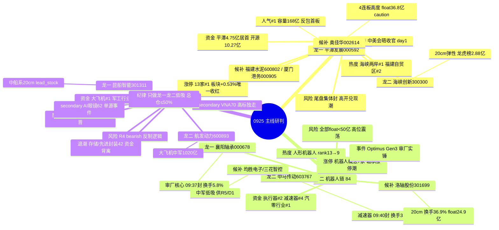

# 2026-09-25 · **主线研判**

> **数据源新鲜度**: partial
> **降级状态**: yes
> **置信度**: 0.65

## 一句话结论

0925 双主线 = **福建/两岸统一**(事件驱动 day1·涨停 13 家全市场第一·龙虎榜硬资金)+ **机器人链**(Optimus 审厂·唯一四源共识成长主线);军工资金搭台临界第三,只做产业分支;高位震荡只做龙一龙二低吸。

## 详细分析

**市场背景(结构性热+全局性冷)**: R1 判定主线扩散型(高标抱团·普跌分化)+ 情绪周期高位震荡(conf 0.41·插值)——炸板率 16.13% 大幅回落重回健康区、昨日涨停溢价 +0.55% 回正、连板高度 4→5 回升 1 级(接力端全面修复),但全市场广度 0.26 为 9 月最差、8 宽基全线大跌、中位 -1.3%、1030 只跌超 3%(市场端全面恶化)。**高标接力暴赚(+5.13%)但首板/打板微亏(-0.61%/-0.66%),资金极度收缩到龙头——0925 只做各主线龙一/龙二低吸与高标卡位,总仓 ≤50%。** 隔夜外盘中性:美股走平、费半 -2% 存储普跌对硬件映射偏空、Meta +4.5% 显示 AI 应用端仍强、A50 夜盘 +0.03%。重大外部变量:习近平访美会谈收官(中美缓和)+ 央行"适度宽松+逆周期"。

**主线一·福建/两岸统一(88 分·事件驱动 day1)**: R3 五主题唯一最强新主题,四源同向——热榜海峡两岸 0923 未上榜→0924 #1(99274 热度)+福建自贸区 #2 新晋;人气平潭发展 dc#1(0923 rank90→0924 rank1);龙虎榜开源西安西大街 +10.27 亿集中买福建票(平潭/福建水泥/厦工/泉阳泉),平潭 net_buy 4.75 亿全市场居首;KOL 五群点名。涨停结构(limit_cpt/limit_list 0924):**海峡两岸概念 13 家涨停 #1(全市场第一)+福建自贸区 6 家 #18 且板块指数 +0.53% 唯一收红**;明细含平潭反包首板(14:23)/海峡创新 20cm(14:24)/奥佳华 4 连板(09:30 早盘)/福建水泥 2 板/厦门港务/漳州发展/厦工/新华都等。⚠️两个关键裂缝:①板块指数 0924 收跌 -0.28%,热度>价格(R3 distribution_alert watch);②10+ 涨停中大部分是 14:20-14:54 尾盘集体抢筹,先手多→0925 高开兑现压力大。生命周期 = formation(day1·资金已确认·扩散待验证)。

**主线二·机器人链 Optimus Gen3(84 分·early_up★)**: 唯一有真金白银的成长主线,R3 rank2 四源同向——KOL 五群(国盛张一鸣节前积极配置/碳纤维骨架减重 33%/审厂传闻轴承涨停潮/花旗 2027-28 年产 10 万/30 万台)+热榜人形机器人 rank13→9↑4+资金(执行器 +10.41 亿#2·减速器 +6.38 亿#4·汽车零部件行业 +9.9 亿#1)+R4 E006 审厂实锤(震裕/均胜/拓普/三花 Tier1+新订单 5000-6000 部)。涨停:机器人概念 7 家 #12+轴承涨停潮(襄阳 10cm 09:37/大业 09:37/中马 09:40/洛轴 20cm 09:42)。**生命周期 = early_up(运行 2 天+资金持续 2 天)= 最佳参与窗口,但 R3 标 early_or_late=middle,且板块内涨停票 float 全部 <50 亿(24.9-45.5 亿)= 小盘高波动,只做龙一襄阳/龙二中马低吸。**

**主线三·军工/商业航天(71 分·临界)**: R7 资金全榜第一簇(大飞机 +10.47 亿#1/空间站 +8.14 亿#3/卫星导航 +5.92 亿#5/军民融合 +5.35 亿#6/卫星互联网 +4.48 亿#9+国防军工行业 +8.84 亿#2)+热榜商业航天 ↑11 最强加速。⚠️但三大压制:①R4 E002 明确 bearish 军工(中美缓和利空反制/避险逻辑·错题本 004 正反两面分开看);②纯军工涨停稀缺(0924 仅昆船智能 20cm 一只·权重搭台型);③KOL 弱(仅长征电视剧情绪面)。**只做 大飞机/商业航天/中船系 产业分支,军民融合/稀土 反制分支严禁。**

**为什么不是 VNA/存储**: VNA(70 分)KOL 三群强推+涨停 4 只(东方中科 2 板/电科思仪 20cm/雷科 10cm/霍莱沃 20cm),但 L1 仅个股级无板块热榜+电科思仪 5 日+59.77% 高位换手 56.71% = 高标独走,按纪律"L1 无板块热榜不立主线"降级 secondary;存储/先进封装(42 分)电子 -228 亿/PCB -74 亿/半导体 -93 亿/CPO -296 亿资金背离+隔夜美股存储普跌=**退潮确认,不入主线**,只留康强电子(2 板·双源人气)观察。

## 关键证据

- 证据 1: limit_cpt_list 0924 · 海峡两岸 13 家#1(4天4板)/人工智能 12 家#2/机器人概念 7 家#12/福建自贸区 6 家#18(+0.53% 唯一收红) · 来源 tushare
- 证据 2: R7 龙虎榜 · 平潭发展 net_buy 4.75 亿全市场居首 + 开源西安西大街 +10.27 亿集中买福建票(平潭/福建水泥/厦工/泉阳泉) · 来源 R7_capital_flow
- 证据 3: R7 资金 Top5 = 大飞机+10.47 亿#1/机器人执行器+10.41 亿#2/空间站+8.14 亿#3/减速器+6.38 亿#4/卫星导航+5.92 亿#5;行业电子 -228.76 亿(材料链退潮) · 来源 R7_capital_flow
- 证据 4: R4 E002 中美元首会晤收官(high·R3 映射两岸统一)+E006 Optimus Gen3 审厂(high) · 来源 R4_news
- 证据 5: limit_step 0924 · 总龙 5 板=新华文轩(传媒字辈·玄学)/4 板=奥佳华(福建·厦门)·泰慕士·新华传媒/2 板=福建水泥·东方中科(VNA)·康强电子 · 来源 tushare
- 证据 6: ⚠️R3 distribution_alert · 海峡两岸 新晋#1 但板块收跌 -0.28%(热度>价格·watch)+哈药股份 ths#1+跌停 -9.96%(hard L4 出货) · 来源 R3_sentiment

## 主线 → 板块 → 龙头 (mermaid)

## 推理深度三问

### 福建/两岸统一(88 分·主线一)

- **大资金意图**: 开源西安西大街一个游资席位单日 +10.27 亿集中买福建票、平潭发展 4.75 亿净买全市场居首、国新北京 +5.88 亿同步进场——这不是散户情绪,是游资在赌"中美会晤收官→两岸统一预期"的事件发酵第一天拿先手。对手盘是 0925 高开追涨的接力资金。游资拿的是"事件第一天"的预期差,散户拿的是"第二天的高开溢价",谁先谁后一目了然。
- **为什么走强**: 位置(事件驱动 day1·海峡两岸 0923 未上榜→0924 #1·平潭 dc rank90→rank1 人气跃升)+ 催化(中美会晤收官硬事件·E002 high)+ 筹码(龙虎榜 4.75 亿居首+开源席位集中买·尾盘 14:20-14:54 集体抢筹)三维交叉。但注意:板块指数收跌 -0.28% 热度>价格,是"资金抢先手、价格未跟上"的典型 day1 形态。
- **逻辑够不够硬**: 事件催化硬(元首会晤实锤)+ 资金硬(龙虎榜全市场第一)+ 共振硬(热榜/人气/KOL/资金四源同向)= 硬。证伪路径:①0925 高开 >6% 无承接=先手兑现潮,day1 变一日游;②涨停家数 <4=板块扩散失败;③若两岸预期被官方定性"无新进展"降温,事件逻辑证伪。

### 机器人链 Optimus Gen3(84 分·主线二)

- **大资金意图**: 在 AI 应用/算力/材料链 0923-0924 全线流出(电子 -228 亿)的背景下,资金唯独回流机器人链(执行器 +10.41 亿#2·减速器 +6.38 亿#4·汽零行业 +9.9 亿#1)——这是产业催化(审厂实锤+花旗出货预测)驱动的景气再定价,不是题材轮动。国盛张一鸣"节前积极配置"代表机构在 0924 普跌中捡筹码。
- **为什么走强**: 位置(early_up·运行 2 天·轴承涨停潮刚起)+ 催化(Optimus Gen3 碳纤维减重 33%+审厂 Tier1 实锤+花旗 2027/28 年产 10 万/30 万台·E006 high)+ 筹码(襄阳 09:37 早盘封换手仅 5.8%=封板质量好·洛轴多游资席位)三维交叉,唯一没有资金背离的成长主线。
- **逻辑够不够硬**: 四源全向(4/4 共识)= 0925 最强共识主线。硬事件(审厂实锤)+ 硬资金(全市场唯一正流入成长方向)。证伪路径:①0925 板块涨停 <4 家=扩散失败;②高标断板/轴承线核按钮传导;③float 全 <50 亿小盘票在高位震荡下波动放大,竞价承接不足即杀。

### 军工/商业航天(71 分·主线三·临界)

- **大资金意图**: 大飞机 +10.47 亿#1、空间站 +8.14 亿#3、卫星导航 +5.92 亿#5、国防军工行业 +8.84 亿#2——资金全榜第一簇且连续 2-4 天净入(空间站 4/5 天),这是权重机构在普跌中做"低位+产业"防御配置,不是游资打板。它搭台不唱戏,给大盘托底而非造妖股。
- **为什么走强**: 位置(商业航天旧题材回摆·热榜 rank18→7 最强加速)+ 催化(无硬事件·KOL 仅长征情绪面)+ 筹码(机构资金持续流入但涨停稀缺=权重搭台)三维只有资金一维强,这就是它只有 71 分的原因。
- **逻辑够不够硬**: 不够硬。资金硬但事件/情绪/涨停三维都弱,且 R4 E002 明确 bearish 军工(中美缓和利空反制/避险逻辑)。**这条例外成立的条件是"只做产业分支"(大飞机/商业航天/中船系)且资金继续净流入**——若 0925 资金转出,立即降级观察;若军民融合/稀土反制分支异动,那是错误的方向,严禁参与。

## 首推票思维链

### 平潭发展 000592.SZ (龙一 · 福建/两岸统一)

- **买入理由**: ①产业逻辑——福建/两岸统一事件驱动 day1 核心,林业/基建属性(福建金森同板涨停);②数据锚——人气 dc#1(0923 rank90→0924 rank1)、龙虎榜 net_buy 4.75 亿全市场居首(机构/开源/国新/国信/深股通多席位)、float 168 亿主板容量中军、尾盘 14:23 封单 3.57 亿、换手 17.01% 充分换手。
- **风险点**: ①尾盘 14:23 才封=先手资金多,0925 高开兑现压力大;②板块指数 0924 收跌 -0.28% 热度>价格,day1 扩散未验证;③事件驱动若被官方降温,逻辑一日游。
- **止损条件**: 破 8.78(0924 收盘)即逻辑弱化退出观察;竞价溢价 >+6% 无承接=先手兑现,不追。
- **可验证假设**: 0925 竞价溢价 +3~5% 且板块涨停 ≥5 家 → 扩散确认,龙一地位巩固;若高开低走破昨收或涨停 <4 家 → 一日游证伪,降档。

### 海峡创新 300300.SZ (龙二 · 20cm 弹性)

- **买入理由**: ①产业逻辑——福建/两岸统一 20cm 弹性标的,与平潭构成"容量+弹性"组合;②数据锚——人气 dc#4、龙虎榜 net_buy 2.88 亿(机构/深股通/开源/T王)、0923 -4.66% 洗盘后 0924 涨停反包、换手 24.26% 充分分歧转一致、float 72 亿。
- **风险点**: ①20cm 高开兑现时杀跌更快(隔日 ±20% 波动);②换手 24.26% 分歧大;③若板块 day1 证伪,20cm 补跌最惨。
- **止损条件**: 破 10.81(0924 收盘)观察;竞价无承接(溢价 <+3% 且量能萎缩)不进场。
- **可验证假设**: 0925 竞价转强(溢价 +3~5% 承接)且平潭同步走强 → 板块合力确认;若平潭弱转强而海峡创新低开 → 弹性票被弃,降档。

### 襄阳轴承 000678.SZ (龙一 · 机器人链/轴承审厂)

- **买入理由**: ①产业逻辑——特斯拉 Optimus 审厂传闻→轴承概念涨停潮核心,10cm 主板轴承标的;②数据锚——早盘 09:37 首封、换手仅 5.8%(封板质量好)、KOL 突发新闻群点名、dc 人气#26、减速器/执行器资金 #4/#2。
- **风险点**: ①float 44.5 亿 <50 亿 caution 区,高位震荡下小盘波动剧烈;②板块内多为首板需验证合力(0925 涨停 <4=失败);③审厂传闻未实锤,若证伪则逻辑崩塌。
- **止损条件**: 破 9.68(0924 收盘)退出;竞价高开无溢价不追。
- **可验证假设**: 0925 竞价弱转强(高开承接)且轴承链 ≥2 只涨停 → 审厂逻辑扩散确认;若轴承线核按钮/低开破昨收 → 传闻证伪,全线降档。

### 中马传动 603767.SH (龙二 · 减速器)

- **买入理由**: ①产业逻辑——减速器是 Optimus 核心执行部件,R7 减速器资金 +6.38 亿#4;②数据锚——早盘 09:40 封、换手仅 3.49%(封板质量好)、dc 人气#47、KOL 点名(批量涨停 大业/襄阳/中马)。
- **风险点**: ①float 45.5 亿 <50 亿 caution;②首板需验证;③与襄阳同质化,若襄阳走弱则联动杀跌。
- **止损条件**: 破 14.74(0924 收盘)观察;竞价资金不转正不进场。
- **可验证假设**: 0925 减速器概念资金继续净流入且中马竞价承接 → 细分持续性确认;若执行器/减速器资金转负 → 降档观察。

### 昆船智能 301311.SZ (龙一 · 军工/中船系 20cm)

- **买入理由**: ①产业逻辑——中船系新晋热榜#6+商业航天加速+统一大市场题材,lead_stock(R3 首推);②数据锚——20cm 首板 14:02 封、换手 14.1%、R7 LHB 机构+深股通+开源多席位、float 43.2 亿。
- **风险点**: ①军工线涨停稀缺=合力弱,权重搭台型非打板主线;②R4 E002 bearish 军工(反制逻辑)压制;③float 43.2 亿 <50 亿 caution+20cm 波动。
- **止损条件**: 破 17.98(0924 收盘)退出;高开兑现不追。
- **可验证假设**: 0925 大飞机/空间站资金继续净流入且昆船竞价转强 → 军工产业分支确认;若资金转出或板块下跌 → 立即降级观察。

### 航发动力 600893.SH (龙二 · 大飞机中军)

- **买入理由**: ①产业逻辑——航空发动机/大飞机产业分支,R7 大飞机 +10.47 亿#1 资金榜首;②数据锚——float 1020 亿超大盘容量、国防军工行业 +8.84 亿#2、R3 资金方向首推。
- **风险点**: ①0924 个股 -3.21%(资金逆势流入但价格未跟);②权重中军非打板标的,弹性弱;③R4 bearish 军工压制整个板块。
- **止损条件**: 破 38.29(0924 收盘)放弃;低吸需竞价承接确认。
- **可验证假设**: 0925 大飞机资金继续净流入且板块指数转红 → 权重搭台确认,中军可低吸;若资金转出 → 该主线整体降级。

## 数据源审计

| 源 | 日期 | 状态 | 备注 |
|---|---|:--:|---|
| R1_style.json | 2026-09-25 | 🟢 | complete · 主线扩散型 · 高位震荡 0.41 · 仓位 0.50 |
| R3_sentiment.json | 2026-09-25 | 🟡 | 5 主题 L1+L2 · 场景C baseline(0924vs0923) · 情绪 61 |
| R4_news.json | 2026-09-25 | 🟡 | 8 事件 · E002 中美会晤/E006 机器人 · hithink 不可用 |
| R7_capital_flow.json | 2026-09-25 | 🟢 | 北向 +23.25 亿 · 资金 Top5 · 非降级 |
| tushare limit_cpt_list | 2026-09-24 | 🟢 | 20 板块 · 海峡两岸13家#1 / 机器人7家#12 |
| tushare limit_step | 2026-09-24 | 🟢 | 13 条 · 总龙5板新华文轩 · 4板奥佳华 |
| tushare limit_list_d(U) | 2026-09-24 | 🟢 | 52 只涨停 · first_time/float/封单全字段 |
| tushare daily_basic/daily | 2026-09-24 | 🟢 | 中军市值核对(三花1332亿/均胜316亿/航发1020亿) |
| factor_snapshot | - | 🔴 | top_ir_factors.json 缺失 · factor_layer_degraded=true |
| weflow_analytics | - | 🔴 | DOWN(永久下线 08-19)· 最高共振 L1+L2 |
| 群聊 KOL 5 群 | 2026-09-24 | 🟢 | 253 条 · 匿名五群全活 |

## 不确定性 / 反证

①**福建 day1 兑现潮是最大风险**: 板块 10+ 涨停中大部分尾盘 14:20-14:54 集体抢筹(先手极多)+板块指数收跌 -0.28% 热度>价格,0925 高开兑现概率大——若竞价高开 >6% 无承接,平潭/海峡创新都会被先手砸盘,此时宁可空仓不追;②**军工线 R4 反证冲突**: E002 中美缓和明确 bearish 军工(反制/避险),与 R7 资金流入正面矛盾,这是 R6 必须重点反证的点——本 R2 已保守处理(只做产业分支+71 分临界),若 R6 hard_reject 军工线,执行池只剩福建+机器人;③**总龙是玄学传媒(新华文轩 5 板)**: 传媒字辈 R3 判定 L1_only 无 KOL 无资金,不立主线,但它是全市场总龙——高标卡位玩家注意其断板对情绪的传导;④**高位震荡双面性**: 炸板率 16.13% 健康+溢价回正=接力端修复,但广度 0.26+中位 -1.3%=市场端恶化,若 0925 高标断板或炸板率回升破 25%,高位震荡转退潮确认,所有候选砍半。

## 与其他 R/D/E 的关系

- 依赖: R1_style(风格/仓位上限 0.50) · R3_sentiment(共振主题/distribution_alert) · R4_news(催化事件 E002/E006·军工 bearish) · R7_capital_flow(资金面/龙虎榜) · tushare MCP(涨停明细/连板/市值)
- 被消费: filter_leader_v1(龙头硬过滤·已原地执行·6 只 execution_eligible) · R5(个股画像·平潭/海峡创新/襄阳/中马/昆船/航发) · R6(反证·军工 R4 bearish 冲突·福建 day1 兑现) · D1(execution_pool 候选: 平潭发展/海峡创新/襄阳轴承/中马传动/昆船智能/航发动力)

## Sub-Agent 元数据

- skill: analyze_main_sectors_v1@1.2
- artifact: data/research/20260925/R2_main_sectors.json
- 生成耗时: ~50 秒
- model: deepseek-v4-flash-ga-260731
