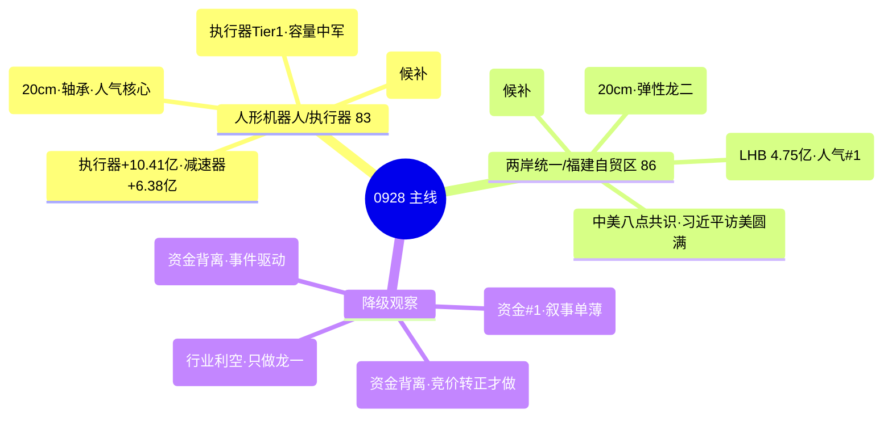

# 2026年09月28日 · **主线研判**

> **数据源新鲜度**: partial(A股行情0924收盘·中秋滞后)
> **降级状态**: yes(factor因子层缺失·weflow下线)
> **置信度**: 0.63

## 一句话结论

0928 节后首日主线 = **人形机器人/执行器**(三源唯一强共振) + **两岸统一/福建自贸区**(L1+R7三证极强),只做两条龙一/龙二低吸,不追高、不满仓、防高开兑现。

## 详细分析

**市场底色**: R1 判主线扩散型(高标抱团·普跌分化),情绪浓度 58,仓位上限 50%,情绪周期高位震荡(conf0.41)。0924 收盘真实盘面是"接力修复+市场普跌"的极端撕裂日——涨停 52 / 炸板率 16.13% 重回健康区 / 连板 5 板,但广度 0.26 为 9 月最差、8 宽基全线大跌、高标接力簇 30 日 +224.61%。假期(0925-0927)外部催化显著转正:中美八点共识、美股周五收涨、半导体景气催化密集。0928 高开大概率,但"高开兑现 vs 高开修复"二分是主基调,只做最强主线龙一/龙二低吸。

**主线一·人形机器人/执行器/碳纤维(83 分)**: R3 五个 L1+L2 主题中**唯一三源同向强共振**——THS 人形机器人 #9(+4)、机器人概念 #15;DC 洛轴股份 #23(20cm +19.99%)、襄阳轴承 #26、昆船智能 #60、均胜电子 #29;KOL 双群研报式整理(高盛 2030 出货 89 万台/德银 2026 5 万台/特斯拉 Optimus 产量 10 倍/碳纤维减重 33%)。资金端关键变化:机器人执行器 +10.41 亿 #2、减速器 +6.38 亿 #4、汽车零部件 +9.9 亿行业 #1——0923 的 -135 亿流出转正,是"催化升级非启动初期"的证据。生命周期 mid_up(age3/height2/persist1,conf0.55),中段早期,资金才转正单日,必须竞价确认延续。龙一洛轴股份(20cm·人气#23·R3首推)、龙二三花智控(R4首推·执行器 Tier1·容量中军)。

**主线二·两岸统一/福建自贸区(86 分)**: R3 l1_only rank1(L1+R7 三证极强,因 KOL 未直接点名板块按红线不入共振 top5,但明确供 R2/D1 直接消费)。THS 海峡两岸 #1 + 福建自贸区 #2 双新进榜首;DC 平潭发展 #1(rank90→1·surge+89)、海峡创新 #4(20cm)、福建水泥 #11;limit_cpt 海峡两岸 13 家 #1(4天4板)+ 福建自贸区 6 家 #18。资金三证:平潭 LHB 净买 4.75 亿 + 开源西安西大街 +10.27 亿游资 + 机构 6.99 亿。催化 = 中美八点成果共识(high·正面)。生命周期 formation(age1/height2/persist1,conf0.60)——0924 首次涨停潮,但涨停潮集中于尾盘(14:23-14:45),假期利好已被 KOL 提前定价("必须涨上4000"),0928 高开兑现风险是最大变量。

**降级观察**: 玻璃基板/FOPLP(51)是"假期催化 vs 资金已撤"最大分歧主题(0924 -32.39 亿 + 沃格光电人气崩),竞价资金转正才做;存储/HBM·SiGe 锗链(61)产业逻辑硬(格芯售罄/锗价新高)但资金背离(电子 -228.76 亿),事件驱动只做自然走强;军工/大飞机(61)资金 #1 但叙事单薄;AI应用/传媒高标(56)高度最高但行业级利空(OpenAI 暂停训练)+ 资金背离,只做龙一低吸。

## 推理深度三问

### 主线一 · 人形机器人/执行器
- **大资金意图**: 0924 资金从 0923 的 -135 亿转正 +10.41 亿杀进执行器/减速器细分,是"催化升级"的右侧卡位;对手盘是假期前获利盘(30日 +224.61%)与泛概念杂毛资金,目的=抢在 0927 机构上调出货(高盛/德银)落地前拿筹码。
- **为什么走强**: 位置=mid_up 中段早期(age3/height2),催化=三机构数据锚+特斯拉 10 倍+碳纤维减重 33%,筹码=执行器资金转正+洛轴 20cm 人气爆发——三因子同向。
- **逻辑够不够硬**: 热榜+双群 KOL+资金三源同向+三机构硬数据锚=硬共振;证伪路径=0928 执行器资金不延续(泛概念 -30.81 亿仍在流出)或高标断板。

### 主线二 · 两岸统一/福建自贸区
- **大资金意图**: 平潭 LHB 净买 4.75 亿+开源西安西大街 +10.27 亿+机构 6.99 亿=游资+机构合力抢筹事件驱动;对手盘=节前尾盘(14:23-14:45)抢筹的先手资金,目的=博弈中美八点共识节后兑现。
- **为什么走强**: 位置=formation 首日(0924 首次涨停潮 13 家),催化=中美八点共识(high)+习近平访美圆满,筹码=平潭 rank90→1 surge+89+福建链涨停潮——事件+人气双爆。
- **逻辑够不够硬**: L1 热榜#1#2+R7 三证+R4 宏观催化=三证极强;但 KOL 未点名+无产业纵深=事件驱动型,证伪路径=竞价无承接/高开低走(利好已定价)。

## 首推票思维链

### 洛轴股份 301699(人形机器人·龙一)
- **买入理由**: ① 20cm 首板 +19.99%·机器人轴承方向人气 #23·R3 首推;② 轴承/丝杠为 R3"机器人轴承方向已暴涨"的卡位核心,执行器资金 +10.41 亿 #2 背书。
- **风险点**: ① float 24.85 亿 <50 亿·庄股风险提示;② 换手 36.9% 极端+20cm 退潮环境隔日 -20% 风险。
- **止损条件**: 竞价资金转正才进;破昨收 35.54 或执行器板块资金转出→离场(止损距 -5~-10% 硬区间)。
- **可验证假设**: 0928 竞价量比 >2 且执行器资金延续→20cm 溢价可期;若高开无溢价/量比 <1→兑现离场。

### 三花智控 002050(人形机器人·龙二)
- **买入理由**: ① R4 首推·特斯拉 Optimus 执行器 Tier1·研报 4 买入 1 增持·H1 净利 +79%;② float 1331 亿容量中军·量能充沛时大盘股优先·低吸性价比高。
- **风险点**: ① 0924 仅 +0.25%·需竞价确认资金回归执行器;② 大盘普跌(广度 0.26)容量股承压。
- **止损条件**: 破 36.08(0924 收盘)且执行器资金转出→逻辑弱化离场。
- **可验证假设**: 竞价执行器板块净流入延续+三花主力净流入→低吸成立;板块资金转负→放弃。

### 平潭发展 000592(两岸统一·龙一)
- **买入理由**: ① LHB 净买 4.75 亿+开源西安 +10.27 亿+机构 6.99 亿三路硬资金;② 人气 dc#1(rank90→1 surge+89)·两岸统一龙头·R3 l1_only rank1 首推。
- **风险点**: ① 14:23 尾盘封板·高开兑现风险大;② 假期利好已被 KOL 定价("必须涨上4000")·预期差反噬。
- **止损条件**: 竞价承接(量比/封单)不过关不进;破 8.78(昨收)且板块退潮→离场。
- **可验证假设**: 竞价高开 ≤+3% 且量比 >1.5→修复预期;高开 >5% 无承接→兑现离场。

### 海峡创新 300300(两岸统一·龙二)
- **买入理由**: ① 20cm 首板 +19.98%·dc#4·弹性龙二;② float 72.08 亿适中·福建链次席人气。
- **风险点**: ① 14:24 尾盘封·高开兑现;② 20cm 退潮环境波动剧烈。
- **止损条件**: 竞价自然走强低吸才进;破 10.81 昨收→离场。
- **可验证假设**: 板块竞价红盘率 >50% 且平潭承接→弹性可期;平潭兑现走弱→20cm 补跌。

## 关键证据

- 证据 1: R3 rank1 人形机器人 L1+L2 唯一三源强共振·执行器 +10.41 亿 #2 · 来源 R3_sentiment.json + R7_capital_flow.json
- 证据 2: 热榜 0924 THS#1 海峡两岸 + #2 福建自贸区 双新进·平潭 rank90→1 surge+89 · 来源 ths_hot/dc_hot MCP
- 证据 3: 平潭发展 LHB 净买 4.75 亿 + 开源西安西大街 +10.27 亿 + 机构 6.99 亿 · 来源 R7 LHB 字段
- 证据 4: limit_cpt 海峡两岸 13 家 #1(4天4板)·机器人概念 7 家 #12(4天4板) · 来源 limit_cpt_list MCP
- 证据 5: R4 E001 中美八点共识 high + E002 人形机器人 high(高盛/德银/特斯拉) · 来源 R4_news.json

## 数据源审计

| 源 | 日期 | 状态 | 备注 |
|---|---|:--:|---|
| tushare/ths_hot | 2026-09-24 | 🟢 | 20 条概念板块热榜 |
| tushare/dc_hot | 2026-09-24 | 🟢 | 100 条 A股人气榜 |
| tushare/limit_cpt_list | 2026-09-24 | 🟢 | 20 条涨停板块统计 |
| tushare/moneyflow_ind_dc | 2026-09-24 | 🟢 | 504 条概念资金流 |
| tushare/limit_step | 2026-09-24 | 🟢 | 13 条连板天梯 |
| tushare/limit_list_d | 2026-09-24 | 🟢 | 52 条涨停明细 |
| tushare/daily + daily_basic | 2026-09-24 | 🟢 | 5557 只全市场 |
| manifest.json | 2026-09-28 | 🟢 | global_severity=2 |
| weflow-analytics | - | 🔴 | 永久下线(2026-08-19) |
| factor_snapshot | - | 🔴 | 目录缺失·因子层降级 |

## 不确定性 / 反证

1. **A股行情滞后 3 日**: 0925-0927 中秋休市,全部量化指标定格 0924 收盘。假期催化(中美共识/美股收涨/半导体景气)未经过 A股 交易验证,0928 高开后是否被承接是最大未知。若高开低走、高标断板,两条主线全部降档。
2. **两岸统一是高开兑现高发区**: 0924 涨停潮集中于尾盘 + KOL "必须涨上4000" 已提前定价利好,平潭发展 14:23 才封板。高开无溢价即兑现,竞价承接(量比/封单)不过关就不进。
3. **人形机器人资金刚转正单日**: 执行器 0924 +10.41 亿是 0923 -135 亿后的首个正日,泛概念层(人形机器人 -30.81 亿/机器人概念 -102.14 亿)仍在流出。若 0928 执行器资金不延续,mid_up 判定失效,降档观察。
4. **洛轴股份 float 24.85 亿 < 50 亿**: 用户硬规则 20-50 亿 caution。20cm + 高换手(36.9%)在退潮环境波动剧烈,需 D1 仓位控制,不能作为主仓。
5. **材料链集体背离**: 玻璃基板 -32.39/先进封装 -49.88/复合集流体 -9.67 亿,与 KOL 假期强推严重背离。20260915 教训"热榜在榜但资金先撤=退潮前兆",玻璃基板必须竞价资金转正才做。

## 与其他 R/D/E 的关系

- 依赖: R1_style(风格/情绪/仓位上限) · R3_sentiment(共振主题/l1_only) · R4_news(sectors_catalyzed) · R7_capital_flow(资金确认)
- 被消费: D1(canghai-plan)选 execution_pool · R5(analyze_stock_profile_v1)画像龙一龙二 · R6(analyze_devil_advocate_v1)反证 · E1(canghai-review)复盘
- 交叉验证: 人形机器人 cross_validation_score=1.0(四源)·两岸统一=1.0(R3 l1_only + R4 E001 + R7 LHB 跨字段映射)

## Sub-Agent 元数据

- skill: analyze_main_sectors_v1
- artifact: data/research/20260928/R2_main_sectors.json
- 生成耗时: ~600 秒
- model: deepseek-v4-flash-ga-260731
