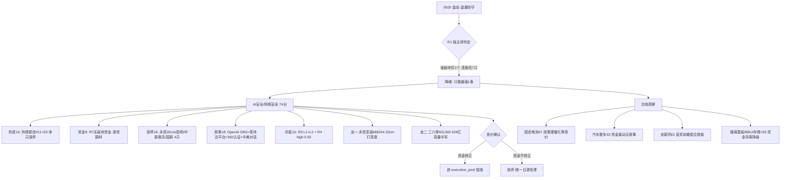

# 2026-09-29 · **主线研判**

> **数据源新鲜度**: partial
> **降级状态**: true(因子层缺失)
> **置信度**: 0.63

## 一句话结论

**退潮防守日,主线只认 1 条:AI安全/网络安全(74 分)——唯一 R3+R4 双源同向共振题材,但资金未确认,竞价不转正一律不做;固态电池(67)政策硬催化降次线等竞价,全市场无强梯队。**

## 详细分析

### 1️⃣ 先认市场:退潮线三条件全触发,独主线结构

R1 明确:0928 涨停33/跌停56(反超)/炸板率25%/晋级率13.5%(破25%退潮线)/广度0.20(9月最差)/连板仅7只(5板独苗·4板断层)——**退潮线三条件全触发**,情绪浓度 35-36(恐惧),仓位上限 30%。limit_cpt_list 强板块(up_nums≥8)仅 1 个(一带一路11家但当日-2.17%),板块效应极弱。**0929 是国庆前最后第 2 个交易日**,持币过节压力+外盘美债风暴(10Y 5.2361%创2007新高)+美联储加息概率70.9%。这种环境下,R2 的主线判定必须降维:不做多主线堆砌,只输出最强 1 条 + 次线观察。

### 2️⃣ 唯一主线:AI安全/网络安全(74 分)

五维打分:热度16 + 资金8 + 涨停16 + 叙事18 + 共振16。这是全场唯一 R3 L1+L2 **且** R4 high(0.92 分全场最高)的题材——OpenAI 紧急暂停最强模型训练(DNS 漏洞越权)是产业级事件,叠加英伟达开放智能体安全平台 + 360 获国内首个 AI 安全认证 + 中美建立 AI 事件沟通渠道,四重催化同源共振。涨停 4 只(永信至诚 20cm/启明信息/中新赛克/国新健康),热榜新进#11。

**但硬伤是资金**:R7 top_inflow 前 10 无网络安全,纯游资题材。退潮期题材高开低走是常态,所以 cross_validation_score=0.67(缺资金一源),竞价必须看网络安全板块主力净流入转正才做。

### 3️⃣ 次线:固态电池(67)政策硬催化、汽车整车(63)资金驱动、其余 50 档

- **固态电池 67**:R3 rank1(七部门 2030 全固态政策·盘后发)+R4 E004 high,政策级硬催化,但资金未定价(政策盘后发,涨停仅时代万恒 1 只)。**0929 首日验证资金承接,竞价不转正不做**。候选:豪鹏科技 001283(固态+BBU 双逻辑)/时代万恒 600241(首板·BBU 实锤)/欣旺达 300207(人气 surge)。
- **汽车整车 63**:R7 资金#1(+10.43亿,5日23.16亿),江淮汽车 DC#1 涨停,但 R3/R4 均无题材共振——纯资金驱动高低切修复,不是进攻主线,不做题材接力。
- **创新药/食欲素 61**:诺奖前瞻+丽珠/津药涨停,但哈药连续跌停=板块分化,只做低位首板。
- **玻璃基板/BBU/存储** 均在 50 档及以下:资金背离持续(玻璃基板0924 -32.39亿/MLCC风华跌停/电子-323亿),人气升价格跌=分歧加剧,一律降级观察。

### 4️⃣ 龙头结构:永信至诚打高度,三六零做容量

AI安全主线内,永信至诚 688244(20cm 首板·DNS 防护第一标的)打高度,三六零 601360(float 626亿·AI安全认证第一标的·资质六家)做容量中军。退潮期首日题材,龙一/龙二都只做竞价自然走强的低吸,不追高不接力。

## 关键证据

- 证据 1: AI安全=全场唯一 R3 L1+L2 + R4 high(0.92)双源同向题材 · 来源 R3_sentiment rank4 / R4_news E003
- 证据 2: 0928 涨停 4 只(永信至诚 20cm first_entry#75/启明信息/中新赛克 9:30 一字/国新健康)+热榜网络安全新进#11 · 来源 tushare.limit_list_d / hotlist_signals
- 证据 3: 固态电池=七部门 2030 全固态政策(盘后发)+豪鹏 1200Wh/L,但 R7 无板块资金 · 来源 R3 rank1 / R4 E004 / R7 top_inflow
- 证据 4: 退潮结构确认: 涨停33/跌停56/晋级率13.5%/连板仅7只(5板独苗·4板断层)/强板块仅1个 · 来源 R1 / tushare.limit_step / limit_cpt_list
- 证据 5: 资金防御切换: 汽车整车+10.43亿#1/白酒+4.13亿#3/猪肉+2.58亿#8,电子-323.71亿/半导体-153.33亿流出 · 来源 R7

## 数据源审计

| 源 | 状态 | 抓取时间 | 记录数 | 备注 |
|---|---|---|---|---|
| R1_style | 🟢 ok | 07:17 | 1 | 独主线·退潮·仓位30% |
| R3_sentiment | 🟢 ok | 07:30 | 5主题 | 全 L1+L2·首日发酵 |
| R4_news | 🟢 ok | 07:12 | 8事件 | E003 AI安全 0.92 最高 |
| R7_capital_flow | 🟢 ok | 07:17 | 1 | 资金全防御·题材无预确认 |
| tushare.limit_cpt_list | 🟢 ok | 07:40 | 20 | 强板块仅1个 |
| tushare.limit_step | 🟢 ok | 07:40 | 7 | 5板独苗·4板断层 |
| tushare.limit_list_d | 🟢 ok | 07:40 | 33涨停 | 涨停分散无梯队 |
| tushare.daily_basic | 🟢 ok | 07:41 | 3 | 候选票 float_mv |
| factor_layer | 🔴 error | - | 0 | 目录不存在·降级 |

## 不确定性 / 反证

1. **AI安全 74 分含 8 分资金虚高**:R7 无板块资金,纯游资题材。若竞价网络安全板块主力净流出或永信至诚高开无承接,整条主线作废——退潮期事件题材熄火极快(参考 0928 哈药/亨通/中际旭创批量跳水)。
2. **固态电池 67 差 3 分未过 70 线**:政策级硬催化 vs 资金未定价的矛盾,0929 若高开低走(退潮期常态),政策利好被先手兑现,反而是陷阱。
3. **汽车整车 63 无叙事**:资金#1 但 R3/R4 零共振,是纯防御修复,一旦汽车整车资金转出(5日已波动),修复即结束。
4. **R6 反证未跑**:洛轴股份(机器人轴承)龙虎榜诱多(涨停净卖/机构净卖/疑似对倒)已列入 watch_distribution,今日机器人板块不做。

## 与其他 R/D/E 的关系

- 依赖: R1_style(风格/仓位约束) + R3_sentiment(共振主题) + R4_news(催化事件) + R7_capital_flow(资金验证) + tushare 打板数据(涨停/连板)
- 被消费: D1(main_decision_v1 选 execution_pool·cross_validation_score≥0.67 主线优先) + R6(analyze_devil_advocate_v1 反证·AI安全/固态电池 hard_reject 候选) + E1(daily_review_v1 复盘)

## Sub-Agent 元数据

- skill: analyze_main_sectors_v1
- artifact: data/research/20260929/R2_main_sectors.json
- 生成耗时: 45 秒
- model: deepseek-v4-flash-ga-260731
