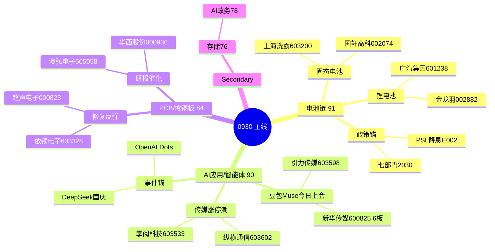

# 2026-09-30 · **主线研判**

> **数据源新鲜度**: partial
> **降级状态**: 否（factor 因子层降级，核心五维正常）
> **置信度**: 0.65

## 一句话结论
节前最后1日：3条主线 = 电池链(91) > AI应用/智能体(90) > PCB(84)，只做各线龙一/龙二，总仓≤60%，竞价弱转强确认才进。

---

## 详细分析

### 🧭 市场定盘：主升修复·全面点火·节前收官

0929 是 0928 退潮日的全面修复日——退潮线三条件（晋级率 13.5% / 跌停 56 反超涨停 33 / 广度 0.20）全部证伪：涨停 57 / 跌停 10 / 炸板率 12.31% / 高度 6 板 / 广度 1.80，情绪周期回到主升（conf 0.52 插值）。R1 定性「连板情绪型(主升修复·全面点火)」，17 个强板块（涨停家数≥8）全部集中在科技硬件/AI 大方向内，其中：

| 梯队 | 板块 | 高度 |
|---|---|---|
| 12天8板梯队 | 数据中心/5G/PCB/东数西算/汽车电子/储能 | 高位加速 |
| 7天6板梯队 | 华为/AI应用/数字经济/人工智能/百度/DeepSeek | 高标接力 |
| 首板点火方向 | 固态电池10家/锂电池11家/新能源汽车10家 | 低位点火 |

**但今天是国庆长假前最后 1 个交易日**——今天买入即持股过节 8 天，长假外盘（美债/加息概率 50%/伊朗/日债）不可控。R1 仓位上限 0.60（band 下沿），R3 情绪 75，KOL「修复共识+持股过节预期」与「高标兑现(明天不涨停就出货)+外资去美债+超级泡泡警惕」并存。R2 的裁决：不堆主线，只做最强三条的龙一龙二，其余降级等竞价。

### 🔥 主线一：电池链（固态电池·锂电池·广汽XFC）— 91分 · early_up 首板点火

**R3 rank2 L1+L2** + **R7 资金三板块全部 top10**（固态电池+24.36亿#5 / 电池技术+22.51亿#6 / 锂电池+21.6亿#7 / 行业电池+21.75亿#3）+ **直拉涨停结构**（固态 10 家涨停 / 锂电 11 家）——这是修复日资金与涨停共振最完整的方向，属于「首板点火」最佳窗口。

- **大资金意图**: 广汽巨湾 XFC 超充 + 固态双轮驱动，容量中军（国轩 498 亿 / 广汽 413 亿）被主力一字抢筹；龙虎榜净买 top1 国轩高科 3.68 亿（国泰海通知春路/南京太平南路/深股通/机构多席位）= 游资+机构+北向三方合力，是对「七部门 2030 全固态规模化 + 央行 PSL 降息/科技创新再贷款 1.4 万亿」政策组合的提前下注。
- **为什么走强**: 位置=低位首板点火（0928 前电池链资金连续流出，0929 单日大额转正=修复日新点火方向）；催化=七部门政策续发酵 + 广汽 XFC 一字 + 央行 PSL 降息（E002 high）；筹码=国轩龙虎榜净买第一、广汽一字换手 0.11% 封死=筹码完全锁定。
- **逻辑够不够硬**: 政策（七部门 2030 + PSL 降息）硬、资金（三板块 top10）硬、人气（THS 固态电池#1 登顶）硬——三源独立共振。⚠️ 证伪路径：节前最后 1 日若竞价资金不延续，首板点火方向一日游；尚水智能 float 10.36 亿<20 亿已硬剔除（庄股特征）。

### 🔥 主线二：AI应用/AI智能体（豆包Muse·传媒）— 90分 · mid_up

**R3 rank1 L1+L2**（豆包 Muse 9/30 **今日上会内测**=时间锚硬）+ **R4 E003 high** + **R7 资金确认**（AI应用+17.13亿#9 / 人工智能+25.93亿#3 / 数据中心+15.34亿#10）。高度龙头新华传媒 6 连板=全场最高板，传媒 7 家涨停潮。

- **大资金意图**: 国产 Agent 军备竞赛（豆包对标 Meta Muse / OpenAI Dots / DeepSeek V4.1 Pro 国庆 / 可灵 Kling4.0 / Manus2.0），字节系传媒是第一落点；今天 9/30 是豆包上会日，资金赌「上会=第二催化日」的高开溢价。
- **为什么走强**: 位置=7 天 6 板梯队高位（新华传媒 6 板一字）；催化=今日上会时间锚（R4 E003 high）+ 假期 DeepSeek 发布预期；筹码=传媒 7 家涨停=情绪扩散非业绩，换手充分但高标获利盘极端丰厚。
- **逻辑够不够硬**: 事件级（今日上会）+ 资金级（3 板块 top10）+ 人气级（THS #3 飙升）三源共振。⚠️ 证伪路径：高开无溢价=预期兑现，传媒系涨停潮为情绪扩散，若竞价高开低走题材一日游概率高。

### 🔥 主线三：PCB/覆铜板 — 84分 · mid_up（12天老线修复反弹）

**R3 rank5 L1+L2** + **R7 资金最强**（PCB+25.77亿#4 / 行业印制电路板+29.51亿**#1** 领涨 +5.43%）+ **直拉涨停**（PCB 8 家涨停 / 元件 7 家）。但 R4 无 PCB 事件级催化（叙事维 14/20），且为 12 天 8 板老线 0929 修复反弹**非新高**。

- **大资金意图**: 深股通实买超声电子（人气王 surge 70→5），行业资金#1——修复日资金回流 PCB 首选人气龙头；机构风向群开源证券蒋颖 1018 字深度（杰普特金刚石钻针+尖点科技 MOU）提供第二成长曲线叙事。
- **为什么走强**: 位置=0928 大跌（-5.67%）后超跌反包（超声电子 0928 -9.4% → 0929 +10.01% 换手 19.56%）；催化=资金回流+研报催化（弱于前两线）；筹码=超声电子人气+深股通+机构多方买入。
- **逻辑够不够硬**: 资金硬（行业#1）但叙事偏弱（无 R4 事件）——定性「修复反弹」而非「新主线」，只做人气龙头不追高。⚠️ 证伪路径：元件/PCB 与 AI 应用共用资金池，若 AI 应用竞价吸金，PCB 修复缩量。

---

## 主线三层 mermaid

---

## 每票思维链（execution_eligible 龙一/龙二）

### 电池链 · 龙一国轩高科 002074

- **买入理由**: ① 锂电池+固态双概念容量中军，10.01% 一字（9:37·open 0），龙虎榜净买 3.68 亿全场 top1（国泰海通知春路/南京太平南路/深股通/机构）——游资+机构+北向三方合力；② R7 三板块资金 top10（固态+24.36/电池技术+22.51/锂电池+21.6 亿）+ 行业电池+21.75 亿#3 共振。
- **风险点**: ① 一字板无参与度，若竞价高开兑现=先手出货，容量中军低吸需等分歧；② 节前最后 1 日持股过节 8 天，电池链首板点火方向若竞价资金不延续则一日游。
- **止损条件**: 破 28.68 元（0929 涨停价）且竞价/盘中不能快速收回 → 电池链逻辑失效止损；若分歧低吸于涨停下方，止损距 -5%~-10% 硬区间。
- **可验证假设**: 0930 竞价固态/锂电池板块主力净流入维持正值且国轩不低开>3% → 主升延续可低吸；竞价板块转负或国轩高开兑现 → 证伪，当日不参与。

### 电池链 · 龙二广汽集团 601238

- **买入理由**: ① 10.02% 一字（9:25·换手 0.11% 封死）巨湾 XFC 超充+固态双轮驱动，自研电池主线爆发，surge 99→7（+92）；② float 413 亿整车容量，板块第二高度，R3 核心群/题材群/快讯群 3 群独立点名。
- **风险点**: ① 一字板明日溢价需竞价验证，高开兑现不做（R3 明确）；② 整车 12 天 8 板梯队与电池链共用资金池，若高标断板高低切。
- **止损条件**: 若开板分歧买入，破开板低点或 -5%~-10% 硬区间止损；不追一字（无买入则无止损）。
- **可验证假设**: 0930 竞价广汽高开≤5% 且有承接 → 可分歧低吸；高开>7% 或翻绿 → 兑现信号，放弃。

### AI应用 · 龙一新华传媒 600825

- **买入理由**: ① 6 连板=全场最高板（limit_step#1），9:25 一字封死（open 0），出版/传媒 AI 应用总龙头，THS 热股#4；② 豆包 Muse 9/30 今日上会=时间锚硬，传媒 7 家涨停潮带头。
- **风险点**: ① 6 板一字=高度极限，节前最后 1 日高标兑现压力极端（龙虎榜诱多 91% 极值·Jason「明天不涨停就出货」）；② 一字板无参与度，断板即天地板风险。
- **止损条件**: 不追一字；仅开板分歧承接参与，破当日分歧低点即止损，止损距 -5%~-10% 硬区间。
- **可验证假设**: 0930 竞价传媒/AI应用板块高开且新华传媒开板有强承接 → 弱转强可做；竞价高开低走/直接核按钮 → 证伪，主线分歧转退。

### AI应用 · 龙二引力传媒 603598

- **买入理由**: ① R4 E003 首推（sector_linkage 0.92·字节头部代理商·火山引擎/巨量引擎 AI 合作·豆包 AI 广告 AI 短剧正宗映射）；② 10.01% 涨停 float 51.6 亿小票弹性，豆包 Muse 今日上会直接受益。
- **风险点**: ① 首板涨停 11:13 封（盘中），今天上会日若高开无溢价=预期兑现；② 传媒系涨停潮为情绪扩散非业绩，题材退潮跌得快。
- **止损条件**: 破 17.41 元（R4: 19.13×0.91 涨停逻辑失效）止损；竞价弱转强买入则以竞价低点 -5%~-10% 硬区间。
- **可验证假设**: 0930 竞价引力传媒高开≤5% 且传媒板块不弱 → 弱转强低吸；高开>7% 无承接或传媒高开低走 → 证伪放弃。

### PCB · 龙一超声电子 000823

- **买入理由**: ① 10.01% 涨停（10:31·换手 19.56% 人气王·surge 70→5），PCB/覆铜板修复日人气核心，深股通+国新北京+机构买入；② R7 行业印制电路板+29.51 亿#1（+5.43% 行业领涨）+ PCB 概念+25.77 亿#4。
- **风险点**: ① 超跌反弹属性强（0928 曾-9.4% 大跌→0929 反包），追高谨慎（R3）；② PCB 12 天老线修复反弹非新高，叙事弱（R4 无事件级催化），与 AI 应用共用资金池。
- **止损条件**: 破 24.40 元（0929 涨停价）转弱即弃；若低吸于涨停下方 -5%~-10% 硬区间止损。
- **可验证假设**: 0930 竞价 PCB 板块主力净流入维持且超声电子不低开>3% → 可分歧低吸；竞价板块转负或超声高开兑现 → 证伪放弃。

### PCB · 龙二依顿电子 603328

- **买入理由**: ① 9.98% 涨停（9:34·板块内最早封=有带动性），元件/PCB 容量 144.2 亿合规；② 早封带动性 + 元件板块 +4.42% 修复，与超声电子并列 PCB 首板高度。
- **风险点**: ① 修复日首板，若竞价 PCB 板块缩量则带动性失效；② 12 天老线修复反弹，题材持续性弱于 AI 应用/电池。
- **止损条件**: 破 14.44 元（0929 涨停价）止损；低吸以 -5%~-10% 硬区间为准。
- **可验证假设**: 0930 竞价 PCB 板块资金维持且依顿电子承接 > 超声电子 → 可做；竞价 PCB 转弱 → 证伪，PCB 线整体放弃。

---

## 关键证据

- 证据 1: 电池链 R7 三板块主力净流入 top10（固态+24.36 / 电池技术+22.51 / 锂电池+21.6 亿）· 来源 R7_capital_flow.json
- 证据 2: 国轩高科龙虎榜净买 3.68 亿全场 top1（国泰海通/深股通/机构多席位）· 来源 R7 hot_money
- 证据 3: 新华传媒 6 连板=全场最高板（limit_step#1）+ 传媒 7 家涨停 · 来源 tushare limit_step/limit_list_d
- 证据 4: 豆包 Muse 9/30 今日上会内测（R3 rank1 L1+L2·3 群 KOL 独立）· 来源 R3_sentiment.json
- 证据 5: PCB 行业印制电路板 +29.51 亿#1（+5.43% 行业领涨）+ 超声电子深股通买入 · 来源 R7 + hot_money seats
- 证据 6: 尚水智能 301513 float 10.36 亿<20 亿 → market_cap_filter 硬剔除（庄股特征）· 来源 tushare daily_basic + R3 警告

---

## 数据源审计

| 源 | 日期 | 状态 | 备注 |
|---|---|:--:|---|
| tushare/limit_list_d | 2026-09-29 | 🟢 | 57 只涨停 · 覆盖涨停结构/封板时间 |
| tushare/limit_cpt_list | 2026-09-29 | 🟢 | 强板块 17 个 · up_nums≥8 |
| tushare/limit_step | 2026-09-29 | 🟢 | 连板天梯 10 只 · 6 板=新华传媒 |
| tushare/daily_basic | 2026-09-29 | 🟢 | 候选龙头流通市值核实 |
| tushare/moneyflow_ind_dc | 2026-09-29 | 🟢 | 板块资金 · 经 R7 校验 |
| R3_sentiment | 2026-09-29 | 🟢 | 5 主题 L1+L2 共振 · weflow 永久下线降级 |
| R4_news | 2026-09-29 | 🟢 | 8 事件 · 5 源交叉 |
| R7_capital_flow | 2026-09-29 | 🟢 | 北向+主力+龙虎榜全 fresh |
| factor_snapshot | - | 🔴 | 缺失 · 因子层跳过（-0.02 置信度） |
| weflow | - | 🔴 | 永久下线 · R3 场景C降级（不计新鲜度扣分） |

---

## 不确定性 / 反证

1. **节前最后 1 日是最大不确定性**: 今天买入=持股过节 8 天，长假外盘（美债 5.59% 高位 / 加息概率 50% / 伊朗局势 / 日债风暴）不可控；R1 明确「若高开兑现/高标炸板/涨停回落至 40 以下，降至 40% 以下甚至空仓过节」。R2 只能给出候选，竞价强弱由 P1 校准。
2. **龙虎榜诱多 63/69（91%）为近期极值**: 高位票节前兑现压力极端，任何涨停票必须过 R7 龙虎榜过滤（R6 联动）——新华传媒 6 板一字、广汽/国轩一字均属「无参与度」标的，只做竞价分歧承接。
3. **情绪浓度四维 82(极贪) vs 五维 63(贪婪) 差 19>15**: 表面火热可能是节前最后一冲，追高风险大；参考 2026-08-05 极贪 85.2 → 降仓先例。
4. **AI 政务（America.gov）是最大错杀风险**: E001 high（今日凌晨新华社）事件级硬催化但资金未定价（量子-11.53 亿流出），R2 将其降级 secondary——若竞价资金转正，可能成为今天最大预期差方向；反之高开低走。这是 R2 最有争议的取舍，已留 secondary 等竞价。
5. **存储 cv1.0 但无涨停潮**: 修复非新高，只做测试设备细分（联讯仪器代码未确认），若存储竞价放量上攻，D1 可从 secondary 提升。

---

## 与其他 R/D/E 的关系

- 依赖: R1_style.json（风格/主线条数/仓位上限）· R3_sentiment.json（共振主题）· R4_news.json（催化事件）· R7_capital_flow.json（资金面）· tushare 直拉（涨停结构/市值）
- 输出被下游使用: **filter_leader_v1**（同文件原地过滤·已执行）→ R5（龙头画像）→ R6（反证 hard_reject）→ D1（execution_pool 候选·cross_validation_score≥0.67 优先）
- 本文件: data/research/20260930/R2_main_sectors.json（机读）· chzl_kg/投研交易/主线研判/20260930.md（人读）

## Sub-Agent 元数据

- skill: analyze_main_sectors_v1@1.2 + filter_leader_v1 + mainline_lifecycle_v1
- artifact: data/research/20260930/R2_main_sectors.json
- 生成耗时: ~15 秒
- model: deepseek-v4-flash-ga-260731
