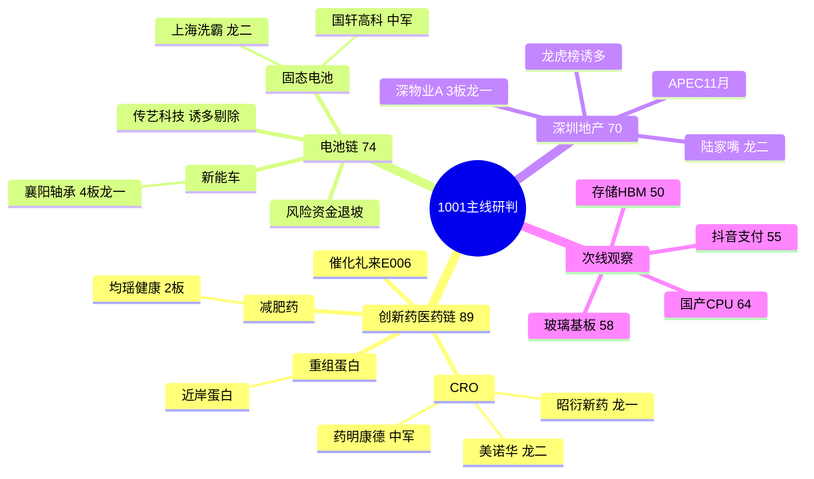

# 2026-10-01 · **主线研判**

> **数据源新鲜度**: partial
> **降级状态**: true
> **置信度**: 0.62

## 一句话结论

0930节前收官定格「**医药高低切+科技失血**」：唯一四源全确认主线=**创新药/医药链**（资金top11全占+热榜登顶+CRO涨停潮），电池链涨停潮第一但资金退坡、深圳地产3板高标但龙虎榜诱多——节后(1008)主攻医药，CPU/存储/玻璃基板是「KOL嘴盘vs资金背离」的假期预期差，竞价资金回流才做。

## 详细分析

**主线1 · 创新药/医药链(89分·cv1.0)** —— 0930最硬的主线事实。R7主力净流入top11全部是医药（创新药+41.51亿#1/医药医疗+37.9亿#2/CRO+27.27亿#3/减肥药+15.4亿#10/CAR-T+13.56亿#11），热榜创新药5→1登顶+CRO概念新进#2+重组蛋白新进#6，涨停潮（昭衍/美诺华/康希诺20cm/奥赛康/南华生物/贝瑞基因），R4礼来减重23%创纪录催化。**资金+热榜+涨停+事件四源全确认**，是全市场唯一cv1.0主线。风险面：E008美债5.62%创24年新高对创新药估值有medium-high压制，医药是防御性轮动而非情绪扩散，只做资金确认的龙一/龙二。

**主线2 · 电池链(74分·cv0.33)** —— 涨停家数全市场第一（新能车10家#1/储能9家#3/锂电7家#8/固态5家#17/风电8家#5），襄阳轴承4板全场第2高标+龙虎榜净买1.46亿+主力超大单强确认。**但资金在退坡**：0929固态+24.36亿#5→0930未进top15，R3明确「资金从电池切向医药」。涨停潮是情绪惯性，节后资金不回流则一日游概率大。只做龙一襄阳轴承/龙二上海洗霸竞价确认，尚水智能float 11.4亿硬剔除、传艺科技龙虎榜诱多硬过滤。

**主线3 · 深圳国资地产(70分·cv0.33)** —— 深物业A 3板全场并列第3高标+APEC 11月时间锚，人气强（深物业A 12→3/陆家嘴涨停/我爱我家surge+18）。**但资金分歧**：深圳特区-23.87亿流出 vs AH股+21.43亿#6，深物业A龙虎榜已标「涨停净卖出+机构净卖+疑似对倒」。只做龙一竞价弱转强确认，不做补涨接力。

**次线观察**：国产CPU/算力(64分)——R4三high事件+KOL 6人4群狂推但R7半导体-123亿流出，是最大假期预期差，等1008竞价资金信号；玻璃基板(58分)/存储(50分)/抖音支付(55分)资金未确认，仅观察。

## 关键证据

- 证据 1: R7主力净流入top11全医药·创新药+41.51亿#1·CRO+27.27亿#3 来源 R7_capital_flow.json
- 证据 2: THS创新药#1登顶(5→1)·CRO概念新进#2·重组蛋白新进#6 来源 R3_sentiment.json
- 证据 3: limit_cpt_list新能车10家涨停#1·储能9#3·锂电7#8·固态5#17 来源 tushare MCP
- 证据 4: 襄阳轴承4板全场第2高标·龙虎榜净买1.46亿+主力+2.45亿 来源 limit_step + R7
- 证据 5: 深物业A 3板但龙虎榜诱多(涨停净卖-1.8亿·机构净卖-1.45亿·疑似对倒) 来源 R7 lhb_bull_trap
- 证据 6: 美债5.62%创24年新高·高盛改12月加息·压制科技成长/创新药估值 来源 R4 E008

## 推理深度三问

- **大资金意图**: 0930主力资金明确从科技(半导体-123亿/国产芯片-122亿/存储-95亿)切向医药(创新药+41.51亿#1)——这是「高低切」的配置行为，不是防御避险，是医药CRO/减肥药/重组蛋白等低位细分补涨+礼来减重数据催化共振。对手盘是节前兑现的高标获利盘（龙虎榜诱多74/79=94%极值）与节后复市的增量资金。
- **为什么走强**: 位置（创新药指数30日-3.24%刚转正·低位补涨）+催化（礼来E006减重23%创纪录·热榜登顶）+筹码（CRO/重组蛋白资金大额净流入·北向连续5日+20亿）三维同向。科技走弱是位置（高位）+资金（流出）+筹码（出货）三维反向。
- **逻辑够不够硬**: 硬——创新药有R3 L1+L2+KOL 5群+R7资金#1+R4礼来事件四个独立源共振，且资金是硬事实（+41.51亿真金白银）。**证伪路径**: ①E008美债续升压制成长估值；②节后首板无溢价→医药防御轮动一日游；③龙虎榜诱多94%下涨停票被R6反证hard_reject。CPU/存储是「KOL嘴盘+事件强但资金背离」，逻辑不硬，只做预期差观察。

## mermaid · 主线三层结构

## 每票思维链

### 昭衍新药 603127（创新药·龙一）

- **买入理由**: ①CRO临床前龙头·礼来E006+CRO资金+27.27亿#3确认 ②10%涨停+热榜first_entry#11+CRO概念5家涨停领涨，float 309.5亿合规容量。
- **风险点**: ①医药防御轮动非情绪扩散·若节后首板无溢价一日游 ②E008美债压制创新药估值 ③龙虎榜诱多94%环境·涨停票须过R7过滤。
- **止损条件**: 竞价高开超3%不追；买入后破10%涨停价(49.30×0.93≈45.85)或跌破5日线离场；板块资金转负即弃。
- **可验证假设**: 节后(1008)竞价医药板块高开<3%且CRO资金继续净流入→弱转强成立可低吸；若高开>3%兑现或资金转出→证伪放弃。

### 美诺华 603538（创新药·龙二）

- **买入理由**: ①减肥药正宗(礼来E006+减肥益生菌发酵)·原料药基本面托底 ②10%涨停早封9:48有带动性·float 96.3亿合规。
- **风险点**: ①减肥药细分是板块内最强但波动大 ②首板无溢价则2板预期证伪 ③龙虎榜诱多环境需过滤。
- **止损条件**: 竞价高开超3%不追；破涨停价(28.59×0.93≈26.59)或跌破5日线离场。
- **可验证假设**: 节后竞价弱转强+医药资金延续→低吸参与；高开兑现或医药资金转出→证伪放弃。

### 襄阳轴承 000678（电池链·龙一）

- **买入理由**: ①4板全场第2高标·新能车链10家涨停#1领涨 ②龙虎榜净买1.46亿+主力+2.45亿+超大单+2.15亿三确认，float 59.2亿合规。
- **风险点**: ①4板高位·节前高标兑现压力极端(Jason'不涨停就出货') ②电池资金退坡(固态0929#5→0930未进top15)·板块一日游风险 ③龙虎榜疑似对倒标记需警惕。
- **止损条件**: 只做竞价弱转强/分歧承接；破位(12.89×0.93≈11.99)或高开兑现即弃；资金转出即弃。
- **可验证假设**: 节后竞价弱转强+电池资金回流→可参与；高开兑现/资金继续流出→证伪放弃。

### 深物业A 000011（深圳地产·龙一）

- **买入理由**: ①3板全场并列第3高标·深圳国资引爆点·APEC 11月时间锚 ②热榜12→3人气top1·比价补涨逻辑(深振业/建科院)。
- **风险点**: ①龙虎榜诱多(涨停净卖-1.8亿·机构净卖-1.45亿·疑似对倒)·游资高位兑现盘 ②深圳特区-23.87亿流出·资金未全面确认 ③题材脉冲非产业·APEC时间锚中期。
- **止损条件**: 只做竞价弱转强确认；高开兑现/低开无承接放弃；破位(12.24×0.93≈11.38)即弃。
- **可验证假设**: 节后竞价弱转强+AH股资金延续→参与龙一；竞价高开兑现或资金转出→证伪放弃·不做补涨。

## 数据源审计

| 源 | 日期 | 状态 | 备注 |
|---|---|---|---|
| tushare/limit_cpt_list | 2026-09-30 | 🟢 | 20条 · 强板块新能车10#1/储能9#3/锂电7#8/固态5#17 |
| tushare/limit_step | 2026-09-30 | 🟢 | 12条 · 7板新华传媒/4板襄阳/3板深物业九阳善水时代万恒 |
| tushare/limit_list_d | 2026-09-30 | 🟢 | 55条 · 涨停52家·医药系霸榜 |
| tushare/daily_basic | 2026-09-30 | 🟢 | 60条 · 候选龙头流通市值核实 |
| R1_style | 2026-10-01 | 🟢 | 连板情绪型·高标孤岛·情绪65·仓位上限60% |
| R3_sentiment | 2026-10-01 | 🟢 | 5主题 · 创新药rank1四源共振 |
| R4_news | 2026-10-01 | 🟢 | 8事件 · 礼来/美债/CPU/昇腾 |
| R7_capital_flow | 2026-10-01 | 🟢 | 北向+20.79亿·创新药+41.51亿#1·龙虎榜诱多74/79 |
| factor_snapshot | — | 🔴 | 目录不存在 · top_ir_factors.json缺失 · 因子层跳过 |
| weflow_analytics | — | 🔴 | 永久下线(2026-08-19) · 不计扣分 |

## 不确定性 / 反证

1. **KOL嘴盘vs资金背离是全篇最大张力**: KOL 4群狂推国产CPU(综艺股份走龙·交货期25-30周·DeepSeek昇腾)但R7半导体-123亿/国产芯片-122亿流出——节后若科技资金回流CPU是最大预期差，若资金继续切医药CPU一日游。**本产出不赌方向，CPU全部降级观察。**
2. **E008美债5.62%创24年新高**：对科技成长/创新药估值双压制——若长假期间美债续升，节后(1008)创新药也可能被估值杀拖累，需P1竞价校准。
3. **龙虎榜诱多74/79=94%极值**：深物业A/尚水智能/传艺科技/五方光电全被标「涨停净卖出/机构净卖/疑似对倒」——高位兑现压力极端，任何涨停票必须过R7过滤+R6反证，本产出已硬过滤传艺/尚水。
4. **电池链资金退坡**：涨停潮第一但资金未进top15，若节后资金不回流，「涨停潮惯性」会被证伪为一日游——D1须按cv0.33降级watch，只做龙一竞价确认。

## 与其他 R/D/E 的关系

- 依赖: data/research/20261001/R1_style.json · R3_sentiment.json · R4_news.json · R7_capital_flow.json
- 被消费: filter_leader_v1(已内置leader_rank/execution_eligible) · R5(龙头画像) · R6(反证·cv0.33/0.33线重点反证) · D1(execution_pool·cv排序) · E1(复盘)

## Sub-Agent 元数据

- skill: analyze_main_sectors_v1
- artifact: data/research/20261001/R2_main_sectors.json
- 生成耗时: 约 15 分钟
- model: deepseek-v4-flash-ga-260731
