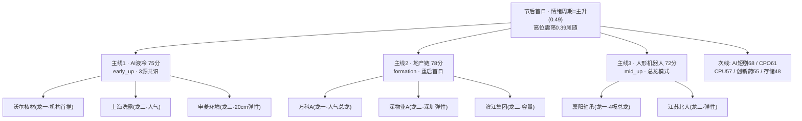

# 2026年10月8日 · **主线研判**

> **数据源新鲜度**: partial 🟡
> **降级状态**: true（R1 degraded、因子层缺失、资金口径节前）
> **置信度**: 0.64

## 一句话结论

🟢 节后首日叙事/共振先行、资金待回补：**液冷（唯一3源共识）> 地产（情绪重启）> 机器人（靠总龙）**，中位杂毛一律不做。

## 详细分析

### 🥇 主线一 · AI液冷/机柜热管理（75分 · 主升早期 · 唯一3源共识）

这是今日**跨源验证最扎实**的方向：R4 硬事件（E003，小摩测算 Rubin Ultra 液冷快接头单柜价值翻倍至 2.05 万美元，OCP 峰会聚焦液冷）+ R3 rank2 L1+L2 共振（上海洗霸 DC7/THS20、松芝股份新进热榜）+ 隔夜美股 GLW +6.02% 情绪映射。

**大资金意图**：机构在节后第一个交易日为「机柜 BOM 价值上修」定价，沃尔核材作为快接头最直接映射获得 R4 首推，属于认知先行、等待买盘回补的状态。
**为什么走强**：叙事新鲜（CoreWeave 已上线 Vera Rubin NVL72，Rubin 试产 2026Q4），且价值量翻倍是可量化的硬催化，不是模糊口号。
**逻辑够不够硬**：中短期情绪硬，业绩兑现远（Ultra 量产 2027H2）——所以这是**纯情绪博弈线，仓位只跟龙头封单走**，不能拿长线逻辑给短线仓位壮胆。

⚠️ 关键矛盾：R7 的 9/30 口径里电子板块单日净流出 150 亿、科技是最大流出方。今日是「资金流出 + 新催化」的**分歧修复预期**，11:35 R7 增量若仍无流入，D1 必须降仓。

**首推票思维链 · 沃尔核材 002130**
- **买入理由**：快接头价值翻倍主线 A 股最直接映射，机构认知度最高，兼具人气与容量
- **风险点**：机构首推易被先手抢成一字；2027 年才兑现业绩，封单松动则退潮快
- **止损条件**：跌破启动平台/10日线，或封板后炸板不回封（参考 R4 给出的 5-8% 硬止损区）
- **可验证假设**：竞价封单量级进入板块前列且开盘后 30 分钟不炸；若一字则等开板回封，不缩量追

### 🥈 主线二 · 地产及地产链（78分 · 启动/重启首日）

R3 rank1 L1+L2：万科 A 双平台 avg_rank=1.5、深物业 A DC 第3、我爱我家 rank_momentum 26→8。催化来自假期港股地产走强 + 深圳地产消息，G5 一手群确认节前尾盘地产抢筹凶猛，游资协同（万科 A/深物业 A 各 4 席位）。

**大资金意图**：先手资金在节前尾盘低成本抢跑政策预期，节后试图借港股映射和人气霸榜拉出持续性。
**为什么走强**：情绪+政策博弈，人气榜多票霸榜是真实的关注度证据。
**逻辑够不够硬**：**偏软**——R4 无公告级硬事件、R7 moneyflow 板块榜无地产（cross_validation 仅 0.33）。定性分能过 70 靠的是热度(19)+共振(18)，所以它只能按「重启首日」对待：竞价封单承接确认才进，无承接的高开直接降级观察。

梯队处理上有两个明确动作：滨江集团（9/29 板 + 9/30 不破板 + LHB 净买 1.93 亿）作为容量龙二保留；我爱我家虽 momentum 最强，但 9/30 前期涨停后转跌、资金兑现，已标 **高位派发嫌疑**，只降候补——只有弱转强放量上板才能证伪，低吸坚决不碰。

### 🥉 主线三 · 人形机器人/物理AI（72分 · 主升中段 · 总龙模式）

叙事增量是 AMD 82 亿美元收购 World Labs、英伟达开源 GR00T 1.7（为「大脑」定价），上半年全球出货 2.2 万台同比 +300%。但板块年内反复活跃、R4 八个硬事件中无机器人条目，所以它入围主线靠的是**个股资金证据全场最硬**：襄阳轴承 4 连板、LHB 净买 1.46 亿、5 席位（机构+深股通+知春路）协同，同时满足「连板高度 top1 + 资金 top1」。

**大资金意图**：围绕唯一高标做总龙博弈，后排只是供血材料。
**为什么走强**：高度+资金+席位三确认，不是无龙头的普涨。
**逻辑够不够硬**：只够支撑「做总龙」这一件事——4 板后 T+1 博弈最激烈，中位补涨一律不进 execution，龙二江苏北人仅作弹性跟随。整条线只输出 2 只票是有意为之（leaders_degraded=true），宁缺毋滥。

## 关键证据

- 证据 1: R4 E003 液冷快接头单柜价值翻倍（high 0.76），R4 首推沃尔核材 · 来源 R4_news
- 证据 2: R3 rank1-3 全部为 L1+L2 双源共振，地产/液冷/机器人主题明确 · 来源 R3_sentiment
- 证据 3: 襄阳轴承 LHB 净买 1.46 亿 + 5 席位协同，4 连板高度确认 · 来源 R7 LHB
- 证据 4: 9/30 电子 -150 亿、存储 -95 亿（流出），医药生物 +61.9 亿（流入）· 来源 R7 moneyflow
- 证据 5: 隔夜美股 GLW +6.02%/AVGO +3.67%/AMD +2.80%，唯 MU -1.73% 偏弱 · 来源 R7 overseas

## 次线一览（不进主推）

| 板块 | 分数 | 处置 | 理由 |
|---|---|---|---|
| AI短剧/传媒 | 68 | 观察·前排试错 | 假期C端爆发首日，新华传媒6板；R4仅medium，差2分未过线 |
| CPO/TFLN | 61 | 观察 | 新分支+GLW映射，但节前资金流出、需放量反包确认 |
| 国产CPU | 57 | 观察 | R4最高分事件(0.82)但缺热榜共振，资金流出科技 |
| 创新药 | 55 | 观察(防御轮动) | R7资金单源最强，但R3无共振R4无催化，资金单源不立主线 |
| 存储芯片 | 48 | 拦截 | 涨价high 与 资金流出-95亿/MU-1.73% 直接背离 |

## 数据源审计

| 源 | 状态 | 抓取时间 | 记录数 | 备注 |
|---|---|---|---|---|
| R3_sentiment | 🟢 ok | 2026-10-08 | 5主题 | 双源健全 |
| R4_news | 🟢 ok | 2026-10-08 | 8事件 | 双源合并 |
| R7_capital_flow | 🟡 stale | 2026-10-08 | 15板块 | 9/30口径，时点错位 |
| R1_style | 🔴 degraded | 2026-10-08 | - | 已落盘但severity=2，基线可用 |
| factor_snapshot | 🔴 error | — | 0 | 周度任务未跑 |

## 不确定性 / 反证

今日最大的结构性风险是**资金维全部基于 9/30 节前口径**：节前科技被大幅兑现，而假期科技催化最密集——三条主线的 cross_validation 有两条仅 0.33，本质是在赌「节后资金回补叙事」。若竞价地产无封单承接、液冷龙头封单量级不足、襄阳轴承核按钮三者出现任意两个，说明资金不认可节后叙事，当日主线数应砍到 1 条甚至转纯观察。存储线已出现叙事与资金背离的反例，提示「假期好消息 ≠ 节后买盘」。最终硬否决留待 R6 裁决。

## 与其他 R/D/E 的关系

- 依赖: R1_style（degraded，情绪基线70可用）、R3_sentiment、R4_news、R7_capital_flow
- 被消费: filter_leader_v1（龙头硬过滤，下一步）、D1 主决策、R6 反证
- 特别提示 D1: execution_pool 优先 cross_validation≥0.67 的液冷；地产/机器人只围绕前排；11:35 R7 增量是资金回补确认的关键时点

## Sub-Agent 元数据

- skill: analyze_main_sectors_v1@1.2
- artifact: data/research/20261008/R2_main_sectors.json
- 生成耗时: 约 180 秒
- model: ark-code-latest
