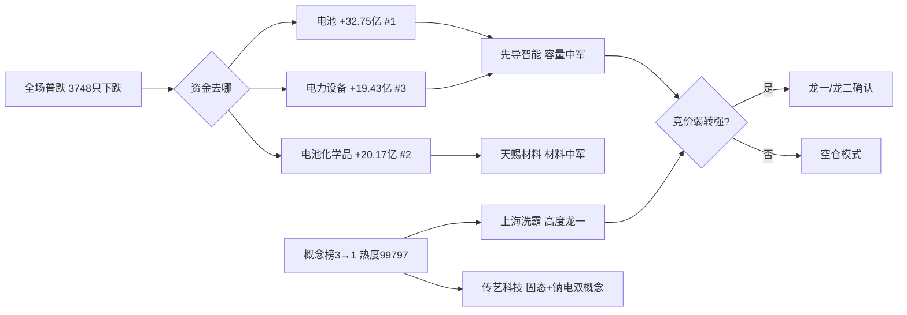

# 2026年10月9日（周四） · 主线研判

> 数据源新鲜度: partial（上游4源齐备 · 因子层缺失）
> 降级状态: false（五维可完整打分）
> 置信度: 0.70

## 一句话结论

全场退潮日只有一条线：固态电池/新能源链，四源共识 1.0；油气是最强叙事但板块效应为零，只配做事件驱动次线。

## 段位先认（先认市场，再认个股）

- R1：震荡分化偏退潮，情绪 48，炸板率 42.7% 破 40% 退潮线，昨日涨停溢价 −1.85%（打板隔日亏钱），仓位上限 35%。
- R3：情绪 50，创新药霸榜退潮、CPO 为 FCC 利空下的负向热度，均不加分。
- 结论：高位震荡段位，只做独主线龙一的弱转强确认，不做中位补涨、不抄底科技。

## 五维打分总表

| 排名 | 板块 | 热度 | 资金 | 涨停 | 叙事 | 共振 | 总分 | 裁决 |
|---|---|---|---|---|---|---|---|---|
| 1 | 🔋 固态电池/新能源链 | 18 | 19 | 17 | 14 | 16 | **84** | ✅ 核心主线（≥70） |
| 2 | ⛽ 油气/能源资源链 | 12 | 11 | 8 | 19 | 8 | 58 | 🟡 事件驱动次线 |
| 3 | 🛰️ 卫星通信/手机直连 | 13 | 7 | 10 | 16 | 9 | 55 | 🟡 次线（观察） |

## 核心主线：固态电池/新能源链（84分 · 主升早中段）

生命周期：运行约 6 个自然日（0929 电池板块主力首次回流 21.75 亿/rank3 → 0930 延续 9.98 亿 → 1008 加速 32.75 亿/rank1），龙头高度为首板潮、无连板高标 → `mid_up/early_up`，可做龙头龙二，禁中位补涨。

### 候选梯队

| 角色 | 代码 | 名称 | 1008 | 类型 | 认定依据 | T+1 博弈位置 |
|---|---|---|---|---|---|---|
| 龙一（容量） | 300450.SZ | 先导智能 | +7.58% | 波段趋势 | 电池/电力设备/锂电设备三板块共同 lead_stock | 弱转强·中军 |
| 龙一（高度） | 603200.SH | 上海洗霸 | 涨停 | 连板妖股 | 固态电解质领涨，热榜首位 | 二板卡位 |
| 龙二 | 002866.SZ | 传艺科技 | 涨停 | 连板妖股 | 固态+钠电双题材共振（R3 rank1+rank2） | 联动/分离卡位 |
| 龙二 | 002709.SZ | 天赐材料 | +4.78% | 波段趋势 | 电池化学品 lead_stock，板块+20.17亿 | 趋势低吸 |
| 候补 | 603906.SH | 龙蟠科技 | 涨停 | 波段趋势 | 热榜 lead_stocks，辨识度次之 | 补涨 |

### 推理深度三问（主线层）

- 大资金意图：电子 −233 亿、半导体 −160 亿、通信 −100 亿遭恐慌抽水，资金切向低位制造，电池链三个子行业包揽流入前三——是高低切换下的主动进攻，不是防御抱团。
- 为什么走强：产业锚双硬——十五五规划 2030 全固态初步规模化；10 月头部 6 家电池厂排产 214.6GWh 同比 +57%。普跌日唯一有板块宽度的逆势方向。
- 逻辑够不够硬：趋势逻辑硬，但当日缺新的官方硬催化（R4 仅 E006 medium 单源），持续性靠钱不靠消息——故只认竞价承接，不提前信仰。

### 每票验证假设（非买卖指令，买点/止损归 D1）

- 先导智能：假设=独主线唯一性带来弱转强溢价；证伪=竞价低开无承接或高开 >5% 后回落。
- 上海洗霸：假设=二板卡位成功带动板块；证伪=竞价封单不实、打板客核按钮（流通盘偏小，高波动）。
- 传艺科技：假设=钠电同步走强支撑双概念；证伪=两题材任一退潮。
- 天赐材料：假设=材料环节获机构持续加仓、退潮日抗跌；证伪=放量跌破前一日资金流入区间。
- 龙蟠科技：假设=前排买不到时补涨外溢；证伪=前排分歧则同步撤销。

已剔除：尚水智能（+19.98% 但席位净卖 0.82 亿、拉萨散户接盘，R7 诱多 flag）；一切未涨停、资金排名 5 名外的中位补涨股。

## 次线说明

- ⛽ 油气/能源资源链（58）：R4 双 high（中东升级 weighted 0.801 + 广汇能源预增 167–177% weighted 0.693，板块 net 1.494 全场最高），但事件全在盘后/凌晨，1008 收盘口径无涨停潮、无板块主力净流入、R3 无主题——板块效应为零，严守纪律不越级提主线。交 D1 按竞价油气股集体高开与封单决定是否小仓试错；关注中国石油、广汇能源、中国海油；双刃剑：同时砸航空与成长，停火即证伪。
- 🛰️ 卫星通信/手机直连（55）：R4 high + R3 rank5，但 1008 板块 −1.62%、通信为资金净流出重灾区，只看华力创通、南京熊猫的最强承接。

## 关键证据

- 证据 1：R7 电池 +32.75 亿（#1）、电池化学品 +20.17 亿（#2）、电力设备 +19.43 亿（#3），全链霸榜 · 来源 tushare moneyflow_ind_dc
- 证据 2：R3 固态电池概念榜 3→1，热度 17307→99797，rank1 L1+L2
- 证据 3：R1 涨停板块 up_nums 前列储能 10/锂电池 9/新能源车 8，三者同链，独主线判定
- 证据 4：R4 油气 net_weighted 1.494 全场最高但无盘口确认 · 来源 R4 sectors_catalyzed

## 数据源审计

| 源 | 状态 | 口径时间 | 记录数 | 备注 |
|---|---|---|---|---|
| R1_style | 🟢 ok | 06:35 | 1 | 非降级 |
| R3_sentiment | 🟢 ok | 06:45 | 5主题 | R3自身degraded=true(WeFlow下线),但top5完整 |
| R4_news | 🟢 ok | 07:44 | 8事件 | 三硬源齐备 |
| R7_capital_flow | 🟢 ok | 06:27 | 15板块 | 1008收盘真实资金 |
| factor_snapshot | 🔴 error | — | 0 | 因子层降级 |
| WeFlow | ⚫ 永久下线 | — | — | 2026-08-19 起 |

## 不确定性 / 反证

- 八板高标新华传媒 1009 若核按钮（其自身已被 R7 检出涨停净卖出 0.85 亿），情绪正式滑入主跌，全部接力候选撤销。
- 主线无当日官方催化，若电池链竞价集体高开低走，则"独主线"转为"独大坑"，仓位应降至 20% 以下。
- R6 尚未运行，霸榜出货等硬否决结论以 R6 为准，本研判不预设豁免。

## 与其他 R/D/E 的关系

- 依赖：R1_style / R3_sentiment / R4_news / R7_capital_flow
- 被消费：filter_leader_v1（龙头硬过滤，同文件原地更新）→ D1 主决策、R6 反证、E1 复盘

## Sub-Agent 元数据

- skill: analyze_main_sectors_v1@1.2
- artifact: data/research/20261009/R2_main_sectors.json
- model: ark-code-latest
- 因子层: 降级（factor_layer_degraded=true）
