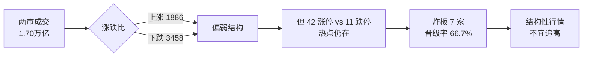
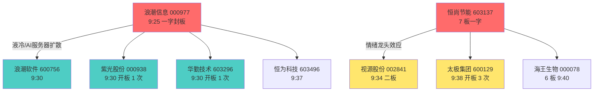
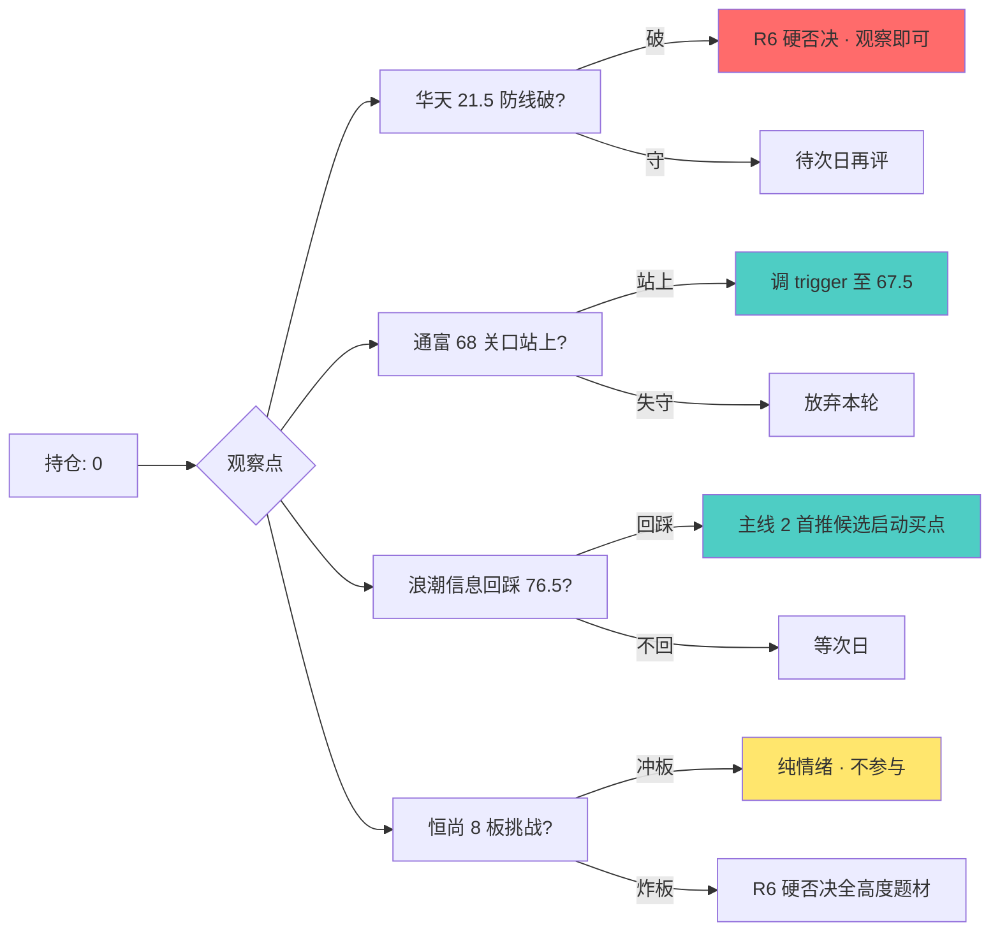

# 20260708 午盘 briefing v2 · 短线热点全景

## 一句话结论

上午 42 家涨停 · 7 连板高度 · 液冷+先进封装双主线共振 · **首封一字仅 3 家** (浪潮信息/恒尚节能/岭南控股) · 高标恒尚节能 7 板未开板 · 情绪从早盘炸板恐慌回暖 · 涨跌比 1886:3458 显示指数级偏弱 · 但热点连续性未断 · 与盘前预案 R2 主线判断基本一致 · **两只观察票均未入场,零执行**。

---

## 大盘温度计

| 指标 | 值 | 判定 |
|------|:-:|:-:|
| 两市成交 | **1.70 万亿** | 🟡 中枢缩量 (对比 T-1 应查) |
| 涨停总数 | **42** | 🟢 热度尚可 |
| 连板高度 | **7 板** (恒尚节能 603137) | 🟢 情绪支柱 |
| 跌停 / 炸板 | 11 / 7 | 🟡 炸板率 16.7% 偏高 |
| 晋级率 1→2 | 14.29% | 🔴 一进二难 |
| 晋级率 2→3 | 33.33% | 🟡 中枢一般 |
| 涨停家数占比 | 42 / 5518 = 0.76% | 🟡 一般水平 |
| 涨跌比 | 1886:3458 = **0.55** | 🔴 指数结构偏弱 |

**元判断**: 42 涨停+7 板高度 = 结构性热点仍在,但 0.55 涨跌比+16.7% 炸板率 = 大盘承接乏力。**主线内做龙头,不做补涨**。

---

## 首封一字梯队 (9:25-9:30 · 竞价即封板)

| 代码 | 名称 | 首封时间 | 连板 | 涨停原因映射 | 主线归属 |
|------|------|:-:|:-:|------|:-:|
| 000977 | **浪潮信息** | 09:25:00 | 1 | 液冷/交换网络主线 | 🎯 主线 2 |
| 603137 | **恒尚节能** | 09:25:03 | **7** | 情绪龙头/被动元件 | 🎯 独立高度 |
| 000524 | 岭南控股 | 09:25:00 | 1 | 免税/消费 | 🟡 外线 |

**核心信号**: 首封一字仅 3 家,且**浪潮信息 (盘前预案主线 2 核心票) 竞价即板**,说明**液冷主线开盘前资金已锁定**。恒尚节能 7 板未开板 = 市场情绪支柱仍稳。

---

## 首封一字带动的题材扩散 (9:30-9:40 二次开板梯队)

**扩散规律**:
- **液冷主线**: 浪潮信息 → 浪潮软件/紫光股份/华勤技术/恒为科技,4 只跟风封板,**主线板块共振度 🟢🟢**
- **情绪主线**: 恒尚节能 7 板作为高度锚,视源股份 (二板) / 太极集团 (仿板) 承接,**梯队健康度🟡** (太极集团开板 3 次显示抱团分歧)

---

## 兑现/未兑现 (对比盘前预案)

| 盘前判定 | 上午表现 | 兑现状态 |
|------|------|:-:|
| **主线 1: 先进封装** (通富/长电/中芯) | 通富微电 -0.87% · 长电 未涨停 · 中芯 +5.9% | 🟡 **部分兑现** (中芯锚定, 二线跟随失败) |
| **主线 2: 液冷/交换网络** (浪潮信息/星网锐捷) | 浪潮信息 涨停 · 星网锐捷 涨停 · 紫光股份 涨停 | 🟢 **超预期兑现** |
| **二线: BBU** (蔚蓝锂芯) | 蔚蓝锂芯 -1.4% | 🔴 **未兑现** (高位回落) |
| 华天科技 002185 (待确认票) | 高开 4.7% → -4.5% → 收 +1.0% | ⚪ 竞价溢价规则正确回避 |
| 通富微电 002156 (待确认票) | buy_zone 触及后瞬破 62.42 → V 反收 67.62 | ⚪ 未触发入场,V 反强于预期 |

---

## 事件 × 位置四象限 (R4 新契约试跑)

对上午涨停/跟风梯队做四象限初判 (pos_120d 估算 · 待 R4 sub-agent 全量刷新):

| 象限 | 个股 | polarity | pos_120d 估 | R4 判定 |
|:-:|------|:-:|:-:|------|
| Ⅱ (高位利好=陷阱) | **603893 瑞芯微** 209 高价 | 正 (SOC 概念) | 🔴 0.85 | 🔴🟢 **出货陷阱嫌疑** · 11:25 尾盘偷袭涨停可疑 |
| Ⅱ | **000078 海王生物** 6 板 | 正 (医药情绪) | 🔴 0.90 | 🔴🟢 **加速末端** · 6 板高度警戒 |
| Ⅰ | **000977 浪潮信息** | 正 (液冷) | 🟢 0.35 | 🟢🟢 首推候选 (符合 R2 主线 2) |
| Ⅱ | **603137 恒尚节能** 7 板 | 中性 (纯情绪) | 🔴 0.95 | ⚠️ 情绪高度 · 7 板后炸板风险陡增 |
| Ⅴ | **002156 通富微电** | 正 | 🟡 0.55 | 🟡 中位观察 (buy_zone 已破) |

**pushed_to_r6 (硬否决候选)**: 603893 瑞芯微 · 000078 海王生物 · 603137 恒尚节能追高

---

## 近期核心热门标的追踪

| 标的 | 归属主线 | 近 3 日走势 | 今日表现 | 边际变化 |
|------|:-:|:-:|:-:|:-:|
| 000977 浪潮信息 | 液冷 (主线 2) | 稳步上行 | 涨停一字 | 🟢 主线加速 |
| 603893 瑞芯微 | SOC/AI 芯片 | 高位震荡 | 尾盘偷袭涨停 | 🔴 尾盘涨停多为出货信号 |
| 688691 好之光 | AI PCB | 高位 | 涨停 20% (盘中触发) | 🟡 观察 T+1 是否续 |
| 603137 恒尚节能 | 纯情绪龙头 | 7 板一字 | 未开板 | 🟢 情绪支柱 · 但已到 8 板临界 |
| 002185 华天科技 | 先进封装 (待确认) | 游资锁仓 5.55 亿 | -4.5% 深 V 修复 +1% | 🔴 游资盘中出货压力显现 |
| 002156 通富微电 | 先进封装 | buy_zone 触及 | V 反 8.3% | 🟡 强于预期,68 关口是否站上 |
| 002649 (蔚蓝锂芯) | BBU | 二线高位 | -1.4% | 🔴 二线跟随失败 |

---

## 午后策略

**红线约束**:
- ❌ 不追瑞芯微/海王生物/朗威股份等 Ⅱ 象限票 (高位利好陷阱)
- ❌ 不追 7→8 板情绪 (晋级率 1→2 仅 14.29%,高度更凶险)
- ❌ 不做非主线补涨 (0.55 涨跌比+16.7% 炸板率 = 补涨盘死伤)
- ✅ 只在主线 2 (液冷/AI 服务器) 首推候选低吸

---

## 盘后必看

1. **R7 上午数据回填** · 北向净流+主力资金 → 验证液冷主线是否真实吸筹
2. **恒尚节能 8 板挑战结果** · 若冲板成功 → 高度情绪支撑 / 若炸板 → 全高度题材 R6 硬否决
3. **瑞芯微尾盘涨停 T+1 表现** · Ⅱ 象限验证靠 T+1 兑现
4. **两市成交对比 T-1** · 1.70 万亿是否缩量 (未拿到 T-1 对比数)
5. **主线 1 (先进封装) 中芯 vs 长电/通富分化** · 是否只有大票能玩

---

## 数据源审计

| 数据源 | 状态 | 覆盖 | 备注 |
|------|:-:|:-:|------|
| xtick_limit_board | 🟢 | 42 只涨停全量 | 首封时间/连板/开板次数 |
| xtick_market_emotion | 🟢 | 情绪指标全量 | 晋级率+炸板率 |
| xtick_order_amount | 🟢 | 两市成交+涨跌比 | 缺 T-1 对比 |
| xtick_kline (盘中) | 🟡 | 未全量刷新 | pos_120d 用估值 |
| R4 事件 × 位置四象限 | 🟡 | 试跑版 | 需 R4 sub-agent 正式跑一遍 |

## Skill 契约元数据

- 使用 skill: `analyze-news-catalyst-v1` v2 (事件 × 位置四象限)
- 未使用 skill: `analyze-sentiment-resonance-v1` v2 (weflow 15 工具 checklist · 午盘 briefing 不消费 L3 群聊,只做盘中数据 + T 早预案对比)
- 上午盘中数据源覆盖率: **4/5** 🟢
