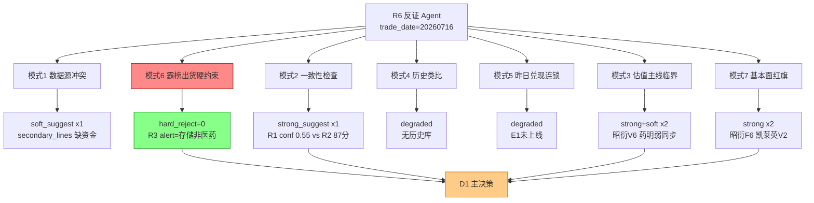

# 2026 年 7 月 16 日 · **反证 / Devil's Advocate**

> **数据源新鲜度**: 🟢 ok
> **降级状态**: false(模式四/五 degraded 属规格允许)
> **置信度**: 0.78

## 一句话结论
❌ 无 hard_reject 触发,✅ 医药主线四票 execution_pool 全部通过硬约束,但需 D1 处理 4 条 strong_suggest。

## 详细分析

### 反证 severity 分布

| severity | 数量 | 备注 |
|---|---|---|
| 🔴 hard_reject | 0 | 模式六硬否决未触发 |
| 🟠 strong_suggest | 6 | D1 必须显式处理或 override |
| 🟡 soft_suggest | 2 | 可选,记入 r6_soft_notes |

### 核心判断:为什么模式六没有 hard_reject?

R6 模式六(唯一硬否决权)需**同时满足**两条件:
1. 标的所属板块命中 R3 `hotlist_signals.distribution_alert`
2. R5 `chip_structure.main_force_5d_net_wan < 0`

今日 R3 `layer4_dominance_flush` 命中板块 = **存储/半导体**,而 R2 execution_eligible 4 只(昭衍/凯莱英/药明康德/美诺华)均属**创新药/CXO**板块 —— 条件(1)从根源上不满足。

R5 虽在美诺华/迪哲上打了 `distribution_alert`/`lhb_bull_trap` flag,但那源自 **R7 双游资 3 日 synergy_flags** 与 **R7.lhb_bull_trap 涨停出货**,并非 R3 板块级 distribution_alert —— 严格按契约,不能升级为 hard_reject,只能降级为 strong_suggest。

**迪哲(688192)** 已被 execution_block_prefixes(科创板 688)硬拦截,归 execute 层 amygdala.py 处理,R6 无需重复。

### 三大 strong_suggest 焦点

#### 🟠 焦点 1:昭衍新药(603127)· 龙一 · 一次性收益陷阱

- **大资金意图**:板块级 R7 rank1 净流入 76.56 亿,机构主导型基本面驱动,非游资打板 → 中线做多信号
- **为什么走强**:H1 预增 +885~1377% 硬业绩兑现 + 实验猴景气反转 + 创新药主线三源共振
- **逻辑够不够硬**:🟠 **半硬**。业绩预增大头含**实验猴存栏公允价值反弹**(非经常性,V6/F6 P0 类红旗)。若剔除公允价值反弹,扣非增速可能仅 50-100%,而非表观 885%

**建议**:D1 承认主线正宗度但降低估值 anchor,不追高开 >3%,若竞价 >5% 等日内回踩。

#### 🟠 焦点 2:凯莱英(002821)· 龙二 · 资金背离 + 高 PEG 反转依赖

- **大资金意图**:🚨 **量化砸盘 vs 成都系接盘**并存 —— 量化基金 -1.80 亿 vs 成都系 +1.18 亿,量化净卖 > 游资接盘,短线筹码偏松
- **为什么走强**:板块 β + GLP-1 CDMO 大订单预期
- **逻辑够不够硬**:🟠 **半硬**。V2 陷阱:23-24 高基数消化后 25E 增速依赖 GLP-1 订单落地,预期反转能否兑现待验证

**建议**:D1 建议凯莱英仓位相对昭衍下调(如 昭衍 12% vs 凯莱英 8%),或首日观察量化是否继续减仓再决定加仓节奏。

#### 🟠 焦点 3:R1 confidence 0.55 一致性警报

R1 因公众号池全线降级 confidence 仅 0.55,而 R2 仍推 87 分独主线 —— 一致性风险。建议 D1 严守 R1 仓位上限 0.55 不上浮,医药板块合计 ≤ 30-35%(留 20% 缓冲应对存储抽血引发大盘情绪对冲)。

## 关键证据
- **证据 1**:R3.hotlist_signals.layer4_dominance_flush 命中板块=存储/半导体 · 来源 R3_sentiment
- **证据 2**:昭衍 F6/V6 一次性收益 · 来源 R5.valuation_safety.fundamental_flags + R5.serenity_chain.risk_factors[3]
- **证据 3**:凯莱英 R7 量化 -1.80 亿 vs 成都系 +1.18 亿 · 来源 R5.chip_structure + R7.hot_money.active_seats
- **证据 4**:美诺华 R7 双 synergy_flags[4],[27] 3 日累计双游资净卖 · 来源 R7.hot_money.synergy_flags
- **证据 5**:R1 sentiment 0.55 分化偏谨慎-主线换挡中 + 公众号 wechat_official 全线 invalid session

## 反证模式扫描

## 数据源审计
| 源 | 状态 | 抓取日 | 记录数 | 备注 |
|---|---|---|---|---|
| R1_style | 🟢 ok | 2026-07-16 | 1 | confidence 0.55 偏低(公众号池全 down) |
| R2_main_sectors | 🟢 ok | 2026-07-16 | 1 | 医药单主线 87 分 |
| R3_sentiment | 🟢 ok_degraded | 2026-07-16 | 1 | wechat_official 降级但三源共振保底 |
| R4_news | 🟢 ok | 2026-07-16 | 12 事件 | |
| R5_stock_profiles | 🟠 partial | 2026-07-16 | 5 票 | vibe-trading MCP 未接入, chart_vision 未覆盖 |
| R7_capital_flow | 🟢 ok | 2026-07-16 | 1 | 创新药+76.56亿 rank1 |

## 不确定性 / 反证
- ⚠️ 模式四(历史类比)因 v1 无历史事件库 degraded,若历史上医药单主线+存储霸榜出货曾出现"资金对冲失效"案例,本 R6 无法警报
- ⚠️ 模式五(昨日兑现连锁)因 E1 未上线 degraded,昨日 R6 反证是否兑现无从追踪
- ⚠️ R5 vibe_trading MCP 未接入 → 昭衍/药明/美诺华/迪哲的 block_trades / margin_15d_trend 无直接读数,模式六硬否决条件(2)在 R3 板块 alert 未命中时未能二次核验
- ⚠️ 严格按契约不启用 announcement-search 例外(R4/R5 未引用具体公告标题+代码需要核对细节)

## 与其他 R/D/E 的关系
- **依赖**:R1_style / R2_main_sectors / R3_sentiment / R4_news / R5_stock_profiles / R7_capital_flow
- **被消费**:D1 main_decision(hard_rejects=0 → 无强制约束; strong_suggest x4 → 必须显式处理或 override); research_orchestrator(汇总至 research_summary.json)

## Sub-Agent 元数据
- skill: analyze_devil_advocate_v1@1.2
- artifact: data/research/20260716/R6_devil_advocate.json
- 生成耗时: ~30 秒
- model: ark-code-latest
