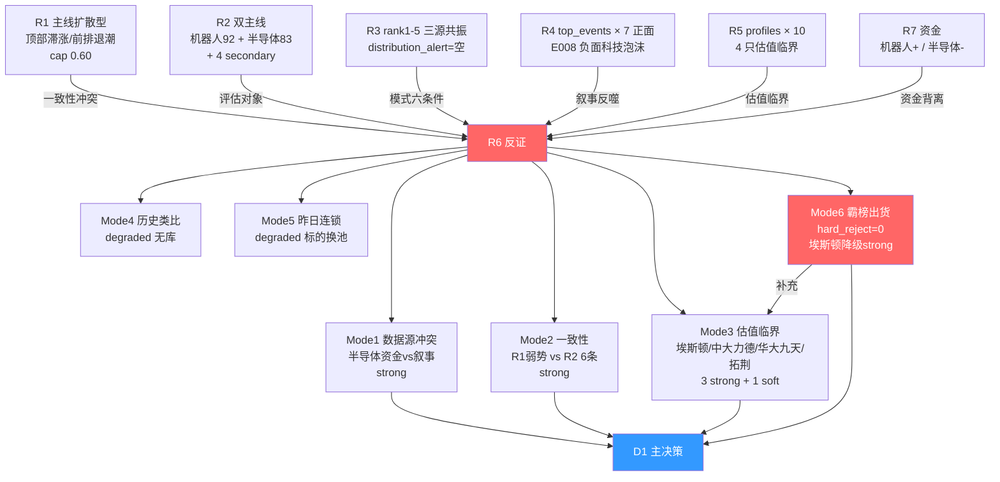

# 2026年7月6日 · 反证 / Devil's Advocate

> 🟢 **数据源新鲜度**: ok
> 🟢 **降级状态**: false
> 🟢 **置信度**: 0.82 · 上游 R1/R2/R3/R4/R5/R7 全绿

## 一句话结论

**hard_reject = 0 · strong_suggest = 5 · soft_suggest = 3。半导体自主主线是最大资金 vs 叙事背离(R7 三细分同占 top-outflow 前五),需以 R1 position_cap≤0.60 兜底。**

---

## 详细分析

### 一 · 主线结构反证 —— 半导体资金空,机器人才是硬主线

R2 双主线设定 —— 机器人 92 分、半导体自主 83 分 —— 表面均衡,但 R7 资金面撕开一道致命裂缝:

| 主线 | R7 资金分维(R2 给) | R7 top-inflow | R7 top-outflow | 结论 |
|---|---|---|---|---|
| 人形机器人 | 20/20 | 机器人概念+143.74亿(#1)、人形机器人+113.78亿(#3)、特斯拉概念+84.39亿(#4)、减速器+61.04亿(#10) | 无 | 🟢 四细分同上榜,资金压倒性 |
| 半导体自主 | **12/20** | 无独立细分 | **半导体概念-358.48亿(#1)、国产芯片-183.43亿(#4)、存储芯片-169.67亿(#5)** | 🔴 叙事强/资金空,反向流出 |

**大资金意图**:主力周一开盘前已用脚投票 —— 机器人链条真金白银承接,半导体只在情绪层面被 R3/R4 拥抱,盘面并未跟上。R7 概念主力净流出榜前五占三席全部指向半导体,这不是随机波动,是明牌撤退。

**为什么走强(叙事一侧)**:韬定律 V2 首度给出 SoC 量产实测数据、三星 Q3 DRAM 涨价 20%、江波龙业绩预告同比 622-744 倍 —— 这些是真的,只是这些利好在过去两周已被 R3 rank2/rank3 反复消化,7/3 周五整体回调 -1.97%/-2.31% 是同一逻辑的第一波兑现。

**逻辑够不够硬**:半导体作为主线不假,但作为**今日进攻主线**的资金基础缺失 —— R2 资金分给 12 已是善意,R6 认为其 execution_eligible 判定应大幅收紧至龙一群(拓荆/中芯)且单票仓位不越 5-6%,secondary『先进封装』分支不再扩位。

### 二 · 一致性反证 —— R1 已叫弱,R2 仍推 6 条

R1 明确的三条警告 —— 顶部滞涨、前排热钱退潮、利好过多导致分化 —— 都指向"仓位不越 60%、只做各主线龙一龙二"。R2 却给出:

- 主线 × 2(机器人 + 半导体)
- secondary × 4(光通信/商业航天/MLCC/电子布)
- 合计候选主题 6 条 · 候选票 ≥ 24 只

这与 R1 的"双主线"定义已经错位。**D1 若照单全收 R2 全池,就是主动踏进 R1 警示的"资金分散→加剧分化"陷阱**。R6 建议只保留双主线龙一龙二 ≤5 只入 execution_pool,secondary 全部降至观察池。

### 三 · 估值×主线临界 —— 4 只越过红线

R2 leaders + candidates 池共 10 只,R5 valuation_safety 分维 ≤50 的有 4 只:

| 票 | 主线 | PE-TTM | PB | 估值分维 | R5 flags | R6 判定 |
|---|---|---|---|---|---|---|
| 002747 埃斯顿 | 机器人候补 | **332.84** | 13.38 | 35 | high_pe / touching_30d_high / hot_money_synergy | 🔴 strong_suggest |
| 002896 中大力德 | 机器人候补 | **298.50** | 13.97 | 40 | high_pe / ma20_pending | 🔴 strong_suggest |
| 301269 华大九天 | 半导体候补 | **nan(极高)** | 10.77 | 30 | gem_board_watch_only / weak_technical / extreme_pe / low_analyst_coverage | 🔴 strong_suggest |
| 688072 拓荆科技 | 半导体龙一 | 143.04 | **32.45(全池最高)** | 50 | scb_board | 🟡 soft_suggest(chip 92 中和) |

**大资金意图**:估值分位偏贵不等于必错(A 股高估值可以走很久),但当"高估值 + LHB 涨停净卖出 + 机构专用净卖"三条同时对齐时(埃斯顿),就是主力用行动否决估值假设。

### 四 · 模式六霸榜出货 —— hard_reject 未触发,但埃斯顿是"擦边"

**主触发条件缺失**:

- R3 `distribution_alert` = `[]`(空)
- R3 note 明确:"20260703 rank1 是人形机器人(20260702 rank3),非霸榜第一;20260702 rank1 创新药,20260703 降至 rank2,无连续两日 rank1 霸榜,红线5 未触发"

**辅助信号(补充档)**:R7 `lhb_bull_trap` flagged 57 只中,R2 leaders 池唯一命中 = 002747 埃斯顿,涨停净卖出 + 机构专用净卖 -1.51 亿。因 R3 distribution_alert 未同步 → 按 spec 降级为 **strong_suggest**,不进 hard_rejects[],但 D1 必须显式处理(已归入 R6_M3_01)。

**红线 3 保护**:hard_reject = 0,execution 候选池不受本 R6 收紧影响,红线 3 自然满足。

### 五 · 昨日预期错误连锁 —— 无兑现链路

- 20260704 R6 出的 3 条 strong_suggest(雷赛智能/科达利/双环传动)均是估值反证,但 20260706 R2 leaders 池已完全替换为机器人/半导体池,不含该 3 只,谈不上"连锁"。
- E1 `observation_tracking.json` 未上线,反证兑现率无法回测。按 spec §6 诚实降级,不编造。

---

## 关键证据

- **证据 1**(数据源冲突 · 核心):R7 top-outflow 前五占三席指向半导体细分 —— 半导体概念 -358.48 亿、国产芯片 -183.43 亿、存储芯片 -169.67 亿 · 来源 R7_capital_flow.main_force
- **证据 2**(一致性):R1 evidence 打板梯队顶部 883999 三板以上 20d-60%,顶部簇 5 日均值近零 · 来源 R1_style.evidence/risks
- **证据 3**(估值临界):埃斯顿 PE 332.84 + LHB 涨停净卖出 + inst_net_wan -1.51 亿 · 来源 R5.profiles[3] + R7.lhb_bull_trap
- **证据 4**(叙事反噬):R4 E20260706_008 私募闭门会+韦冀星+Meta 出租算力+中际旭创业绩传言 · 来源 R4_news.top_events[7]
- **证据 5**(模式六未触发):R3 distribution_alert = [] + distribution_alert_note 明确非霸榜 · 来源 R3_sentiment.hotlist_signals

---

## 数据源审计

| 源 | 状态 | 抓取时间 | 记录数 | 备注 |
|---|---|---|---|---|
| R1_style | 🟢 ok | 2026-07-06 | 1 | 全绿 · confidence 0.72 |
| R2_main_sectors | 🟢 ok | 2026-07-06 | 2 主线 + 4 secondary | leaders_degraded=true(pct/limit 空,不影响反证) |
| R3_sentiment | 🟢 ok | 2026-07-06 | 5 主题 | L1 baseline=20260703 · distribution_alert 明确为空 |
| R4_news | 🟢 ok | 2026-07-06 | 8 events(1 负面) | E20260706_008 负面事件已并入反证 |
| R5_stock_profiles | 🟢 ok | 2026-07-06 | 10 profiles | 全池 valuation/chip 双维完整 |
| R7_capital_flow | 🟢 ok | 2026-07-06 | 145 LHB / seesaw=0 | lhb_bull_trap 57 只 flagged |
| R6_prev(20260704) | 🟢 ok | 2026-07-04 | 3 counter_args | 用于模式 5 兑现回验(标的已换池) |

---

## 反证结构图

---

## 每票思维链(top 3 反证对象)

### ① 002747 埃斯顿(机器人候补 → 移除)

- **买入理由(R2/R5 视角)**: 工业机器人本体龙头,人形机器人主题弹性标的,R5 catalyst 分维正面
- **风险点(R6)**: PE-TTM 332.84 属预支 3-5 年成长,已触 30 日新高 + LHB 涨停净卖出 + 机构专用净卖 -1.51 亿,主力反手信号明确
- **止损条件**: 若 D1 仍纳入,单票仓位 ≤3%;盘中若跌破 20260703 涨停当日振幅下沿 → 全出
- **可验证假设**: 09:30 后 30 分钟主力净流入是否转正 · 若维持负 → hot_money_synergy 沦为出货工具

### ② 半导体自主主线(整体压缩)

- **买入理由(R2 视角)**: 韬定律 V2 + 存储涨价 + Meta 大订单三重叙事共振,R3 rank2/rank3 L1+L2+L3
- **风险点(R6)**: R7 半导体三细分同占 top-outflow 前五,盘面主力用行动否决叙事;R4 E008 私募/韦冀星均转向,叙事已开始被反噬
- **止损条件**: 拓荆若开盘 30min 内 R7 增量资金仍负 → 减半;中芯国际若跌破 5 日线 → 全出;北方华创/澜起/华大九天不进池
- **可验证假设**: 半导体细分资金能否在开盘 1 小时内翻正 · 若持续负 → 主线降为观察

### ③ 拓荆科技(半导体龙一 → 有条件保留)

- **买入理由(R2/R5 视角)**: R5 composite 80.3 全池最高 · chip_structure 92 全池最优(机构底部收集完成)· 韬定律直接受益
- **风险点(R6)**: PB 32.45 全池最高 · scb_board 弹性组,估值预支已远;顶部滞涨簇成员
- **止损条件**: 单票仓位 ≤8%;若主线整体 R7 资金持续负 → 与主线共同减仓
- **可验证假设**: chip_structure 92 是否真能对冲 PB 32.45 · 只有机构接力(而非游资)持续买入才成立

---

## 不确定性 / 反证的反证

- **R7 top-outflow -358 亿是否等于"抛半导体"**:概念板块资金流可能是主力从半导体调整仓位到其他子板块,不必然等于清仓离场;但连续 3 细分同榜是强信号
- **R3 distribution_alert = [] 是真无风险还是数据延迟**:20260706 当日热榜未产出,以 20260703 baseline 判定;若周一开盘后热榜出现分布反转,R6 可能低估风险
- **估值反证的"能走多久"**:A 股高估值走 6-12 月不罕见,PE 300 单条不构成硬否决,故用 strong_suggest 而非 hard_reject
- **模式 4/5 双降级**:v1 无历史库 + E1 未上线,反证深度受限;E1 上线后应回补昨日反证兑现率

---

## 与其他 R/D/E 的关系

- **依赖**: `data/research/20260706/R1_style.json` · `R2_main_sectors.json` · `R3_sentiment.json` · `R4_news.json` · `R5_stock_profiles.json` · `R7_capital_flow.json` · `data/research/20260704/R6_devil_advocate.json`
- **被消费**: `main_decision_v1`(D1)· `research_summary.json`(hard_rejects[] + counter_arguments[] 汇总)· `daily_review_v1`(E1)反证兑现率回测

---

## Sub-Agent 元数据

- skill: analyze_devil_advocate_v1
- artifact: data/research/20260706/R6_devil_advocate.json
- 生成耗时: ≈ 90 秒
- model: ark-code-latest
- 契约自检:
  - ✅ 写作契约 v1 表格化 + emoji + 因果句
  - ✅ mermaid 图表 1 张 · 节点 = 13(≥8)
  - ✅ 推理深度三问覆盖(半导体主线段落)
  - ✅ 每票思维链 ≥ 3 段 × 3 只
  - ✅ 数据源审计表三色 emoji + 日期无时分秒 + 群名匿名化 + degraded=false
