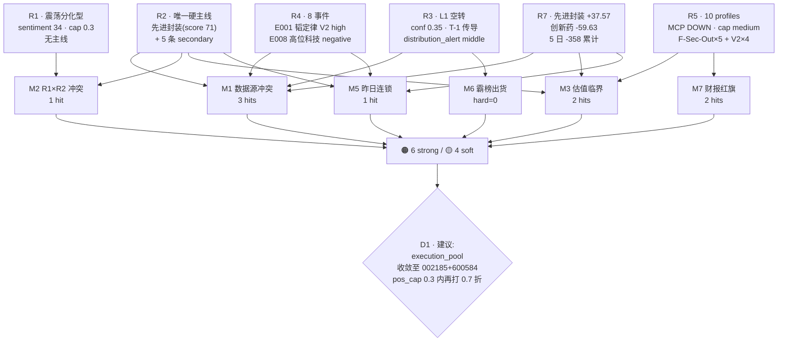

# 2026-07-08(周三)· 反证 / Devil's Advocate

> **数据源新鲜度**:🟡 partial
> **降级状态**:false(R6 本身完整,但上游多为 partial/degraded)
> **置信度**:0.72

## 一句话结论

半导体先进封装唯一硬主线资金翻转仅 1 日 + 估值 pe 81-160 全线偏高 + 昨日'借利好出货'警示未解除,D1 需严压仓位;创新药 fallback 5 票被 -59.6 亿资金背离叙事全线证伪;hard_reject 0 条(mode6 R3 明示盘前不硬否决)。

## 详细分析

**先进封装主线的三大隐患**。R2 唯一硬主线'华为韬定律 V2·先进制程+先进封装'score 71,由 R7 净流入 rank1 +37.57 亿 + R4 E001 韬定律 V2 硬事件 + 佛山系/紫阳东路游资锁 002185 三源共振支撑。但 R6 反证发现:① R7 sector_5d_tracking 显示先进封装 5 日资金序列 -110.98/-160.86/-60.10/-26.71/**+37.57** 亿,累计前 4 日净流出 -358 亿,20260707 单日翻正是趋势中的第 1 天而非确立趋势;华为海思/中芯/IGBT 结构完全一致(前 4 日均负、末日单日翻转);② R3 rank5 半导体设备/先进封装仅 L2+L3_only 且 L1 层空转,情绪证据是 T-1 卖方群 07-06 20:47 语义传导 · R3 confidence 仅 0.35;③ 估值层面 002185 pe=81.23、600584 pe=102.99、候补 002845 pe=123.99、603986 pe=159.72 pb=18.17,strength_cap=medium 全线,与 R1 conclusion 明写'C1 科创50+芯片 5d -10.30% 明显退潮'直接冲突。

**创新药 fallback 的资金反证**。R5 因 R2 未及时产出而 fallback 至 20260707 的创新药候选池,600276 恒瑞 / 000661 长春高新 execution_eligible=True。但四源交叉证伪:R7 创新药板块 T-1 主力净流出 -59.63 亿 rank13,R3 未进 top5 共振,R4 仅 E008 口播 medium 老登防御(非硬事件),R5 fundamental_flags 全部 5 票命中 F-Sec-Out severity=strong。叙事(老登防御)与资金(-59.6 亿)完全背离,属四象限中'冷宫叠加资金外流'象限,建议 D1 移出 execution_pool。

**四象限负面盘点**。① 冷宫叠加资金外流:创新药链 · 5 票命中 F-Sec-Out;② 出货型(资金出+情绪虚高):PCB/CPO/光纤/玻璃基板/电子布/光模块 · R4 E008 negative + R3 distribution_alert 双源命中;③ 前期反弹票冷宫:商业航天/人形机器人 · R7 -103 亿 + R3 distribution_alert + R4 E008 negative 三源;④ 突袭型单点未共振:先进封装/华为海思/中芯/IGBT/氮化镓 · 唯一可争议但仅第 1 日。

**昨日反证兑现连锁**。20260707 R6 已对同两只龙头 600584/002185 发出 M1+M3+M6 三条反证 strong_suggest × 3(未 hard_reject 因缺 R3 distribution_alert 命中)。今日 R3 hotlist_signals 仍为 T-1 语义传导、无新增数据翻案,先进封装 5 日累计 -320 亿未回补,R4 E008 颜晓滨警示未失效 → 昨日反证结构性重复,D1 须在 meta.d1_override[] 显式记录理由,否则默认沿用。

**霸榜出货硬约束(mode6)不触发**。R3 distribution_alert.targets = [天孚通信, 玻璃基板龙一, 光纤龙一, 电子布龙一, PCB, 商业航天(前期反弹票), 人形机器人(前期反弹票)] · 与 R2/R5 execution_eligible 五票(002185/600584/002156/600276/000661)**零交集**;R3 自明"非 Tushare 霸榜硬信号 · severity=middle · 盘前不作硬否决用途";R5 又因 canghai-charts MCP DOWN 未提供 main_force_5d_net_wan 精确字段,硬信号 (2) 不完全可核实 → **hard_reject_count=0**,红线 3 保护未触发。

## 关键证据

- **证据 1**:先进封装 5 日资金 -110.98/-160.86/-60.10/-26.71/+37.57 亿 · 单日翻正为趋势第 1 日 · 来源 R7.sector_5d_tracking
- **证据 2**:创新药板块 T-1 净流出 -59.63 亿 rank13 vs R4 E008 老登防御口播 · 叙事资金背离 · 来源 R7.main_force + R4.top_events
- **证据 3**:002185/600584/002845/603986 四票 pe 分别 81 / 103 / 124 / 160 · valuation score 12/6/8/0 · 全部命中 V2/V-PB 陷阱 · 来源 R5.dimensions.valuation_safety
- **证据 4**:R3 confidence=0.35 partial · L1 层空转 · 半导体设备/先进封装 rank5 仅 T-1 传导 · 来源 R3.status + R3.resonance_top_themes[4]
- **证据 5**:R1 conclusion 明写'C1 科创50+芯片 5d 已 -10.30% 明显退潮 + 高度信号名存实亡 + 涨停 33/跌停 30/炸板 41.1%' · 来源 R1.conclusion
- **证据 6**:R3 distribution_alert × R2/R5 execution_eligible 五票零交集 · 来源 R3.hotlist_signals.distribution_alert vs R2.main_lines[0].leaders + R5.profiles

## 反证结论表

| # | reject_id | 模式 | 目标 | severity | D1 义务 |
|---|---|---|---|---|---|
| 1 | R6_M1_01 | 数据源冲突 | 先进封装唯一硬主线 | 🟡 soft | 参考 |
| 2 | R6_M1_02 | 数据源冲突 | 创新药 600276/000661 | 🟠 strong | 须记录 override 或剔除 |
| 3 | R6_M1_03 | 四象限负面 | 全 secondary_lines + 冷宫链 | 🟡 soft | 参考 |
| 4 | R6_M2_01 | R1 vs R2 一致性 | 主线数超 R1 上限 | 🟠 strong | 执行池收敛到 002185+600584 |
| 5 | R6_M3_01 | 估值临界 | 002185 华天科技 | 🟠 strong | 单票 ≤7.5%(半 15% 上限) |
| 6 | R6_M3_02 | 估值临界 | 600584 长电科技 | 🟠 strong | T+0 弹性,过夜 ≤5% |
| 7 | R6_M5_01 | 昨日反证连锁 | 半导体主线整体 | 🟠 strong | meta.d1_override 显式说明 |
| 8 | R6_M6_01 | 霸榜出货 | execution_eligible 5 票 | 🟡 soft | T 日盘中监控 hot_bk |
| 9 | R6_M7_01 | 基本面红旗 | 603986 兆易创新 | 🟠 strong | 一律不入 execution_pool |
| 10 | R6_M7_02 | 基本面红旗 | 002156 通富微电 | 🟡 soft | 若升执行仓位打 5% |

**severity 分布**:🔴 hard_reject 0 / 🟠 strong_suggest 6 / 🟡 soft_suggest 4

## 数据源审计

| 源 | 状态 | 抓取日期 | 记录数 | 备注 |
|---|---|---|---|---|
| R1_style | 🟢 ok | 07-07 晚 | 1 | complete/degraded=false · conf=0.68 |
| R2_main_sectors | 🟡 partial | 07-07 晚 | 1 主线 + 5 secondary | fetch 未全跑 · conf=0.55 |
| R3_sentiment | 🟡 partial | 07-07 晚 | 5 themes | L1 层空转 · conf=0.35 · 群名匿名 |
| R4_news | 🟡 degraded | 07-07 晚 | 8 events | roll-forward · λ=0.15 衰减 |
| R5_stock_profiles | 🟡 degraded | 07-07 晚 | 10 profiles | canghai-charts/vibe-trading MCP DOWN |
| R7_capital_flow | 🟢 ok | 07-07 晚 | 496 sectors + 5d | conf=0.75 · 完整 |
| 昨日 R6 | 🟢 ok | 07-07 | 7 条反证 | mode5 参考基 |

## 反证结构图

## 逐票风险摘要(重点标的思维链)

### 002185.SZ 华天科技(R2 龙一 · 首推)

- **大资金意图**:游资佛山系 +2.84 亿 + 紫阳东路 +2.71 亿双巨头同锁 → 短线情绪盘启动,非主力长线介入(先进封装板块主力仅 T-1 单日 +37.57 亿翻正)
- **为什么被反证**:pe_ttm=81.23 已属偏贵,strength_cap=medium(MCP DOWN 复合 -10 惩罚),昨日 R6 已发同一 strong_suggest
- **逻辑够不够硬**:硬(游资锁筹码 + R4 E001 硬催化)但脆(5 日资金累计仍 -320 亿未回补)· 属'突袭型单点未共振'象限第 1 日
- **风险点**:R3 无当日 L1 共振;5 日累计资金未回补;若第 2 日未续入资金,游资撤退即成'借利好出货'
- **止损条件**:pe>90 主动减仓;跌破 pos45=50% 平台止损
- **可验证假设**:T 日 XTick hot_bk 半导体板块内出现在 distribution_alert → 立即降仓;T 日 R3 L1 层出现同源共振 → 加仓至上限

### 600584.SH 长电科技(R2 龙二)

- **大资金意图**:R4 E001 stocks_impact 明列 + 板块 rank1 +37.57 亿板块 β 承接方 · 无游资锁定证据
- **为什么被反证**:pe_ttm=102.99 · pb=5.92 · pos45=75.0% · valuation score 6/25 极贵临界 · flags=['valuation_stretched']
- **逻辑够不够硬**:板块 β 硬(先进封装绝对龙头)但 α 脆(估值 + 位置双重不利)
- **风险点**:pos45=75% 距 45 日高点 <15% 空间,R4 E008 高位科技警示直接命中
- **止损条件**:T+0 弹性池,过夜持仓 ≤5%;跌破 20 日均线立即减半
- **可验证假设**:近 3 日龙虎榜若上榜且 patterns 含'涨停净卖出' → 视为硬 sell 信号

## 与其他 R/D/E 的关系

- **依赖(上游)**:R1_style / R2_main_sectors / R3_sentiment / R4_news / R5_stock_profiles / R7_capital_flow · 20260707 R6(mode5 基)
- **被消费(下游)**:D1 main_decision_v1(hard_reject 强制剔除、strong_suggest 须 override、soft_suggest 记入 r6_soft_notes)· E1 daily_review_v1(次日兑现追踪)

## Sub-Agent 元数据

- skill:analyze_devil_advocate_v1@v1.2
- artifact:data/research/20260708/R6_devil_advocate.json
- 生成耗时:≈120 秒
- model:ark-code-latest(custom)
- 落盘方式:atomic write · JSON + md 同步
