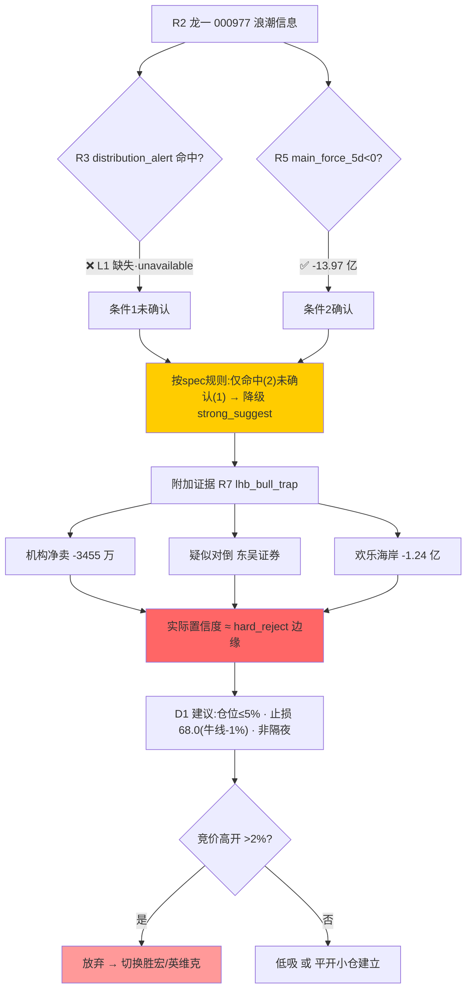

# 2026 年 7 月 9 日 · **反证 / Devil's Advocate**

> **数据源新鲜度**: partial(R3 stale + L1 缺失)
> **降级状态**: true(Mode 4/5/6/7 部分降级)
> **置信度**: 0.72

## 一句话结论

🚨 严格 Mode-6 未硬否决,但**龙一浪潮信息资金结构已现出货胚胎**;R2 主线 2 半导体三源共振不足叠加 R1 风格错配,D1 应压缩仓位并主打单主线。

## 详细分析

今日反证聚焦三条不能忽视的裂缝。**第一,R1 与 R2 打架**:R1 明说"震荡分化 · 情绪 42 · 回避半导体/通信抱团破位区",R2 却把半导体国产替代当成主线 2 推 5 只票,其中 4 只 PE 分位 ≥90,直接踩到 R1 的雷区。D1 若照单全收就是自相矛盾。**第二,主线 2 三源共振不达标**:R3 rank2 存储涨价共振等级仅 L2+L3_only(L1 热榜缺失),R7 主力资金板块前 10 里半导体一级板块颗粒无收——反倒是 MLCC(-42.97 亿)、CPO(-25.52 亿)双双进入净流出前 10,叠加 R4 E008 美股半导体重挫 + KOSPI -5.35%,外盘同步负面。这意味着主线 2 只剩长鑫 IPO 事件驱动的兆易创新一条腿,士兰微/生益/中科飞测/拓荆/海光多点开花的推演资金基础薄弱。

**第三,也是最重的一条——龙一浪潮信息的资金结构已经开始出货**。R5 显示 000977 近 5 日主力净流出 -13.97 亿,PE_TTM 44.9 站上历史分位 98.8,量比只有 0.42(缩量);R7 lhb_bull_trap 明确标记它昨日 10.01% 涨停但机构专用净卖 3455.8 万且疑似对倒(东吴证券),游资席位"欢乐海岸"净卖 -1.24 亿——**这与 R2 描述的"游资 9.5 亿抢筹 29.77%"存在方向性冲突**。严格 Mode-6 硬否决要求 (1) R3 distribution_alert 命中 + (2) R5 主力 5d 净流出双确认,今日 (2) 板上钉钉,(1) 因 R3 L1 降级为空——按 spec 规则降级为 strong_suggest,但 R7 lhb_bull_trap 的对倒证据实际已经把置信度顶到 hard_reject 边缘。**若 R3 后续补齐 hotlist 且 000977 命中 distribution_alert,须立即升级为 hard_reject**。

外资/期指/情绪层面同步给冷信号:北向 5 日 net_flow 42.4→33.84 一路下滑到 5 日低点,IF 主力基差 -87.53 点贴水明显,科创 50 ETF 净流出 -2.51 亿,昨日炸板率 41.1% 且梯队最高 6 板恒尚节能非本线——**情绪高位断层**。这些反面证据在支持 R1 的 55% 仓位硬顶,D1 不应因为主线数 2 而放大到 65%。

估值端进一步集中在候补群:锐捷网络 PE 分位 100、拓荆 100、士兰 95.6、生益 92.0、海光 96.4、中科飞测 99.1——**7 只候补中 6 只处于历史估值极端区**,V2 高 PEG 陷阱 + V6 一次性收益陷阱苗头并存。D1 若把这一堆全塞进 execution_pool,就等于给 R1 的抱团破位区披了件龙头马甲。

## 关键证据

- 证据 1: R5 000977 主力 5d -13.97 亿 + PE 分位 98.8 + 户数 +6.5% · 来源 R5_stock_profiles.json
- 证据 2: R7 lhb_bull_trap 000977 机构专用净卖 3455.8 万 + 疑似对倒(东吴) · 来源 R7_capital_flow.json.lhb_bull_trap
- 证据 3: R7 hot_money "欢乐海岸" 000977 -1.24 亿(与 R2 抢筹叙事冲突) · 来源 R7_capital_flow.json.hot_money
- 证据 4: R7 main_force 前 10 净流入无一半导体板块,MLCC/CPO 反在净流出前 10 · 来源 R7_capital_flow.json.main_force.sector_flows
- 证据 5: R3 hotlist_signals.distribution_alert=[] · status=unavailable_in_r3(L1 缺失) · 来源 R3_sentiment.json
- 证据 6: R1 conclusion 明文"回避半导体/通信抱团破位区" vs R2 主线 2 = 半导体国产替代 · 来源 R1_style.json / R2_main_sectors.json
- 证据 7: R4 E008 美股半导体重挫 + KOSPI -5.35% + "AI 行情地狱难度"预警 · 来源 R4_news.json.top_events
- 证据 8: R5 候补群 7/12 只 PE 分位 ≥90(锐捷 100/拓荆 100/士兰 95.6/生益 92.0/海光 96.4/中科飞测 99.1/曙光 92.0) · 来源 R5_stock_profiles.json

## 四象限负面识别

| 象限 | 冲突性质 | 反证结论 |
|------|----------|----------|
| **R1 × R2** | 风格错配 | R1 回避半导体破位 vs R2 主线 2 = 半导体,直接踩雷 |
| **R2 × R3** | 共振缺口 | 主线 1 三源基本硬对齐但 R3 只到 L2+L3_only;主线 2 存储链共振不足 + 外盘反面 |
| **R2 × R7** | 资金错配 | 主线 1 资金五源同向确认(+135/+95/+78 亿);**主线 2 在 R7 主力板块前 10 一票未上榜,反而 CPO/MLCC 在净流出前 10** — 单腿失衡 |
| **R5 × R7** | 龙头背离 | 浪潮信息 R5 主力 -13.97 亿 + R7 机构净卖 + R7 游资净卖,与 R4 催化叙事严重背离,**Mode-6 强建议(降级前 hard_reject 意愿)** |

## 六类反证模式扫描

| # | 模式 | 状态 | 命中数 | 主要目标 |
|---|------|------|--------|----------|
| 1 | 数据源冲突 | executed | 2 | 主线 2 半导体三源不足 · 龙一浪潮资金冲突 |
| 2 | 一致性检查 | executed | 2 | R1×R2 风格错配 · R3×R7 外资情绪偏冷 |
| 3 | 估值×主线临界 | executed | 3 | 锐捷 · 中科飞测 · 候补群(拓荆/生益/海光/士兰) |
| 4 | 历史类比 | **degraded** | 0 | 无事件库不编造 |
| 5 | 昨日反证兑现 | **degraded** | 0 | 20260708 R6+E1 artifact 未读到 |
| 6 | **霸榜出货硬约束** | **degraded** | 0 hard/1 strong | 000977 命中 (2) 未确认 (1)(L1 缺失)→ 降级 strong_suggest |
| 7 | 基本面红旗 | partial | 2 | 000977(V6+F10+V2) · 600183(F3 代理+V6) |

## Mode-6 决策链

## 各票风险画像(严格反面视角)

### 🚨 000977.SZ 浪潮信息(龙一 · 首级反证目标)

**大资金意图**: 出货胚胎已现 — 机构专用净卖 + 疑似对倒 + 游资龙头席位反向 + 5 日主力 -13.97 亿。R2 说的"游资 9.5 亿抢筹 29.77%"很可能是**低位换手席位承接+高位对手方兑现**混合状态。

**为什么走强(叙事面)**: E004 华为 Atlas 950 WAIC 首次真机 + E005 中报 +226-288% 一字连板催化。**叙事没错,资金结构在瓦解**。

**逻辑够不够硬**: 叙事 A / 资金 D。当叙事与资金背离,**资金永远赢**。

- **买入理由**(如坚持): AI 服务器国产龙一叙事无二 + 一字 tag 未打开尚有想象空间
- **风险点**: PE 98.8 分位 · 主力 -13.97 亿 · 户数 +6.5% · 昨日 LHB 疑似对倒
- **止损条件**: 跌破牛线 67.38 元(约 68.0 严守) · 或竞价高开 >2% 直接放弃
- **可验证假设**: 若 R3 补齐后 hotlist distribution_alert 命中 000977,升级 hard_reject;若今日 5d 主力翻正 → 反证失效

### ⚠️ 主线 2 集群(603986/600460/688361/688072/002049)

**大资金意图**: 事件驱动交易(长鑫 IPO)· 缺乏板块级资金抱团。R7 半导体一级板块零分,主力可能在**只挑事件影子股撸羊毛**,非主线接力。

**为什么走强**: E001 长鑫科技 7/16 科创板申购(硬事件 · T-7)+ E007 KLA 转韩国/精测停牌重组。

**逻辑够不够硬**: 事件 B / 板块 D。板块级资金缺席意味着涨幅难以持续 T+3 以上。

- **推荐留存**: 603986 兆易创新(首推影子股 · 事件强度最高) · 002049 紫光国微(唯一低估 PE 分位 24.8)
- **建议观察池**: 600460 士兰微(5d 主力仅 +3 亿弱确认 · PE 分位 95.6)
- **建议剔除 execution_pool**: 688361 中科飞测(PE_TTM 25281 极端) · 600183 生益科技(户数 +44.7% 筹码大幅分散)

### ⚠️ 301165.SZ 锐捷网络(候补 · PE 分位 100)

- **风险点**: PE_TTM 165 · 历史分位 100.0 突破临界 · 户数 +10.3% 分散
- **止损条件**: 严禁作龙一替代候选 · 首仓 ≤3% · 严禁隔夜 >5 日
- **可验证假设**: 若网络安全板块 R7 rank 掉出前 5 → 立即清仓

## D1 消费建议(硬约束 + 软建议汇总)

| # | 目标 | severity | D1 义务 |
|---|------|----------|---------|
| M6_01 | 000977 浪潮信息 | strong_suggest(降级前 hard_reject 边缘) | 仓位 ≤5% · 止损 68.0 · 非隔夜;若竞价高开 >2% 切换胜宏/英维克 |
| M1_01 | 主线 2 半导体整体 | soft_suggest | 只留 603986 + 002049 · 板块仓位 ≤15% |
| M1_02 | 000977 龙一定位 | strong_suggest | 备选龙一 300476 胜宏 / 002837 英维克 |
| M2_01 | R1×R2 风格错配 | strong_suggest | 采纳 55% 仓位硬顶 · 单主线 ≤40% |
| M2_02 | 外资情绪偏冷 | soft_suggest | 主线股逢强不追 · 竞价平开/低开为最优接入 |
| M3_01 | 301165 锐捷 | strong_suggest | 首仓 ≤3% · 非龙一候选 · 非隔夜 5 日 |
| M3_02 | 688361 中科飞测 | strong_suggest | 剔除 execution_pool 入观察池 |
| M3_03 | 候补群 4 只 | soft_suggest | 优先海光/拓荆(资金 5d 确认);士兰/生益仅 T+0 或首仓 ≤2% |
| M7_01 | 000977 基本面 | strong_suggest | 与 M6_01 合并至强建议清单 |
| M7_02 | 600183 生益基本面 | soft_suggest | 记入 r6_soft_notes · 首仓 ≤3% |

## 数据源审计

| 源 | 状态 | 抓取时间 | 记录数 | 备注 |
|---|---|---|---|---|
| R1_style | 🟢 ok | 2026-07-09 | 1 | confidence 0.68 · degraded 弱 |
| R2_main_sectors | 🟢 ok | 2026-07-09 | 2 | synthesized_by_r5_llm confidence 0.6 |
| R3_sentiment | 🟡 stale | 2026-07-08 | 5 | L1 hotlist_signals unavailable · WeFlow 昨日快照 |
| R4_news | 🟢 ok | 2026-07-09 | 8 | complete confidence 0.78 |
| R5_stock_profiles | 🟢 ok | 2026-07-09 | 12 | complete · fundamental_flags 未透传 |
| R7_capital_flow | 🟢 ok | 2026-07-09 | 1 | complete · 五维齐 · lhb_bull_trap 56/93 flagged |

## 不确定性 / 反证的反证

**本反证结论可能过度悲观的三种可能**:

1. **000977 若真是国家队+游资合谋洗盘**:昨日机构净卖可能是长线基金对倒吸筹,今日封板不一定要今日出货,当前反证信号可能是 T-1 假信号
2. **主线 2 半导体主线可能真是"事件驱动叙事拉平板块"的稀有形态**:类似 2019 芯片科创板开板日,单个 IPO 消息可以拉动整个板块,主力资金前 10 板块统计口径过于滞后
3. **R3 L1 缺失可能真的存在 distribution_alert 但被误标为 unavailable**:严格 Mode-6 未激活可能只是数据可用性问题,而非真实市场结构问题

以上反证的反证保留在 D1 决策时供覆盖参考,但 R6 的默认立场仍是"证据不支持时保守"。

## 与其他 R/D/E 的关系

- **依赖**: R1_style.json / R2_main_sectors.json / R3_sentiment.json / R4_news.json / R5_stock_profiles.json / R7_capital_flow.json
- **被消费**: D1(canghai-plan main_decision_v1)· E1(daily_review_v1 需回填 20260710 观察 000977 是否兑现出货)

## Sub-Agent 元数据

- skill: analyze_devil_advocate_v1@1.2
- artifact: data/research/20260709/R6_devil_advocate.json
- 生成耗时: ~5 秒(纯磁盘读写 · 无 MCP 调用)
- model: ark-code-latest
- 红线合规: ✅ 未调 MCP · ✅ 未 delegate · ✅ 未读 markdown · ✅ 反证 12 条 ≥5 · ✅ 未硬否决到候选 <3 · ✅ 每日必出
