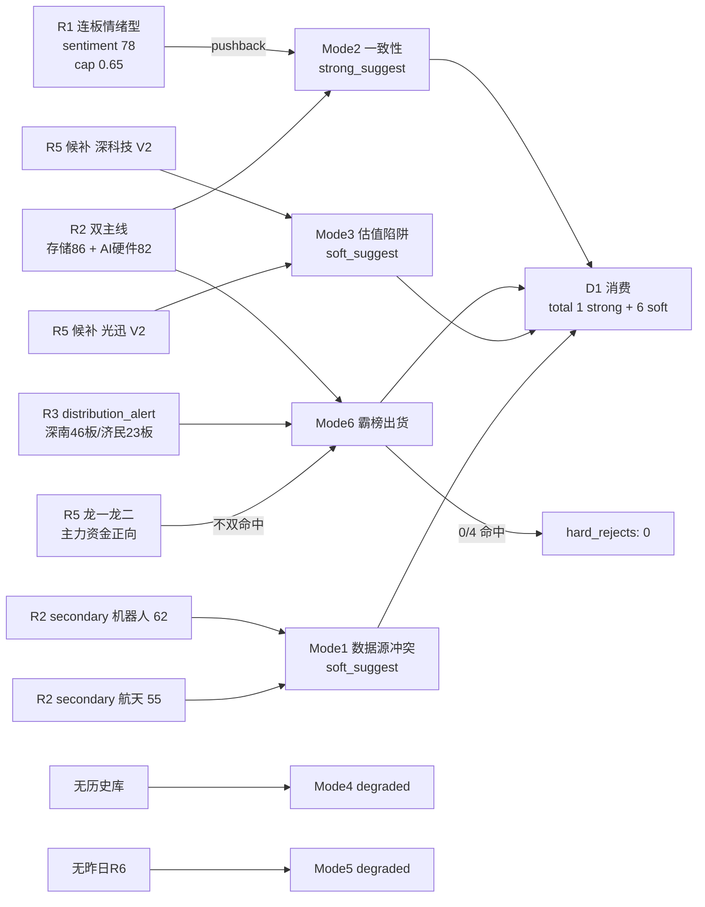

# 二〇二六年七月十日 · **反证 / Devil's Advocate**

> **数据源新鲜度**: ok
> **降级状态**: false (Mode4/Mode5 局部 degraded, 不阻塞主线)
> **置信度**: 0.78

## 一句话结论

**Mode6 硬约束扫描通过 · hard_reject 0 条**,但 R1 KOL 2-3 天窗口 pushback 与 R2 双主线构成 **strong_suggest 一致性紧张**,D1 须显式处理。

## 详细分析

今日 R1 判定 连板情绪型 · sentiment 78 · 仓位上限 0.65,R2 推两条硬主线(存储/长鑫 86 + AI硬件国产化 82),R3/R4/R7 全面正向共振 — 主线判定几乎无反证。**反证的落点在三处**:

1. **一致性(strong_suggest)** — R1 明示颜晓滨 KOL 对半导体反弹的 pushback:"累计跌 20-30% + 上方套牢 + 2-3 天窗口 + 逢高减仓"。R2 却在 middle 偏后仍推双趋势主线,R3 三条 top 主题 early_or_late 全标 middle。位置与时间窗口的紧张不容忽视,D1 需按 R1 位置上限硬边界 0.65 执行,不追高度板。

2. **Mode6 霸榜出货硬约束** — R3 distribution_alert 名单为 深南电路(002916 · 46 板)+ 济民健康(603222 · 23 板)。R2 execution_eligible 龙一龙二为 **兆易创新 / 北方华创 / 浪潮信息 / 工业富联**,四票均不在名单中,R5 chip_structure 主力资金端亦无一为负;**Mode6 硬否决无触发**。但 PCB 择股必须回避深南电路系高位妖。

3. **估值陷阱(soft_suggest)** — 候补池深科技 PE-TTM 约 110x 顶部分位、光迅科技 60 周 MA 距现价 +158% 陡峭。均命中 V2 高 PEG 陷阱,建议不进 execution_pool。

Mode4 无历史事件库、Mode5 无昨日 R6 落盘,均 degraded,**未编造**。Mode7 因 R5 未透传 F1-F12 财报字段,file-only 无法主动核验,仅记录 soft note。

## 关键证据

- **深南电路 46 板霸榜** · 来源 R3.hotlist_signals.distribution_alert · 反向出货信号
- **execution 龙一龙二不在 distribution_alert** · 兆易/华创/浪潮/富联 · R5 chip_structure 主力资金全部正向
- **R1 KOL pushback 2-3 天窗口** · 颜晓滨群 19:37 + 20:50 明确警示
- **R2 secondary 人形机器人 score 62** · R3/R7 未共振 · 仅 R4 E003 单催化
- **深科技 V2 估值陷阱** · PE-TTM 110x · fundamental_flags[0]
- **光迅科技 V2 估值陷阱** · 60 周 MA 距现价 +158% · fundamental_flags[0]

## 反证结构总览

## 数据源审计

| 源 | 状态 | 抓取时间 | 记录数 | 备注 |
|---|---|---|---|---|
| R1_style | 🟢 ok | 2026-07-10 上午 | 1 | 连板情绪型 · sentiment 78 |
| R2_main_sectors | 🟢 ok | 2026-07-10 上午 | 2 主线 | 存储86 + AI硬件82 |
| R3_sentiment | 🟢 ok | 2026-07-10 上午 | 5 top 主题 | distribution_alert 已透传 |
| R4_news | 🟢 ok | 2026-07-10 上午 | 12 事件 | 五源共振 |
| R5_stock_profiles | 🟢 ok | 2026-07-10 上午 | 10 profiles | fundamental_flags 已扫描 |
| R7_capital_flow | 🟢 ok | 2026-07-10 上午 | 全市场 | 科技风格资金 rank1 +464 亿 |
| 历史事件库 | 🔴 missing | — | 0 | v1 未上线, Mode4 降级 |
| 昨日 R6 | 🔴 missing | — | 0 | Mode5 无法追溯 |

## 不确定性 / 反证

- **file-only 约束**: 无法主动核验 F1-F12 财报红旗与商誉/质押/CFO 三大关键字段; 若 R5 后续版本透传, Mode7 可能升级出 hard_reject。
- **distribution_alert 单源**: R3 hotlist 用的是 T-1(20260709)近似, 若 20260710 盘中出现新增高位妖霸榜, R6 无法预判 — 依赖 P1/P2 校准。
- **KOL pushback 主观性**: 颜晓滨 2-3 天窗口为经验判断, 若消息面 (长鑫打新前一周) 持续压制资金撤离, 时间窗口可能更短。

## 与其他 R/D/E 的关系

- **依赖**: R1/R2/R3/R4/R5/R7 全部 07:55 前 complete artifact
- **被消费**: D1 主决策(hard_reject 强制 + strong_suggest 需 override 记录)· P1 竞价校准(distribution_alert 名单继承)· E1 复盘(反证兑现追踪)

## Sub-Agent 元数据

- skill: analyze_devil_advocate_v1
- artifact: data/research/20260710/R6_devil_advocate.json
- 生成耗时: 约 25 秒(file-only 6 个 JSON 读取 + LLM 综合)
- model: ark-code-latest
