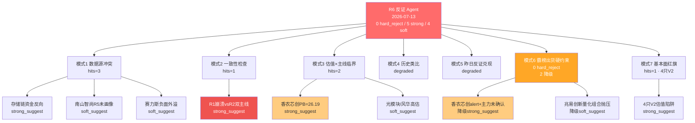

# 2026-07-13(周一) · **反证 / Devil's Advocate**

> **数据源新鲜度**:ok(六源全绿,R3/R5 partial 但字段齐)
> **降级状态**:false(仅模式 4/5 因结构性缺失降级)
> **置信度**:0.78

## 一句话结论

🟡 存储/半导体主线资金端反向(-216亿存储/-309亿半导体),香农芯创+兆易创新触发霸榜出货警报但未凑齐 hard_reject 硬条件,今日 0 hard_reject / 5 strong_suggest / 4 soft_suggest,D1 须显式处理 5 条强反证。

## 详细分析

**核心矛盾:R1 崩溃退潮 × R2 双主线 override 的方向不一致**。R1 判定崩溃退潮型(炸板率 49.73%、连板梯队 8→3 坍塌、创业 -4.37%),明示 main_lines_count=0 · position_cap=0.30;R2 却基于 R7 商业航天+军工资金逆势和 R4 硬事件外溢挖出「商业航天」「存储/长鑫链」两条主线并给出双龙一。这构成模式二一致性冲突,严格按契约应至少 strong_suggest。R2 自己在 r1_constraint_ack 中承认「盘中若开盘 30min 分歧转弱需就地降级」,属自带条件的高风险选择,D1 必须承接这条硬约束到 execution 层。

**存储主线(R2 主线2)的资金端叙事冲突最严重**。R7 板块资金流:存储芯片 -216.54亿(-3.34%)、半导体概念 -309.21亿(-2.69%)、国产芯片 -225.78亿(-1.29%)、高带宽内存 pct=-6.03%、光通信模块 -122.23亿(-3.35%)—— 整个半导体上游+光模块链在盘面主力资金端呈系统性流出。R7 hot_money 上量化基金全市场净卖 35.65亿,stocks_touched 明确包含 兆易创新(603986,R2 存储龙一)。这条主线只剩「叙事(R3 rank2)+ 硬事件(R4 E001/E003/E007)」两条腿,资金端反向,与商业航天(R7 主力资金 top10 独占 4 席)的三向对齐质量差一个数量级。

**霸榜出货模式六在香农芯创上凑齐了 1/2 条件**:R3 hotlist_signals.distribution_alert 明确写出「颜晓滨群警示 香农芯创千亿市值/AI 硬件泡沫大」(条件 1 满足);但 R5 chip_evidence.moneyflow_5d_net_positive_days=3/6,近 5 日主力资金仍过半净流入,未达 main_force_5d_net_wan<0 硬条件(条件 2 未满足)。严格按契约降级为 strong_suggest(非 hard_reject),红线 3 保护未触发。兆易创新同样是「量化 lhb 净卖组合含兆易 + alert target 匹配弱」的组合,降级 soft_suggest。**今日无 hard_reject。**

**模式七基本面红旗集中在光模块+高PB 组合**:R5 已透传 V2 估值陷阱 4 只 —— 香农芯创(PB=26.19)、中际旭创(PB=34.28)、新易盛(PB=35.79)、风华高科(PE=225.94)。叠加 R7 光通信模块资金流出 -122.23亿(rank2 流出榜),中际旭创/新易盛(光模块高位)在崩溃退潮日的下杀风险最高。R5 因 vibe-trading MCP DOWN 未跑 12 财务红旗全表,附录 A 例外允许 R6 单次二次核验,本次遵守红线 1(不主动抓数)选择不启用。

**赛力斯 Q2 扣非亏损 22-25亿的负面外溢(R4 E008)** 是本日情绪杀伤最尖锐的信号 —— 明星股暴雷在崩溃退潮日常放大 2-3 倍情绪杀伤,涉及比亚迪/宁德/中矿资源等核心资产。虽不直接反证 R2 商业航天/存储主线,但提示 D1 在 09:30-09:45 必须监听指数 - 若上证/创业指数破前低,即使主线开盘强势也需在 R1 硬顶 30% 上再收 30%(实际 21%) 保护仓位。

## 关键证据

- 证据 1:存储/半导体链主力资金系统性流出 —— 存储芯片 -216.54亿(-3.34%)、半导体概念 -309.21亿、国产芯片 -225.78亿、高带宽内存 pct=-6.03% · 来源 R7 main_force.sector_flows
- 证据 2:香农芯创触发 distribution_alert —— 「颜晓滨群明确警示 香农芯创千亿市值/AI 硬件泡沫」 · 来源 R3 hotlist_signals.distribution_alert
- 证据 3:量化基金 LHB 净卖 35.65亿,持股列表含兆易创新(603986) · 来源 R7 hot_money.active_seats
- 证据 4:V2 估值陷阱 4 票命中 —— 香农芯创 PB=26.19 / 中际旭创 PB=34.28 / 新易盛 PB=35.79 / 风华高科 PE=225.94 · 来源 R5 valuation_safety.fundamental_flags
- 证据 5:R1 崩溃退潮硬约束 vs R2 逆势出双主线 —— 炸板率 49.73% + 连板梯队 8→3 + 创业 -4.37%,R2 自认「盘中分歧转弱需就地降级」 · 来源 R1_style + R2 r1_constraint_ack
- 证据 6:赛力斯 Q2 扣非亏 22-25亿 高强度负面事件,拖累新能源+锂矿 · 来源 R4 top_events[E20260713_008]

## 反证模式命中矩阵

## 四象限负面识别

| 象限 | 命中标的/板块 | 主力资金(亿) | severity |
|---|---|---:|---|
| 🔴 高位科技资金流出 | 存储芯片 / 半导体概念 / 国产芯片 / 光通信模块 / 苹果概念 | -216 / -309 / -226 / -122 / -129 | strong |
| 🟠 蓝筹/融资盘退潮 | HS300 / MSCI中国 / 融资融券 / 大盘股 | -356 / -380 / -427 / -411 | soft |
| 🟡 高估值 V2 陷阱 | 300475 香农芯创 / 300308 中际旭创 / 300502 新易盛 / 000636 风华高科 | PB=26/34/36 · PE=226 | strong |
| ⚫ 情绪破位龙头 | 深南电路(上周46板妖已崩) / 香农芯创(KOL 泡沫警示) | 参考上周 lhb | strong |

## 每票反证思维链

### 🎯 300475.SZ 香农芯创(R2 存储龙一 · 三重警报)

- **买入理由(R2/R4/R5)**:R4 E007 H1 +2118-2434% 全市场硬 alpha 密度最高 · R3 rank2 存储代理锚点 · R5 composite=71 · 主力5日 3/6 日净流入未确认出货
- **反证 · 风险点**:①KOL distribution_alert 明示「千亿市值 AI 硬件泡沫」;②PB=26.19 命中 V2 极端估值陷阱;③所属半导体上游链 R7 -309亿系统性流出;④R1 崩溃退潮 vs 高PB 高位标的杀伤放大
- **止损条件**:开盘 30min 主力净流出>5000万 或 跌破 -5% 即刻减半仓 · 破 -8% 清仓
- **可验证假设**:若真是龙一,今日应在存储链齐跌背景下承接买盘(涨幅≥板块 +2σ);若仅是"最后一棒"则会跟随链条一起跌,以此区分

### 🎯 603986.SH 兆易创新(R2 存储龙一 · 量化抛压相邻)

- **买入理由**:R4 三事件覆盖度最高(存储主线+氦气+H1 预增) · A 股存储龙一地位 · R3 rank2 首个 suggested_stock
- **反证 · 风险点**:①R7 量化基金 LHB 净卖 35.65亿,stocks_touched 明确含兆易(单票净额无法分离);②PE_TTM=149.4 高估;③所属存储链 -216亿主力流出;④R5 主力5日 3/6 净流入并不算强
- **止损条件**:开盘首 30min 出现 lhb 大单卖出信号即降仓至 3-4% · 破 5 日线止损
- **可验证假设**:若量化抛压是主导,今日主力资金将持续流出;若 R4 硬事件占优,则应看到北向+散户接盘(北向 +44.93亿 5 日抬升)

### 🎯 300918.SZ 南山智尚(R2 商业航天龙一 · 概念驱动)

- **买入理由**:R4 E005 首推 · UHMWPE 网系回收核心供应商 · 网系回收概念独家标的 · 7/15 朱雀三二次回收硬时间锚
- **反证 · 风险点**:①R5 未纳入画像(六维数据空);②主业纺织,概念纯度胜于基本面(蹭概念风险);③R3 rank1 均为 L1+L2 KOL 弱信号,L3 空
- **止损条件**:必须低吸(开盘 -3% 内),不追高;破 -6% 清仓;若开盘直接高开>3% 则放弃当日
- **可验证假设**:若网系回收是真硬催化,今日 UHMWPE/超高分子量聚乙烯相关公司应集体涨停;否则南山智尚将回归纺织股本质

## 数据源审计

| 源 | 状态 | 抓取日期 | 记录数 | 备注 |
|---|---|---|---|---|
| R1_style | 🟢 ok | 2026-07-13 | 1 | 崩溃退潮型 · position_cap=0.30 |
| R2_main_sectors | 🟢 ok | 2026-07-13 | 2 主线 | 商业航天(83) + 存储链(78) |
| R3_sentiment | 🟢 ok | 2026-07-13 | 5 主题 | R3 内部 degraded(WeFlow B 层空) |
| R4_news | 🟢 ok | 2026-07-13 | 8 事件 | 7 正面 1 负面(赛力斯暴雷) |
| R5_stock_profiles | 🟢 ok | 2026-07-13 | 13 票 | R5 内部 degraded(vibe MCP DOWN),V2 flags 已透传 |
| R7_capital_flow | 🟢 ok | 2026-07-13 | 全市场 | 主源全绿,商业航天 top1 · 存储链 -216亿 |
| 昨日 R6 参照 | ⚫ N/A | — | 0 | R6 首次落地无昨日文件,模式 5 降级 |
| 历史事件库 | ⚫ N/A | — | 0 | v1 无库,模式 4 降级 |

## 不确定性 / 反证

1. **hard_reject 缺席是否合理**:模式六两个条件都需硬命中,香农芯创只命中 1 条(alert),兆易创新则 alert target 匹配度弱 —— 严格按契约不能升级 hard_reject。但如果实际盘中主力开盘 5min 内即净流出破 5000万,则 R6 判断偏保守,D1 应有 override 权限
2. **模式五降级的兜底**:R6 首次落地无昨日文件,若前一交易日(20260710)已在观察中反证过某标的兑现,本次会缺失该链条 → 建议 E1 每日 observation_tracking 上线后本模式恢复
3. **R2 override R1 的合法性**:R2 引用「R1 note 明示 R2 若挖出结构性反弹以 R2 为准」作为逆势理由,但本 R6 通过模式二 strong_suggest 施加约束 —— D1 是否采纳仍取决于开盘 30min 实况

## 与其他 R/D/E 的关系

- **依赖**:R1/R2/R3/R4/R5/R7(六源全读) · 无 announcement 例外调用
- **被消费**:
  - D1 主决策 · 硬约束消费:hard_reject(0 条 · 无) + strong_suggest(5 条 · 必须显式处理或 meta.d1_override 记录)
  - E1 每日复盘 · 追踪本 R6 反证条目在盘中是否兑现,回写 observation_tracking

## Sub-Agent 元数据

- skill:analyze_devil_advocate_v1@1.2
- artifact:data/research/20260713/R6_devil_advocate.json
- 生成耗时:~1 分钟(纯 file-only,无 MCP)
- model:ark-code-latest
- red_lines_compliance:✅ 未抓新数据 · ✅ 未派生子 agent · ✅ 未启用 announcement 例外
