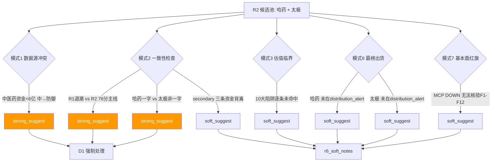

# 2026 年 7 月 14 日 · **反证 / Devil's Advocate**

> 🟢 **数据源新鲜度**: ok  
> 🟢 **降级状态**: false(R5 上游 partial 但不阻断反证)  
> 🟡 **置信度**: 0.72

## 一句话结论

**模式六 hard_reject = 0**;但 3 条 strong_suggest 齐指"崩溃退潮 × 政策已发酵 × 一字涨停龙一"的追高风险,D1 应从严执行 R1 20% 仓位上限。

## 反证 severity 全景

## 详细分析

### ① 中医药是"防御补涨"还是"主线级驱动"?(模式一)

R2 判定中医药主线 76 分,但反证发现:R7 全市场主力资金正流入板块仅 6 个,中医药相关 3 个板块金额均 <6 亿(CRO +3.73 / 特色药 +2.80 / 独家药品 +2.65),量级远弱于 AI 硬件负流入(液冷 -231 亿 / PCB -229 亿 / 无人机 -109 亿)。R3 KOL 定调是"从硬件切应用"而非"切中医药",十五五规划已披露 3 天且 20260713 已批量涨停兑现。

- **大资金意图**:防御性对冲而非"主线级建仓",一日内涨停 7 只后开始向补涨杂毛扩散(陇神戎发 / 万邦医药 +20cm 属尾部)
- **为什么走强**:R1 崩溃退潮 + AI 硬件雪崩传导 = 防御资金天然承接方向,并非中医药基本面驱动
- **逻辑够不够硬**:政策已发酵 3 天,继续走强需政策细则或个股新催化,不构成"跨日主线"

### ② 哈药一字涨停龙一的追高风险(模式二)

R2 给哈药 execution_eligible=true,但 R1 崩溃退潮 × 一字板 +10.09% × T-2 #75→#16 跃升 59 位 = 典型"快速追涨"形态,次日高开概率大。R5 technical strength 仅 medium(chart 降级 + 一字板量能未验证)。

### ③ R2 主线数量 vs R1 无主线(模式二 · 全局)

R1 硬约束"崩溃退潮 + 情绪 18 + 承接盘枯竭"严格意义应为 0 主线;R2 挑出 76 分主线只高于 70 硬阈值 6 分,共振维度仅 12。R3 distribution_alert 8 只全在存储 / PCB / 商业航天,反证"高位板块系统性瓦解中",不应将任何板块视为主线级。

### ④ 模式六霸榜出货 hard_reject 逐票核验

| 标的 | 命中 distribution_alert? | 主力 5 日净流(R5) | 判定 |
|---|---|---|---|
| 🟢 600664.SH 哈药股份 | ❌ 未命中 | ⚪ null(MCP DOWN) | 不触发 hard_reject |
| 🟢 600129.SH 太极集团 | ❌ 未命中 | ⚪ null(MCP DOWN) | 不触发 hard_reject |

`R3 distribution_alert` 全部落在 002185 华天科技 / 603986 兆易创新 / 300475 香农芯创 / 000636 风华高科 / 002636 金安国纪 / 600206 有研新材 / 603618 杭电股份 / 002428 云南锗业 — **风险方向与中医药完全错开**。模式六无硬否决义务。

### ⑤ 模式四 / 五 降级说明

- 模式四 历史类比:历史事件库 v1 未上线 → 按 skill 红线"不编造"降级
- 模式五 昨日反证连锁:prev_date R6 artifact + E1 observation_tracking 均不可用 → 降级

## 关键证据

- 证据 1:R7 sector_flows — 医药相关正流入 3 个但金额 <6 亿,量级远弱于 AI 硬件负流入十亿级 · 来源 R7
- 证据 2:R3 hotlist_signals.L4_distribution_alert 8 只标的全部为存储 / PCB / 商业航天,中医药零命中 · 来源 R3
- 证据 3:R1 evidence — 20260713 跌停 176 vs 涨停 32 + 成交缩量 5760 亿 + 连板天梯断裂(最高仅 4 板) · 来源 R1
- 证据 4:R2 leaders — 哈药 pct_chg=+10.09% limit_times=1 一字涨停 · 太极 pct_chg=+8.20% limit_times=0 非一字 · 来源 R2
- 证据 5:R5 status=partial + MCP 全域 DOWN → 基本面 F1-F12 无法逐条核验,附录 A MCP 例外亦不可用 · 来源 R5

## 逐票思维链

### 600664.SH 哈药股份

- **买入理由**(R2 视角):板块内涨停 + 排名跃升板块第 1 + 中医药十五五规划政策共振 + 主板 execution_eligible
- **风险点**:一字涨停 + 政策已发酵 3 天 + R1 崩溃退潮系统性风险 + 主力 5 日净流 unknown(MCP DOWN)
- **止损条件**:开板深度 >5% + 板块正流入回吐至负 → 立即降级观察
- **可验证假设**:11:35 午盘修订(P2)时若哈药盘中开板 <3% 且板块内涨停家数 ≥3 → 假设成立可继续持有

### 600129.SH 太极集团

- **买入理由**:综合评分板块第 2 + 排名跃升 T-2 #71→#20 + 非一字连续性优于哈药 + 主板可执行
- **风险点**:同板块防御属性 + 十五五规划已一日兑现 + 若 AI 应用早盘反弹跷跷板回吐
- **止损条件**:板块回吐 + 太极自身跌破 20260713 收盘价 3% 以下 → 减仓
- **可验证假设**:太极非一字板筹码交换充分,若早盘不高开 >4% + 尾盘收阳 → 假设成立

## 数据源审计

| 源 | 状态 | 抓取时间 | 记录数 | 备注 |
|---|---|---|---|---|
| R1_style | 🟢 ok | 2026-07-14 07:35 | 1 | 崩溃退潮型 情绪 18 |
| R2_main_sectors | 🟢 ok | 2026-07-14 07:50 | 1 主线 | confidence=0.68 degraded=true |
| R3_sentiment | 🟢 ok | 2026-07-14 07:45 | 5 主题 | WeFlow B 层降级 但不影响反证 |
| R4_news | 🟢 ok | 2026-07-14 07:42 | 10 事件 | 五源硬约束齐备 |
| R5_stock_profiles | 🟡 partial | 2026-07-14 07:55 | 5 profiles | MCP 全域 DOWN 六维部分降级 |
| R7_capital_flow | 🟢 ok | 2026-07-14 07:32 | 4 维 | 北向 +41.78 亿 |

## 不确定性 / 反证之反证

1. **模式六 unknown 权重**:R5 chip_structure.main_force_5d_net_wan=null,若 MCP 恢复后核验发现哈药近 5 日主力净流 <0,则模式六第二条件命中,需升级为 strong_suggest — R6 已在 suggestion 中显式提示 D1 于 P2 二次核验
2. **模式七核验缺口**:附录 A MCP 例外(vibe-trading get_financial_statements)在 R5 已降级前提下也不可用,F1-F12 全部无法逐条落地,只能通过 R5 稳定现金流行业类型定性给 soft_suggest
3. **主线判定张力**:R6 反证 R2 主线偏软(76 分刚过 70 硬阈值),但不构成 hard_reject — 最终仍需 D1 权衡

## 与其他 R/D/E 的关系

- 依赖:R1 / R2 / R3 / R4 / R5 / R7 全部 upstream artifact
- 被消费:D1 主决策(严格 hard_reject 无 / strong_suggest 3 条须显式处理)· P2 午盘修订(模式六二次核验触发条件)· E1 每日复盘(soft_suggest 追踪)

## Sub-Agent 元数据

- skill: analyze_devil_advocate_v1@1.2
- artifact: data/research/20260714/R6_devil_advocate.json
- 生成耗时: ~30 秒
- model: ark-code-latest
- toolsets: file-only(0 MCP / 0 delegate / 0 announcement-search)
