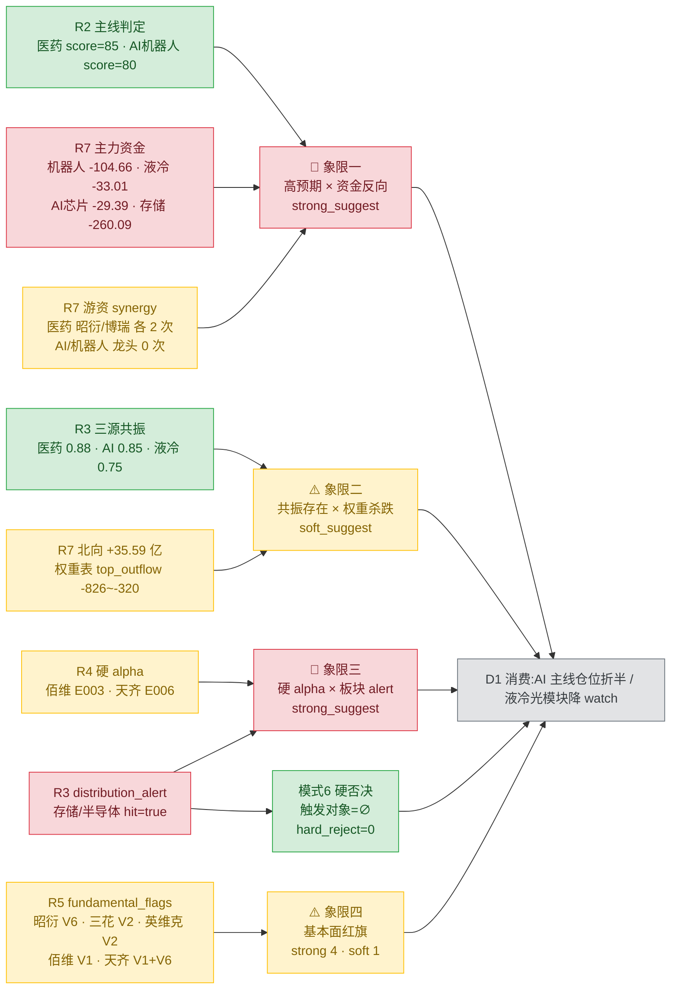

# 20260717(周五) · **反证 / Devil's Advocate**

> **数据源新鲜度**: partial(R1 T-1 fallback + R3/R5 部分降级)
> **降级状态**: true
> **置信度**: 0.78
> **反证条目**: 14(strong_suggest 10 · soft_suggest 3 · hard_reject 0 · not_triggered 1)

## 一句话结论

模式6 **零 hard_reject**(存储链已被 R2 前置 excluded);最大反面证据来自 **AI/机器人主线资金反向**——R2 score=80 但 R7 全域主力净流出、游资 synergy=0,与医药主线形成鲜明反差,D1 应仓位倾斜医药、AI 主线折半、光模块液冷降 watch。

## 详细分析

**Section 1 · 模式6 硬否决为何为 0**

R3 hotlist `layer4_distribution_alert` 命中 `target_theme=存储/半导体`(20260714-15 连续 2 日霸榜前 10 达 70% 席位 + 20260715 集体 -9%~-15%),这本是 R6 唯一硬否决权的触发条件。但 R2 已在 `excluded_sectors` 前置硬规避该板块,同时 R2 execution_eligible 龙一龙二共 6 只(昭衍/凯莱英/药明/三花/巨人/恺英)全部 **不在** alert 板块。**触发对象交集=∅ → hard_reject=0**,红线 3 保护未启动。R5 `hard_flags_to_R6` 中的佰维存储(688525.SH)虽命中 alert,但 688 前缀本身就在 amygdala 层 execution_block_prefixes,R6 无需重复硬否决,以 M6_02 strong_suggest 处理(禁入 watch_pool)。

**Section 2 · 最大反面证据 · AI/机器人主线四象限负面**

R2 主线#2「AI应用+端侧+人形机器人」score=80,R3+R4 三源共振 0.85。**但 R7 20260716 主力资金端**给出反向确认:机器人概念 rank47 -104.66 亿、人形机器人 rank10 -54.39 亿、机器人执行器 rank39 -1.2 亿、液冷概念 rank20 -33.01 亿、AI 应用 rank26 -5.06 亿、AI 芯片 rank8 -29.39 亿——**AI+机器人+液冷+算力四大细分链全域资金净流出**。同时 R7 `hot_money.synergy_flags` 中 R2 AI/机器人 execution_eligible 龙头(002050/002558/002517/300418/300748)**无一命中**3 日游资协同,与医药主线昭衍(603127)、博瑞(688166)分别 2 次协同形成鲜明反差。**大资金没在买机器人,只有游资在情绪 + 事件催化**。

**Section 3 · R1 缺失下的一致性风险**

R1_20260717 未落盘,采用 R1_20260716 T-1 fallback:style=主线扩散型/main_lines_count=1/position_cap=0.55/confidence=0.55(偏低)。**R2 依据 R3+R4 三源共振扩到 2 条主线,超出 T-1 R1 建议 1 条**。R7 侧数据结构性支持"结构分化不是普涨":北向 +35.59 亿维持流入,但主力资金 top_outflow 是 MSCI/富时罗素/沪股通/深股通/大盘股/HS300 六大权重表全部破 -320~-826 亿——**北向增 + 主力减 = 换手结构,非普涨结构**,不足以支撑 2 条主线并行的高仓位。

**Section 4 · 昭衍 V6 红旗第 2 日未解除**

昨日 R6 已给出 8 条反证,核心 5 项风险(V6 昭衍公允价值反弹一次性、M1 凯莱英量化背离、拥挤度、T-1 R1 confidence 偏低)今日**全部未解除**。E1 observation_tracking 未上线,昨日反证兑现率无法量化验证,R6 保守假定全部有效沿用。**R7 医药医疗风格 rank15 -16.88 亿、创新药 rank31 -19.8 亿**——与 R3 引用的 T-2 rank1 +76.56 亿分歧,采信 R7 当日数据。

**Section 5 · 硬 alpha 陷阱两只**

佰维存储(688525)E003 中报扭亏 2776%~3421% + 天齐锂业(002466)E006 中报预增 3276%~4934%,两只都是 R4 硬 alpha,但 **R5 已明标 cycle_top_risk/priced_in**:PE 因扭亏失真需 PB×ROE 四象限重估,业绩含一次性存货减值转回或公允价值反弹,R7 存储 -260.09 亿、锂矿 -9.81 亿、锂电池 -102.33 亿、新能源车 -111.38 亿全链条资金反向——**极端预增的基数失真 + 资金反向 = 见光死高危信号**。

## 关键证据

- 证据 1: R7 主力资金 20260716:机器人 -104.66亿 / 人形机器人 -54.39亿 / 液冷 -33.01亿 / AI芯片 -29.39亿 · 来源 `R7.main_force.sector_flows`
- 证据 2: R7 游资 synergy_flags:AI/机器人主线 R2 execution_eligible 龙头 0 命中 · 来源 `R7.hot_money.synergy_flags`
- 证据 3: R3 distribution_alert:存储/半导体 hit=true,20260714-15 连续 2 日 70% 席位 + 集体 -9%~-15% · 来源 `R3.hotlist_signals.layer4_distribution_alert`
- 证据 4: R5 fundamental_flags 昭衍 V6(一次性公允价值)/ 三花 V2(高 PEG 1.3-1.5)/ 英维克 V2(高 PEG 1.4)/ 佰维 V1(周期顶)/ 天齐 V1+V6 · 来源 `R5.dimensions.valuation_safety.fundamental_flags`
- 证据 5: R2 已 exclude 存储/半导体,execution_eligible 与 alert 交集=∅ · 来源 `R2.excluded_sectors`
- 证据 6: R7 top_outflow 六大权重表 -320~-826 亿全线杀跌 · 来源 `R7.main_force.top_outflow_sectors`
- 证据 7: 昨日 R6 8 条反证核心 5 项今日未解除 · 来源 `data/research/20260716/R6_devil_advocate.json`

## 四象限负面识别(mermaid)

## 反证条目(6 类模式 × 14 条)

### 模式 1 · 数据源冲突(3 条 · strong 2 / soft 1)

**R6_M1_01 · AI/机器人主线 R2 score=80 vs R7 资金反向**  
- **大资金意图**: 主力资金端明确**避开机器人+AI+液冷+算力**四大细分链,合计净流出超 200 亿;北向净流入 +35.59 亿但被主力 -826 亿融资融券出流覆盖  
- **为什么走强(为何反证)**: R2 score=80 来自 R3+R4 三源共振,但这三源都是"叙事密度"(WeFlow 词频/KOL 长文/事件催化),不是"资金买盘"  
- **逻辑够不够硬**: **不够硬**——游资 synergy=0 说明连情绪面热钱都没进场,只有主题叙事在推。**severity=strong_suggest**  
- 可验证假设: 20260717 开盘后 30 分钟内三花/巨人若出现放量高开低走 → 反证兑现

**R6_M1_02 · R4 券商链利好 vs R7 券商资金反向**  
- 券商概念 -36.39亿/参股券商 -15.34亿,R3 top5 不含券商,KOL 仅 1 条提及。**severity=soft_suggest** — 不建议纳入首推

**R6_M1_03 · 光模块液冷产业催化 vs R7 硬件端全撤**  
- 液冷 -33.01亿/AI 芯片 -29.39亿/算力 -95.36亿/半导体 -430.17亿。R3 自认"研报-价格背离位置偏高"。**severity=strong_suggest** — 中际旭创/英维克降 watch_pool

### 模式 2 · R1-R2 一致性(1 条 · strong)

**R6_M2_01 · T-1 R1 建议 1 主线 vs R2 出 2 主线**  
- T-1 R1 position_cap=0.55/confidence=0.55/main=1;R7 结构是"北向增 + 主力权重表-826 亿"= 换手结构非普涨。**D1 必须严守 position_cap 0.55 不上浮,两线合计 ≤ 45%**

### 模式 3 · 估值 × 主线临界(2 条 · strong 2)

**R6_M3_01 · 昭衍龙一位置 + V6 一次性收益红旗**  
- V6 延续昨日;R7 医药医疗 rank15 -16.88亿 · 创新药 rank31 -19.8亿(采信 R7 当日 vs R3 引用 T-2)  
- **建议**: 不追高开 >3%,竞价 >5% 等回踩;硬止盈 25E 扣非 PE 40x;单票 ≤ 12%

**R6_M3_02 · 三花龙一 + V2 高 PEG + 资金反向双约束**  
- PE 40x 分位 75%,机器人业务 <10% 但市场愿给主题溢价;叠加 M1_01 资金反向  
- **建议**: 单票 ≤ 8-10%;若开盘弱 → 资金转医药加仓;龙二巨人网络 R5 未 profile 谨慎

### 模式 4 · 历史类比(degraded)

无历史事件库,**不编造**。

### 模式 5 · 昨日预期错误连锁(1 条 · soft · partial_degraded)

**R6_M5_01 · 昨日 R6 8 条反证核心 5 项今日未解除**  
- E1 未上线无法量化兑现率,保守沿用;R3 自认存储"20260716 未见反弹"— 昨日看空存储反证今日继续兑现

### 模式 6 · 霸榜出货硬约束(2 条 · hard_reject=0 · strong 1 · not_triggered 1)

**R6_M6_01 · 触发对象核查 · hard_reject=0**  
- distribution_alert 命中存储/半导体,但 R2 已 excluded + execution_eligible 与 alert 交集=∅ → **无 hard_reject**

**R6_M6_02 · 佰维存储(non-execution 位)**  
- 20260715 单日 -15% 跌幅最深;688 前缀 amygdala 硬拦截;**strong_suggest 禁入 execution_pool 与 watch_pool**

### 模式 7 · 基本面红旗(5 条 · strong 4 · soft 1)

**R6_M7_01 · 昭衍新药 V6**(strong)· **M7_02 · 三花智控 V2**(soft,叠加 M1/M3 后综合升级)· **M7_03 · 英维克 V2+M1**(strong,禁 execution)· **M7_04 · 佰维存储 V1+M6**(strong,与 M6_02 合并)· **M7_05 · 天齐锂业 V1+V6+资金反向**(strong,若首日高开不封视为分歧位)

## 每票思维链(top 反证对象)

### 三花智控(002050.SZ) · AI/机器人主线龙一

- **买入理由**: R4 E005 英伟达三连击(Jetson Thor+丰田+三菱重工)+ R3 AI 应用共振 0.85 + R2 龙一位置
- **风险点**: R7 机器人 -104.66亿全链撤 · 游资 synergy=0 · V2 高 PEG 1.3-1.5 · R5 chip_structure 全域降级(vibe-trading 未接入)· 机器人业务贡献 <10% 但市场给主题溢价
- **止损条件**: 集合竞价 >2% 追高即止损;日内跌破 5 日线 -3% 硬止损;单票仓位 ≤ 8-10% 硬约束
- **可验证假设**: 若 20260717 开盘 30 分钟游资 synergy 依然为 0 且分时不放量 → 反证兑现,当日不加仓

### 昭衍新药(603127.SH) · 医药主线龙一

- **买入理由**: R3 KOL 三源共振(冲锋V/理杏仁/群B 3 条独立长文)+ 实验猴 20 万元硬产业逻辑 + R7 游资量化基金 3 日 2 次协同
- **风险点**: V6 一次性收益红旗延续(H1 预增大头含实验猴公允价值反弹)· R7 医药医疗 -16.88亿/创新药 -19.8亿 板块资金反向 · 昨日 R6 已提示 M3_01+M7_01 双反证
- **止损条件**: 不追高开 >3%;竞价 >5% 等日内回踩;硬止盈 25E 扣非 PE 40x;单票 ≤ 12%
- **可验证假设**: 中报正式披露后扣非增速若 <60% → V6 红旗坐实,需清仓

### 天齐锂业(002466.SZ) · R5 hard_flags

- **买入理由**: R4 E006 中报预增 3276%~4934%(扣非 +21万%级)极端硬 alpha
- **风险点**: V1 周期顶 + V6 一次性存货减值转回 + R7 锂电全链条 -102~-111 亿资金反向 + R5 明标 priced_in
- **止损条件**: **禁入 execution_pool**;若开盘涨停 → 观察 T+1 高开低走(见光死信号);若首日大幅高开不封 → 分歧位,不追不吸,退居 watch_pool 5 日
- **可验证假设**: 20260717 若封板但 T+1 破板 → cycle_top+priced_in 兑现

### 佰维存储(688525.SH) · R5 hard_flags + M6+M7

- **买入理由**: R4 E003 中报扭亏 2776%~3421% 硬 alpha
- **风险点**: distribution_alert 命中 · 20260715 单日 -15% 跌幅最深 · V1 周期顶 · 688 前缀 amygdala 硬拦截 · 长鑫 20260717 二级挂牌抽血逻辑仍在
- **止损条件**: **禁入 execution_pool 与 watch_pool**(双约束);同板块 alpha 也不做替代
- **可验证假设**: 长鑫首日若"见光死" → 存储链二次杀跌,佰维业绩 alpha 无法对冲(反证兑现);若长鑫强势 → 反弹先看华天/长电/兆易而非佰维

## 数据源审计

| 源 | 状态 | 抓取时间 | 记录数 | 备注 |
|---|---|---|---|---|
| R2_main_sectors | 🟢 ok | 2026-07-17 07:15 | 2 主线 | ok_degraded(factor_layer_degraded) |
| R3_sentiment | 🟡 ok_degraded | 2026-07-17 07:08 | 5 top themes | 公众号池 down + wechat-cli T-1 |
| R4_news | 🟢 ok | 2026-07-17 07:07 | 8 events | 全源 ok |
| R5_stock_profiles | 🟡 partial | 2026-07-17 07:19 | 10 profiles | vibe-trading MCP 未接入 |
| R7_capital_flow | 🟢 ok | 2026-07-17 07:01 | 4 大维度全可用 | 无降级 |
| R1_20260716 (T-1 fallback) | 🟡 stale | 2026-07-16 | 1 style | R1_20260717 未落盘 |
| R6_20260716 (mode5) | 🟢 ok | 2026-07-16 | 8 条 | 用于昨日反证追踪 |

## 不确定性 / 反证(自我批判)

1. **R1_20260717 缺失**:模式 2 依赖 T-1 fallback,若今日 R1 突变(如切换至防御风格),position_cap 建议可能偏松。
2. **模式 4 无历史事件库**:无法基于历史类比(如 2015 年 6 月 12 日 4998 点后续走势 / 2021 年 CXO 见顶模式)给出结构化警告。
3. **模式 5 E1 未上线**:昨日反证兑现率无法量化,保守假定全部有效,可能过度悲观。
4. **R5 chip_structure 全域降级**:vibe-trading MCP 未接入,block_trades/margin 15d trend 缺失,筹码结构验证仅依赖 R7 dragon_tiger 单点,可能漏掉大宗交易溢价/两融背离信号。
5. **R6 未启用 announcement 单次核验**:附录 A 允许的 vibe-trading `get_financial_statements` 二次核验未触发,依赖 R5 定性透传的 fundamental_flags,若 R5 定性有误则模式 7 判定跟随。
6. **正向证据 R6 不给**:例如 R7 hot_money 中"温州帮 3 日 2 次协同 688166 博瑞医药"这类正向信号 R6 有意忽略,D1 需自行从 R5/R7 消费。

## 与其他 R/D/E 的关系

- **依赖**(只读): `data/research/20260717/R2/R3/R4/R5/R7`+`R6_20260716`+`R1_20260716` T-1 fallback
- **被消费**:
  - **D1(canghai-plan)** — hard_reject 强制剔除(本日=0)/ strong_suggest 必须接受或 meta.d1_override 记录理由 / soft_suggest 可选记 r6_soft_notes
  - **E1(canghai-review)** — 昨日反证兑现率追踪(E1 未上线时 M5 partial_degraded)

## Sub-Agent 元数据

- skill: analyze_devil_advocate_v1@1.2
- artifact: data/research/20260717/R6_devil_advocate.json
- 生成耗时: ~30 秒(纯磁盘只读)
- model: ark-code-latest
- toolsets: [file] (禁 MCP + 禁 delegate + 未启用 announcement 例外)
