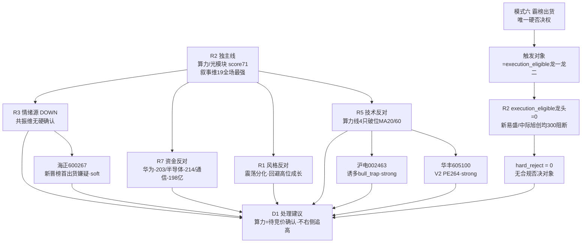

# 2026年7月21日 · **反证 / Devil's Advocate**

> **数据源新鲜度**: partial（R3 情绪源 DOWN + hotlist T-1）
> **降级状态**: true
> **置信度**: 0.70

## 一句话结论
算力独主线纯叙事驱动，遭 R1 风格 + R7 资金 + R5 技术三重证伪；模式六无合规硬否决对象（龙一龙二均 300 阻断），hard_reject = 0。

## 详细分析

今日反证的核心张力，是 **R2 独主线『算力/光模块/AI』(score 71) 站在一条极度不平衡的证据链上**：叙事维 19 分为全场最强（WAIC 官方三源共振 + 新易盛中报预增 77–103% 硬 alpha），但其余三根支柱全部反向——

第一，**情绪维缺席**：R3_sentiment.json 未落盘，R2 自承共振维(12/20)靠 R4 多子板块催化 + R1 热榜 crumb 替代并已标降级，情绪浓度没有硬确认。

第二，**资金维反对**：R7 T-1(20260720)主力资金显示华为概念 −203 亿 / 半导体 −214 亿 / 通信技术 −198 亿，算力全家桶在净流出榜前列；R7 判『偏多』的真实资金入口是权重股 / 上证50 / 大盘价值 / 红利，与算力主线正交。R7 自己也点明：北向 + ETF + 主力偏权重蓝筹，成长端遭净流出。

第三，**技术维破位**：R5 core_finding 直接给出『catalyst ≠ capital』——算力催化线 5 只里，除紫光股份(000938，20d +33.6%、站双均线、量比 1.75、催化×资金×技术三重共振)外，工业富联(20d −30.3%)、新易盛(20d −34.8%)、沪电股份(诱多 + 破位)、华丰科技(PE264 + 破位)**全线破位 MA20/60**。

再叠加 R1 的风格判定（震荡分化型 · 情绪 45 · 仓位上限 0.45 · 独主线是**防御性高股息高低切**，明确『高位成长追高风险极高，明确回避』），R2 推算力右侧追高与 R1 框架构成方向性错配——这一点 R2 自己的 risks 第 3 条已经认账。

**模式六（唯一硬否决权）的结论是诚实的 hard_reject = 0**：其触发对象只能是 R2 中 execution_eligible 的龙一龙二，而 R2 的 execution_eligible 龙头数 = 0（龙一新易盛、龙二中际旭创均为创业板 300，auto-buy 阻断；唯一主板候选中兴通讯因资金背离 −37 亿已判杂毛剔除）。既无合规触发对象，hotlist distribution_alert 又仅命中『创新药(medium)』，未覆盖算力主线标的，故不构成霸榜出货硬否决。红线 3 保护未触发。

个股层面另有三张负面牌供 D1 显式处理：**沪电股份(002463)** 命中 R7 龙虎榜诱多 bull_trap（机构净卖 1.31 亿 + 跌停 + 破位），是典型『催化有 × 资金无 × 技术破位』负面象限；**华丰科技(605100)** PE-TTM=264 命中估值陷阱 V2 + 破位 + 小市值 63 亿；**海正药业(600267)** 所属创新药新晋热榜第一存 medium 出货嫌疑，且板块联动弱、换手 8.52% 需防一日游。

## 关键证据
- 证据 1：R7 T-1 主力资金 华为 −203 / 半导体 −214 / 通信 −198 亿，算力全线净流出 · 来源 R7_capital_flow.json
- 证据 2：R5 算力线除紫光股份外 4 只全破位 MA20/60（工业富联 20d −30%、新易盛 20d −34.8%）· 来源 R5_stock_profiles.json core_finding
- 证据 3：R1 风格=震荡分化型 · cap 0.45 · 明确『高位成长追高风险极高，回避』· 来源 R1_style.json
- 证据 4：沪电股份龙虎榜机构净卖 1.31 亿 + 跌停 −10% + 破位，flags=distribution_alert · 来源 R5 chip_structure.dragon_tiger_hit
- 证据 5：华丰科技 PE-TTM=263.72 命中 V2 估值陷阱 · 来源 R5 fundamental_flags 透传
- 证据 6：R2 execution_eligible 龙头数=0（龙一龙二 300 阻断）→ 模式六无合规硬否决对象 · 来源 R2_main_sectors.json

## 反证证据链（mermaid）

## severity 分布（供 D1 消费）

| # | 模式 | 标的 | severity | D1 义务 |
|---|------|------|----------|---------|
| M1_01 | 数据源冲突 | 算力独主线 | soft_suggest | 记 r6_soft_notes·视为待竞价确认 |
| M2_01 | 一致性检查 | R1×R2 方向错配 | strong_suggest | 必须接受或 override 记理由 |
| M3_01 | 估值×主线临界 | 新易盛(龙一) PB34.9 | strong_suggest | 必须接受或 override |
| M7_01 | 基本面红旗 | 华丰科技 V2 PE264 | strong_suggest | 剔除或限仓≤5% |
| M1_02 | 催化×资金负面象限 | 沪电股份 诱多 | strong_suggest | 剔除 execution_pool |
| M1_03 | 催化×技术背离 | 算力线整体 | soft_suggest | 收敛至紫光股份单票 |
| M1_04 | 霸榜出货交叉 | 创新药/海正 | soft_suggest | 仅打首板情绪·不追 |

## 数据源审计
| 源 | 状态 | 抓取时间 | 记录数 | 备注 |
|---|---|---|---|---|
| R1_style | 🟢 ok | 2026-07-21 | 1 | 震荡分化型·cap0.45 |
| R2_main_sectors | 🟢 ok | 2026-07-21 | 1 | 独主线算力·execution龙头=0 |
| R3_sentiment | 🔴 error | — | — | 未落盘·共振维降级 |
| R4_news | 🟢 ok | 2026-07-21 | 8 | WAIC三源共振 |
| R5_stock_profiles | 🟡 partial | 2026-07-21 | 11 | vibe/chart 双MCP未调 |
| R7_capital_flow | 🟢 ok | 2026-07-21 | 1 | T-1基准·偏多 |
| hotlist_signals | 🟡 stale | 2026-07-20 | 20 | T-1·创新药distribution_alert(medium) |

## 不确定性 / 反证
本 R6 输出自身也需被反证：(1) **R7 资金为 T-1(20260720) pre-catalyst 读数**，WAIC 催化发生于 07-20 晚间，若 P1 竞价资金大举涌入算力，则模式一/模式二的资金反对论据将失效——因此模式一定级 soft 而非 strong，把最终裁定权交给竞价。(2) **R3 缺失**使模式六 hotlist 交叉只能用 T-1 crumb，若当日情绪源恢复且算力板块出现 distribution_alert，硬否决结论需重估。(3) 模式四(无历史库)、模式五(无 E1 observation_tracking)诚实降级，未编造。(4) 硬业绩票新易盛的 PB34.9 属高成长赛道常态，模式三定 strong 而非 hard_reject，D1 保留 override 空间。

## 与其他 R/D/E 的关系
- 依赖: R1_style / R2_main_sectors / R4_news / R5_stock_profiles / R7_capital_flow（只读）+ hotlist_signals(20260720)
- 被消费: D1(main_decision_v1) — hard_reject 强制剔除 / strong_suggest 必须处理 / soft_suggest 记 r6_soft_notes；E1(daily_review_v1) — 反证兑现追踪

## Sub-Agent 元数据
- skill: analyze_devil_advocate_v1
- artifact: data/research/20260721/R6_devil_advocate.json
- 生成耗时: ~约 1 分钟
- model: ark-code-latest
