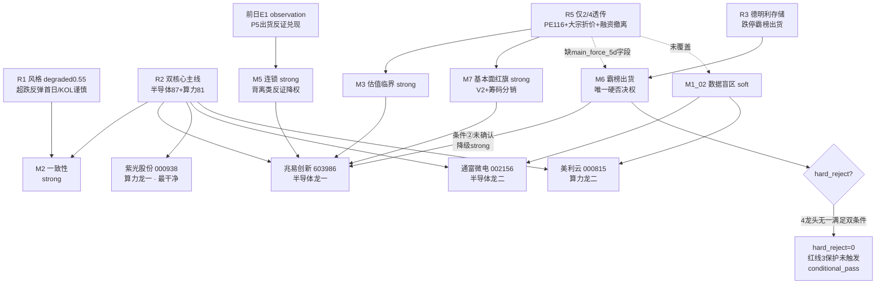

# 2026年7月22日 · **反证 / Devil's Advocate**

> **数据源新鲜度**: partial
> **降级状态**: false
> **置信度**: 0.74

## 一句话结论
🟡 无硬否决(0 hard_reject)；火力集中兆易创新——高估值×筹码分销×存储霸榜三重张力，D1 须守半仓不追高。

## 详细分析

今日 R6 六模式全扫描，产出 **7 条反证**（5 条 strong_suggest + 2 条 soft_suggest），**无 hard_reject**，四只 execution_eligible 龙头全部保留（红线3保护未触发）。整体判定 `conditional_pass`：没有标的必须强制剔除，但 D1 有五条 strong_suggest 必须显式处理。

**火力最集中的对象是半导体龙一兆易创新（603986）**。它同时被三条反证命中：①估值临界（M3）——PE_ttm 116 / PS 29，叠加核心 KOL 颜晓滨"A股半导体平均 PE≈218 倍泡沫、反弹是跑路时机"的全场最强反向声音；②基本面红旗（M7）——命中 V2 高 PEG 陷阱 + 大宗 3 笔折价 -11.8% 分销减持 + 融资余额 15 日 -14.3% 撤离；③板块霸榜出货（M6）——所属存储板块命中 distribution_alert（20日德明利存储跌停霸榜=出货型）。**但兆易未触发 hard_reject**：模式六硬否决要求"霸榜出货高置信 + 近5日主力净流出"双条件同时满足，而 R5 未透传 `main_force_5d_net_wan` 规定字段，条件②仅"未确认"而非"确认为负"，按 skill 规则降级为 strong_suggest。

**第二重张力是一致性/仓位（M2）**。R1 status=degraded(0.55) 明示"超跌反弹第一天持续性未验证，易一日游"，顶级 KOL 谨慎（留半仓等确认）与盘面强度（涨停121家/创业板+7.05%）明显背离，position_cap 仅 0.50；而 R2 同时推两条高波动进攻主线。D1 必须严守半仓上限、低吸不追涨停板。

**模式五首次以真实 E1 数据执行**（前日 observation_tracking 已接入）：昨日 P5 的 distribution_alert 反证兑现（海正药业 -2.17% 走弱），证明该框架有效 → 今日德明利存储霸榜出货是相似结构，须重视。但昨日 P1/P3 的"背离类"反证被证伪（创业板+7.05% 科技全面爆发）→ 今日 R6 主动下调背离类反证权重，警惕"连续证伪后仍机械看空强势主线"的反证疲劳。

**数据盲区（M1_02）**：R5 仅覆盖 4 只龙头中的 2 只（紫光股份、兆易创新），通富微电、美利云无六维画像，其筹码/估值无法独立核验，D1 纳入前须补验或降仓 watch 优先。相较之下，**紫光股份 fundamental_flags=[] 无任何红旗**，融资 +9.9%、北向连续流入、全周期多头，是四票中最干净的执行标的。

## 反证清单（severity 排序）

| # | 模式 | 对象 | severity | 核心理由 |
|---|------|------|----------|----------|
| M2_01 | 一致性检查 | 双核心主线 × R1 仓位 | 🟠 strong | R1 degraded+KOL谨慎与盘面背离，超跌首日未验证，守 0.50 上限 |
| M3_01 | 估值×主线临界 | 兆易创新 603986 | 🟠 strong | PE116/存储PE218泡沫+颜晓滨"跑路时机"，命中 V2 陷阱 |
| M5_01 | 昨日预期错误连锁 | 存储霸榜结构+反证自省 | 🟠 strong | 昨日 P5 出货反证兑现→德明利相似结构；背离类反证权重下调 |
| M6_01 | 霸榜出货硬约束 | 兆易创新 603986 | 🟠 strong | 条件①命中(存储 alert)，条件②未确认(缺 main_force 字段)→降级 |
| M7_01 | 基本面红旗 | 兆易创新 603986 | 🟠 strong | V2 估值陷阱+大宗折价分销+融资撤离双压 |
| M1_01 | 数据源冲突 | CPO/光模块次级线 | 🟡 soft | L2 群聊被动共振+无独立主力流入+龙头 execution_blocked |
| M1_02 | 数据盲区 | 通富微电/美利云 | 🟡 soft | R5 仅 2/4 透传，两只龙二无筹码估值核验 |

## 关键证据
- 证据 1: 兆易创新 PE_ttm=116.08 / PS_ttm=29.06，R5 valuation_safety=5 且透传 fundamental_flags[V2]，drawdown -43.8% 后 60分空头反弹遇 MA60 压制 · 来源 R5_stock_profiles
- 证据 2: 兆易大宗 3 笔折价 -11.8%(7-21约5.76亿，华泰上海买/广发杭州卖分销)+融资15日 -14.3%(236→202亿撤离) · 来源 R5 chip_structure
- 证据 3: 20日德明利(存储)跌停霸榜 hot=929431 出货型，21日切紫光股份修复但拥挤度未降，top50 约75%集中科技一条线 · 来源 R3 distribution_alert
- 证据 4: R1 degraded(0.55)，KOL 颜晓滨留半仓 vs 涨停121家/创业板+7.05%，position_cap 0.50 · 来源 R1_style
- 证据 5: 前日 P5(distribution_alert 海正-2.17%)兑现 fulfilled=true；P1/P3(背离/风格错配)fulfilled=false 被科技爆发证伪 · 来源 observation_tracking 20260721

## mermaid · 反证张力图

## 数据源审计
| 源 | 状态 | 抓取时间 | 记录数 | 备注 |
|---|---|---|---|---|
| R1_style | 🟡 stale | 2026-07-22 | — | degraded 0.55，可读可用 |
| R2_main_sectors | 🟢 ok | 2026-07-22 | 2 主线 | execution_eligible 4 龙头 |
| R3_sentiment | 🟢 ok | 2026-07-22 | 5 主题 | ok_degraded 0.62，德明利 alert |
| R4_news | 🟢 ok | 2026-07-22 | 6 事件 | 公众号全灭，五源补齐 |
| R5_stock_profiles | 🟡 partial | 2026-07-22 | 2/4 | 仅紫光/兆易透传 |
| R7_capital_flow | 🟢 ok | 2026-07-22 | — | 北向5日递增/科技+295亿 |
| observation_tracking(前日) | 🟢 ok | 2026-07-21 | 16 | 模式五连锁数据源 |

## 不确定性 / 反证
- **R6 自省**：昨日 P1/P3 背离类反证被科技爆发全面证伪，今日虽已主动下调背离类权重，但仍存在"矫枉过正"或"反证疲劳后放松警惕"的双向风险；M5 已显式记录。
- **模式六边界**：兆易本可能是 hard_reject 的最强候选，但因 R5 未透传 `main_force_5d_net_wan` 规定字段，只能降级 strong_suggest。这是数据契约缺口而非兆易安全，D1 不应据此放松——大宗折价+融资撤离已是筹码松动实证。
- **数据盲区**：通富/美利仅由 R2 涨停+资金定性认定，无 R5 筹码核验，本 R6 无法对其做估值/筹码反证，属"未证伪 ≠ 安全"。
- **置信度 0.74**：上游 R2/R5/R7 交叉充分，但 R1/R3 degraded + R5 仅 2/4 profile + mode4 无历史库，故未上 0.80。

## 与其他 R/D/E 的关系
- 依赖: R1_style / R2_main_sectors / R3_sentiment / R4_news / R5_stock_profiles / R7_capital_flow(20260722) + R6(20260721) + observation_tracking(20260721)
- 被消费: D1 主决策(main_decision_v1) —— strong_suggest 须接受或记 meta.d1_override；soft_suggest 记 r6_soft_notes；hard_rejects[] 供 orchestrator 写入 research_summary.json

## Sub-Agent 元数据
- skill: analyze_devil_advocate_v1
- artifact: data/research/20260722/R6_devil_advocate.json
- 生成耗时: 约 90 秒
- model: ark-code-latest
