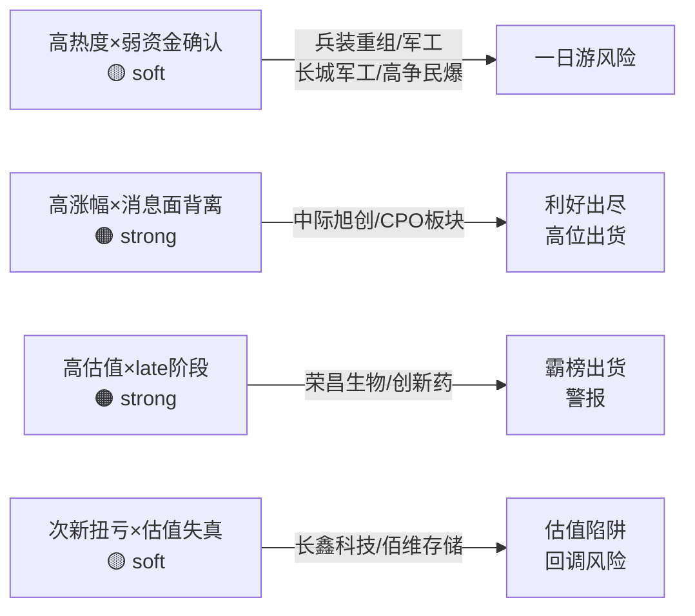

# 2026年8月11日 · **反证 / Devil's Advocate**

> **数据源新鲜度**: 🟡 partial（R3/R5/R7各有降级）
> **降级状态**: ❌ false（核心模式全部执行，仅模式四历史类比降级）
> **置信度**: 0.72

## 一句话结论
**无 hard_reject，但 4 条 strong_suggest 集中指向同一风险：TMT 高位出货模式可能传导至存储/半导体设备新主线，存量跷跷板行情下新主线持续性存疑。**

## 反证全景

| severity | 数量 | 代表条目 |
|----------|------|---------|
| 🔴 hard_reject | 0 | — |
| 🟠 strong_suggest | 4 | 中际旭创资金背离 / 存量跷跷板非多线 / 荣昌生物霸榜late / 昨日反证兑现连锁 |
| 🟡 soft_suggest | 7 | 军工缺资金确认 / 半导体设备催化远期 / 长鑫科技估值失真 / 佰维存储涨幅过大 等 |

## 四象限负面识别

## 详细分析

### 🟠 strong #1 · 中际旭创：消息极硬 vs 资金全面背离

R4 双事件首推中际旭创——英伟达 5000 亿算力融资（score 0.92）+ 在手订单至 2027 年（score 0.82），光模块全球龙头逻辑无懈可击。

但 R7 数据给出完全相反的信号：CPO 概念今日 **-239 亿** 净流出（net_rate -8.12%），光通信模块 -221 亿，5G 概念 -296 亿，TMT 整体高位出货。超大单（buy_elg）净卖出 -170 亿，机构在跑路。

R5 画像佐证：chip_structure 仅 45 分，technical_readiness 仅 50 分，R3 热榜中际旭创"大跌 6% 但热度仍高"=典型分歧出货形态。

**大资金意图**：利用重磅利好完成高位派发，利好出尽即利空。  
**为什么还在热榜**：散户/游资接盘，热度维持但资金净流出。  
**逻辑够不够硬**：基本面长期逻辑硬，但短期技术面与资金面已破位，不可作为今日买入标的。

### 🟠 strong #2 · 存量跷跷板，非增量多线并行

R2 推三条主线（存储/半导体设备/军工），看似主线扩散行情。但 R7 seesaw 15 对跷跷板配对全部指向同一模式：**5G/CPO/PCB 流出 → 半导体设备/HBM/锂电流入**。

这不是增量资金推动的多线并行，而是**存量资金在板块间切换**。今日的新主线流入 = 昨日老主线流出，明天可能反过来。

R1 也佐证：创业板/科创 50 昨日收跌，高位科技股已有分歧迹象；连板高度仅 5 板，未达连板情绪型 6 板门槛，情绪天花板明确。

**操作含义**：D1 不应按"三主线满仓"配置，应按"存量轮动"思路，仅拿最强的存储线做主仓，其余两条先观察。

### 🟠 strong #3 · 创新药霸榜出货警报 × 荣昌生物

R3 hotlist_signals 明确触发 distribution_alert：创新药连续 2 日概念榜 top1，药明康德连续 2 日热股 top1。

荣昌生物（ADC 龙头）虽有 RC148 授权艾伯维 + 中报扭亏 433% 的硬逻辑，但板块整体处于 **late 阶段**。R5 技术得分仅 55 分，估值 62 分（biotech 高波动）。

**风险**：板块霸榜 = 全市场都知道 = 对手盘不足，随时可能集体回调。

### 🟠 strong #4 · 昨日反证兑现 → 今日警惕连锁

昨日 R6_M2_01（strong_suggest）警示"TMT 高位分歧 + 主线扩散需警惕"，今日 R7 完全证实：CPO/PCB/5G 单日流出超 2000 亿级别。

而今日新推的存储/半导体设备，结构上与昨日的 CPO/PCB 高度相似：
- 都是科技成长方向
- 都有产业级催化
- 都是 R7 资金流入榜首
- 5 日涨幅都已超 20%

**历史韵脚**：昨日的 CPO 就是今日的 HBM，昨日的 PCB 就是今日的半导体设备。资金从老高位切向新高位，但新高位的涨幅也不小了。

**建议**：分层建仓，先上半仓，确认 2-3 日资金持续流入后再加。

### 🟡 soft · 其他值得关注的反面证据

1. **军工新题（长城军工/高争民爆）**：R3 热榜新进 top2 但 R7 无军工资金数据，R4 地缘事件军工强度仅 medium。高热度 × 弱资金确认象限 = 一日游风险。
2. **半导体设备远期催化**：E007 马斯克 FEL 光刻 score 仅 0.55，属远期概念情绪催化，非基本面强催化。流入榜首可能是跷跷板效应。
3. **长鑫科技估值陷阱**：次新 + 扭亏高增长，命中 V6 估值陷阱，PE 失真，安全边际低。
4. **山东黄金周期顶风险**：金价 4400 美元高位，命中 V1 周期股估值陷阱，地缘事件若缓和可能快速回落。

## 模式六 · 霸榜出货硬否决

| 条件 | 状态 | 说明 |
|------|------|------|
| R2 龙一/龙二命中 R3 distribution_alert | ❌ 未命中 | R3 仅创新药+药明康德触发，R2 主线（存储/半导体设备/军工）均未命中 |
| R5 近 5 日主力净流出 | ⚠️ 无法确认 | vibe-trading MCP 不可用，main_force_5d_net_wan 字段缺失 |
| **hard_reject 数量** | **0** | 不满足双条件，无硬否决 |

**红线 3 保护**：无需触发（候选池充足）。

## 关键证据

- 证据 1: R7 CPO 概念 -239 亿净流出 + 5G -296 亿 + 光通信 -221 亿，TMT 全面高位出货 · 来源 R7_capital_flow
- 证据 2: R7 seesaw_pairs 15 对全部为 TMT 流出 → 算力链/锂电流入，存量跷跷板模式 · 来源 R7_capital_flow
- 证据 3: R3 distribution_alert 创新药连续 2 日榜一 + 药明康德 2 日热股榜首 · 来源 R3_sentiment
- 证据 4: 昨日 R6_M2_01 strong_suggest 今日兑现，TMT 高位出货模式验证 · 来源 昨日R6 + 今日R7
- 证据 5: R5 中际旭创 chip_structure 45 分 + technical_readiness 50 分，资金面与技术面双弱 · 来源 R5_stock_profiles

## 数据源审计

| 源 | 状态 | 抓取时间 | 记录数 | 备注 |
|---|---|---|---|---|
| R1_style | 🟢 ok | 2026-08-11 | 1 | 完整 |
| R2_main_sectors | 🟢 ok | 2026-08-11 | 3主线 | MCP 全挂但上游交叉验证 |
| R3_sentiment | 🟡 partial | 2026-08-11 | 5主题 | WeFlow L3层缺失，走L1+L2降级 |
| R4_news | 🟢 ok | 2026-08-11 | 8事件 | 5源交叉验证 |
| R5_stock_profiles | 🟡 partial | 2026-08-11 | 7只 | MCP全挂，chart/vibe降级 |
| R7_capital_flow | 🟢 ok | 2026-08-11 | 62条 | 四维完整，ETF/期货降级 |

## 不确定性 / 反证自我批判

1. **R5 降级限制**：vibe-trading MCP 不可用，模式六条件二（主力净流出）无法精准确认，可能漏判部分霸榜出货标的。
2. **R3 降级限制**：WeFlow 缺失可能低估早期发酵主题的正面/负面信号，distribution_alert 仅基于热榜数据。
3. **模式四空缺**：无历史事件库，无法给出"XX年YY月类似形态"的类比证据，仅靠逻辑推理。
4. **军工资金盲区**：R7 未单列军工/兵装板块资金流，军工主线的资金面判断存在盲区，可能错杀也可能漏判。
5. **模式六严格但可能偏保守**：仅 R2 龙一/龙二触发才 hard_reject，荣昌生物等 R5 候选即使接近也仅 strong_suggest，D1 需自行判断。

## 与其他 R/D/E 的关系

- **上游依赖**: R1_style, R2_main_sectors, R3_sentiment, R4_news, R5_stock_profiles, R7_capital_flow
- **被消费**: D1 主决策（strong_suggest 必须显式处理，hard_reject 强制剔除）
- **下游联动**: E1 每日复盘追踪反证兑现情况；E2 周度进化评估反证准确率

## Sub-Agent 元数据

- skill: analyze_devil_advocate_v1@1.2
- artifact: data/research/20260811/R6_devil_advocate.json
- 生成耗时: ~2 分钟（纯磁盘读取 + LLM 推理）
- model: doubao-seed-2-0-code-preview-260215
- 执行约束: 只读上游 JSON，不抓新数据；6 模式 + 四象限 + 模式六硬否决
