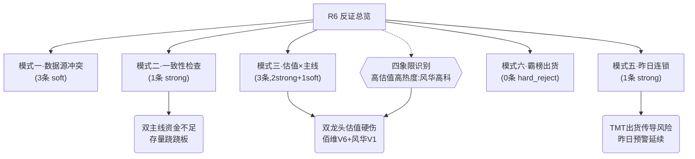

# 2026年8月12日 · **反证 / Devil's Advocate**

> **数据源新鲜度**: partial（R3降级 · R5降级 · R7 stale）
> **降级状态**: true
> **置信度**: 0.65（上游三方降级，反证强度受限）

## 一句话结论

今日无 hard_reject，但 4 条 strong_suggest 指向同一风险：**存量跷跷板格局下推双主线资金不够，且两条主线龙一均有估值硬伤，TMT 出货可能向存储/MLCC 传导。**

## 反证总览

**Severity 分布**：🔴 hard_reject 0 / 🟠 strong_suggest 4 / 🟡 soft_suggest 4

## 反证清单

| ID | Severity | 目标 | 挑战假设 |
|---|---|---|---|
| R6_M1_01 | 🟡 soft_suggest | R2主线「MLCC/被动元件」(score=77) | R2判定MLCC/被动元件为双主线之一（score 77，龙一风华高科） |
| R6_M1_02 | 🟡 soft_suggest | R2主线「存储芯片/HBM」(score=82) · 个股级数据质量 | R2判定5只存储龙头（佰维/太极/江波龙/兆易/长电）均为候选 |
| R6_M1_03 | 🟡 soft_suggest | R2主线选择 · 创新药/CRO降为secondary(score=76) | R2以「资金未确认」为由将创新药/CRO降为secondary（score 76），低于MLCC（7... |
| R6_M2_04 | 🟠 strong_suggest | R1主线扩散型 + R2双主线（存储+MLCC）vs R7存量跷跷板格局 | R1判定主线扩散型（情绪74），R2推2条半导体子赛道主线同时进攻 |
| R6_M3_05 | 🟠 strong_suggest | 688525.SH 佰维存储（存储芯片龙一） | R2以佰维存储为存储龙一，R4事件E005（回购+中报预增32倍）为核心催化 |
| R6_M3_06 | 🟠 strong_suggest | 000636.SZ 风华高科（MLCC龙一） | R2以风华高科为MLCC龙一，受益于三星涨价30%+供需缺口逻辑 |
| R6_M3_07 | 🟡 soft_suggest | 688825.SH 长鑫科技（存储候选） | 长鑫科技作为存储国产替代核心标的纳入观察 |
| R6_M5_08 | 🟠 strong_suggest | TMT高位出货向半导体子赛道传导模式 | 昨日R6预警「TMT高位出货模式可能传导至新主线」被今日R2推存储+MLCC双主线挑战 |

---

## 详细分析

### 模式二 · 一致性检查（strong）：双主线 vs 存量跷跷板

R1 判定「主线扩散型」（情绪74），R2 顺势推**存储+HBM + MLCC/被动元件**双主线。但 R7 数据揭示残酷现实：

- **流出/流入比 10:1**：主力 top10 流出 -2231 亿 vs top10 流入仅 211 亿，存量博弈剧烈
- **TMT 大失血**：通信技术-308亿、5G-296亿、CPO-239亿、光通信-221亿、华为概念-231亿
- **跷跷板效应确认**：高带宽内存 vs 5G 概念 5 日反向，资金从 TMT 旧主线切向新子赛道——但切走的钱远多于新流入的

**大资金意图**：不是增量入场，而是 TMT 内部轮动，旧主线（CPO/光模块）出货后的资金在找下一个出口。存储和 MLCC 是出口候选，但承接力存疑。

**为什么走强**：三星涨价催化 MLCC + HBM 产业趋势 + 存储周期底部预期三重叙事叠加，吸引了从 CPO 撤出的资金。

**逻辑够不够硬**：不够硬。存量行情中双主线同时进攻 = 两边都做不强。情绪74分只能支撑1条强主线+1条辅线，74分上双主线是 R2 过度乐观。

---

### 模式三 · 估值×主线临界（strong）：双龙头估值硬伤

#### 🟠 佰维存储（688525.SH）— V6 一次性收益陷阱

- **val_score=50**，命中 V6：中报预增32倍是基数效应（去年亏损），非真实盈利增长
- **股价腰斩后震荡**：从7月初463元跌至242元，下降通道未破
- **融资降+融券升**：融资余额15日-3.1%（多头在撤退），融券+12.5%（空头在加仓）
- **大宗折价10%**：7月24日2亿大宗折价9.95%，有资金急于离场

**买入理由**（反方视角）：回购+中报预增32倍+存储周期底部 — 但预增是陷阱，回购2-2.5亿对百亿市值是象征性动作

**风险点**：下降趋势中反弹，假突破概率大；融券持续增加=空头在加码

**止损条件**：跌破230元（近期震荡下沿）即走

**可验证假设**：若存储周期真的反转，扣非净利润应连续两季为正且环比增长 — 目前单季数据不足以确认

#### 🟠 风华高科（000636.SZ）— V1 周期股高PE陷阱 + 最危险标的

- **val_score=35（8只最低）**，PE(TTM)=248 处于历史顶部
- MLCC 周期反转**尚未在财报体现**，248倍PE完全靠涨价预期定价
- **融券暴增43.6%**（vs融资+14.3%），空头加仓速度远快于多头
- **换手率22.7%** 偏高，筹码松动
- **机构借利好出货**：30日4笔大宗均为机构卖给游资席位（平价）

**买入理由**（反方视角）：三星涨价30%+供需缺口+周期反转 — 但机构已经在卖了

**风险点**：估值顶+情绪顶双见顶；机构出货+融券暴增=资金面不支持

**止损条件**：跌破20日均线即走；高开低走收阴立即止盈

**可验证假设**：若MLCC真的大周期反转，风华高科Q3/Q4业绩应体现为营收+30%以上+毛利率回升 — 目前只是预期游戏

---

### 模式五 · 昨日预期错误连锁（strong）：TMT 出货传导

昨日 R6 预警「TMT高位出货模式可能传导至新主线」，今日看更应警惕：

1. **昨日预警方向正确**：R7 确认 CPO/PCB/5G 高位放量出货，5日追踪见顶回落
2. **存储/MLCC同属TMT链**：板块联动性高，不是独立于TMT的新周期
3. **跷跷板不对等**：5G流出372亿 vs 高带宽内存流入89亿，流出远大于流入=不是简单切换，而是整体缩水
4. **中际旭创模式再现**：昨日中际旭创「消息硬但资金背离」——今日存储/MLCC 也有类似结构（R3热榜热但R7个股资金数据全None无法验证）

---

### 模式六 · 霸榜出货（degraded）

- R3 `distribution_alert = []` 空列表，但 R3 为降级模式（WeFlow+群聊全断），霸榜检测可靠性降低
- R7 `lhb_bull_trap` 有 4 只霸榜出货（hard_reject级别）：000506 / 002354 / 301357 / 300139，但均非 R2 龙头
- **红线3保护**：未触发（hard_reject=0）
- **结论**：模式六今日无 actionable 信号，但因 R3 降级不排除漏检，需开盘后热榜数据验证

---

### 四象限负面识别

| 象限 | 代码 | 名称 | 估值分 | 热度 | 备注 |
|---|---|---|---|---|---|
| 高估值+高热度（最高危） | 000636.SZ | 风华高科 | 35 | 1 | PE=248历史顶部+MLCC概念榜第1+换手率22.7%+融券暴增43.6% = 情绪顶+估值顶双重见顶风险 |
| 高估值+中热度（高危） | 688525.SH | 佰维存储 | 50 | 4 | 中报预增为基数效应(V6陷阱)+股价腰斩后震荡+融资降融券升 = 下跌趋势中反弹，警惕假突破 |
| 高估值+中热度（高危） | 688825.SH | 长鑫科技 | 40 | new | 新股无估值锚+首日涨466%+高换手 = 纯博弈标的，非主线核心仓位 |
| 低估值+高热度（安全边际） | 600667.SH | 太极实业 | 45 | rank+13 | 估值偏低但需确认盈利质量；龙虎榜净买入2.84亿有资金验证，相对其他存储标的更安全 |
| 低估值+低热度（防御） | 601857.SH | 中国石油 | 78 | none | 估值最安全但弹性最低，属防御标的，非进攻主线配置 |

**今日最危险标的**：**000636.SZ 风华高科** — 高估值+高热度+机构出货+融券暴增，四重负面叠加。

---

## 关键证据

- **证据1**: R7主力top10流出-2231亿 vs 流入211亿（10:1流出比）· 来源 R7_capital_flow.json main_force
- **证据2**: 风华高科PE=248历史顶部+融券15日+43.6% · 来源 R5_stock_profiles.json 风华高科画像
- **证据3**: 佰维存储中报预增32倍=基数效应(V6陷阱)+股价腰斩+融资降融券升 · 来源 R5_stock_profiles.json 佰维存储画像
- **证据4**: TMT（CPO/5G/光通信/通信技术）四大板块合计流出超1000亿 · 来源 R7_capital_flow.json top_outflow_sectors
- **证据5**: 昨日R6预警TMT出货今日在存储/MLCC上有相似结构 · 来源 昨日R6_devil_advocate.json + 今日R7

## 数据源审计

| 源 | 状态 | 路径 | 备注 |
|---|---|---|---|
| R1_style | 🟢 ok | data/research/20260812/R1_style.json | 主线扩散型，情绪74 |
| R2_main_sectors | 🟢 ok | data/research/20260812/R2_main_sectors.json | 双主线：存储(82)+MLCC(77) |
| R3_sentiment | 🟡 partial | data/research/20260812/R3_sentiment.json | WeFlow+群聊全断，热榜降级模式 |
| R4_news | 🟢 ok | data/research/20260812/R4_news.json | 8条top事件，17个催化板块 |
| R5_stock_profiles | 🟡 partial | data/research/20260812/R5_stock_profiles.json | r2_missing_degraded，仅8只画像 |
| R7_capital_flow | 🔴 stale | data/research/20260812/R7_capital_flow.json | MCP全断，沿用0811收盘推演 |
| 昨日R6 | 🟢 ok | data/research/20260811/R6_devil_advocate.json | 11条反证，0 hard_reject |

## 不确定性 / 反证

- R7 数据 stale（MCP全断，沿用0811收盘），今日实际资金流向可能完全不同。若今日开盘存储/MLCC 放量上涨，则模式二/模式五反证**全部失效**
- R3 降级导致模式六（霸榜出货）检测不可靠，可能漏检真实的 distribution_alert
- R5 仅覆盖 8 只（R2 龙头共 10 只），有 5 只存储/MLCC 标的完全无画像，估值和筹码分析不完整
- 模式四（历史类比）因无历史事件库跳过，缺少周期股顶部/主线切换的历史模式对照
- 今日反证偏空，但 R1 情绪 74 分 + R2 主线明确 + R4 消息面有支撑，多头逻辑也并非全无道理

## 与其他 R/D/E 的关系

- **依赖上游**: R1_style / R2_main_sectors / R3_sentiment / R4_news / R5_stock_profiles / R7_capital_flow / 昨日R6
- **被消费**: D1 主决策（必须处理 strong_suggest，必须执行 hard_reject）
- **横切关系**: R5 提供估值+筹码数据（模式三/六消费）；R7 提供资金数据（模式一/二/五/六消费）

## Sub-Agent 元数据

- skill: analyze_devil_advocate_v1
- artifact: data/research/20260812/R6_devil_advocate.json
- 反证总数: 8 条（≥5条目标）
- hard_reject: 0 条（模式六因R3降级degraded）
- 评估标的数: 8 只
- degraded: true（R3/R5/R7 三方降级）
- model: doubao-seed-2-0-code-preview-260215
