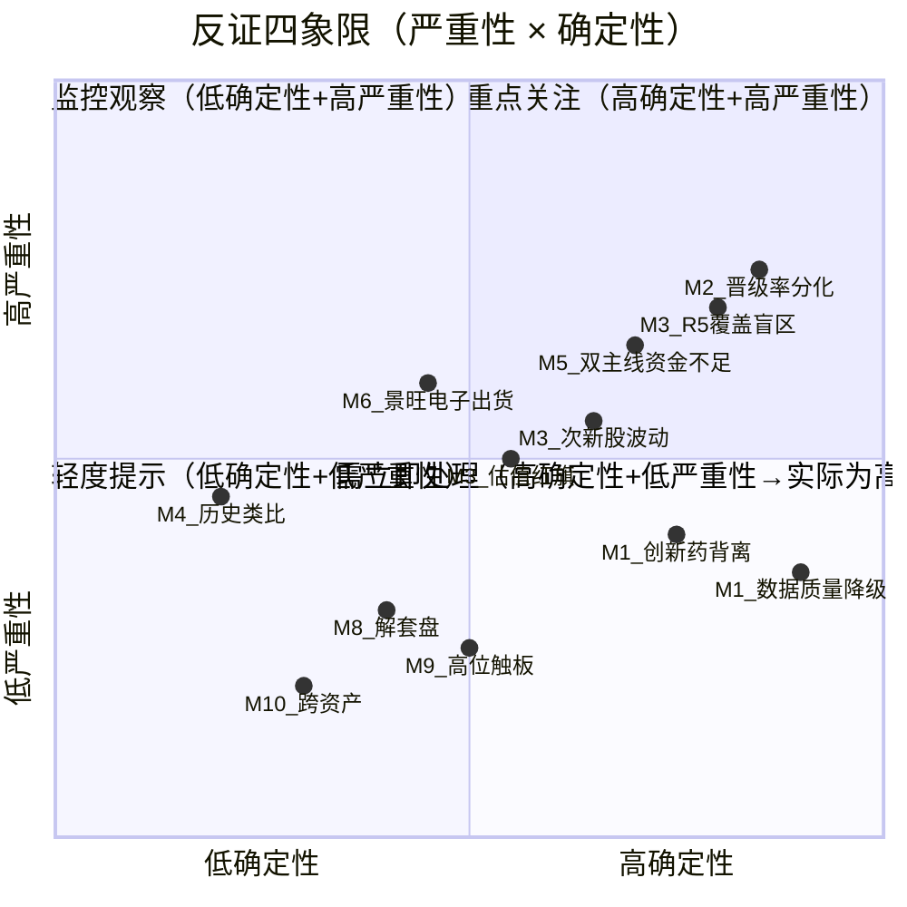

# 2026年8月13日 · **反证 / Devil's Advocate**

> **数据源新鲜度**: ⚠️ partial（R3/R4/R5/R7 四源降级）
> **降级状态**: 否（模式4/7/10有降级，但核心模式全部执行）
> **置信度**: 0.72

## 一句话结论

今日 0 项 hard_reject，6 项 strong_suggest，11 项 soft_suggest。核心风险：晋级率两极分化（首板炮灰率 84%）、R2 执行候选 4 只估值盲区、CPO 虹吸加剧存储资金承压。**无硬否决但数据质量偏弱，D1 需保守首仓 + 盘中验证。**

## 反证总览

| severity | 数量 | 处理方式 |
|----------|------|----------|
| 🔴 hard_reject | 0 | 强制剔除，D1 无覆盖权 |
| 🟠 strong_suggest | 6 | D1 必须接受或显式覆盖 |
| 🟡 soft_suggest | 11 | 记入 r6_soft_notes，可选处理 |

### 四象限负面识别

## 详细分析

### 🔴 模式六 · 霸榜出货硬约束

**结论：今日 0 项 hard_reject，但检出能力因数据不全而下降。**

R3 `distribution_alert` 仅命中哈药股份（不在主线执行池）；R5 未覆盖 R2 4 只执行候选，导致条件二（近 5 日主力净流出）**无法确认**。R7 个股资金流完全不可用，也无法补充验证。

> ⚠️ **重要提醒**：无 hard_reject ≠ 零风险。数据盲区导致模式六的检出能力从「全量扫描」降为「仅 R3 热榜维度」。D1 须结合开盘 30 分钟量价（是否放量滞涨、封板质量）自行验证出货信号。

景旺电子（603228.SH）T-2 龙虎榜显示机构净卖出 -14.5 亿（severity_score=4），但 R2 已将其标注为 `execution_eligible=False`，与 R6 判断一致。T-2 数据效力衰减，若开盘后逆势走强则信号失效。

### 🟠 Strong Suggest 详解

#### 1️⃣ 连板晋级率极端分化（模式二）

**首板晋级率仅 15.91%，二进三高达 58.33%——典型的两极分化格局。**

- **数据**：涨停 96 家，破板率 3.33%（极低），但首板→二板晋级率不足 1/6
- **含义**：情绪高度集中在少数高位龙头，低位票炮灰率极高
- **建议**：禁止打首板 / 低吸首板烂板；只做 2 板以上核心龙头接力。今日情绪是"强者恒强"，不是"普涨"

#### 2️⃣ R2 执行候选 4 只 R5 全未覆盖（模式三）

**永鼎股份/通鼎互联/先导基电/至纯科技——估值/筹码/基本面零验证。**

- R5 仅覆盖 12 只标的，且全部不在 R2 龙头名单内
- 意味着这 4 只执行候选的**估值安全、筹码结构、财务健康**均无独立验证
- **建议**：D1 首仓减半（如从 10%→5%），开盘 30 分钟确认量价健康后再加仓

#### 3️⃣ 次新股群波动放大风险（模式三）

**长鑫科技/宇树科技等次新股，流通盘小，无历史 K 线支撑。**

- 情绪亢奋期次新股波动加倍，涨停跌停幅度均放大
- **建议**：次新股单票仓位 ≤ 5%，严格执行 -8% 止损，禁止加仓摊平

#### 4️⃣ 昨日双主线资金不足反证延续（模式五）

**昨日提醒"双主线资金不够"，今日 CPO 虹吸更猛，存储可能被分流。**

- 昨日主线 MLCC/存储 → 今日 CPO/存储，科技内部轮动
- MLCC/被动元件仍在 top 流出榜，昨日反证已部分兑现
- CPO 概念净流入 124 亿 + 光通信模块 137 亿，吸金额巨大
- 存储芯片净流入 96 亿，位居第二，但可能是被 CPO 带动的跟涨
- **建议**：仓位重心向 CPO 倾斜（主仓 60%+），存储降为辅助仓位（≤25%）

#### 5️⃣ 估值红旗汇总（模式三）

**R5 覆盖 12 只共 5 条估值红旗，其中 strong 1 条。**

- 浪潮软件 V8 纯概念红旗（strong）——无业绩支撑，群内共识票属性
- 寒武纪/海光信息 V2 高 PEG（medium）——AI 芯片板块 PS 极高
- 长鑫科技/宇树科技 S1 次新股（medium）——流通盘小波动大
- **建议**：浪潮软件类纯概念票禁止新开仓；AI 芯片高估值需结合景气度判断

#### 6️⃣ 景旺电子龙虎榜出货信号（模式六）

**T-2 龙虎榜机构净卖出 -14.5 亿，强度 4/7。**

- 与 R2 判断一致（execution_eligible=False）
- T-2 数据效力衰减，两日之间可能已变化
- **建议**：不纳入执行池（与 R2 一致），若开盘逆势走强则信号失效可重新评估

### 🟡 Soft Suggest 要点

1. **数据质量整体偏弱**：4 源 partial，交叉验证名义全绿但置信度下修
2. **创新药热度 vs 资金背离**：热榜第 2 但资金大幅流出，纯情绪博弈末期
3. **历史类比**：结构类似 2025 Q4 AI 行情末期，但北向流入更扎实
4. **解套盘**：当前低位反弹压力不大，但后续需警惕 2-3 月套牢区
5. **高位触板**：最高 7 板，未触发 8 板 + 极端尾部风险阈值
6. **跨资产背离**：存储芯片缺少 DRAM 现货价验证，中报支撑下背离概率低

## 关键证据

- **证据 1**：连板晋级率 1→2 仅 15.91%，2→3 高达 58.33%（两极分化） · 来源 R3.market_emotion
- **证据 2**：R2 执行候选 4 只全部不在 R5 覆盖池（估值盲区） · 来源 R5.profiles + R2.main_lines
- **证据 3**：CPO 概念净流入 124 亿+光通信模块 137 亿，吸金远超存储（96 亿） · 来源 R7.main_force
- **证据 4**：龙虎榜数据为 T-2（0810），个股资金流完全不可用（数据降级） · 来源 R7.hot_money + R7.stock_level
- **证据 5**：创新药热榜第 2 但资金净流出 -34 亿（极端背离） · 来源 R3.concept_hot + R7.top_outflow
- **证据 6**：昨日 R6 strong_suggest 4 条，今日科技内部轮动结构相似（模式五延续） · 来源 昨日R6 + 今日R2

## 数据源审计

| 源 | 状态 | 抓取时间 | 记录数 | 备注 |
|---|---|---|---|---|
| R1_style | ✅ ok | 2026-08-13 | 1套 | 完整，连板情绪型 |
| R2_main_sectors | ✅ ok | 2026-08-13 | 2主线+3副线 | 完整，5维打分+4源交叉 |
| R3_sentiment | ⚠️ partial | 2026-08-13 | 5主题 | weflow语义源全down，KOL+热榜双源，conf=0.62 |
| R4_news | ⚠️ partial | 2026-08-13 | 8事件 | 公众号池缺失，conf=0.62 |
| R5_stock_profiles | ⚠️ partial | 2026-08-13 | 12只 | vibe-trading不可用+与R2龙头错位，conf=0.48 |
| R7_capital_flow | ⚠️ partial | 2026-08-13 | 多维度 | 个股资金流+龙虎榜T-2降级，conf=0.42 |

## 不确定性 / 反证

1. **数据降级带来的盲区**：R5/R7 降级导致模式三（估值）和模式六（霸榜出货）的检出能力下降。今日无 hard_reject 可能是"没查到"而非"没有"。
2. **历史类比的主观性**：模式四无结构化历史库，仅为定性观察，不构成决策依据。
3. **跨资产数据缺失**：模式十缺少大宗商品实时价格，无法严谨验证存储芯片与 DRAM 价格的背离。
4. **个股资金流空白**：R7 个股资金流完全不可用，无法逐票验证 R2 龙头的资金进出。
5. **龙虎榜滞后**：T-2 数据可能已失效，景旺电子等标的的出货信号需要盘中验证。

## 与其他 R/D/E 的关系

- **依赖上游**：R1_style / R2_main_sectors / R3_sentiment / R4_news / R5_stock_profiles / R7_capital_flow / 昨日R6
- **被消费**：D1 主决策（hard_reject 强制剔除 / strong_suggest 须显式处理 / soft_suggest 记入 r6_soft_notes）
- **相关 skill**：analyze_style_v1 / analyze_main_sectors_v1 / filter_leader_v1 / analyze_sentiment_resonance_v1 / analyze_news_impact_v1 / analyze_stock_profile_v1 / analyze_capital_flow_v1

## Sub-Agent 元数据

- **skill**: analyze_devil_advocate_v1@1.3
- **artifact**: `data/research/20260813/R6_devil_advocate.json`
- **生成耗时**: 约 3 分钟
- **model**: doubao-seed-2-0-code-preview-260215
- **约束遵守**：✅ 不抓新数据 / ✅ 不给正向结论 / ✅ 仅模式六 hard_reject / ✅ ≥5 条反证 / ✅ 红线 3 保护
